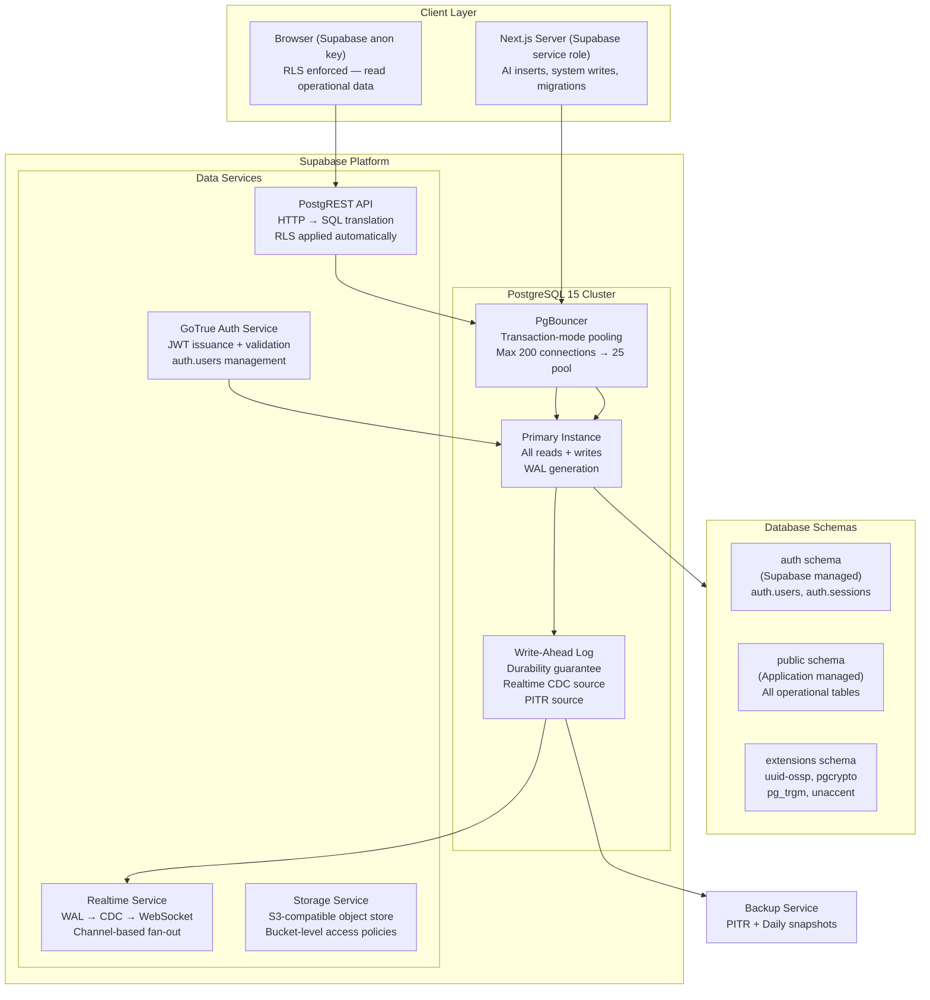
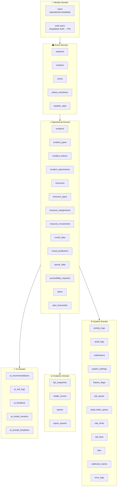
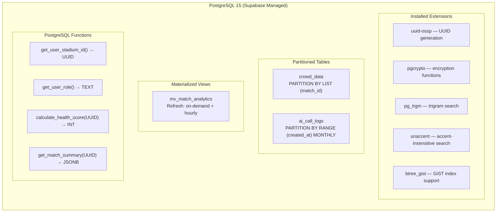

# ArenaMind AI — Database Design Document

> **Product:** ArenaMind AI — The Intelligent Stadium Operations Copilot  
> **Document Type:** Database Design Document (DDD) — Data Bible  
> **Version:** 1.0.0  
> **Status:** APPROVED — Data Authority  
> **Last Updated:** July 12, 2026  
> **Document Owner:** Principal Database Architecture, Staff Data Engineering  
> **References:** [PRD v1.0.0](./ArenaMind_AI_PRD.md) · [TRD v1.0.0](./ArenaMind_AI_TRD.md) · [SAD v1.0.0](./ArenaMind_AI_SAD.md) · [Design Brief v1.0.0](./ArenaMind_AI_Design_Brief.md)  
> **Database:** PostgreSQL 15 via Supabase · ORM: Prisma  
> **Classification:** Internal — Data Architecture

---

## Table of Contents

1. [Executive Summary](#1-executive-summary)
2. [Database Design Principles](#2-database-design-principles)
3. [Database Architecture](#3-database-architecture)
4. [Entity Analysis](#4-entity-analysis)
5. [Entity Relationship Diagram](#5-entity-relationship-diagram)
6. [Complete Database Schema](#6-complete-database-schema)
7. [PostgreSQL Data Type Decisions](#7-postgresql-data-type-decisions)
8. [Prisma Schema](#8-prisma-schema)
9. [Index Strategy](#9-index-strategy)
10. [Row Level Security](#10-row-level-security)
11. [Supabase-Specific Design](#11-supabase-specific-design)
12. [Query Optimization](#12-query-optimization)
13. [Transaction Strategy](#13-transaction-strategy)
14. [Realtime Database Design](#14-realtime-database-design)
15. [AI Database Design](#15-ai-database-design)
16. [Analytics Database Design](#16-analytics-database-design)
17. [Background Job System](#17-background-job-system)
18. [Storage Design](#18-storage-design)
19. [Database Security](#19-database-security)
20. [Performance Architecture](#20-performance-architecture)
21. [Backup Strategy](#21-backup-strategy)
22. [Migration Strategy](#22-migration-strategy)
23. [Testing Strategy](#23-testing-strategy)
24. [Monitoring Strategy](#24-monitoring-strategy)
25. [Appendix](#25-appendix)

---

## 1. Executive Summary

The ArenaMind AI database is a **multi-tenant, event-driven, AI-augmented PostgreSQL system** designed to support real-time stadium operations for FIFA World Cup 2026 across 16 stadiums simultaneously.

### Scale Targets

| Metric                | Match Day                     | Full Tournament |
| --------------------- | ----------------------------- | --------------- |
| Concurrent users      | 800 (50/stadium × 16)         | 800             |
| Stadiums              | 16                            | 16              |
| Matches               | 1 active/stadium              | 104 total       |
| Incidents per match   | ~200-500                      | ~52,000 total   |
| Crowd data rows/match | ~17,280 (30s × 48 zones × 6h) | ~1.8M total     |
| AI calls/hour         | 1,600 max (100/stadium)       | ~166,400 total  |
| Read ops/second       | ~2,000 (peak match day)       | —               |
| Write ops/second      | ~200 (peak)                   | —               |

### Key Architectural Decisions

| Decision                | Choice                                        | Rationale                                               |
| ----------------------- | --------------------------------------------- | ------------------------------------------------------- |
| **Multi-tenancy model** | Shared database, RLS scoping                  | Simplicity at scale; RLS enforces isolation             |
| **Primary keys**        | UUID v4                                       | Globally unique, no sequence contention, safe for merge |
| **Soft deletes**        | `deleted_at TIMESTAMPTZ`                      | Audit trail integrity, referential safety               |
| **AI data separation**  | Dedicated AI schema domain                    | Clean separation of operational vs ML data              |
| **Time-series data**    | Native PostgreSQL + partitioning strategy     | Crowd data grows 17K rows/match; partition by match     |
| **JSONB usage**         | Bounded — only for truly variable schema data | Prefer normalized columns for queryable, indexable data |
| **RLS enforcement**     | Database-level, not application               | Cannot be bypassed by application bugs                  |

---

## 2. Database Design Principles

### P01 — Normalization to 3NF with Tactical Denormalization

**Base standard:** All tables are normalized to Third Normal Form (3NF) — no transitive dependencies, no partial dependencies, no repeating groups.

**Tactical denormalization:** Three specific cases justify denormalization:

1. `incidents.stadium_id` is duplicated from `matches.stadium_id` to avoid a join on the most frequently queried operational table
2. `crowd_data.density_pct` is a GENERATED column (computed from `fan_count / safe_capacity`) to avoid runtime computation on every read
3. `kpi_snapshots` is a fully denormalized analytics table — intentional redundancy for read performance

### P02 — Performance First on Operational Read Paths

The dashboard is read-heavy (10:1 read/write ratio during a match). Every hot query path has:

- A covering index that satisfies the query from the index alone (no heap fetch)
- Selective WHERE clauses on indexed columns
- A documented expected query plan

### P03 — Data Integrity at the Database Level

All constraints are enforced in the database engine, not in application code. CHECK constraints validate enum values. FOREIGN KEY constraints enforce referential integrity. NOT NULL constraints prevent incomplete records. Triggers enforce derived state transitions (e.g., a resolved incident cannot be re-opened through a status UPDATE that bypasses the incident_actions table).

### P04 — Auditability

Every mutation to any operational table is logged. The mechanism: PostgreSQL trigger on UPDATE/DELETE that writes to `audit_logs`. INSERT is tracked by `created_at` + `created_by` columns. The `audit_logs` table has an RLS INSERT policy but no DELETE policy — audit records are immutable.

### P05 — Soft Deletes

All operational entities use `deleted_at TIMESTAMPTZ DEFAULT NULL`. Hard deletes are prohibited on operational tables. Soft deletes preserve:

- Referential integrity (child records still have valid foreign keys)
- Audit trail completeness
- AI model training data integrity (AI must have access to historical data including "deleted" records)

RLS policies automatically filter `WHERE deleted_at IS NULL` for all standard user queries.

### P06 — Security by Design

- RLS enabled on every table (default: deny all)
- `auth.uid()` is the authentication anchor — no trust is placed in application-provided user IDs
- The service role key is used exclusively by server-side code; the anon key is used by browser clients (RLS protects all data)
- PII is stored exclusively in `auth.users` (Supabase managed) — the `users` table in our schema contains only operational metadata

### P07 — AI Compatibility

AI features require structured, queryable operational context. The schema is designed so that any AI feature can construct its context with a single parameterized query (or up to 6 parallel queries, one per domain). JSONB columns in AI tables store the full AI output in a structured, queryable format.

### P08 — Extensibility

Schema is designed for incremental extension without breaking changes:

- `metadata JSONB DEFAULT '{}'` column on all major tables for future attributes without migrations
- Enum-like CHECK constraints can be extended by adding new valid values without table rebuilds
- `feature_flags` table enables new features to be toggled per stadium without code deployments

### P09 — Event-Driven Ready

All tables that require Realtime subscriptions have:

- `match_id` as a filter column for channel scoping
- Indexed `match_id + stadium_id` for WAL filter performance
- `updated_at` for polling fallback ordering

### P10 — Enterprise Maintainability

- All column names use `snake_case`
- All table names use `snake_case`, plural
- All indexes follow the naming convention: `idx_{table}_{columns}`
- All foreign keys follow: `fk_{table}_{referenced_table}`
- All check constraints follow: `chk_{table}_{column}`

---

## 3. Database Architecture

### 3.1 High-Level Database Architecture



### 3.2 Logical Data Architecture — Five Domains



### 3.3 Physical Data Architecture



---

## 4. Entity Analysis

### 4.1 Entity Inventory and Classification

| Entity               | Domain      | Lifecycle          | Retention              | Access Level      | Growth Rate      |
| -------------------- | ----------- | ------------------ | ---------------------- | ----------------- | ---------------- |
| `stadiums`           | Event       | Permanent          | Forever                | All authenticated | Static (16 rows) |
| `matches`            | Event       | Per-match          | 2 years                | All authenticated | 104/tournament   |
| `users`              | Identity    | Long-lived         | Duration of employment | Self + admin      | ~50/stadium      |
| `zones`              | Event       | Per-stadium config | Permanent              | All authenticated | ~24/stadium      |
| `incidents`          | Operational | Per-match          | 5 years                | All authenticated | 200-500/match    |
| `incident_types`     | Config      | Permanent          | Forever                | All authenticated | Static           |
| `incident_actions`   | Operational | Per-incident       | 5 years                | All authenticated | 3-10/incident    |
| `resources`          | Operational | Per-match          | 2 years                | All authenticated | 50-200/stadium   |
| `crowd_data`         | Operational | Per-30s            | 2 years                | All authenticated | 17,280/match     |
| `crowd_predictions`  | AI          | Per-hour           | 6 months               | All authenticated | 48/match         |
| `queue_data`         | Operational | Per-match          | 6 months               | All authenticated | 5,760/match      |
| `ai_recommendations` | AI          | Per-AI-call        | 2 years                | All authenticated | ~100/match       |
| `ai_call_logs`       | AI          | Per-AI-call        | 1 year                 | Admin only        | ~100/match       |
| `kpi_snapshots`      | Analytics   | Per-5-min          | 2 years                | All authenticated | 72/match         |
| `health_scores`      | Analytics   | Per-5-min          | 2 years                | All authenticated | 72/match         |
| `audit_logs`         | System      | Per-mutation       | 7 years                | Admin only        | ~1,000/match     |

### 4.2 Entity Deep Analysis

#### Entity: `incidents`

- **Purpose:** The central operational entity. Represents any logged event requiring attention during a match.
- **Lifecycle:** Created → AI-classified → Assigned → Active → Monitoring → Resolved → Closed
- **Ownership:** Created by coordinators/managers; managed by managers/deputies
- **Dependencies:** `matches`, `zones`, `users` (reporter), `resources` (via assignments), `ai_recommendations`
- **Retention:** 5 years (required for legal/safety reporting)
- **Access:** Readable by all stadium users; writable by OM, DM, Coord

#### Entity: `crowd_data`

- **Purpose:** High-frequency time-series measurement of crowd density per zone per 30-second interval
- **Lifecycle:** Inserted by simulation worker (or future hardware sensor adapter); never updated after insert
- **Ownership:** System service (service role inserts)
- **Dependencies:** `matches`, `zones`
- **Retention:** 2 years (used for AI training data and post-event analytics)
- **Growth:** 17,280 rows per match (48 zones × 120 30-second intervals per hour × 3 hours)

#### Entity: `ai_recommendations`

- **Purpose:** Immutable audit record of every AI output, human decision, and the metadata required to replay or audit the AI's reasoning
- **Lifecycle:** Created by AI Route Handler → Displayed to user → Accepted/Dismissed/Expired by human
- **Ownership:** Inserted by AI service (service role); updated by OM/DM (action_taken field only)
- **Dependencies:** `matches`, `users` (acted_by), feature identity (feature_name)
- **Retention:** 2 years (required for AI accountability and prompt improvement)

---

## 5. Entity Relationship Diagram

```mermaid
erDiagram
    STADIUMS ||--o{ MATCHES : "hosts"
    STADIUMS ||--o{ ZONES : "contains"
    STADIUMS ||--o{ RESOURCES : "deploys"
    STADIUMS ||--o{ ALERT_THRESHOLDS : "configures"
    STADIUMS ||--o{ SYSTEM_SETTINGS : "has"
    STADIUMS ||--o{ FEATURE_FLAGS : "uses"

    MATCHES ||--o{ INCIDENTS : "has"
    MATCHES ||--o{ CROWD_DATA : "tracks"
    MATCHES ||--o{ QUEUE_DATA : "tracks"
    MATCHES ||--o{ CROWD_PREDICTIONS : "generates"
    MATCHES ||--o{ WEATHER_DATA : "has"
    MATCHES ||--o{ PHASE_TRANSITIONS : "undergoes"
    MATCHES ||--o{ AI_RECOMMENDATIONS : "context for"
    MATCHES ||--o{ AI_CALL_LOGS : "triggers"
    MATCHES ||--o{ KPI_SNAPSHOTS : "aggregates to"
    MATCHES ||--o{ HEALTH_SCORES : "aggregates to"
    MATCHES ||--o{ RESOURCES : "activates"
    MATCHES ||--o{ REPORTS : "generates"
    MATCHES ||--o{ ACCESSIBILITY_REQUESTS : "has"

    USERS ||--o{ INCIDENTS : "reports"
    USERS ||--o{ INCIDENT_ACTIONS : "performs"
    USERS ||--o{ AI_RECOMMENDATIONS : "acts on"
    USERS ||--o{ PHASE_TRANSITIONS : "initiates"
    USERS ||--o{ AUDIT_LOGS : "generates"
    USERS ||--o{ NOTIFICATIONS : "receives"
    USERS ||--o{ ACTIVITY_LOGS : "generates"
    USERS ||--o{ REPORTS : "generates"

    ZONES ||--o{ CROWD_DATA : "measured in"
    ZONES ||--o{ QUEUE_DATA : "measured in"
    ZONES ||--o{ INCIDENTS : "occurs in"
    ZONES ||--o{ RESOURCES : "assigned to"
    ZONES ||--o{ CROWD_PREDICTIONS : "predicted for"

    INCIDENTS ||--o{ INCIDENT_ACTIONS : "has"
    INCIDENTS ||--o{ INCIDENT_ATTACHMENTS : "has"
    INCIDENTS ||--o{ RESOURCE_ASSIGNMENTS : "triggers"
    INCIDENTS }o--|| INCIDENT_TYPES : "classified as"

    RESOURCES ||--o{ RESOURCE_ASSIGNMENTS : "participates in"
    RESOURCES ||--o{ RESOURCE_MOVEMENTS : "records"
    RESOURCES }o--|| RESOURCE_TYPES : "typed as"

    AI_RECOMMENDATIONS ||--o{ AI_FEEDBACK : "receives"

    REPORTS ||--o{ REPORT_EXPORTS : "generates"

    JOB_QUEUE ||--o{ DEAD_LETTER_QUEUE : "fails to"
```



---

## 6. Complete Database Schema

### Setup SQL — Extensions and Schemas

```sql
-- Enable required PostgreSQL extensions
CREATE EXTENSION IF NOT EXISTS "uuid-ossp";
CREATE EXTENSION IF NOT EXISTS "pgcrypto";
CREATE EXTENSION IF NOT EXISTS "pg_trgm";
CREATE EXTENSION IF NOT EXISTS "unaccent";
CREATE EXTENSION IF NOT EXISTS "btree_gist";

-- Helper function: Get current user's stadium_id
CREATE OR REPLACE FUNCTION get_user_stadium_id()
RETURNS UUID
LANGUAGE SQL STABLE SECURITY DEFINER
AS $$
  SELECT stadium_id FROM users WHERE id = auth.uid()
$$;

-- Helper function: Get current user's role
CREATE OR REPLACE FUNCTION get_user_role()
RETURNS TEXT
LANGUAGE SQL STABLE SECURITY DEFINER
AS $$
  SELECT role FROM users WHERE id = auth.uid()
$$;

-- Helper function: Check if current user has any of the given roles
CREATE OR REPLACE FUNCTION has_role(allowed_roles TEXT[])
RETURNS BOOLEAN
LANGUAGE SQL STABLE SECURITY DEFINER
AS $$
  SELECT get_user_role() = ANY(allowed_roles)
$$;

-- Trigger function: Auto-update updated_at on any row mutation
CREATE OR REPLACE FUNCTION update_updated_at()
RETURNS TRIGGER AS $$
BEGIN
  NEW.updated_at = NOW();
  RETURN NEW;
END;
$$ LANGUAGE plpgsql;

-- Trigger function: Auto-write to audit_logs on UPDATE/DELETE
CREATE OR REPLACE FUNCTION write_audit_log()
RETURNS TRIGGER AS $$
BEGIN
  INSERT INTO audit_logs (
    table_name, record_id, operation,
    old_data, new_data, performed_by
  ) VALUES (
    TG_TABLE_NAME,
    COALESCE(NEW.id, OLD.id),
    TG_OP,
    CASE WHEN TG_OP != 'INSERT' THEN row_to_json(OLD) ELSE NULL END,
    CASE WHEN TG_OP != 'DELETE' THEN row_to_json(NEW) ELSE NULL END,
    auth.uid()
  );
  RETURN COALESCE(NEW, OLD);
END;
$$ LANGUAGE plpgsql SECURITY DEFINER;
```

---

### Table: `stadiums`

**Purpose:** Master record for each FIFA World Cup 2026 venue. The root entity for all stadium-scoped data.

```sql
CREATE TABLE stadiums (
  id                UUID PRIMARY KEY DEFAULT uuid_generate_v4(),
  name              TEXT NOT NULL,
  short_name        TEXT NOT NULL,                          -- "Al Bayt", "Lusail"
  city              TEXT NOT NULL,
  country           TEXT NOT NULL DEFAULT 'Qatar',
  capacity          INTEGER NOT NULL CHECK (capacity > 0),
  latitude          NUMERIC(9, 6),                          -- GPS for future geo features
  longitude         NUMERIC(9, 6),
  timezone          TEXT NOT NULL DEFAULT 'Asia/Riyadh',    -- IANA timezone identifier
  zone_count        INTEGER NOT NULL DEFAULT 0,             -- Denormalized count, updated by trigger
  surface_area_sqm  INTEGER,                               -- For crowd density calculations
  metadata          JSONB DEFAULT '{}',                    -- Future: amenities, accessibility features
  is_active         BOOLEAN NOT NULL DEFAULT true,
  created_at        TIMESTAMPTZ NOT NULL DEFAULT NOW(),
  updated_at        TIMESTAMPTZ NOT NULL DEFAULT NOW()
);

-- Indexes
CREATE UNIQUE INDEX idx_stadiums_name ON stadiums (name);
CREATE INDEX idx_stadiums_is_active ON stadiums (is_active) WHERE is_active = true;

-- Updated_at trigger
CREATE TRIGGER trg_stadiums_updated_at
  BEFORE UPDATE ON stadiums
  FOR EACH ROW EXECUTE FUNCTION update_updated_at();
```

**Example Record:**

```json
{
  "id": "uuid-001",
  "name": "Al Bayt Stadium",
  "short_name": "Al Bayt",
  "city": "Al Khor",
  "country": "Qatar",
  "capacity": 60000,
  "latitude": 25.798,
  "longitude": 51.5265,
  "timezone": "Asia/Qatar",
  "zone_count": 24
}
```

**Growth:** Static — 16 rows total.

---

### Table: `matches`

**Purpose:** Represents a single FIFA match event at a stadium. The primary operational context for all match-day data.

```sql
CREATE TABLE matches (
  id                UUID PRIMARY KEY DEFAULT uuid_generate_v4(),
  stadium_id        UUID NOT NULL REFERENCES stadiums(id) ON DELETE RESTRICT,
  match_number      INTEGER NOT NULL,                        -- FIFA match number (1-104)
  home_team         TEXT NOT NULL,
  away_team         TEXT NOT NULL,
  scheduled_at      TIMESTAMPTZ NOT NULL,
  kickoff_at        TIMESTAMPTZ,                             -- Actual kickoff time (may differ)
  ended_at          TIMESTAMPTZ,
  current_phase     TEXT NOT NULL DEFAULT 'pre_event'
    CHECK (current_phase IN (
      'pre_event', 'gate_opening', 'fan_arrival',
      'pre_kickoff', 'match_live', 'halftime',
      'second_half', 'full_time', 'crowd_exit', 'post_event'
    )),
  match_status      TEXT NOT NULL DEFAULT 'scheduled'
    CHECK (match_status IN ('scheduled', 'active', 'completed', 'cancelled')),
  expected_attendance INTEGER,
  actual_attendance   INTEGER,
  weather_summary   TEXT,                                    -- Cached weather summary for AI context
  notes             TEXT,
  metadata          JSONB DEFAULT '{}',
  created_at        TIMESTAMPTZ NOT NULL DEFAULT NOW(),
  updated_at        TIMESTAMPTZ NOT NULL DEFAULT NOW()
);

-- Indexes
CREATE INDEX idx_matches_stadium_id ON matches (stadium_id);
CREATE INDEX idx_matches_scheduled_at ON matches (scheduled_at DESC);
CREATE INDEX idx_matches_current_phase ON matches (current_phase);
CREATE INDEX idx_matches_match_status ON matches (match_status) WHERE match_status = 'active';
-- Composite: find active matches for a stadium
CREATE INDEX idx_matches_stadium_status ON matches (stadium_id, match_status);

CREATE TRIGGER trg_matches_updated_at
  BEFORE UPDATE ON matches
  FOR EACH ROW EXECUTE FUNCTION update_updated_at();

-- Realtime: Enable for phase change subscriptions
ALTER TABLE matches REPLICA IDENTITY FULL;
```

**RLS:** Enabled. Users can read matches for their stadium only.

**Growth:** 104 rows for the full tournament.

---

### Table: `users`

**Purpose:** Extends `auth.users` with operational metadata. No PII stored here — all PII remains in Supabase's managed `auth.users` table.

```sql
CREATE TABLE users (
  id                UUID PRIMARY KEY REFERENCES auth.users(id) ON DELETE CASCADE,
  stadium_id        UUID NOT NULL REFERENCES stadiums(id) ON DELETE RESTRICT,
  full_name         TEXT NOT NULL,
  role              TEXT NOT NULL DEFAULT 'coordinator'
    CHECK (role IN ('operations_manager', 'deputy_manager', 'coordinator', 'read_only')),
  department        TEXT,                                   -- "Medical", "Security", "Transport"
  phone_number      TEXT,                                   -- Operational contact (not auth PII)
  employee_id       TEXT UNIQUE,                            -- FIFA credential number
  avatar_file_id    UUID REFERENCES files(id),
  is_active         BOOLEAN NOT NULL DEFAULT true,
  last_seen_at      TIMESTAMPTZ,
  preferences       JSONB DEFAULT '{}',                    -- UI prefs: density_mode, theme, etc.
  metadata          JSONB DEFAULT '{}',
  created_at        TIMESTAMPTZ NOT NULL DEFAULT NOW(),
  updated_at        TIMESTAMPTZ NOT NULL DEFAULT NOW()
);

-- Indexes
CREATE INDEX idx_users_stadium_id ON users (stadium_id);
CREATE INDEX idx_users_role ON users (stadium_id, role);
CREATE INDEX idx_users_employee_id ON users (employee_id) WHERE employee_id IS NOT NULL;
CREATE INDEX idx_users_is_active ON users (is_active) WHERE is_active = true;

CREATE TRIGGER trg_users_updated_at
  BEFORE UPDATE ON users
  FOR EACH ROW EXECUTE FUNCTION update_updated_at();
```

**Note:** When a new user authenticates for the first time, a record must be inserted here via a Supabase Auth trigger or a server-side onboarding step. `stadium_id` must be assigned by an administrator.

---

### Table: `zones`

**Purpose:** Defines the named operational zones within each stadium. Zones are the spatial unit for crowd measurement, resource assignment, and incident location.

```sql
CREATE TABLE zones (
  id                UUID PRIMARY KEY DEFAULT uuid_generate_v4(),
  stadium_id        UUID NOT NULL REFERENCES stadiums(id) ON DELETE RESTRICT,
  name              TEXT NOT NULL,                          -- "Zone A", "North Stand", "Gate 4 Concourse"
  short_code        TEXT NOT NULL,                          -- "ZA", "NS", "G4C" — used in AI prompts
  zone_type         TEXT NOT NULL DEFAULT 'seating'
    CHECK (zone_type IN ('seating', 'concourse', 'gate', 'concession', 'medical', 'parking', 'service')),
  safe_capacity     INTEGER NOT NULL CHECK (safe_capacity > 0),
  alert_threshold_pct INTEGER NOT NULL DEFAULT 85
    CHECK (alert_threshold_pct BETWEEN 50 AND 100),        -- % at which alert fires
  critical_threshold_pct INTEGER NOT NULL DEFAULT 95
    CHECK (critical_threshold_pct BETWEEN 70 AND 100),
  -- Spatial position for SVG heatmap rendering (normalized 0-100 coordinates)
  position_x       NUMERIC(5,2),
  position_y       NUMERIC(5,2),
  svg_path_id      TEXT,                                    -- ID of SVG path in stadium SVG file
  is_active        BOOLEAN NOT NULL DEFAULT true,
  metadata         JSONB DEFAULT '{}',
  created_at       TIMESTAMPTZ NOT NULL DEFAULT NOW(),
  updated_at       TIMESTAMPTZ NOT NULL DEFAULT NOW(),

  UNIQUE (stadium_id, short_code)
);

-- Indexes
CREATE INDEX idx_zones_stadium_id ON zones (stadium_id);
CREATE INDEX idx_zones_type ON zones (stadium_id, zone_type);
CREATE INDEX idx_zones_active ON zones (stadium_id, is_active) WHERE is_active = true;

CREATE TRIGGER trg_zones_updated_at
  BEFORE UPDATE ON zones
  FOR EACH ROW EXECUTE FUNCTION update_updated_at();
```

---

### Table: `incidents`

**Purpose:** The core operational table. Records every logged event during a match. This is the most read/write intensive table for operational users.

```sql
CREATE TABLE incidents (
  id                  UUID PRIMARY KEY DEFAULT uuid_generate_v4(),
  match_id            UUID NOT NULL REFERENCES matches(id) ON DELETE RESTRICT,
  stadium_id          UUID NOT NULL REFERENCES stadiums(id) ON DELETE RESTRICT, -- DENORMALIZED for query performance
  zone_id             UUID REFERENCES zones(id) ON DELETE SET NULL,
  incident_type_id    UUID REFERENCES incident_types(id) ON DELETE SET NULL,
  reported_by         UUID NOT NULL REFERENCES users(id) ON DELETE RESTRICT,
  assigned_to         UUID REFERENCES users(id) ON DELETE SET NULL,

  -- Core incident data
  title               TEXT NOT NULL,
  description         TEXT NOT NULL,
  location_detail     TEXT,                                -- "Near Gate 3, Row G, Seat 24"
  severity_tier       INTEGER NOT NULL DEFAULT 4
    CHECK (severity_tier IN (1, 2, 3, 4)),               -- 1=Life safety, 4=Minor

  -- Status management
  status              TEXT NOT NULL DEFAULT 'open'
    CHECK (status IN ('open', 'active', 'monitoring', 'resolved', 'closed')),

  -- AI classification (written by AI service after creation)
  ai_type             TEXT,                               -- AI-determined incident type
  ai_tier             INTEGER CHECK (ai_tier IN (1, 2, 3, 4)),
  ai_confidence       NUMERIC(4,3) CHECK (ai_confidence BETWEEN 0 AND 1),
  ai_classification_at TIMESTAMPTZ,
  human_override_type  TEXT,                              -- If manager overrides AI classification
  human_override_by    UUID REFERENCES users(id),
  human_override_at    TIMESTAMPTZ,

  -- Resolution
  resolved_at         TIMESTAMPTZ,
  resolved_by         UUID REFERENCES users(id),
  resolution_notes    TEXT,

  -- Metadata
  tags                TEXT[] DEFAULT '{}',
  metadata            JSONB DEFAULT '{}',
  deleted_at          TIMESTAMPTZ DEFAULT NULL,          -- Soft delete
  created_at          TIMESTAMPTZ NOT NULL DEFAULT NOW(),
  updated_at          TIMESTAMPTZ NOT NULL DEFAULT NOW()
);

-- Performance indexes (ordered by query frequency)
CREATE INDEX idx_incidents_match_id ON incidents (match_id) WHERE deleted_at IS NULL;
CREATE INDEX idx_incidents_stadium_id ON incidents (stadium_id) WHERE deleted_at IS NULL;
CREATE INDEX idx_incidents_status ON incidents (match_id, status) WHERE deleted_at IS NULL;
CREATE INDEX idx_incidents_severity ON incidents (match_id, severity_tier) WHERE deleted_at IS NULL;
CREATE INDEX idx_incidents_zone ON incidents (match_id, zone_id) WHERE deleted_at IS NULL;
CREATE INDEX idx_incidents_created_at ON incidents (match_id, created_at DESC) WHERE deleted_at IS NULL;
-- Composite covering index for incident list query
CREATE INDEX idx_incidents_list ON incidents (stadium_id, match_id, status, severity_tier, created_at DESC)
  WHERE deleted_at IS NULL;
-- GIN index for tag-based searches
CREATE INDEX idx_incidents_tags ON incidents USING GIN (tags);
-- GIN index for metadata JSONB queries
CREATE INDEX idx_incidents_metadata ON incidents USING GIN (metadata);
-- Full-text search on title + description
CREATE INDEX idx_incidents_fts ON incidents
  USING GIN (to_tsvector('english', title || ' ' || description))
  WHERE deleted_at IS NULL;

CREATE TRIGGER trg_incidents_updated_at
  BEFORE UPDATE ON incidents
  FOR EACH ROW EXECUTE FUNCTION update_updated_at();

CREATE TRIGGER trg_incidents_audit
  AFTER UPDATE OR DELETE ON incidents
  FOR EACH ROW EXECUTE FUNCTION write_audit_log();

-- Realtime
ALTER TABLE incidents REPLICA IDENTITY FULL;
```

**Example Record:**

```json
{
  "id": "uuid-inc-001",
  "match_id": "uuid-match-032",
  "stadium_id": "uuid-stadium-001",
  "zone_id": "uuid-zone-c",
  "incident_type_id": "uuid-type-medical",
  "reported_by": "uuid-user-coord-01",
  "title": "Fan collapsed in Zone C Gate area",
  "description": "Adult male, approximately 50 years old, collapsed near Gate 3 concourse",
  "severity_tier": 1,
  "status": "active",
  "ai_type": "Medical Emergency",
  "ai_tier": 1,
  "ai_confidence": 0.94,
  "created_at": "2026-07-12T20:14:32Z"
}
```

**Growth:** 200-500 rows per match. ~52,000 total for tournament.

---

### Table: `incident_types`

**Purpose:** Lookup table for incident classification types. Provides controlled vocabulary for both human and AI classification.

```sql
CREATE TABLE incident_types (
  id              UUID PRIMARY KEY DEFAULT uuid_generate_v4(),
  name            TEXT NOT NULL UNIQUE,                   -- "Medical Emergency", "Security Breach"
  category        TEXT NOT NULL
    CHECK (category IN ('medical', 'security', 'crowd', 'infrastructure', 'weather', 'operational')),
  default_tier    INTEGER NOT NULL DEFAULT 3
    CHECK (default_tier IN (1, 2, 3, 4)),
  description     TEXT,
  response_protocol TEXT,                                 -- Standard response steps for this type
  is_active       BOOLEAN NOT NULL DEFAULT true,
  sort_order      INTEGER DEFAULT 0,
  created_at      TIMESTAMPTZ NOT NULL DEFAULT NOW()
);

CREATE INDEX idx_incident_types_category ON incident_types (category);

-- Pre-seed data
INSERT INTO incident_types (name, category, default_tier) VALUES
  ('Medical Emergency', 'medical', 1),
  ('Security Incident', 'security', 1),
  ('Crowd Crush Risk', 'crowd', 1),
  ('Fire Alarm', 'infrastructure', 1),
  ('Pitch Invasion', 'security', 2),
  ('Fan Altercation', 'security', 2),
  ('Medical Assistance', 'medical', 3),
  ('Lost Child', 'security', 3),
  ('Infrastructure Fault', 'infrastructure', 3),
  ('Queue Management', 'crowd', 4),
  ('Noise Complaint', 'operational', 4);
```

---

### Table: `incident_actions`

**Purpose:** Immutable timeline of every action taken on an incident. Forms the complete audit trail of incident management.

```sql
CREATE TABLE incident_actions (
  id              UUID PRIMARY KEY DEFAULT uuid_generate_v4(),
  incident_id     UUID NOT NULL REFERENCES incidents(id) ON DELETE RESTRICT,
  performed_by    UUID NOT NULL REFERENCES users(id) ON DELETE RESTRICT,
  action_type     TEXT NOT NULL
    CHECK (action_type IN (
      'created', 'status_changed', 'tier_changed', 'assigned',
      'resource_dispatched', 'ai_classification_received', 'ai_override',
      'note_added', 'resolved', 'closed', 'reopened'
    )),
  previous_value  TEXT,                                   -- For status/tier changes
  new_value       TEXT,                                   -- For status/tier changes
  notes           TEXT,
  metadata        JSONB DEFAULT '{}',
  created_at      TIMESTAMPTZ NOT NULL DEFAULT NOW()
  -- NOTE: No updated_at — actions are immutable once created
);

-- Indexes
CREATE INDEX idx_incident_actions_incident_id ON incident_actions (incident_id, created_at DESC);
CREATE INDEX idx_incident_actions_performer ON incident_actions (performed_by);
```

---

### Table: `incident_attachments`

**Purpose:** Links uploaded files (photos, documents) to incidents. Actual files stored in Supabase Storage.

```sql
CREATE TABLE incident_attachments (
  id              UUID PRIMARY KEY DEFAULT uuid_generate_v4(),
  incident_id     UUID NOT NULL REFERENCES incidents(id) ON DELETE CASCADE,
  file_id         UUID NOT NULL REFERENCES files(id) ON DELETE RESTRICT,
  caption         TEXT,
  uploaded_by     UUID NOT NULL REFERENCES users(id),
  created_at      TIMESTAMPTZ NOT NULL DEFAULT NOW()
);

CREATE INDEX idx_incident_attachments_incident ON incident_attachments (incident_id);
```

---

### Table: `resources`

**Purpose:** Tracks all operational staff and equipment deployed for a match. Each row represents a single deployable unit (person, vehicle, equipment).

```sql
CREATE TABLE resources (
  id                UUID PRIMARY KEY DEFAULT uuid_generate_v4(),
  match_id          UUID NOT NULL REFERENCES matches(id) ON DELETE RESTRICT,
  stadium_id        UUID NOT NULL REFERENCES stadiums(id) ON DELETE RESTRICT,
  resource_type_id  UUID NOT NULL REFERENCES resource_types(id) ON DELETE RESTRICT,
  zone_id           UUID REFERENCES zones(id) ON DELETE SET NULL,   -- Current deployment zone

  name              TEXT NOT NULL,                         -- "EMT Unit 4", "Security Alpha 7"
  identifier        TEXT,                                  -- Radio call sign, vehicle plate
  staff_count       INTEGER NOT NULL DEFAULT 1 CHECK (staff_count >= 0),
  equipment_details TEXT,

  status            TEXT NOT NULL DEFAULT 'available'
    CHECK (status IN ('available', 'deployed', 'incident_assigned', 'off_duty', 'unavailable')),

  -- Location tracking
  current_location  TEXT,                                  -- Free-text location note
  last_location_update TIMESTAMPTZ,

  -- Deployment metadata
  deployed_at       TIMESTAMPTZ,
  deployment_notes  TEXT,

  metadata          JSONB DEFAULT '{}',
  deleted_at        TIMESTAMPTZ DEFAULT NULL,
  created_at        TIMESTAMPTZ NOT NULL DEFAULT NOW(),
  updated_at        TIMESTAMPTZ NOT NULL DEFAULT NOW()
);

CREATE INDEX idx_resources_match_id ON resources (match_id) WHERE deleted_at IS NULL;
CREATE INDEX idx_resources_stadium_id ON resources (stadium_id) WHERE deleted_at IS NULL;
CREATE INDEX idx_resources_status ON resources (match_id, status) WHERE deleted_at IS NULL;
CREATE INDEX idx_resources_zone ON resources (match_id, zone_id) WHERE deleted_at IS NULL;
-- Covering index for AI resource suggestion query
CREATE INDEX idx_resources_ai_context ON resources (match_id, status, zone_id, resource_type_id)
  WHERE deleted_at IS NULL;

CREATE TRIGGER trg_resources_updated_at
  BEFORE UPDATE ON resources FOR EACH ROW EXECUTE FUNCTION update_updated_at();

ALTER TABLE resources REPLICA IDENTITY FULL;
```

---

### Table: `resource_types`

**Purpose:** Lookup table for resource categories. Provides the taxonomy used by both the UI and AI classification.

```sql
CREATE TABLE resource_types (
  id          UUID PRIMARY KEY DEFAULT uuid_generate_v4(),
  name        TEXT NOT NULL UNIQUE,              -- "Medical", "Security", "Fire Safety"
  category    TEXT NOT NULL
    CHECK (category IN ('medical', 'security', 'fire', 'transport', 'steward', 'management', 'technical')),
  icon_name   TEXT,                              -- Lucide icon name for UI
  color_hex   TEXT DEFAULT '#6B7280',            -- UI display color
  sort_order  INTEGER DEFAULT 0,
  created_at  TIMESTAMPTZ NOT NULL DEFAULT NOW()
);

INSERT INTO resource_types (name, category, icon_name) VALUES
  ('Medical', 'medical', 'Heart'),
  ('Security', 'security', 'Shield'),
  ('Fire Safety', 'fire', 'Flame'),
  ('Steward', 'steward', 'Users'),
  ('Transport', 'transport', 'Bus'),
  ('Wheelchair Assistance', 'transport', 'Accessibility');
```

---

### Table: `resource_assignments`

**Purpose:** Bridge table linking resources to incidents. Records when a resource was assigned to and released from a specific incident.

```sql
CREATE TABLE resource_assignments (
  id              UUID PRIMARY KEY DEFAULT uuid_generate_v4(),
  resource_id     UUID NOT NULL REFERENCES resources(id) ON DELETE RESTRICT,
  incident_id     UUID NOT NULL REFERENCES incidents(id) ON DELETE RESTRICT,
  assigned_by     UUID NOT NULL REFERENCES users(id) ON DELETE RESTRICT,
  assigned_at     TIMESTAMPTZ NOT NULL DEFAULT NOW(),
  released_at     TIMESTAMPTZ,                            -- NULL = still assigned
  release_notes   TEXT,
  metadata        JSONB DEFAULT '{}'
);

CREATE INDEX idx_resource_assignments_resource ON resource_assignments (resource_id);
CREATE INDEX idx_resource_assignments_incident ON resource_assignments (incident_id);
CREATE INDEX idx_resource_assignments_active ON resource_assignments (resource_id)
  WHERE released_at IS NULL;
```

---

### Table: `resource_movements`

**Purpose:** Immutable audit log of every zone change for a resource during a match.

```sql
CREATE TABLE resource_movements (
  id              UUID PRIMARY KEY DEFAULT uuid_generate_v4(),
  resource_id     UUID NOT NULL REFERENCES resources(id) ON DELETE RESTRICT,
  from_zone_id    UUID REFERENCES zones(id),
  to_zone_id      UUID REFERENCES zones(id),
  initiated_by    UUID REFERENCES users(id),
  reason          TEXT,                                   -- "AI recommendation accepted", "Manual redeployment"
  ai_recommendation_id UUID REFERENCES ai_recommendations(id),
  created_at      TIMESTAMPTZ NOT NULL DEFAULT NOW()
);

CREATE INDEX idx_resource_movements_resource ON resource_movements (resource_id, created_at DESC);
```

---

### Table: `crowd_data`

**Purpose:** High-frequency time-series table. One row per zone per 30-second measurement interval. This is the highest-volume table in the system.

```sql
CREATE TABLE crowd_data (
  id              UUID PRIMARY KEY DEFAULT uuid_generate_v4(),
  match_id        UUID NOT NULL REFERENCES matches(id) ON DELETE RESTRICT,
  zone_id         UUID NOT NULL REFERENCES zones(id) ON DELETE RESTRICT,
  stadium_id      UUID NOT NULL REFERENCES stadiums(id) ON DELETE RESTRICT, -- DENORMALIZED

  fan_count       INTEGER NOT NULL CHECK (fan_count >= 0),
  safe_capacity   INTEGER NOT NULL CHECK (safe_capacity > 0),

  -- GENERATED column — density percentage (avoids runtime division)
  density_pct     NUMERIC(5,2) GENERATED ALWAYS AS
                    (ROUND((fan_count::NUMERIC / safe_capacity::NUMERIC) * 100, 2)) STORED,

  ingress_rate    INTEGER DEFAULT 0,                      -- fans/minute entering zone
  egress_rate     INTEGER DEFAULT 0,                      -- fans/minute leaving zone
  recorded_at     TIMESTAMPTZ NOT NULL DEFAULT NOW(),

  -- Source of measurement
  source          TEXT NOT NULL DEFAULT 'simulation'
    CHECK (source IN ('simulation', 'sensor', 'manual', 'ai_estimate')),

  UNIQUE (match_id, zone_id, recorded_at)
) PARTITION BY LIST (match_id);                          -- Partition per match for performance

-- Note: Child partition tables created dynamically per match:
-- CREATE TABLE crowd_data_match_{id} PARTITION OF crowd_data FOR VALUES IN ('{match_id}');

-- Indexes (on parent, inherited by partitions)
CREATE INDEX idx_crowd_data_match_zone ON crowd_data (match_id, zone_id, recorded_at DESC);
CREATE INDEX idx_crowd_data_density ON crowd_data (match_id, density_pct DESC, recorded_at DESC);
CREATE INDEX idx_crowd_data_recorded_at ON crowd_data (recorded_at DESC);

-- BRIN index for time-range queries (extremely efficient for append-only time-series)
CREATE INDEX idx_crowd_data_brin ON crowd_data USING BRIN (recorded_at, match_id);

-- Realtime (enable on parent — inherited by partitions)
ALTER TABLE crowd_data REPLICA IDENTITY FULL;
```

**Storage Optimization:**

- Partition by `match_id` — each partition is dropped after 2 years
- BRIN index for time-range queries (10x smaller than B-tree, excellent for sequential append)
- No `updated_at` — crowd_data rows are never updated after insert

**Growth:** 17,280 rows/match × 104 matches = 1.8M rows for full tournament.

---

### Table: `crowd_predictions`

**Purpose:** Stores AI-generated crowd density predictions, allowing forward-looking display on the heatmap ("predicted to reach 95% in 12 minutes").

```sql
CREATE TABLE crowd_predictions (
  id                  UUID PRIMARY KEY DEFAULT uuid_generate_v4(),
  match_id            UUID NOT NULL REFERENCES matches(id) ON DELETE RESTRICT,
  zone_id             UUID NOT NULL REFERENCES zones(id) ON DELETE RESTRICT,
  predicted_at        TIMESTAMPTZ NOT NULL DEFAULT NOW(),  -- When prediction was made
  prediction_horizon  INTERVAL NOT NULL,                  -- How far ahead: '15 minutes'
  predicted_density   NUMERIC(5,2) NOT NULL CHECK (predicted_density BETWEEN 0 AND 150),
  confidence          NUMERIC(4,3) CHECK (confidence BETWEEN 0 AND 1),
  model_version       TEXT,
  created_at          TIMESTAMPTZ NOT NULL DEFAULT NOW()
);

CREATE INDEX idx_crowd_predictions_match_zone ON crowd_predictions (match_id, zone_id, predicted_at DESC);
```

---

### Table: `queue_data`

**Purpose:** Time-series measurement of queue lengths at concession stands, gates, and restrooms.

```sql
CREATE TABLE queue_data (
  id              UUID PRIMARY KEY DEFAULT uuid_generate_v4(),
  match_id        UUID NOT NULL REFERENCES matches(id) ON DELETE RESTRICT,
  zone_id         UUID NOT NULL REFERENCES zones(id) ON DELETE RESTRICT,
  queue_type      TEXT NOT NULL
    CHECK (queue_type IN ('gate_entry', 'gate_exit', 'concession', 'restroom', 'medical', 'transport')),
  queue_length    INTEGER NOT NULL DEFAULT 0 CHECK (queue_length >= 0),
  wait_time_min   INTEGER,                                -- Estimated wait time in minutes
  recorded_at     TIMESTAMPTZ NOT NULL DEFAULT NOW(),
  source          TEXT NOT NULL DEFAULT 'simulation'
    CHECK (source IN ('simulation', 'sensor', 'manual'))
);

CREATE INDEX idx_queue_data_match_zone ON queue_data (match_id, zone_id, recorded_at DESC);
CREATE INDEX idx_queue_data_type ON queue_data (match_id, queue_type, recorded_at DESC);
CREATE INDEX idx_queue_data_brin ON queue_data USING BRIN (recorded_at, match_id);
```

---

### Table: `accessibility_requests`

**Purpose:** Tracks wheelchair assistance and accessibility service requests from fans.

```sql
CREATE TABLE accessibility_requests (
  id              UUID PRIMARY KEY DEFAULT uuid_generate_v4(),
  match_id        UUID NOT NULL REFERENCES matches(id) ON DELETE RESTRICT,
  stadium_id      UUID NOT NULL REFERENCES stadiums(id) ON DELETE RESTRICT,
  zone_id         UUID REFERENCES zones(id),
  created_by      UUID REFERENCES users(id),

  request_type    TEXT NOT NULL
    CHECK (request_type IN ('wheelchair', 'visual_assistance', 'hearing_assistance', 'mobility', 'other')),
  requester_name  TEXT NOT NULL,
  requester_location TEXT NOT NULL,
  requester_notes TEXT,

  status          TEXT NOT NULL DEFAULT 'pending'
    CHECK (status IN ('pending', 'assigned', 'in_progress', 'completed', 'cancelled')),

  assigned_to     UUID REFERENCES users(id),
  assigned_resource_id UUID REFERENCES resources(id),
  completed_at    TIMESTAMPTZ,
  completion_notes TEXT,

  priority        INTEGER NOT NULL DEFAULT 2 CHECK (priority BETWEEN 1 AND 5),

  deleted_at      TIMESTAMPTZ DEFAULT NULL,
  created_at      TIMESTAMPTZ NOT NULL DEFAULT NOW(),
  updated_at      TIMESTAMPTZ NOT NULL DEFAULT NOW()
);

CREATE INDEX idx_accessibility_match_id ON accessibility_requests (match_id) WHERE deleted_at IS NULL;
CREATE INDEX idx_accessibility_status ON accessibility_requests (match_id, status) WHERE deleted_at IS NULL;

CREATE TRIGGER trg_accessibility_updated_at
  BEFORE UPDATE ON accessibility_requests FOR EACH ROW EXECUTE FUNCTION update_updated_at();

ALTER TABLE accessibility_requests REPLICA IDENTITY FULL;
```

---

### Table: `phase_transitions`

**Purpose:** Immutable audit record of every match phase change. Provides the authoritative history of how a match day unfolded operationally.

```sql
CREATE TABLE phase_transitions (
  id              UUID PRIMARY KEY DEFAULT uuid_generate_v4(),
  match_id        UUID NOT NULL REFERENCES matches(id) ON DELETE RESTRICT,
  from_phase      TEXT NOT NULL,
  to_phase        TEXT NOT NULL,
  initiated_by    UUID NOT NULL REFERENCES users(id) ON DELETE RESTRICT,
  notes           TEXT,
  metadata        JSONB DEFAULT '{}',
  created_at      TIMESTAMPTZ NOT NULL DEFAULT NOW()
  -- Immutable: no updated_at
);

CREATE INDEX idx_phase_transitions_match ON phase_transitions (match_id, created_at DESC);
```

---

### Table: `weather_data`

**Purpose:** Stores weather readings for a match's location. Used as context in AI prompts (crowd behavior is affected by heat/rain).

```sql
CREATE TABLE weather_data (
  id                  UUID PRIMARY KEY DEFAULT uuid_generate_v4(),
  match_id            UUID NOT NULL REFERENCES matches(id) ON DELETE RESTRICT,
  temperature_c       NUMERIC(4,1),                       -- Celsius
  feels_like_c        NUMERIC(4,1),
  humidity_pct        INTEGER CHECK (humidity_pct BETWEEN 0 AND 100),
  wind_speed_kmh      NUMERIC(5,1),
  wind_direction      TEXT,
  weather_condition   TEXT,                               -- "Clear", "Cloudy", "Light Rain"
  uv_index            INTEGER,
  visibility_km       NUMERIC(4,1),
  recorded_at         TIMESTAMPTZ NOT NULL DEFAULT NOW(),
  source              TEXT DEFAULT 'manual'
    CHECK (source IN ('manual', 'api', 'sensor'))
);

CREATE INDEX idx_weather_match_id ON weather_data (match_id, recorded_at DESC);
```

---

### Table: `alerts`

**Purpose:** System-generated alerts triggered by threshold breaches (crowd density, incident tier, resource coverage). Distinct from notifications (user-targeted) — alerts are match-level events.

```sql
CREATE TABLE alerts (
  id              UUID PRIMARY KEY DEFAULT uuid_generate_v4(),
  match_id        UUID NOT NULL REFERENCES matches(id) ON DELETE RESTRICT,
  stadium_id      UUID NOT NULL REFERENCES stadiums(id) ON DELETE RESTRICT,
  zone_id         UUID REFERENCES zones(id),

  alert_type      TEXT NOT NULL
    CHECK (alert_type IN ('crowd_density', 'crowd_critical', 'resource_gap', 'incident_tier1', 'weather', 'system')),
  severity        TEXT NOT NULL DEFAULT 'warning'
    CHECK (severity IN ('info', 'warning', 'critical', 'emergency')),
  title           TEXT NOT NULL,
  description     TEXT NOT NULL,
  data            JSONB DEFAULT '{}',                     -- Triggering data values

  status          TEXT NOT NULL DEFAULT 'active'
    CHECK (status IN ('active', 'acknowledged', 'resolved', 'auto_resolved')),
  acknowledged_by UUID REFERENCES users(id),
  acknowledged_at TIMESTAMPTZ,
  resolved_at     TIMESTAMPTZ,
  auto_resolves   BOOLEAN NOT NULL DEFAULT true,           -- If condition clears, auto-resolve

  created_at      TIMESTAMPTZ NOT NULL DEFAULT NOW(),
  updated_at      TIMESTAMPTZ NOT NULL DEFAULT NOW()
);

CREATE INDEX idx_alerts_match_active ON alerts (match_id, status) WHERE status = 'active';
CREATE INDEX idx_alerts_severity ON alerts (match_id, severity, created_at DESC);

CREATE TRIGGER trg_alerts_updated_at
  BEFORE UPDATE ON alerts FOR EACH ROW EXECUTE FUNCTION update_updated_at();
```

---

### Table: `alert_thresholds`

**Purpose:** Configurable alert thresholds per stadium. Allows stadium operators to tune sensitivity without code changes.

```sql
CREATE TABLE alert_thresholds (
  id              UUID PRIMARY KEY DEFAULT uuid_generate_v4(),
  stadium_id      UUID NOT NULL REFERENCES stadiums(id) ON DELETE CASCADE,
  metric_type     TEXT NOT NULL
    CHECK (metric_type IN ('crowd_density', 'queue_length', 'resource_coverage', 'response_time')),
  phase           TEXT,                                   -- NULL = applies to all phases
  warning_value   NUMERIC NOT NULL,
  critical_value  NUMERIC NOT NULL,
  unit            TEXT NOT NULL DEFAULT 'percent',
  is_active       BOOLEAN NOT NULL DEFAULT true,
  created_at      TIMESTAMPTZ NOT NULL DEFAULT NOW(),
  updated_at      TIMESTAMPTZ NOT NULL DEFAULT NOW(),

  UNIQUE (stadium_id, metric_type, phase)
);

CREATE INDEX idx_alert_thresholds_stadium ON alert_thresholds (stadium_id, is_active);
```

---

### Table: `ai_recommendations`

**Purpose:** The central AI audit table. Every AI-generated recommendation is stored here with full provenance, human decision, and outcome metadata. This table is the foundation of AI accountability.

```sql
CREATE TABLE ai_recommendations (
  id                  UUID PRIMARY KEY DEFAULT uuid_generate_v4(),
  match_id            UUID NOT NULL REFERENCES matches(id) ON DELETE RESTRICT,
  stadium_id          UUID NOT NULL REFERENCES stadiums(id) ON DELETE RESTRICT,

  -- Feature identity
  feature_name        TEXT NOT NULL
    CHECK (feature_name IN (
      'operational_summary', 'incident_classify', 'incident_recommend',
      'crowd_recommendations', 'resource_suggestions', 'shift_handover',
      'executive_summary', 'routing_suggestions'
    )),

  -- AI model metadata
  model_name          TEXT NOT NULL,                     -- 'gemini-2.0-flash'
  prompt_version      TEXT NOT NULL,                     -- 'incident-recommend-v1.2'

  -- The AI output
  data                JSONB NOT NULL,                    -- Full structured output

  -- Confidence and quality
  confidence_score    NUMERIC(4,3) CHECK (confidence_score BETWEEN 0 AND 1),
  hallucination_detected BOOLEAN NOT NULL DEFAULT false,
  output_validation_passed BOOLEAN NOT NULL DEFAULT true,

  -- Human decision
  action_taken        TEXT DEFAULT NULL
    CHECK (action_taken IN ('accepted', 'dismissed', 'expired', 'superseded')),
  acted_by            UUID REFERENCES users(id),
  acted_at            TIMESTAMPTZ,
  dismiss_reason      TEXT,
  feedback_rating     INTEGER CHECK (feedback_rating IN (1, -1)), -- +1 helpful, -1 not helpful

  -- Linked entities (optional — for recommendation-to-incident linkage)
  incident_id         UUID REFERENCES incidents(id),

  -- Expiry
  expires_at          TIMESTAMPTZ NOT NULL DEFAULT (NOW() + INTERVAL '15 minutes'),

  created_at          TIMESTAMPTZ NOT NULL DEFAULT NOW(),
  updated_at          TIMESTAMPTZ NOT NULL DEFAULT NOW()
);

CREATE INDEX idx_ai_rec_match_feature ON ai_recommendations (match_id, feature_name, created_at DESC);
CREATE INDEX idx_ai_rec_stadium_id ON ai_recommendations (stadium_id);
CREATE INDEX idx_ai_rec_action ON ai_recommendations (match_id, action_taken, created_at DESC);
CREATE INDEX idx_ai_rec_incident ON ai_recommendations (incident_id) WHERE incident_id IS NOT NULL;
-- GIN on data JSONB for analytics queries
CREATE INDEX idx_ai_rec_data ON ai_recommendations USING GIN (data);
-- Partial: active (not yet acted on) recommendations
CREATE INDEX idx_ai_rec_active ON ai_recommendations (match_id, feature_name, expires_at)
  WHERE action_taken IS NULL;

CREATE TRIGGER trg_ai_rec_updated_at
  BEFORE UPDATE ON ai_recommendations FOR EACH ROW EXECUTE FUNCTION update_updated_at();
```

---

### Table: `ai_call_logs`

**Purpose:** Technical log of every Gemini API call. Used for performance monitoring, cost tracking, and prompt quality analysis. Not shown to end users.

```sql
CREATE TABLE ai_call_logs (
  id                      UUID PRIMARY KEY DEFAULT uuid_generate_v4(),
  match_id                UUID REFERENCES matches(id),
  stadium_id              UUID REFERENCES stadiums(id),
  recommendation_id       UUID REFERENCES ai_recommendations(id),

  feature_name            TEXT NOT NULL,
  model_name              TEXT NOT NULL,
  prompt_version          TEXT NOT NULL,

  -- Performance
  latency_ms              INTEGER NOT NULL,
  prompt_tokens           INTEGER,
  output_tokens           INTEGER,
  total_tokens            INTEGER GENERATED ALWAYS AS
                            (COALESCE(prompt_tokens, 0) + COALESCE(output_tokens, 0)) STORED,

  -- Quality
  success                 BOOLEAN NOT NULL,
  error_code              TEXT,
  error_message           TEXT,
  output_validation_passed BOOLEAN DEFAULT NULL,
  hallucination_detected  BOOLEAN DEFAULT false,
  retry_count             INTEGER NOT NULL DEFAULT 0,

  created_at              TIMESTAMPTZ NOT NULL DEFAULT NOW()
  -- No updated_at — ai_call_logs are immutable
) PARTITION BY RANGE (created_at);

-- Monthly partitions
-- CREATE TABLE ai_call_logs_2026_07 PARTITION OF ai_call_logs
--   FOR VALUES FROM ('2026-07-01') TO ('2026-08-01');

CREATE INDEX idx_ai_call_logs_feature ON ai_call_logs (feature_name, created_at DESC);
CREATE INDEX idx_ai_call_logs_success ON ai_call_logs (success, created_at DESC);
CREATE INDEX idx_ai_call_logs_latency ON ai_call_logs (latency_ms DESC);
CREATE INDEX idx_ai_call_logs_tokens ON ai_call_logs (total_tokens DESC);
-- BRIN for time-range monitoring queries
CREATE INDEX idx_ai_call_logs_brin ON ai_call_logs USING BRIN (created_at);
```

---

### Table: `ai_feedback`

**Purpose:** Collects explicit user feedback on AI recommendations for prompt improvement.

```sql
CREATE TABLE ai_feedback (
  id                  UUID PRIMARY KEY DEFAULT uuid_generate_v4(),
  recommendation_id   UUID NOT NULL REFERENCES ai_recommendations(id) ON DELETE CASCADE,
  provided_by         UUID NOT NULL REFERENCES users(id),
  rating              INTEGER NOT NULL CHECK (rating IN (1, -1)),
  feedback_text       TEXT,
  created_at          TIMESTAMPTZ NOT NULL DEFAULT NOW()
);

CREATE INDEX idx_ai_feedback_rec ON ai_feedback (recommendation_id);
CREATE INDEX idx_ai_feedback_feature ON ai_feedback (provided_by, created_at DESC);
```

---

### Table: `ai_prompt_templates`

**Purpose:** Version-controlled storage of all prompt templates. Enables rollback, A/B comparison, and prompt auditing without code deployments.

```sql
CREATE TABLE ai_prompt_templates (
  id              UUID PRIMARY KEY DEFAULT uuid_generate_v4(),
  feature_name    TEXT NOT NULL,
  version         TEXT NOT NULL,                         -- 'incident-recommend-v1.2'
  model_name      TEXT NOT NULL,
  system_prompt   TEXT NOT NULL,
  user_prompt     TEXT NOT NULL,
  output_schema   JSONB NOT NULL,                        -- Zod schema definition
  is_active       BOOLEAN NOT NULL DEFAULT true,
  deprecated_at   TIMESTAMPTZ,
  notes           TEXT,
  created_by      UUID REFERENCES users(id),
  created_at      TIMESTAMPTZ NOT NULL DEFAULT NOW(),

  UNIQUE (feature_name, version)
);

CREATE INDEX idx_prompt_templates_feature ON ai_prompt_templates (feature_name, is_active);
```

---

### Table: `kpi_snapshots`

**Purpose:** Analytics time-series. Pre-computed KPI values captured every 5 minutes during a match for dashboard performance and post-match reporting.

```sql
CREATE TABLE kpi_snapshots (
  id                    UUID PRIMARY KEY DEFAULT uuid_generate_v4(),
  match_id              UUID NOT NULL REFERENCES matches(id) ON DELETE RESTRICT,
  stadium_id            UUID NOT NULL REFERENCES stadiums(id) ON DELETE RESTRICT,
  phase                 TEXT NOT NULL,
  captured_at           TIMESTAMPTZ NOT NULL DEFAULT NOW(),

  -- Operational KPIs
  open_incidents        INTEGER NOT NULL DEFAULT 0,
  tier1_incidents       INTEGER NOT NULL DEFAULT 0,
  tier2_incidents       INTEGER NOT NULL DEFAULT 0,
  resolved_incidents    INTEGER NOT NULL DEFAULT 0,
  avg_response_time_min NUMERIC(6,2),

  -- Crowd KPIs
  avg_crowd_density_pct NUMERIC(5,2),
  peak_zone_density_pct NUMERIC(5,2),
  peak_zone_id          UUID REFERENCES zones(id),
  zones_above_alert     INTEGER NOT NULL DEFAULT 0,
  zones_critical        INTEGER NOT NULL DEFAULT 0,

  -- Resource KPIs
  resources_deployed    INTEGER NOT NULL DEFAULT 0,
  resources_available   INTEGER NOT NULL DEFAULT 0,
  resources_incident_assigned INTEGER NOT NULL DEFAULT 0,
  resource_coverage_pct NUMERIC(5,2),

  -- AI KPIs
  ai_recommendations_generated INTEGER NOT NULL DEFAULT 0,
  ai_recommendations_accepted  INTEGER NOT NULL DEFAULT 0,
  ai_acceptance_rate_pct       NUMERIC(5,2),

  -- Accessibility KPIs
  accessibility_requests_open     INTEGER NOT NULL DEFAULT 0,
  accessibility_requests_completed INTEGER NOT NULL DEFAULT 0,

  health_score          INTEGER NOT NULL CHECK (health_score BETWEEN 0 AND 100)
);

CREATE INDEX idx_kpi_snapshots_match ON kpi_snapshots (match_id, captured_at DESC);
CREATE INDEX idx_kpi_snapshots_brin ON kpi_snapshots USING BRIN (captured_at);
```

---

### Table: `health_scores`

**Purpose:** The computed operational health score for a match, captured every 5 minutes. Stores both the aggregate score and the component breakdown for trend analysis.

```sql
CREATE TABLE health_scores (
  id              UUID PRIMARY KEY DEFAULT uuid_generate_v4(),
  match_id        UUID NOT NULL REFERENCES matches(id) ON DELETE RESTRICT,
  stadium_id      UUID NOT NULL REFERENCES stadiums(id) ON DELETE RESTRICT,

  score           INTEGER NOT NULL CHECK (score BETWEEN 0 AND 100),

  -- Component scores (weighted sub-scores, 0-100 each)
  incident_score      INTEGER CHECK (incident_score BETWEEN 0 AND 100),
  crowd_score         INTEGER CHECK (crowd_score BETWEEN 0 AND 100),
  resource_score      INTEGER CHECK (resource_score BETWEEN 0 AND 100),
  accessibility_score INTEGER CHECK (accessibility_score BETWEEN 0 AND 100),

  -- Component weights (must sum to 100)
  incident_weight     INTEGER NOT NULL DEFAULT 40,
  crowd_weight        INTEGER NOT NULL DEFAULT 30,
  resource_weight     INTEGER NOT NULL DEFAULT 20,
  accessibility_weight INTEGER NOT NULL DEFAULT 10,

  scoring_config  JSONB DEFAULT '{}',                    -- Thresholds used to compute
  captured_at     TIMESTAMPTZ NOT NULL DEFAULT NOW()
);

CREATE INDEX idx_health_scores_match ON health_scores (match_id, captured_at DESC);
```

---

### Table: `reports`

**Purpose:** Stores metadata for generated match reports. The actual report content is stored in the `ai_recommendations` table (for AI-generated content) and in Supabase Storage (for PDF exports).

```sql
CREATE TABLE reports (
  id              UUID PRIMARY KEY DEFAULT uuid_generate_v4(),
  match_id        UUID NOT NULL REFERENCES matches(id) ON DELETE RESTRICT,
  stadium_id      UUID NOT NULL REFERENCES stadiums(id) ON DELETE RESTRICT,
  generated_by    UUID NOT NULL REFERENCES users(id),

  report_type     TEXT NOT NULL
    CHECK (report_type IN ('executive_summary', 'incident_report', 'crowd_analysis', 'resource_utilization')),
  title           TEXT NOT NULL,
  status          TEXT NOT NULL DEFAULT 'generating'
    CHECK (status IN ('generating', 'complete', 'failed')),

  -- Links to AI recommendation that generated the narrative
  ai_recommendation_id UUID REFERENCES ai_recommendations(id),

  -- Aggregated data snapshot at report generation time
  data_snapshot   JSONB DEFAULT '{}',

  deleted_at      TIMESTAMPTZ DEFAULT NULL,
  created_at      TIMESTAMPTZ NOT NULL DEFAULT NOW(),
  updated_at      TIMESTAMPTZ NOT NULL DEFAULT NOW()
);

CREATE INDEX idx_reports_match_id ON reports (match_id, created_at DESC) WHERE deleted_at IS NULL;

CREATE TRIGGER trg_reports_updated_at
  BEFORE UPDATE ON reports FOR EACH ROW EXECUTE FUNCTION update_updated_at();
```

---

### Table: `report_exports`

**Purpose:** Tracks PDF/XLSX export generations. Links to Supabase Storage file location.

```sql
CREATE TABLE report_exports (
  id              UUID PRIMARY KEY DEFAULT uuid_generate_v4(),
  report_id       UUID NOT NULL REFERENCES reports(id) ON DELETE CASCADE,
  exported_by     UUID NOT NULL REFERENCES users(id),

  format          TEXT NOT NULL CHECK (format IN ('pdf', 'xlsx', 'csv')),
  file_id         UUID REFERENCES files(id),
  storage_path    TEXT,                                  -- Supabase Storage path
  file_size_bytes INTEGER,

  status          TEXT NOT NULL DEFAULT 'generating'
    CHECK (status IN ('generating', 'complete', 'failed')),
  expires_at      TIMESTAMPTZ DEFAULT (NOW() + INTERVAL '7 days'),

  created_at      TIMESTAMPTZ NOT NULL DEFAULT NOW()
);

CREATE INDEX idx_report_exports_report ON report_exports (report_id, created_at DESC);
```

---

### Table: `notifications`

**Purpose:** User-targeted notifications for alerts, AI completion events, and system messages.

```sql
CREATE TABLE notifications (
  id              UUID PRIMARY KEY DEFAULT uuid_generate_v4(),
  user_id         UUID NOT NULL REFERENCES users(id) ON DELETE CASCADE,
  match_id        UUID REFERENCES matches(id),

  type            TEXT NOT NULL
    CHECK (type IN ('alert', 'ai_complete', 'incident_assigned', 'phase_change', 'system', 'handover')),
  title           TEXT NOT NULL,
  body            TEXT NOT NULL,
  data            JSONB DEFAULT '{}',                    -- Link data, entity IDs

  is_read         BOOLEAN NOT NULL DEFAULT false,
  read_at         TIMESTAMPTZ,
  dismissed_at    TIMESTAMPTZ,

  created_at      TIMESTAMPTZ NOT NULL DEFAULT NOW()
);

CREATE INDEX idx_notifications_user ON notifications (user_id, is_read, created_at DESC);
CREATE INDEX idx_notifications_unread ON notifications (user_id, created_at DESC) WHERE is_read = false;
```

---

### Table: `audit_logs`

**Purpose:** Immutable record of every data mutation in the system. Inserted by triggers — never deleted.

```sql
CREATE TABLE audit_logs (
  id              BIGSERIAL PRIMARY KEY,                 -- BIGSERIAL (not UUID) — high insert rate, sequential
  table_name      TEXT NOT NULL,
  record_id       UUID NOT NULL,
  operation       TEXT NOT NULL CHECK (operation IN ('INSERT', 'UPDATE', 'DELETE')),
  old_data        JSONB,
  new_data        JSONB,
  performed_by    UUID,                                  -- NULL for system operations
  ip_address      INET,
  user_agent      TEXT,
  created_at      TIMESTAMPTZ NOT NULL DEFAULT NOW()
) PARTITION BY RANGE (created_at);
-- Monthly partitions auto-created

CREATE INDEX idx_audit_logs_table_record ON audit_logs (table_name, record_id);
CREATE INDEX idx_audit_logs_user ON audit_logs (performed_by, created_at DESC);
CREATE INDEX idx_audit_logs_brin ON audit_logs USING BRIN (created_at);
```

**Why BIGSERIAL:** Audit logs are appended at very high rates. UUID primary keys would cause index fragmentation. BIGSERIAL (sequential integers) provides the most efficient B-tree insert pattern.

---

### Table: `activity_logs`

**Purpose:** Higher-level user activity tracking (page views, feature usage, AI interactions). Less granular than `audit_logs` — used for analytics, not security.

```sql
CREATE TABLE activity_logs (
  id              UUID PRIMARY KEY DEFAULT uuid_generate_v4(),
  user_id         UUID NOT NULL REFERENCES users(id) ON DELETE SET NULL,
  match_id        UUID REFERENCES matches(id),
  stadium_id      UUID REFERENCES stadiums(id),

  activity_type   TEXT NOT NULL,                         -- 'incident.created', 'ai.recommendation.accepted'
  resource_type   TEXT,                                  -- 'incident', 'resource', etc.
  resource_id     UUID,
  metadata        JSONB DEFAULT '{}',

  created_at      TIMESTAMPTZ NOT NULL DEFAULT NOW()
) PARTITION BY RANGE (created_at);

CREATE INDEX idx_activity_logs_user ON activity_logs (user_id, created_at DESC);
CREATE INDEX idx_activity_logs_type ON activity_logs (activity_type, created_at DESC);
CREATE INDEX idx_activity_logs_brin ON activity_logs USING BRIN (created_at);
```

---

### Table: `system_settings`

**Purpose:** Key-value store for stadium-specific configuration. Allows runtime configuration without code deployments.

```sql
CREATE TABLE system_settings (
  id              UUID PRIMARY KEY DEFAULT uuid_generate_v4(),
  stadium_id      UUID NOT NULL REFERENCES stadiums(id) ON DELETE CASCADE,
  key             TEXT NOT NULL,
  value           JSONB NOT NULL,
  description     TEXT,
  is_sensitive    BOOLEAN NOT NULL DEFAULT false,        -- If true, value masked in logs
  updated_by      UUID REFERENCES users(id),
  created_at      TIMESTAMPTZ NOT NULL DEFAULT NOW(),
  updated_at      TIMESTAMPTZ NOT NULL DEFAULT NOW(),

  UNIQUE (stadium_id, key)
);

CREATE INDEX idx_system_settings_stadium ON system_settings (stadium_id);

CREATE TRIGGER trg_system_settings_updated_at
  BEFORE UPDATE ON system_settings FOR EACH ROW EXECUTE FUNCTION update_updated_at();
```

---

### Table: `feature_flags`

**Purpose:** Feature toggle system. Enables/disables features per stadium without code deployment.

```sql
CREATE TABLE feature_flags (
  id              UUID PRIMARY KEY DEFAULT uuid_generate_v4(),
  stadium_id      UUID REFERENCES stadiums(id) ON DELETE CASCADE, -- NULL = global flag
  flag_name       TEXT NOT NULL,
  is_enabled      BOOLEAN NOT NULL DEFAULT false,
  description     TEXT,
  rollout_pct     INTEGER DEFAULT 100 CHECK (rollout_pct BETWEEN 0 AND 100),
  metadata        JSONB DEFAULT '{}',
  created_at      TIMESTAMPTZ NOT NULL DEFAULT NOW(),
  updated_at      TIMESTAMPTZ NOT NULL DEFAULT NOW(),

  UNIQUE (stadium_id, flag_name)
);

CREATE INDEX idx_feature_flags_lookup ON feature_flags (flag_name, is_enabled);
```

---

### Table: `files`

**Purpose:** Metadata registry for all files stored in Supabase Storage. The actual binary data is in Supabase Storage buckets.

```sql
CREATE TABLE files (
  id              UUID PRIMARY KEY DEFAULT uuid_generate_v4(),
  uploader_id     UUID NOT NULL REFERENCES users(id),
  stadium_id      UUID NOT NULL REFERENCES stadiums(id),

  bucket_name     TEXT NOT NULL,                         -- 'incident-attachments', 'reports', etc.
  storage_path    TEXT NOT NULL UNIQUE,                  -- Full path within bucket
  original_name   TEXT NOT NULL,
  mime_type       TEXT NOT NULL,
  size_bytes      BIGINT NOT NULL,

  -- Processing status (for async operations like PDF generation)
  status          TEXT NOT NULL DEFAULT 'ready'
    CHECK (status IN ('uploading', 'ready', 'processing', 'error', 'expired')),
  expires_at      TIMESTAMPTZ,

  metadata        JSONB DEFAULT '{}',
  deleted_at      TIMESTAMPTZ DEFAULT NULL,
  created_at      TIMESTAMPTZ NOT NULL DEFAULT NOW()
);

CREATE INDEX idx_files_stadium ON files (stadium_id, created_at DESC) WHERE deleted_at IS NULL;
CREATE INDEX idx_files_storage_path ON files (storage_path);
```

---

### Table: `job_queue`

**Purpose:** Background task queue for async operations (PDF generation, AI batch runs, data aggregation).

```sql
CREATE TABLE job_queue (
  id              UUID PRIMARY KEY DEFAULT uuid_generate_v4(),
  job_type        TEXT NOT NULL,                         -- 'generate_pdf', 'aggregate_kpis'
  payload         JSONB NOT NULL,
  priority        INTEGER NOT NULL DEFAULT 5 CHECK (priority BETWEEN 1 AND 10),

  status          TEXT NOT NULL DEFAULT 'pending'
    CHECK (status IN ('pending', 'running', 'complete', 'failed', 'cancelled')),

  -- Worker locking (pessimistic lock for worker selection)
  locked_by       TEXT,                                  -- Worker instance ID
  locked_at       TIMESTAMPTZ,
  lock_expires_at TIMESTAMPTZ,

  -- Execution metadata
  attempts        INTEGER NOT NULL DEFAULT 0,
  max_attempts    INTEGER NOT NULL DEFAULT 3,
  last_error      TEXT,
  result          JSONB,

  -- Scheduling
  run_at          TIMESTAMPTZ NOT NULL DEFAULT NOW(),    -- Earliest execution time
  created_by      UUID REFERENCES users(id),

  created_at      TIMESTAMPTZ NOT NULL DEFAULT NOW(),
  updated_at      TIMESTAMPTZ NOT NULL DEFAULT NOW()
);

-- Partial index for worker query (most frequent operation)
CREATE INDEX idx_job_queue_pending ON job_queue (priority DESC, run_at ASC)
  WHERE status = 'pending' AND (lock_expires_at IS NULL OR lock_expires_at < NOW());
CREATE INDEX idx_job_queue_status ON job_queue (status, created_at DESC);

CREATE TRIGGER trg_job_queue_updated_at
  BEFORE UPDATE ON job_queue FOR EACH ROW EXECUTE FUNCTION update_updated_at();
```

---

### Table: `dead_letter_queue`

**Purpose:** Failed jobs moved here after exhausting retry attempts.

```sql
CREATE TABLE dead_letter_queue (
  id              UUID PRIMARY KEY DEFAULT uuid_generate_v4(),
  original_job_id UUID NOT NULL,                         -- job_queue.id (not FK — job may be deleted)
  job_type        TEXT NOT NULL,
  payload         JSONB NOT NULL,
  final_error     TEXT NOT NULL,
  attempts_made   INTEGER NOT NULL,
  created_at      TIMESTAMPTZ NOT NULL DEFAULT NOW()
);

CREATE INDEX idx_dlq_job_type ON dead_letter_queue (job_type, created_at DESC);
```

---

### Table: `rate_limits`

**Purpose:** Tracks API rate limit counters per stadium/feature/time window.

```sql
CREATE TABLE rate_limits (
  id              UUID PRIMARY KEY DEFAULT uuid_generate_v4(),
  key             TEXT NOT NULL,                         -- '{stadium_id}:{feature}:{window_start}'
  count           INTEGER NOT NULL DEFAULT 0,
  window_start    TIMESTAMPTZ NOT NULL,
  window_end      TIMESTAMPTZ NOT NULL,
  created_at      TIMESTAMPTZ NOT NULL DEFAULT NOW(),

  UNIQUE (key)
);

CREATE INDEX idx_rate_limits_key ON rate_limits (key, window_end);
-- Auto-cleanup: rows where window_end < NOW() are expired
CREATE INDEX idx_rate_limits_cleanup ON rate_limits (window_end);
```

---

### Table: `error_logs`

**Purpose:** Application-level error logging for debugging and monitoring.

```sql
CREATE TABLE error_logs (
  id              BIGSERIAL PRIMARY KEY,
  error_code      TEXT,
  error_message   TEXT NOT NULL,
  error_stack     TEXT,
  context         JSONB DEFAULT '{}',                    -- Route, userId, matchId
  user_id         UUID,
  match_id        UUID,
  severity        TEXT NOT NULL DEFAULT 'error'
    CHECK (severity IN ('debug', 'info', 'warning', 'error', 'critical')),
  created_at      TIMESTAMPTZ NOT NULL DEFAULT NOW()
) PARTITION BY RANGE (created_at);

CREATE INDEX idx_error_logs_severity ON error_logs (severity, created_at DESC);
CREATE INDEX idx_error_logs_brin ON error_logs USING BRIN (created_at);
```

---

## 7. PostgreSQL Data Type Decisions

| Type             | Usage Decision                                           | Rationale                                                                                                                                                                                             |
| ---------------- | -------------------------------------------------------- | ----------------------------------------------------------------------------------------------------------------------------------------------------------------------------------------------------- |
| **UUID**         | All primary keys (except BIGSERIAL for audit/error logs) | Globally unique without sequence coordination. Safe for distributed scenarios. Avoids enumeration attacks. Generated by `uuid_generate_v4()` (pgcrypto backed)                                        |
| **BIGSERIAL**    | `audit_logs.id`, `error_logs.id`                         | These tables have very high insert rates. Sequential integers provide optimal B-tree index efficiency and avoid UUID fragmentation at scale                                                           |
| **TEXT**         | All string columns (names, descriptions, codes)          | PostgreSQL TEXT has no performance disadvantage vs VARCHAR. Avoiding length constraints reduces migration complexity. Constraints enforced via CHECK where business rules require maximum length      |
| **NUMERIC(p,s)** | `density_pct`, `confidence`, `temperature_c`             | Exact decimal representation. FLOAT/REAL has rounding errors unacceptable for density calculations and AI confidence scores                                                                           |
| **INTEGER**      | Counts, capacities, scores, percentages                  | 4-byte signed int. Sufficient for all count fields (max 2.1B). Used over BIGINT where values will not exceed 100,000                                                                                  |
| **BIGINT**       | `file_size_bytes`, future monetary values                | 8-byte signed int for values that could exceed INTEGER range                                                                                                                                          |
| **BOOLEAN**      | Flags: `is_active`, `success`, `hallucination_detected`  | Native boolean — no TEXT('true'/'false') anti-pattern                                                                                                                                                 |
| **TIMESTAMPTZ**  | All timestamp columns                                    | Timezone-aware. All timestamps stored in UTC. Comparison and arithmetic work correctly across timezones. Critical for a multi-stadium, multi-timezone system                                          |
| **JSONB**        | `metadata`, `data`, `preferences`, `payload`             | Binary JSON — faster queries, GIN indexable, supports operators (@>, ?). Used ONLY where the structure is genuinely variable. Normalized columns are always preferred for queryable/filterable fields |
| **TEXT[]**       | `incidents.tags`                                         | PostgreSQL native array for tag lists. GIN indexed. Avoids a separate join table for simple tag functionality                                                                                         |
| **INET**         | `audit_logs.ip_address`                                  | Native IP address type. Supports CIDR operators, network containment queries                                                                                                                          |
| **INTERVAL**     | `crowd_predictions.prediction_horizon`                   | Native interval type. '15 minutes', '1 hour' stored natively, no string parsing required                                                                                                              |

### Generated Column Design

```sql
-- density_pct: computed from fan_count / safe_capacity
-- Stored (not virtual) for index support and Realtime CDC inclusion
density_pct NUMERIC(5,2) GENERATED ALWAYS AS
  (ROUND((fan_count::NUMERIC / safe_capacity::NUMERIC) * 100, 2)) STORED

-- total_tokens: computed sum in ai_call_logs
total_tokens INTEGER GENERATED ALWAYS AS
  (COALESCE(prompt_tokens, 0) + COALESCE(output_tokens, 0)) STORED
```

---

## 8. Prisma Schema

```prisma
// schema.prisma
generator client {
  provider        = "prisma-client-js"
  previewFeatures = ["postgresqlExtensions", "relationJoins"]
}

datasource db {
  provider          = "postgresql"
  url               = env("DATABASE_URL")
  directUrl         = env("DIRECT_URL")
  extensions        = [uuidOssp(map: "uuid-ossp"), pgcrypto, pgTrgm(map: "pg_trgm")]
}

// ─────────────────────────────────────────────
// ENUMS
// ─────────────────────────────────────────────

enum UserRole {
  operations_manager
  deputy_manager
  coordinator
  read_only

  @@map("user_role")
}

enum MatchPhase {
  pre_event
  gate_opening
  fan_arrival
  pre_kickoff
  match_live
  halftime
  second_half
  full_time
  crowd_exit
  post_event

  @@map("match_phase")
}

enum MatchStatus {
  scheduled
  active
  completed
  cancelled

  @@map("match_status")
}

enum IncidentStatus {
  open
  active
  monitoring
  resolved
  closed

  @@map("incident_status")
}

enum ResourceStatus {
  available
  deployed
  incident_assigned
  off_duty
  unavailable

  @@map("resource_status")
}

enum AIFeature {
  operational_summary
  incident_classify
  incident_recommend
  crowd_recommendations
  resource_suggestions
  shift_handover
  executive_summary
  routing_suggestions

  @@map("ai_feature")
}

enum ActionTaken {
  accepted
  dismissed
  expired
  superseded

  @@map("action_taken")
}

enum JobStatus {
  pending
  running
  complete
  failed
  cancelled

  @@map("job_status")
}

// ─────────────────────────────────────────────
// MODELS
// ─────────────────────────────────────────────

model Stadium {
  id              String   @id @default(dbgenerated("uuid_generate_v4()")) @db.Uuid
  name            String   @unique
  shortName       String   @map("short_name")
  city            String
  country         String   @default("Qatar")
  capacity        Int
  latitude        Decimal? @db.Decimal(9, 6)
  longitude       Decimal? @db.Decimal(9, 6)
  timezone        String   @default("Asia/Riyadh")
  zoneCount       Int      @default(0) @map("zone_count")
  surfaceAreaSqm  Int?     @map("surface_area_sqm")
  metadata        Json     @default("{}")
  isActive        Boolean  @default(true) @map("is_active")
  createdAt       DateTime @default(now()) @map("created_at") @db.Timestamptz()
  updatedAt       DateTime @updatedAt @map("updated_at") @db.Timestamptz()

  // Relations
  matches         Match[]
  zones           Zone[]
  users           User[]
  resources       Resource[]
  crowdData       CrowdData[]
  aiRecommendations AiRecommendation[]
  kpiSnapshots    KpiSnapshot[]
  healthScores    HealthScore[]
  reports         Report[]
  systemSettings  SystemSetting[]
  featureFlags    FeatureFlag[]
  alertThresholds AlertThreshold[]

  @@map("stadiums")
}

model Match {
  id                  String      @id @default(dbgenerated("uuid_generate_v4()")) @db.Uuid
  stadiumId           String      @map("stadium_id") @db.Uuid
  matchNumber         Int         @map("match_number")
  homeTeam            String      @map("home_team")
  awayTeam            String      @map("away_team")
  scheduledAt         DateTime    @map("scheduled_at") @db.Timestamptz()
  kickoffAt           DateTime?   @map("kickoff_at") @db.Timestamptz()
  endedAt             DateTime?   @map("ended_at") @db.Timestamptz()
  currentPhase        String      @default("pre_event") @map("current_phase")
  matchStatus         String      @default("scheduled") @map("match_status")
  expectedAttendance  Int?        @map("expected_attendance")
  actualAttendance    Int?        @map("actual_attendance")
  weatherSummary      String?     @map("weather_summary")
  notes               String?
  metadata            Json        @default("{}")
  createdAt           DateTime    @default(now()) @map("created_at") @db.Timestamptz()
  updatedAt           DateTime    @updatedAt @map("updated_at") @db.Timestamptz()

  stadium             Stadium     @relation(fields: [stadiumId], references: [id])
  incidents           Incident[]
  crowdData           CrowdData[]
  queueData           QueueData[]
  phaseTransitions    PhaseTransition[]
  aiRecommendations   AiRecommendation[]
  aiCallLogs          AiCallLog[]
  kpiSnapshots        KpiSnapshot[]
  healthScores        HealthScore[]
  resources           Resource[]
  reports             Report[]
  accessibilityRequests AccessibilityRequest[]
  weatherData         WeatherData[]

  @@index([stadiumId])
  @@index([matchStatus])
  @@index([scheduledAt(sort: Desc)])
  @@map("matches")
}

model User {
  id              String    @id @db.Uuid  // References auth.users(id)
  stadiumId       String    @map("stadium_id") @db.Uuid
  fullName        String    @map("full_name")
  role            String    @default("coordinator")
  department      String?
  phoneNumber     String?   @map("phone_number")
  employeeId      String?   @unique @map("employee_id")
  isActive        Boolean   @default(true) @map("is_active")
  lastSeenAt      DateTime? @map("last_seen_at") @db.Timestamptz()
  preferences     Json      @default("{}")
  metadata        Json      @default("{}")
  createdAt       DateTime  @default(now()) @map("created_at") @db.Timestamptz()
  updatedAt       DateTime  @updatedAt @map("updated_at") @db.Timestamptz()

  stadium         Stadium   @relation(fields: [stadiumId], references: [id])

  reportedIncidents   Incident[] @relation("ReportedBy")
  assignedIncidents   Incident[] @relation("AssignedTo")
  resolvedIncidents   Incident[] @relation("ResolvedBy")
  incidentActions     IncidentAction[]
  phaseTransitions    PhaseTransition[]
  aiRecommendationsActed AiRecommendation[] @relation("ActedBy")
  reports             Report[]
  notifications       Notification[]
  activityLogs        ActivityLog[]

  @@index([stadiumId])
  @@index([stadiumId, role])
  @@map("users")
}

model Incident {
  id                UUID      @id @default(dbgenerated("uuid_generate_v4()")) @db.Uuid
  matchId           String    @map("match_id") @db.Uuid
  stadiumId         String    @map("stadium_id") @db.Uuid
  zoneId            String?   @map("zone_id") @db.Uuid
  incidentTypeId    String?   @map("incident_type_id") @db.Uuid
  reportedBy        String    @map("reported_by") @db.Uuid
  assignedTo        String?   @map("assigned_to") @db.Uuid

  title             String
  description       String
  locationDetail    String?   @map("location_detail")
  severityTier      Int       @default(4) @map("severity_tier")
  status            String    @default("open")

  aiType            String?   @map("ai_type")
  aiTier            Int?      @map("ai_tier")
  aiConfidence      Decimal?  @db.Decimal(4, 3) @map("ai_confidence")
  aiClassificationAt DateTime? @map("ai_classification_at") @db.Timestamptz()
  humanOverrideType String?   @map("human_override_type")

  resolvedAt        DateTime? @map("resolved_at") @db.Timestamptz()
  resolvedBy        String?   @map("resolved_by") @db.Uuid
  resolutionNotes   String?   @map("resolution_notes")

  tags              String[]  @default([])
  metadata          Json      @default("{}")
  deletedAt         DateTime? @map("deleted_at") @db.Timestamptz()
  createdAt         DateTime  @default(now()) @map("created_at") @db.Timestamptz()
  updatedAt         DateTime  @updatedAt @map("updated_at") @db.Timestamptz()

  match             Match     @relation(fields: [matchId], references: [id])
  zone              Zone?     @relation(fields: [zoneId], references: [id])
  incidentType      IncidentType? @relation(fields: [incidentTypeId], references: [id])
  reporter          User      @relation("ReportedBy", fields: [reportedBy], references: [id])
  assignee          User?     @relation("AssignedTo", fields: [assignedTo], references: [id])
  actions           IncidentAction[]
  attachments       IncidentAttachment[]
  aiRecommendations AiRecommendation[]

  @@index([matchId])
  @@index([stadiumId])
  @@index([matchId, status])
  @@index([matchId, severityTier])
  @@map("incidents")
}

model AiRecommendation {
  id                    String      @id @default(dbgenerated("uuid_generate_v4()")) @db.Uuid
  matchId               String      @map("match_id") @db.Uuid
  stadiumId             String      @map("stadium_id") @db.Uuid
  incidentId            String?     @map("incident_id") @db.Uuid

  featureName           String      @map("feature_name")
  modelName             String      @map("model_name")
  promptVersion         String      @map("prompt_version")

  data                  Json
  confidenceScore       Decimal?    @db.Decimal(4, 3) @map("confidence_score")
  hallucinationDetected Boolean     @default(false) @map("hallucination_detected")
  outputValidationPassed Boolean    @default(true) @map("output_validation_passed")

  actionTaken           String?     @map("action_taken")
  actedBy               String?     @map("acted_by") @db.Uuid
  actedAt               DateTime?   @map("acted_at") @db.Timestamptz()
  dismissReason         String?     @map("dismiss_reason")
  feedbackRating        Int?        @map("feedback_rating")

  expiresAt             DateTime    @map("expires_at") @db.Timestamptz()
  createdAt             DateTime    @default(now()) @map("created_at") @db.Timestamptz()
  updatedAt             DateTime    @updatedAt @map("updated_at") @db.Timestamptz()

  match                 Match       @relation(fields: [matchId], references: [id])
  actedByUser           User?       @relation("ActedBy", fields: [actedBy], references: [id])
  incident              Incident?   @relation(fields: [incidentId], references: [id])
  feedback              AiFeedback[]

  @@index([matchId, featureName])
  @@index([matchId, actionTaken])
  @@map("ai_recommendations")
}
```

---

## 9. Index Strategy

### 9.1 Index Design Principles

1. **Every foreign key has an index** — prevents sequential scans on JOIN operations
2. **All WHERE clause columns on hot queries have indexes** — verified against query patterns
3. **Partial indexes over full-table indexes** — WHERE `deleted_at IS NULL` reduces index size by 90% for soft-deleted tables
4. **Covering indexes for dashboard queries** — include all selected columns in the index to avoid heap fetches
5. **BRIN indexes for time-series tables** — 10-100x smaller than B-tree for append-only sequential data

### 9.2 Complete Index Reference

```sql
-- ═══════════════════════════════════════════
-- INCIDENTS — Most performance-critical table
-- ═══════════════════════════════════════════

-- Primary operational query: "Show me all open incidents for this match"
CREATE INDEX idx_incidents_active_match
  ON incidents (match_id, severity_tier ASC, created_at DESC)
  WHERE status NOT IN ('closed', 'resolved') AND deleted_at IS NULL;

-- Dashboard count query: "How many open incidents by tier?"
CREATE INDEX idx_incidents_tier_count
  ON incidents (match_id, severity_tier, status)
  INCLUDE (id)                                      -- Covering — no heap fetch needed
  WHERE deleted_at IS NULL;

-- AI context query: "What incidents are active in Zone C?"
CREATE INDEX idx_incidents_zone_status
  ON incidents (zone_id, status, severity_tier)
  WHERE deleted_at IS NULL;

-- Full-text search
CREATE INDEX idx_incidents_fts
  ON incidents USING GIN (to_tsvector('english', title || ' ' || COALESCE(description, '')))
  WHERE deleted_at IS NULL;

-- ═══════════════════════════════════════════
-- CROWD_DATA — Highest volume table
-- ═══════════════════════════════════════════

-- Heatmap query: "Get latest density per zone for this match"
-- This is the most frequent dashboard query — runs every 30s per user
CREATE INDEX idx_crowd_data_latest
  ON crowd_data (match_id, zone_id, recorded_at DESC)
  INCLUDE (fan_count, safe_capacity, density_pct);  -- Covering index

-- AI context query: "Average density by zone for last 15 minutes"
CREATE INDEX idx_crowd_data_time_window
  ON crowd_data (match_id, zone_id, recorded_at)
  WHERE recorded_at > NOW() - INTERVAL '15 minutes'; -- Partial — tiny index

-- BRIN for historical range queries (reports)
CREATE INDEX idx_crowd_data_brin
  ON crowd_data USING BRIN (recorded_at)
  WITH (pages_per_range = 32);

-- ═══════════════════════════════════════════
-- RESOURCES — Frequently filtered
-- ═══════════════════════════════════════════

-- AI suggestion query: "Available resources, ordered by zone"
CREATE INDEX idx_resources_available
  ON resources (match_id, zone_id, resource_type_id)
  WHERE status = 'available' AND deleted_at IS NULL;

-- Resource table UI: "All resources for match, sorted by status"
CREATE INDEX idx_resources_match_full
  ON resources (match_id, status, zone_id, resource_type_id)
  WHERE deleted_at IS NULL;

-- ═══════════════════════════════════════════
-- AI_RECOMMENDATIONS — Analytics queries
-- ═══════════════════════════════════════════

-- Acceptance rate analysis by feature and prompt version
CREATE INDEX idx_ai_rec_analytics
  ON ai_recommendations (feature_name, prompt_version, action_taken, created_at DESC);

-- Active recommendation lookup (show pending recommendations)
CREATE INDEX idx_ai_rec_pending
  ON ai_recommendations (match_id, feature_name, expires_at DESC)
  WHERE action_taken IS NULL;

-- ═══════════════════════════════════════════
-- AI_CALL_LOGS — Monitoring queries
-- ═══════════════════════════════════════════

-- Latency monitoring: "p95 latency for each feature in last hour"
CREATE INDEX idx_ai_logs_perf
  ON ai_call_logs (feature_name, latency_ms DESC, created_at DESC);

-- Cost monitoring: "Total tokens by feature today"
CREATE INDEX idx_ai_logs_tokens
  ON ai_call_logs (feature_name, total_tokens DESC, created_at DESC);

-- ═══════════════════════════════════════════
-- EXPRESSION INDEXES
-- ═══════════════════════════════════════════

-- Case-insensitive search on users (future: search bar)
CREATE INDEX idx_users_name_lower
  ON users (LOWER(full_name));

-- Incident text search with trigrams (pg_trgm)
CREATE INDEX idx_incidents_title_trgm
  ON incidents USING GIN (title gin_trgm_ops)
  WHERE deleted_at IS NULL;

-- ═══════════════════════════════════════════
-- JOB_QUEUE — Worker selection index
-- ═══════════════════════════════════════════

-- The most critical job queue query — run by workers every 100ms
CREATE INDEX idx_job_queue_worker
  ON job_queue (priority DESC, run_at ASC)
  WHERE status = 'pending'
    AND (lock_expires_at IS NULL OR lock_expires_at < NOW());

-- ═══════════════════════════════════════════
-- HEALTH_SCORES and KPI_SNAPSHOTS — Trend chart
-- ═══════════════════════════════════════════

CREATE INDEX idx_health_scores_trend
  ON health_scores (match_id, captured_at DESC)
  INCLUDE (score, incident_score, crowd_score, resource_score);

CREATE INDEX idx_kpi_snapshots_trend
  ON kpi_snapshots (match_id, captured_at DESC)
  INCLUDE (open_incidents, avg_crowd_density_pct, health_score);
```

---

## 10. Row Level Security

### 10.1 RLS Design Architecture

```sql
-- Enable RLS on all tables
ALTER TABLE stadiums ENABLE ROW LEVEL SECURITY;
ALTER TABLE matches ENABLE ROW LEVEL SECURITY;
ALTER TABLE users ENABLE ROW LEVEL SECURITY;
ALTER TABLE zones ENABLE ROW LEVEL SECURITY;
ALTER TABLE incidents ENABLE ROW LEVEL SECURITY;
ALTER TABLE resources ENABLE ROW LEVEL SECURITY;
ALTER TABLE crowd_data ENABLE ROW LEVEL SECURITY;
ALTER TABLE ai_recommendations ENABLE ROW LEVEL SECURITY;
-- (enable on all 35 tables)
```

### 10.2 Core RLS Policies

```sql
-- ═══════════════════════════════════════════
-- STADIUMS
-- ═══════════════════════════════════════════
CREATE POLICY "stadiums_select_own"
  ON stadiums FOR SELECT
  USING (id = get_user_stadium_id());

-- ═══════════════════════════════════════════
-- MATCHES
-- ═══════════════════════════════════════════
CREATE POLICY "matches_select_own_stadium"
  ON matches FOR SELECT
  USING (stadium_id = get_user_stadium_id());

CREATE POLICY "matches_update_phase_manager_only"
  ON matches FOR UPDATE
  USING (
    stadium_id = get_user_stadium_id()
    AND get_user_role() = 'operations_manager'
  )
  WITH CHECK (
    stadium_id = get_user_stadium_id()
    AND get_user_role() = 'operations_manager'
  );

-- ═══════════════════════════════════════════
-- USERS
-- ═══════════════════════════════════════════
-- Users can only see users in their own stadium
CREATE POLICY "users_select_own_stadium"
  ON users FOR SELECT
  USING (stadium_id = get_user_stadium_id());

-- Users can update their own record only
CREATE POLICY "users_update_self"
  ON users FOR UPDATE
  USING (id = auth.uid())
  WITH CHECK (
    id = auth.uid()
    AND stadium_id = get_user_stadium_id()  -- Cannot change stadium_id
  );

-- ═══════════════════════════════════════════
-- INCIDENTS
-- ═══════════════════════════════════════════
CREATE POLICY "incidents_select_own_stadium"
  ON incidents FOR SELECT
  USING (
    stadium_id = get_user_stadium_id()
    AND deleted_at IS NULL
  );

CREATE POLICY "incidents_insert_operational_roles"
  ON incidents FOR INSERT
  WITH CHECK (
    stadium_id = get_user_stadium_id()
    AND get_user_role() IN ('operations_manager', 'deputy_manager', 'coordinator')
  );

CREATE POLICY "incidents_update_operational_roles"
  ON incidents FOR UPDATE
  USING (
    stadium_id = get_user_stadium_id()
    AND deleted_at IS NULL
    AND get_user_role() IN ('operations_manager', 'deputy_manager', 'coordinator')
  );

-- Hard delete prevention: only soft delete via UPDATE
CREATE POLICY "incidents_no_hard_delete"
  ON incidents FOR DELETE
  USING (false); -- Nobody can hard delete incidents

-- ═══════════════════════════════════════════
-- CROWD_DATA
-- ═══════════════════════════════════════════
CREATE POLICY "crowd_data_select_own_stadium"
  ON crowd_data FOR SELECT
  USING (stadium_id = get_user_stadium_id());

-- Only the service role (simulation worker) can insert crowd data
CREATE POLICY "crowd_data_insert_service_only"
  ON crowd_data FOR INSERT
  WITH CHECK (auth.role() = 'service_role');

-- No updates to crowd data ever
CREATE POLICY "crowd_data_no_update"
  ON crowd_data FOR UPDATE USING (false);

-- ═══════════════════════════════════════════
-- AI_RECOMMENDATIONS
-- ═══════════════════════════════════════════
CREATE POLICY "ai_rec_select_own_stadium"
  ON ai_recommendations FOR SELECT
  USING (stadium_id = get_user_stadium_id());

-- Only service role can INSERT (AI Route Handlers use service role)
CREATE POLICY "ai_rec_insert_service_only"
  ON ai_recommendations FOR INSERT
  WITH CHECK (auth.role() = 'service_role');

-- OM and DM can UPDATE action_taken (accept/dismiss)
CREATE POLICY "ai_rec_update_decision"
  ON ai_recommendations FOR UPDATE
  USING (
    stadium_id = get_user_stadium_id()
    AND get_user_role() IN ('operations_manager', 'deputy_manager')
    AND action_taken IS NULL  -- Cannot change a decision once made
  )
  WITH CHECK (
    -- Only allow updating the action fields, not the AI data
    stadium_id = get_user_stadium_id()
  );

-- ═══════════════════════════════════════════
-- AI_CALL_LOGS — Admin + monitoring only
-- ═══════════════════════════════════════════
CREATE POLICY "ai_call_logs_admin_only"
  ON ai_call_logs FOR SELECT
  USING (auth.role() = 'service_role' OR get_user_role() = 'operations_manager');

CREATE POLICY "ai_call_logs_insert_service_only"
  ON ai_call_logs FOR INSERT
  WITH CHECK (auth.role() = 'service_role');

-- No updates or deletes to call logs
CREATE POLICY "ai_call_logs_immutable"
  ON ai_call_logs FOR UPDATE USING (false);
CREATE POLICY "ai_call_logs_no_delete"
  ON ai_call_logs FOR DELETE USING (false);

-- ═══════════════════════════════════════════
-- AUDIT_LOGS — Immutable, admin read-only
-- ═══════════════════════════════════════════
CREATE POLICY "audit_logs_select_admin"
  ON audit_logs FOR SELECT
  USING (auth.role() = 'service_role');

CREATE POLICY "audit_logs_insert_trigger_only"
  ON audit_logs FOR INSERT
  WITH CHECK (auth.role() = 'service_role'); -- Trigger runs as SECURITY DEFINER

CREATE POLICY "audit_logs_immutable"
  ON audit_logs FOR UPDATE USING (false);

CREATE POLICY "audit_logs_no_delete"
  ON audit_logs FOR DELETE USING (false);

-- ═══════════════════════════════════════════
-- RESOURCES
-- ═══════════════════════════════════════════
CREATE POLICY "resources_select_own_stadium"
  ON resources FOR SELECT
  USING (stadium_id = get_user_stadium_id() AND deleted_at IS NULL);

CREATE POLICY "resources_insert_operational"
  ON resources FOR INSERT
  WITH CHECK (
    stadium_id = get_user_stadium_id()
    AND get_user_role() IN ('operations_manager', 'deputy_manager', 'coordinator')
  );

CREATE POLICY "resources_update_operational"
  ON resources FOR UPDATE
  USING (
    stadium_id = get_user_stadium_id()
    AND deleted_at IS NULL
    AND get_user_role() IN ('operations_manager', 'deputy_manager', 'coordinator')
  );
```

---

## 11. Supabase-Specific Design

### 11.1 Realtime Channels

```typescript
// Channel specifications (for documentation — implemented in client hooks)

const REALTIME_CHANNELS = {
  // Crowd density updates — highest frequency, ~30s intervals
  crowd: (matchId: string) => ({
    channel: `crowd-${matchId}`,
    table: 'crowd_data',
    filter: `match_id=eq.${matchId}`,
    events: ['INSERT'],
    payload: ['zone_id', 'fan_count', 'density_pct', 'recorded_at'],
  }),

  // Incident updates — immediate delivery required
  incidents: (matchId: string) => ({
    channel: `incidents-${matchId}`,
    table: 'incidents',
    filter: `match_id=eq.${matchId}`,
    events: ['INSERT', 'UPDATE'],
    payload: ['*'], // Full payload for incident classification updates
  }),

  // Resource status changes
  resources: (matchId: string) => ({
    channel: `resources-${matchId}`,
    table: 'resources',
    filter: `match_id=eq.${matchId}`,
    events: ['INSERT', 'UPDATE'],
    payload: ['id', 'name', 'status', 'zone_id', 'updated_at'],
  }),

  // Phase changes — highest priority operational event
  phase: (matchId: string) => ({
    channel: `phase-${matchId}`,
    table: 'matches',
    filter: `id=eq.${matchId}`,
    events: ['UPDATE'],
    payload: ['id', 'current_phase', 'match_status', 'updated_at'],
  }),

  // Accessibility request queue
  accessibility: (matchId: string) => ({
    channel: `accessibility-${matchId}`,
    table: 'accessibility_requests',
    filter: `match_id=eq.${matchId}`,
    events: ['INSERT', 'UPDATE'],
    payload: ['*'],
  }),
} as const;
```

### 11.2 Supabase Storage Buckets

```sql
-- Bucket 1: PDF and XLSX Report Exports
INSERT INTO storage.buckets (id, name, public, file_size_limit, allowed_mime_types)
VALUES (
  'reports',
  'reports',
  false,                           -- Private — signed URLs only
  52428800,                        -- 50MB max
  ARRAY['application/pdf', 'application/vnd.openxmlformats-officedocument.spreadsheetml.sheet']
);

-- Bucket 2: Incident photo attachments
INSERT INTO storage.buckets (id, name, public, file_size_limit, allowed_mime_types)
VALUES (
  'incident-attachments',
  'incident-attachments',
  false,
  10485760,                        -- 10MB max
  ARRAY['image/jpeg', 'image/png', 'image/webp', 'application/pdf']
);

-- Bucket 3: AI export outputs (handover documents, executive summaries as files)
INSERT INTO storage.buckets (id, name, public, file_size_limit, allowed_mime_types)
VALUES (
  'ai-exports',
  'ai-exports',
  false,
  10485760,
  ARRAY['application/pdf', 'text/plain']
);

-- Bucket 4: User avatars
INSERT INTO storage.buckets (id, name, public, file_size_limit, allowed_mime_types)
VALUES (
  'avatars',
  'avatars',
  true,                            -- Public (no PII in filenames — UUID-named)
  2097152,                         -- 2MB max
  ARRAY['image/jpeg', 'image/png', 'image/webp']
);

-- Bucket 5: System assets (stadium SVG maps, icons)
INSERT INTO storage.buckets (id, name, public, file_size_limit, allowed_mime_types)
VALUES (
  'system-assets',
  'system-assets',
  true,                            -- Public read (static assets)
  5242880,
  ARRAY['image/svg+xml', 'image/png', 'application/json']
);
```

**Storage RLS Policies:**

```sql
-- Reports: stadium-scoped read, service-role write
CREATE POLICY "reports_read_own_stadium"
  ON storage.objects FOR SELECT
  USING (
    bucket_id = 'reports'
    AND (storage.foldername(name))[1] = get_user_stadium_id()::text
  );

CREATE POLICY "reports_insert_service"
  ON storage.objects FOR INSERT
  WITH CHECK (bucket_id = 'reports' AND auth.role() = 'service_role');

-- Incident attachments: stadium-scoped read/write
CREATE POLICY "attachments_read_own_stadium"
  ON storage.objects FOR SELECT
  USING (
    bucket_id = 'incident-attachments'
    AND (storage.foldername(name))[1] = get_user_stadium_id()::text
  );
```

**File Naming Convention:**

```
reports/            {stadium_id}/{match_id}/{report_id}_{timestamp}.pdf
incident-attachments/ {stadium_id}/{incident_id}/{uuid}.{ext}
ai-exports/         {stadium_id}/{match_id}/{feature}_{uuid}.pdf
avatars/            {user_id}.{ext}
system-assets/      stadiums/{stadium_short_code}/map.svg
```

### 11.3 RPC Functions (Supabase Edge-Callable)

```sql
-- Function 1: Calculate real-time health score for a match
CREATE OR REPLACE FUNCTION calculate_health_score(p_match_id UUID)
RETURNS INTEGER
LANGUAGE plpgsql STABLE SECURITY DEFINER
AS $$
DECLARE
  v_tier1_count   INTEGER;
  v_open_count    INTEGER;
  v_critical_zones INTEGER;
  v_resource_coverage NUMERIC;
  v_incident_score INTEGER;
  v_crowd_score    INTEGER;
  v_resource_score INTEGER;
  v_final_score    INTEGER;
BEGIN
  -- Count active Tier 1 incidents (major penalty)
  SELECT COUNT(*) INTO v_tier1_count
  FROM incidents
  WHERE match_id = p_match_id AND severity_tier = 1
    AND status NOT IN ('resolved', 'closed') AND deleted_at IS NULL;

  -- Count all open incidents
  SELECT COUNT(*) INTO v_open_count
  FROM incidents
  WHERE match_id = p_match_id
    AND status NOT IN ('resolved', 'closed') AND deleted_at IS NULL;

  -- Count zones at critical density (>90%)
  SELECT COUNT(DISTINCT zone_id) INTO v_critical_zones
  FROM crowd_data
  WHERE match_id = p_match_id
    AND density_pct >= 90
    AND recorded_at > NOW() - INTERVAL '5 minutes';

  -- Incident score (weight: 40%)
  v_incident_score := GREATEST(0, 100 - (v_tier1_count * 30) - (v_open_count * 2));
  v_incident_score := LEAST(100, v_incident_score);

  -- Crowd score (weight: 30%)
  v_crowd_score := GREATEST(0, 100 - (v_critical_zones * 15));

  -- Resource score placeholder (weight: 20%) — simplified
  v_resource_score := 80;  -- Will be enhanced with actual coverage calculation

  -- Weighted final score
  v_final_score := (
    (v_incident_score * 40)
    + (v_crowd_score * 30)
    + (v_resource_score * 20)
    + (80 * 10)            -- accessibility placeholder
  ) / 100;

  RETURN LEAST(100, GREATEST(0, v_final_score));
END;
$$;

-- Function 2: Get crowd statistics for AI context building
CREATE OR REPLACE FUNCTION get_crowd_context(p_match_id UUID, p_window_minutes INTEGER DEFAULT 15)
RETURNS JSONB
LANGUAGE plpgsql STABLE SECURITY DEFINER
AS $$
DECLARE
  v_result JSONB;
BEGIN
  SELECT jsonb_agg(zone_stats) INTO v_result
  FROM (
    SELECT
      z.name AS zone_name,
      z.short_code AS zone_code,
      cd.latest_density,
      cd.avg_density,
      cd.fan_count,
      z.safe_capacity,
      CASE
        WHEN cd.latest_density >= 90 THEN 'critical'
        WHEN cd.latest_density >= 80 THEN 'high'
        WHEN cd.latest_density >= 60 THEN 'elevated'
        WHEN cd.latest_density >= 30 THEN 'normal'
        ELSE 'sparse'
      END AS density_level
    FROM zones z
    JOIN (
      SELECT
        zone_id,
        MAX(density_pct) FILTER (WHERE recorded_at = (SELECT MAX(recorded_at) FROM crowd_data cd2 WHERE cd2.zone_id = cd1.zone_id AND cd2.match_id = p_match_id)) AS latest_density,
        AVG(density_pct) AS avg_density,
        MAX(fan_count) AS fan_count
      FROM crowd_data cd1
      WHERE match_id = p_match_id
        AND recorded_at > NOW() - (p_window_minutes || ' minutes')::INTERVAL
      GROUP BY zone_id
    ) cd ON z.id = cd.zone_id
    WHERE z.stadium_id = (SELECT stadium_id FROM matches WHERE id = p_match_id)
    ORDER BY cd.latest_density DESC
  ) zone_stats;

  RETURN COALESCE(v_result, '[]'::jsonb);
END;
$$;

-- Function 3: Get match summary for AI executive summary
CREATE OR REPLACE FUNCTION get_match_summary(p_match_id UUID)
RETURNS JSONB
LANGUAGE plpgsql STABLE SECURITY DEFINER
AS $$
DECLARE
  v_result JSONB;
BEGIN
  SELECT jsonb_build_object(
    'match_id', m.id,
    'home_team', m.home_team,
    'away_team', m.away_team,
    'stadium', s.name,
    'phase', m.current_phase,
    'scheduled_at', m.scheduled_at,
    'incident_summary', (
      SELECT jsonb_build_object(
        'total', COUNT(*),
        'tier1', COUNT(*) FILTER (WHERE severity_tier = 1),
        'tier2', COUNT(*) FILTER (WHERE severity_tier = 2),
        'resolved', COUNT(*) FILTER (WHERE status = 'resolved'),
        'open', COUNT(*) FILTER (WHERE status NOT IN ('resolved', 'closed'))
      )
      FROM incidents
      WHERE match_id = p_match_id AND deleted_at IS NULL
    ),
    'peak_crowd_density', (
      SELECT MAX(density_pct)
      FROM crowd_data
      WHERE match_id = p_match_id
    ),
    'ai_acceptance_rate', (
      SELECT ROUND(
        COUNT(*) FILTER (WHERE action_taken = 'accepted')::NUMERIC /
        NULLIF(COUNT(*) FILTER (WHERE action_taken IS NOT NULL), 0) * 100, 1
      )
      FROM ai_recommendations
      WHERE match_id = p_match_id
    )
  ) INTO v_result
  FROM matches m
  JOIN stadiums s ON m.stadium_id = s.id
  WHERE m.id = p_match_id;

  RETURN v_result;
END;
$$;
```

### 11.4 Database Triggers

```sql
-- Trigger 1: Updated_at on all tables (applied to each table individually)
-- (see individual table definitions above)

-- Trigger 2: Audit log trigger on critical tables
CREATE TRIGGER trg_incidents_audit
  AFTER UPDATE OR DELETE ON incidents
  FOR EACH ROW EXECUTE FUNCTION write_audit_log();

CREATE TRIGGER trg_resources_audit
  AFTER UPDATE OR DELETE ON resources
  FOR EACH ROW EXECUTE FUNCTION write_audit_log();

CREATE TRIGGER trg_matches_audit
  AFTER UPDATE ON matches
  FOR EACH ROW EXECUTE FUNCTION write_audit_log();

-- Trigger 3: Update stadium zone_count on zone insert/delete
CREATE OR REPLACE FUNCTION sync_stadium_zone_count()
RETURNS TRIGGER AS $$
BEGIN
  UPDATE stadiums
  SET zone_count = (SELECT COUNT(*) FROM zones WHERE stadium_id = NEW.stadium_id AND is_active = true)
  WHERE id = NEW.stadium_id;
  RETURN NEW;
END;
$$ LANGUAGE plpgsql;

CREATE TRIGGER trg_zones_sync_count
  AFTER INSERT OR UPDATE OR DELETE ON zones
  FOR EACH ROW EXECUTE FUNCTION sync_stadium_zone_count();

-- Trigger 4: Auto-insert notification on Tier 1 incident
CREATE OR REPLACE FUNCTION notify_tier1_incident()
RETURNS TRIGGER AS $$
BEGIN
  IF NEW.severity_tier = 1 AND (OLD.severity_tier IS NULL OR OLD.severity_tier != 1) THEN
    INSERT INTO notifications (user_id, match_id, type, title, body, data)
    SELECT
      u.id,
      NEW.match_id,
      'alert',
      '🔴 TIER 1 INCIDENT: ' || NEW.title,
      'Zone ' || COALESCE(z.name, 'Unknown') || ' — ' || LEFT(NEW.description, 100),
      jsonb_build_object('incident_id', NEW.id, 'zone_id', NEW.zone_id)
    FROM users u
    LEFT JOIN zones z ON z.id = NEW.zone_id
    WHERE u.stadium_id = NEW.stadium_id
      AND u.is_active = true
      AND u.role IN ('operations_manager', 'deputy_manager');
  END IF;
  RETURN NEW;
END;
$$ LANGUAGE plpgsql SECURITY DEFINER;

CREATE TRIGGER trg_incidents_tier1_notify
  AFTER INSERT OR UPDATE OF severity_tier ON incidents
  FOR EACH ROW EXECUTE FUNCTION notify_tier1_incident();
```

### 11.5 Cron Jobs (pg_cron)

```sql
-- Enable pg_cron (Supabase dashboard → Extensions → pg_cron)

-- Cron 1: Aggregate KPI snapshots every 5 minutes
SELECT cron.schedule(
  'kpi-snapshot-aggregation',
  '*/5 * * * *',
  $$
  INSERT INTO kpi_snapshots (
    match_id, stadium_id, phase,
    open_incidents, tier1_incidents, resolved_incidents,
    avg_crowd_density_pct, zones_above_alert,
    resources_deployed, resources_available,
    health_score
  )
  SELECT
    m.id AS match_id,
    m.stadium_id,
    m.current_phase AS phase,
    COUNT(i.id) FILTER (WHERE i.status NOT IN ('resolved', 'closed')) AS open_incidents,
    COUNT(i.id) FILTER (WHERE i.severity_tier = 1 AND i.status NOT IN ('resolved', 'closed')) AS tier1_incidents,
    COUNT(i.id) FILTER (WHERE i.status = 'resolved') AS resolved_incidents,
    AVG(cd_latest.density_pct)::NUMERIC(5,2) AS avg_crowd_density_pct,
    COUNT(DISTINCT cd_latest.zone_id) FILTER (WHERE cd_latest.density_pct >= 85) AS zones_above_alert,
    COUNT(r.id) FILTER (WHERE r.status = 'deployed') AS resources_deployed,
    COUNT(r.id) FILTER (WHERE r.status = 'available') AS resources_available,
    calculate_health_score(m.id) AS health_score
  FROM matches m
  LEFT JOIN incidents i ON i.match_id = m.id AND i.deleted_at IS NULL
  LEFT JOIN resources r ON r.match_id = m.id AND r.deleted_at IS NULL
  LEFT JOIN LATERAL (
    SELECT zone_id, density_pct
    FROM crowd_data
    WHERE match_id = m.id
    ORDER BY recorded_at DESC
    LIMIT 1
  ) cd_latest ON true
  WHERE m.match_status = 'active'
  GROUP BY m.id, m.stadium_id, m.current_phase;
  $$
);

-- Cron 2: Expire AI recommendations older than 15 minutes
SELECT cron.schedule(
  'expire-ai-recommendations',
  '*/15 * * * *',
  $$
  UPDATE ai_recommendations
  SET action_taken = 'expired', updated_at = NOW()
  WHERE action_taken IS NULL
    AND expires_at < NOW()
    AND created_at < NOW() - INTERVAL '15 minutes';
  $$
);

-- Cron 3: Clean up expired rate limit windows
SELECT cron.schedule(
  'cleanup-rate-limits',
  '0 * * * *',
  $$
  DELETE FROM rate_limits WHERE window_end < NOW() - INTERVAL '1 hour';
  $$
);

-- Cron 4: Archive old crowd_data partitions (monthly)
SELECT cron.schedule(
  'archive-old-partitions',
  '0 2 1 * *',
  $$
  -- Notification to ops team — actual partition management is manual for safety
  INSERT INTO error_logs (error_message, severity, context)
  SELECT 'Partition maintenance required for crowd_data', 'info',
    jsonb_build_object('month', TO_CHAR(NOW() - INTERVAL '2 months', 'YYYY-MM'));
  $$
);
```

---

## 12. Query Optimization

### 12.1 Dashboard Critical Queries

**Query 1: Command Center — Incident Summary**

```sql
-- Query: Open incident count by tier for match
-- Expected plan: Index Only Scan on idx_incidents_tier_count
-- Expected cost: ~0.5ms

SELECT
  severity_tier,
  COUNT(*) AS count,
  COUNT(*) FILTER (WHERE status = 'active') AS active_count
FROM incidents
WHERE match_id = $1
  AND status NOT IN ('resolved', 'closed')
  AND deleted_at IS NULL
GROUP BY severity_tier
ORDER BY severity_tier ASC;

-- EXPLAIN ANALYZE expected:
-- Index Only Scan using idx_incidents_tier_count on incidents
-- Index Cond: (match_id = $1)
-- Filter: deleted_at IS NULL AND status != 'resolved' AND status != 'closed'
-- Rows removed by filter: 0 (partial index handles this)
-- Actual rows: 4 (one per tier), Loops: 1
-- Execution Time: ~0.3ms
```

**Query 2: Crowd Heatmap — Latest Density per Zone**

```sql
-- Query: Get latest crowd data per zone (runs every 30s for every active user)
-- Expected plan: Index Scan on idx_crowd_data_latest (covering)
-- Expected cost: ~2ms for 24 zones

SELECT DISTINCT ON (zone_id)
  zone_id,
  fan_count,
  safe_capacity,
  density_pct,
  ingress_rate,
  egress_rate,
  recorded_at
FROM crowd_data
WHERE match_id = $1
ORDER BY zone_id, recorded_at DESC;

-- Alternative with lateral join (often faster with partition):
SELECT z.id AS zone_id, z.name, z.short_code, cd.*
FROM zones z
CROSS JOIN LATERAL (
  SELECT fan_count, density_pct, recorded_at
  FROM crowd_data
  WHERE zone_id = z.id AND match_id = $1
  ORDER BY recorded_at DESC
  LIMIT 1
) cd
WHERE z.stadium_id = $2 AND z.is_active = true;
```

**Query 3: AI Context — Full Operational State**

```sql
-- Query: Fetch all context needed for Gemini operational summary prompt
-- 6 parallel queries, each ~2-5ms

-- Q3a: Active match
SELECT id, home_team, away_team, current_phase, match_status, expected_attendance
FROM matches WHERE id = $1;

-- Q3b: Incident summary
SELECT severity_tier, status, COUNT(*) as count
FROM incidents
WHERE match_id = $1 AND deleted_at IS NULL
GROUP BY severity_tier, status;

-- Q3c: Latest crowd by zone
SELECT DISTINCT ON (zone_id) zone_id, density_pct, fan_count, recorded_at
FROM crowd_data WHERE match_id = $1 ORDER BY zone_id, recorded_at DESC;

-- Q3d: Resource status summary
SELECT status, resource_type_id, COUNT(*) as count
FROM resources WHERE match_id = $1 AND deleted_at IS NULL
GROUP BY status, resource_type_id;

-- Q3e: Open accessibility requests
SELECT id, request_type, status, priority, zone_id
FROM accessibility_requests
WHERE match_id = $1 AND status NOT IN ('completed', 'cancelled') AND deleted_at IS NULL;

-- Q3f: Weather
SELECT temperature_c, feels_like_c, weather_condition
FROM weather_data WHERE match_id = $1 ORDER BY recorded_at DESC LIMIT 1;
```

**Query 4: Reports — Match Analytics Aggregation**

```sql
-- Query: Full match statistics for executive summary (runs once at end of match)
-- Uses materialized view when available, falls back to direct aggregation

SELECT
  COUNT(*) AS total_incidents,
  COUNT(*) FILTER (WHERE severity_tier = 1) AS tier1_count,
  COUNT(*) FILTER (WHERE severity_tier = 2) AS tier2_count,
  COUNT(*) FILTER (WHERE status = 'resolved') AS resolved_count,
  AVG(
    EXTRACT(EPOCH FROM (resolved_at - created_at)) / 60
  ) FILTER (WHERE resolved_at IS NOT NULL) AS avg_resolution_min,
  ARRAY_AGG(DISTINCT ai_type) FILTER (WHERE ai_type IS NOT NULL) AS incident_types
FROM incidents
WHERE match_id = $1 AND deleted_at IS NULL;
```

### 12.2 Materialized View: Match Analytics

```sql
CREATE MATERIALIZED VIEW mv_match_analytics AS
SELECT
  m.id AS match_id,
  m.stadium_id,
  m.home_team,
  m.away_team,
  m.scheduled_at,
  m.current_phase,

  -- Incident stats
  COUNT(DISTINCT i.id) AS total_incidents,
  COUNT(DISTINCT i.id) FILTER (WHERE i.severity_tier = 1) AS tier1_incidents,
  COUNT(DISTINCT i.id) FILTER (WHERE i.status = 'resolved') AS resolved_incidents,
  AVG(EXTRACT(EPOCH FROM (i.resolved_at - i.created_at)) / 60)
    FILTER (WHERE i.resolved_at IS NOT NULL) AS avg_resolution_min,

  -- Crowd stats
  MAX(cd.density_pct) AS peak_density_pct,
  AVG(cd.density_pct) AS avg_density_pct,

  -- AI stats
  COUNT(DISTINCT ar.id) FILTER (WHERE ar.feature_name = 'incident_recommend') AS ai_incident_recommendations,
  COUNT(DISTINCT ar.id) FILTER (WHERE ar.action_taken = 'accepted') AS ai_accepted_recommendations,

  -- Health
  hs.latest_health_score

FROM matches m
LEFT JOIN incidents i ON i.match_id = m.id AND i.deleted_at IS NULL
LEFT JOIN crowd_data cd ON cd.match_id = m.id
LEFT JOIN ai_recommendations ar ON ar.match_id = m.id
LEFT JOIN LATERAL (
  SELECT score AS latest_health_score
  FROM health_scores
  WHERE match_id = m.id
  ORDER BY captured_at DESC
  LIMIT 1
) hs ON true
GROUP BY m.id, m.stadium_id, m.home_team, m.away_team,
         m.scheduled_at, m.current_phase, hs.latest_health_score;

CREATE UNIQUE INDEX ON mv_match_analytics (match_id);
CREATE INDEX ON mv_match_analytics (stadium_id);

-- Refresh trigger: refresh when a match ends
-- In production: refresh on-demand via RPC or scheduled job
```

---

## 13. Transaction Strategy

### 13.1 Isolation Levels

| Operation               | Isolation Level            | Rationale                                                                                            |
| ----------------------- | -------------------------- | ---------------------------------------------------------------------------------------------------- |
| Dashboard reads         | `READ COMMITTED` (default) | Maximum concurrency; brief non-repeatable reads acceptable for operational monitoring                |
| Incident creation       | `READ COMMITTED`           | INSERT is a single atomic statement; no concurrent read needed                                       |
| Phase transition        | `SERIALIZABLE`             | Phase change must be atomic; prevents two managers changing phase simultaneously to different values |
| Resource status update  | `READ COMMITTED`           | Optimistic conflict resolution via `updated_at` check                                                |
| AI recommendation audit | `READ COMMITTED`           | Service role INSERT; no concurrent read dependency                                                   |
| Report generation       | `REPEATABLE READ`          | Long-running aggregate must see consistent snapshot                                                  |

### 13.2 Phase Transition Transaction Pattern

```sql
-- Phase change must be serializable to prevent race conditions
-- Implemented in Route Handler as:

BEGIN ISOLATION LEVEL SERIALIZABLE;

-- Check current phase is expected (optimistic concurrency)
SELECT current_phase FROM matches WHERE id = $1 FOR UPDATE;

-- If current_phase != $2 (expected), ROLLBACK with CONFLICT error

-- Update phase
UPDATE matches SET current_phase = $3, updated_at = NOW()
WHERE id = $1 AND current_phase = $2;  -- Conditional update (optimistic)

-- Record transition
INSERT INTO phase_transitions (match_id, from_phase, to_phase, initiated_by)
VALUES ($1, $2, $3, $4);

COMMIT;
```

### 13.3 Deadlock Prevention

All multi-table transactions acquire locks in a consistent order:

1. `matches` (parent) → `incidents` (child)
2. `matches` → `resources` (child)
3. `incidents` → `incident_actions` (child)

This ordering ensures that two concurrent transactions never wait on each other in opposing order.

### 13.4 Optimistic Locking Pattern

```sql
-- Resource status update with optimistic locking
-- Version column = updated_at (no additional version column needed)

UPDATE resources
SET status = $1, zone_id = $2, updated_at = NOW()
WHERE id = $3
  AND updated_at = $4          -- Optimistic lock check
  AND deleted_at IS NULL;

-- If 0 rows affected: conflict detected → return 409 to client
-- Client re-fetches current state and re-attempts
```

---

## 14. Realtime Database Design

### 14.1 WAL Configuration for Realtime

```sql
-- Supabase manages WAL configuration, but these are the settings required:
-- wal_level = logical (enables logical replication)
-- max_replication_slots = 10 (one per Realtime publication)
-- max_wal_senders = 10

-- Publication for Realtime (Supabase creates this automatically)
-- All tables with REPLICA IDENTITY FULL are eligible
ALTER TABLE incidents REPLICA IDENTITY FULL;
ALTER TABLE crowd_data REPLICA IDENTITY FULL;
ALTER TABLE resources REPLICA IDENTITY FULL;
ALTER TABLE matches REPLICA IDENTITY FULL;
ALTER TABLE accessibility_requests REPLICA IDENTITY FULL;
```

### 14.2 Realtime Performance Considerations

**Problem:** crowd_data inserts every 30 seconds per zone (48 zones = 48 WAL events/30s per match, × 16 matches = 768 WAL events/30s total at peak).

**Mitigation:**

1. Each browser client subscribes to only ONE match's crowd channel (`match_id=eq.{matchId}` filter)
2. Supabase Realtime filters WAL events by the subscription filter — only events matching `match_id` are pushed to each subscriber
3. 768 WAL events/30s is well within Supabase Realtime's capacity (designed for 10,000+ events/second)

**Offline recovery:** If client reconnects after a Realtime outage:

1. Client detects reconnection in `onSubscribe` callback
2. Client fires a REST `GET /api/crowd-data?matchId={id}&limit=1` to get current state
3. Realtime subscription resumes — no historical event replay (events missed during outage are fetched via REST)

---

## 15. AI Database Design

### 15.1 AI Data Architecture Overview

The AI database schema is designed around three principles:

1. **Full auditability** — every AI call, output, and human decision is stored with provenance
2. **Prompt iteration support** — `prompt_version` on every record enables A/B analysis across versions
3. **Hallucination detection** — `hallucination_detected` flag allows filtering and analysis of AI reliability

### 15.2 AI Recommendation Data Schema (JSONB Structure per Feature)

```typescript
// ai_recommendations.data JSONB shapes by feature

// Feature: incident_classify
type IncidentClassifyData = {
  incident_type: string; // "Medical Emergency"
  severity_tier: 1 | 2 | 3 | 4;
  confidence: number; // 0-1
  rationale: string;
  recommended_response: string;
  urgent: boolean;
};

// Feature: incident_recommend
type IncidentRecommendData = {
  immediate_actions: string[];
  resource_dispatch: {
    resource_type: string;
    quantity: number;
    destination_zone: string;
    priority: 'high' | 'medium' | 'low';
  }[];
  crowd_management: string[];
  communication_steps: string[];
  estimated_resolution_time: string;
  confidence: number;
  rationale: string;
};

// Feature: crowd_recommendations
type CrowdRecommendData = {
  recommendations: {
    action: string;
    zone: string;
    priority: 'high' | 'medium' | 'low';
    rationale: string;
    confidence: number;
  }[];
  overall_risk_level: 'low' | 'medium' | 'high' | 'critical';
  predicted_peak_time: string;
};

// Feature: operational_summary
type OperationalSummaryData = {
  summary: string; // 200-400 word narrative
  key_concerns: string[];
  positive_indicators: string[];
  recommended_focus: string;
  phase_assessment: string;
  confidence: number;
};

// Feature: executive_summary
type ExecutiveSummaryData = {
  executive_summary: string; // 500-800 word narrative
  incident_summary: string;
  crowd_analysis: string;
  resource_utilization: string;
  ai_performance_summary: string;
  key_decisions: string[];
  recommendations_for_next_match: string[];
  overall_assessment: 'excellent' | 'good' | 'satisfactory' | 'needs_improvement';
};
```

### 15.3 AI Performance Monitoring Queries

```sql
-- Query: AI feature performance dashboard
SELECT
  feature_name,
  model_name,
  prompt_version,
  COUNT(*) AS total_calls,
  COUNT(*) FILTER (WHERE success = true) AS successful_calls,
  ROUND(AVG(latency_ms), 0) AS avg_latency_ms,
  PERCENTILE_CONT(0.95) WITHIN GROUP (ORDER BY latency_ms) AS p95_latency_ms,
  ROUND(AVG(total_tokens), 0) AS avg_tokens,
  SUM(total_tokens) AS total_tokens_used,
  COUNT(*) FILTER (WHERE hallucination_detected = true) AS hallucinations,
  ROUND(
    COUNT(*) FILTER (WHERE hallucination_detected = true)::NUMERIC
    / NULLIF(COUNT(*), 0) * 100, 2
  ) AS hallucination_rate_pct
FROM ai_call_logs
WHERE created_at > NOW() - INTERVAL '24 hours'
GROUP BY feature_name, model_name, prompt_version
ORDER BY total_calls DESC;

-- Query: AI acceptance rate by feature and prompt version (for prompt improvement)
SELECT
  feature_name,
  prompt_version,
  COUNT(*) AS total_recommendations,
  COUNT(*) FILTER (WHERE action_taken = 'accepted') AS accepted,
  COUNT(*) FILTER (WHERE action_taken = 'dismissed') AS dismissed,
  COUNT(*) FILTER (WHERE action_taken = 'expired') AS expired,
  ROUND(
    COUNT(*) FILTER (WHERE action_taken = 'accepted')::NUMERIC
    / NULLIF(COUNT(*) FILTER (WHERE action_taken IS NOT NULL), 0) * 100, 1
  ) AS acceptance_rate_pct
FROM ai_recommendations
WHERE created_at > NOW() - INTERVAL '7 days'
GROUP BY feature_name, prompt_version
ORDER BY feature_name, prompt_version;
```

---

## 16. Analytics Database Design

### 16.1 KPI Aggregation Strategy

**Approach:** Pre-computed snapshots (not real-time aggregations on read).

**Why:** Aggregating across `incidents`, `crowd_data`, and `resources` on every dashboard refresh would cost ~100ms per query. Pre-computing every 5 minutes reduces dashboard query time to ~5ms (indexed lookup on `kpi_snapshots`).

**Trade-off:** KPIs are up to 5 minutes stale. Acceptable — live operational data (incidents, crowd, resources) is shown from live tables via Realtime; KPI strip shows "health trend" not "current precise count."

### 16.2 Health Score Trend Query

```sql
-- Health score sparkline: last 60 minutes in 5-minute intervals
SELECT
  DATE_TRUNC('minute', captured_at) - (
    EXTRACT(MINUTE FROM captured_at)::INTEGER % 5 * INTERVAL '1 minute'
  ) AS bucket,
  AVG(score)::INTEGER AS health_score,
  AVG(incident_score)::INTEGER AS incident_score,
  AVG(crowd_score)::INTEGER AS crowd_score
FROM health_scores
WHERE match_id = $1
  AND captured_at > NOW() - INTERVAL '60 minutes'
GROUP BY bucket
ORDER BY bucket ASC;
```

---

## 17. Background Job System

### 17.1 Worker Query Pattern

```sql
-- Worker: Claim next available job (atomic claim using UPDATE...RETURNING)
-- This is the standard pattern for PostgreSQL job queues
UPDATE job_queue
SET
  status = 'running',
  locked_by = $1,              -- Worker instance ID (UUID generated at startup)
  locked_at = NOW(),
  lock_expires_at = NOW() + INTERVAL '5 minutes',
  attempts = attempts + 1
WHERE id = (
  SELECT id FROM job_queue
  WHERE status = 'pending'
    AND run_at <= NOW()
    AND (lock_expires_at IS NULL OR lock_expires_at < NOW())
  ORDER BY priority DESC, run_at ASC
  FOR UPDATE SKIP LOCKED       -- KEY: Non-blocking row lock; multiple workers safe
  LIMIT 1
)
RETURNING *;
```

### 17.2 Job Types

| Job Type                     | Trigger               | Priority | Retry | Timeout |
| ---------------------------- | --------------------- | -------- | ----- | ------- |
| `generate_pdf_report`        | Manager clicks Export | 8        | 2     | 120s    |
| `aggregate_kpi_snapshot`     | Cron (5-min)          | 5        | 1     | 30s     |
| `refresh_mv_match_analytics` | On match end          | 6        | 2     | 60s     |
| `cleanup_expired_files`      | Cron (daily)          | 2        | 3     | 300s    |
| `send_notification_batch`    | System trigger        | 7        | 3     | 10s     |

---

## 18. Storage Design

### 18.1 Bucket Specification Summary

| Bucket                 | Visibility | Max File Size | Allowed Types       | Access Policy             |
| ---------------------- | ---------- | ------------- | ------------------- | ------------------------- |
| `reports`              | Private    | 50MB          | PDF, XLSX           | Stadium-scoped signed URL |
| `incident-attachments` | Private    | 10MB          | JPG, PNG, WebP, PDF | Stadium-scoped signed URL |
| `ai-exports`           | Private    | 10MB          | PDF, TXT            | Stadium-scoped signed URL |
| `avatars`              | Public     | 2MB           | JPG, PNG, WebP      | Public (UUID filenames)   |
| `system-assets`        | Public     | 5MB           | SVG, PNG, JSON      | Public read-only          |

### 18.2 Signed URL Strategy

```typescript
// Signed URL configuration
const SIGNED_URL_TTL = {
  reports: 60 * 60, // 1 hour — for download sessions
  attachments: 60 * 30, // 30 minutes — for viewing
  ai_exports: 60 * 60, // 1 hour
  avatars: null, // Public — no signed URL needed
};

// Generated via Supabase client
const { data } = await supabase.storage
  .from('reports')
  .createSignedUrl(storagePath, SIGNED_URL_TTL.reports);
```

### 18.3 File Lifecycle

```
Upload lifecycle:
  1. files record INSERT (status: 'uploading')
  2. Supabase Storage upload completes
  3. files record UPDATE (status: 'ready')

Expiry lifecycle:
  1. report_exports.expires_at reached
  2. Cron job: DELETE from storage bucket
  3. files record UPDATE (status: 'expired')
  4. Signed URLs already expired (TTL enforcement)

Deletion lifecycle:
  1. Application: UPDATE files SET deleted_at = NOW()
  2. Cron job: DELETE from storage (30 days after deleted_at)
  3. Hard delete files record
```

---

## 19. Database Security

### 19.1 Encryption Architecture

| Layer                 | Mechanism                                          | Coverage                                       |
| --------------------- | -------------------------------------------------- | ---------------------------------------------- |
| **At rest**           | AES-256 (Supabase managed, AWS EBS encryption)     | All data, all backups                          |
| **In transit**        | TLS 1.3 (Supabase managed)                         | All connections (app → DB, browser → Realtime) |
| **Column level**      | None (PII stored in Supabase Auth, not our schema) | N/A                                            |
| **Backup encryption** | AES-256 (inherits disk encryption)                 | All PITR and snapshot backups                  |

### 19.2 PII Data Governance

ArenaMind AI stores **zero PII** in the public schema:

- `auth.users` (Supabase managed): stores email, phone, encrypted password
- `users` (our schema): stores full_name, phone_number (operational contact, not auth PII), employee_id
- `users.phone_number` is an operational radio contact — not linked to auth identity

**Why this matters:** If the public schema is exposed (e.g., via a misconfigured RLS), no email addresses, passwords, or authentication credentials are exposed.

### 19.3 SQL Injection Prevention

```typescript
// ALL queries use parameterized inputs via Supabase SDK or Prisma
// NEVER string concatenation in SQL

// Safe: Supabase SDK (parameterized automatically)
const { data } = await supabase
  .from('incidents')
  .select('*')
  .eq('match_id', matchId) // matchId is parameterized by SDK
  .eq('stadium_id', stadiumId);

// Safe: Prisma (parameterized automatically)
const incidents = await prisma.incident.findMany({
  where: { matchId, stadiumId }, // Always parameterized
});

// Safe: Raw SQL with explicit parameterization
const result = await supabase.rpc('get_match_summary', { p_match_id: matchId });
```

### 19.4 Service Role Key Security

```
RULE: GEMINI_API_KEY and SUPABASE_SERVICE_ROLE_KEY are server-only
      environment variables. They MUST NOT be:
      - Included in client-side JavaScript bundles
      - Logged to any log that reaches a browser
      - Exposed in error messages returned to clients
      - Committed to version control (use Vercel environment management)

Verification: Run `grep -r "service_role" ./src` to confirm
              no client-side file references the service role key.
```

---

## 20. Performance Architecture

### 20.1 Expected Scale and Growth

```
PER MATCH (6 hours, 48 zones):
  crowd_data:           17,280 rows  (48 zones × 6h × 60min/30s)
  incidents:            200-500 rows
  incident_actions:     600-2,500 rows
  ai_recommendations:   ~100 rows
  ai_call_logs:         ~100 rows
  kpi_snapshots:        72 rows (12/hour × 6h)
  audit_logs:           ~3,000 rows

PER TOURNAMENT (104 matches):
  crowd_data:           ~1.8M rows   ← Partitioned by match_id
  incidents:            ~52,000 rows
  ai_recommendations:   ~10,400 rows
  audit_logs:           ~312,000 rows
  Total database size:  ~15GB estimated
```

### 20.2 Connection Pooling Configuration

```
PgBouncer Settings (Supabase Pro defaults + tuning):

pool_mode = transaction          # Transaction-mode pooling (lowest overhead)
max_client_conn = 200            # Total connections accepted from app
default_pool_size = 25           # Connections per pool (per user+db pair)
min_pool_size = 5                # Always-open connections
reserve_pool_size = 5            # Reserve for burst
reserve_pool_timeout = 5.0s      # How long to wait for reserve pool connection
server_idle_timeout = 600        # Idle server connection lifetime (10 min)

# Application connection string: uses pgBouncer port (5432 pooled)
DATABASE_URL="postgres://...@db.project.supabase.co:5432/postgres"

# Direct connection string (for Prisma migrations only):
DIRECT_URL="postgres://...@db.project.supabase.co:5432/postgres?pgbouncer=false"
```

### 20.3 Vacuum Strategy

```sql
-- Tables requiring aggressive vacuum configuration:

-- crowd_data: append-only (no dead tuples from UPDATEs)
-- → Default autovacuum is fine; VACUUM rarely needed

-- incidents: frequent UPDATEs (status, ai_classification)
ALTER TABLE incidents SET (
  autovacuum_vacuum_scale_factor = 0.01,   -- Vacuum when 1% rows are dead (default: 20%)
  autovacuum_analyze_scale_factor = 0.005, -- Analyze when 0.5% rows change
  autovacuum_vacuum_cost_delay = 2         -- ms — faster autovacuum, less I/O throttling
);

-- resources: frequent UPDATEs (status changes)
ALTER TABLE resources SET (
  autovacuum_vacuum_scale_factor = 0.02,
  autovacuum_analyze_scale_factor = 0.01
);

-- job_queue: frequent UPDATE+DELETE cycle (completed jobs)
ALTER TABLE job_queue SET (
  autovacuum_vacuum_scale_factor = 0.01,
  autovacuum_vacuum_threshold = 10         -- Vacuum after any 10 dead tuples
);
```

### 20.4 Partitioning Implementation

```sql
-- crowd_data partition creation (run before each match starts):
CREATE TABLE crowd_data_match_{match_id_short}
  PARTITION OF crowd_data
  FOR VALUES IN ('{match_id_full_uuid}');

-- Equivalent dynamic SQL:
DO $$
DECLARE
  v_match_id UUID := '...';
  v_partition_name TEXT := 'crowd_data_match_' || REPLACE(v_match_id::TEXT, '-', '_');
BEGIN
  EXECUTE format(
    'CREATE TABLE IF NOT EXISTS %I PARTITION OF crowd_data FOR VALUES IN (%L)',
    v_partition_name, v_match_id
  );
END;
$$;

-- Partition archival (after 2 years):
ALTER TABLE crowd_data DETACH PARTITION crowd_data_match_{old_match};
-- Detached partition can be pg_dump'd to cold storage then dropped
```

---

## 21. Backup Strategy

### 21.1 Point-in-Time Recovery (PITR)

```
Configuration (Supabase Pro):
  PITR enabled: YES
  WAL archiving: ENABLED
  Recovery window: 7 days (extendable to 30 days on Pro)
  RPO (Recovery Point Objective): ~0 seconds (WAL-based)
  RTO (Recovery Time Objective): ~15-30 minutes for PITR

Procedure for PITR restore:
  1. Supabase Dashboard → Project → Database → Backups → Point-in-Time
  2. Select target timestamp (must be within 7-day window)
  3. Select restore destination (new project or overwrite)
  4. Confirm — restore completes in ~15-30 minutes
```

### 21.2 Daily Snapshot Schedule

```
Supabase automated snapshots:
  Frequency: Daily at 02:00 UTC
  Retention: 7 daily + 4 weekly + 1 monthly
  Storage: Encrypted, S3-compatible object storage (Supabase managed)
  Format: PostgreSQL pg_dump (compressed, binary format)

Manual pre-match snapshot:
  Trigger: 2 hours before each match kickoff
  Method: Supabase Dashboard → Backups → Create Manual Backup
  Retention: Indefinite (match-specific backup)
  Purpose: Known-good state before live match operations
```

### 21.3 Backup Verification

```bash
# Monthly restore test procedure (automated script):
#!/bin/bash

# 1. Restore latest daily snapshot to TEST project
supabase db restore --project test-arenamind-ai --snapshot latest

# 2. Run verification queries
psql $TEST_DATABASE_URL -c "SELECT COUNT(*) FROM stadiums;"
psql $TEST_DATABASE_URL -c "SELECT COUNT(*) FROM incidents WHERE created_at > NOW() - INTERVAL '24 hours';"
psql $TEST_DATABASE_URL -c "SELECT calculate_health_score((SELECT id FROM matches LIMIT 1));"

# 3. Verify RLS policies
psql $TEST_DATABASE_URL -c "\dp incidents"

# 4. Log result to monitoring
echo "$(date) Backup restore test: PASSED" >> /var/log/backup_tests.log
```

---

## 22. Migration Strategy

### 22.1 Prisma Migration Workflow

```bash
# Development: generate and apply migration
npx prisma migrate dev --name add_feature_column

# Production: apply migration without dev-only operations
npx prisma migrate deploy

# Emergency rollback (if migration fails):
# 1. Apply the reverse migration SQL manually
# 2. Mark migration as rolled back in prisma_migrations table
# DELETE FROM _prisma_migrations WHERE migration_name = 'failed_migration';
```

### 22.2 Zero-Downtime Migration Patterns

All production schema changes must be backward-compatible:

**Safe operations (no downtime):**

- Adding a nullable column with a DEFAULT: `ALTER TABLE ADD COLUMN x TEXT DEFAULT NULL;`
- Adding an index (use `CREATE INDEX CONCURRENTLY`)
- Adding a new table
- Adding a new CHECK constraint on a new column

**Unsafe operations (require maintenance window or multi-step migration):**

- Renaming a column → 3-step: add new, dual-write, remove old
- Changing column type → 3-step: add new typed column, migrate data, drop old
- Adding NOT NULL to existing column → backfill first, then add constraint
- Dropping a column → 3-step: stop reading in code, then DROP COLUMN

```sql
-- Safe index creation (no table lock)
CREATE INDEX CONCURRENTLY idx_incidents_new_column
  ON incidents (new_column)
  WHERE deleted_at IS NULL;

-- DO NOT use regular CREATE INDEX in production — takes table-level AccessShareLock
-- This would block all reads for the duration of index build
```

### 22.3 Schema Version Control

```
Migration naming convention:
  {YYYYMMDD}{HHMMSS}_{descriptive_name}

Examples:
  20260701120000_initial_schema
  20260702090000_add_crowd_predictions_table
  20260703140000_add_health_score_components
  20260704110000_add_ai_prompt_templates
```

---

## 23. Testing Strategy

### 23.1 RLS Policy Testing

```sql
-- Test: User from Stadium A cannot read Stadium B incidents
-- Run in Supabase SQL Editor as the test user JWT

SET LOCAL ROLE authenticated;
SET LOCAL request.jwt.claims = '{"sub": "user-stadium-a-id", "role": "authenticated"}';

-- This should return 0 rows (RLS blocks Stadium B data)
SELECT COUNT(*) FROM incidents WHERE stadium_id = 'stadium-b-id';
-- Expected: 0 (not an error — RLS returns empty set)

-- This should return Stadium A rows only
SELECT COUNT(*) FROM incidents;
-- Expected: only Stadium A incidents

RESET ROLE;
```

### 23.2 Index Effectiveness Testing

```sql
-- Verify index is being used for critical queries
EXPLAIN (ANALYZE, BUFFERS, FORMAT TEXT)
SELECT DISTINCT ON (zone_id) zone_id, density_pct, recorded_at
FROM crowd_data
WHERE match_id = 'test-match-uuid'
ORDER BY zone_id, recorded_at DESC;

-- Expected: "Index Only Scan using idx_crowd_data_latest"
-- If "Seq Scan" appears: index is missing or statistics are stale
-- Fix: ANALYZE crowd_data;
```

### 23.3 Performance Benchmarking

```bash
# pgbench: Simulate match-day load
pgbench -h $DB_HOST -U postgres -d postgres \
  -c 50 \           # 50 concurrent clients (simulating 50 users)
  -j 10 \           # 10 worker threads
  -T 300 \          # 300 second test duration
  -f benchmark_queries.sql  # Custom query file with realistic operational queries

# Target: p99 latency < 100ms for operational read queries under 50 concurrent users
```

### 23.4 Data Integrity Testing

```sql
-- Test referential integrity
INSERT INTO incidents (match_id, stadium_id, reported_by, title, description, severity_tier)
VALUES ('non-existent-uuid', 'non-existent-uuid', 'non-existent-uuid', 'Test', 'Test', 4);
-- Expected: ERROR: insert or update on table "incidents" violates foreign key constraint

-- Test CHECK constraints
INSERT INTO incidents (match_id, ..., severity_tier)
VALUES ('valid-uuid', ..., 5);  -- 5 is not in (1,2,3,4)
-- Expected: ERROR: new row for relation "incidents" violates check constraint "incidents_severity_tier_check"

-- Test soft delete visibility
UPDATE incidents SET deleted_at = NOW() WHERE id = 'test-id';
SELECT COUNT(*) FROM incidents WHERE id = 'test-id';
-- Expected: 0 (RLS filters deleted_at IS NULL)
```

---

## 24. Monitoring Strategy

### 24.1 Key Database Metrics

| Metric                           | Tool                   | Alert Threshold       | Critical Threshold    |
| -------------------------------- | ---------------------- | --------------------- | --------------------- |
| **Connection count**             | `pg_stat_activity`     | >160 connections      | >190 connections      |
| **Active queries (slow)**        | `pg_stat_activity`     | Any query >500ms      | Any query >2000ms     |
| **Table bloat**                  | `pgstattuple`          | >20% dead tuples      | >40% dead tuples      |
| **Index bloat**                  | `pg_stat_user_indexes` | Index scan ratio <50% | Index scan ratio <20% |
| **Cache hit rate**               | `pg_stat_database`     | <95% hit rate         | <90% hit rate         |
| **Replication lag**              | `pg_stat_replication`  | >1000ms               | >5000ms               |
| **Database size**                | `pg_database_size`     | >10GB                 | >15GB                 |
| **Long-running transactions**    | `pg_stat_activity`     | Any tx >60s           | Any tx >300s          |
| **Dead tuple ratio (incidents)** | `pg_stat_user_tables`  | >5%                   | >15%                  |
| **Lock waits**                   | `pg_locks`             | >5 lock waits/min     | >20 lock waits/min    |
| **Autovacuum lag**               | `pg_stat_user_tables`  | >1h since last vacuum | >6h since last vacuum |

### 24.2 Slow Query Detection

```sql
-- Enable pg_stat_statements (Supabase has this enabled)
-- Query: Find slowest queries
SELECT
  ROUND(total_exec_time::NUMERIC / calls, 2) AS avg_ms,
  ROUND(total_exec_time::NUMERIC, 0) AS total_ms,
  calls,
  ROUND(rows::NUMERIC / calls, 0) AS avg_rows,
  LEFT(query, 100) AS query_preview
FROM pg_stat_statements
WHERE calls > 10
ORDER BY avg_ms DESC
LIMIT 20;

-- Query: Find queries causing index scans (potential missing indexes)
SELECT
  schemaname,
  tablename,
  seq_scan,
  seq_tup_read,
  idx_scan,
  ROUND(seq_scan::NUMERIC / NULLIF(seq_scan + idx_scan, 0) * 100, 1) AS seq_scan_pct
FROM pg_stat_user_tables
WHERE seq_scan > 100
ORDER BY seq_tup_read DESC
LIMIT 20;
```

### 24.3 Connection Pool Monitoring

```sql
-- Monitor active connections vs pool usage
SELECT
  state,
  wait_event_type,
  wait_event,
  COUNT(*) AS connections
FROM pg_stat_activity
WHERE datname = current_database()
GROUP BY state, wait_event_type, wait_event
ORDER BY connections DESC;

-- Alert: If idle > 150 connections, PgBouncer may be misconfigured
-- Alert: If waiting > 10 connections, pool exhaustion imminent
```

### 24.4 AI Performance Monitoring SQL

```sql
-- AI system health check — run every 5 minutes
SELECT
  feature_name,
  COUNT(*) AS calls_last_5min,
  ROUND(AVG(latency_ms), 0) AS avg_latency_ms,
  COUNT(*) FILTER (WHERE success = false) AS failures
FROM ai_call_logs
WHERE created_at > NOW() - INTERVAL '5 minutes'
GROUP BY feature_name
ORDER BY calls_last_5min DESC;
```

---

## 25. Appendix

### Appendix A: Table Size Estimates at Tournament End

| Table                 | Estimated Rows | Estimated Size |
| --------------------- | -------------- | -------------- |
| `crowd_data`          | 1,800,000      | 500MB          |
| `incidents`           | 52,000         | 25MB           |
| `incident_actions`    | 260,000        | 30MB           |
| `ai_call_logs`        | 10,400         | 5MB            |
| `ai_recommendations`  | 10,400         | 15MB           |
| `kpi_snapshots`       | 7,488          | 5MB            |
| `audit_logs`          | 312,000        | 80MB           |
| `activity_logs`       | 500,000        | 60MB           |
| `resource_movements`  | 30,000         | 10MB           |
| **Total (estimated)** | **~3M rows**   | **~750MB**     |

### Appendix B: Index Maintenance Schedule

```sql
-- Monthly: Rebuild bloated indexes
REINDEX CONCURRENTLY INDEX idx_incidents_list;
REINDEX CONCURRENTLY INDEX idx_crowd_data_latest;

-- Weekly: Update statistics on high-write tables
ANALYZE incidents;
ANALYZE crowd_data;
ANALYZE resources;
ANALYZE ai_call_logs;

-- Daily: Monitor index usage (automated)
SELECT indexname, idx_scan
FROM pg_stat_user_indexes
WHERE idx_scan = 0
  AND indexname NOT LIKE 'idx_%_brin'  -- BRIN indexes have low scan counts by design
ORDER BY indexname;
-- Any index with 0 scans after 30 days is a candidate for removal
```

### Appendix C: RLS Policy Verification Checklist

```
□  All 35 tables have RLS ENABLED
□  All tables have at least one SELECT policy
□  No SELECT policy allows access to other stadiums' data
□  INSERT policies check stadium_id = get_user_stadium_id()
□  INSERT policies check get_user_role() for role-restricted tables
□  audit_logs has NO DELETE policy
□  ai_call_logs has NO UPDATE or DELETE policy
□  crowd_data INSERT is service_role only
□  ai_recommendations INSERT is service_role only
□  matches UPDATE (phase change) is operations_manager only
□  Tested with user from Stadium A → Stadium B data returns 0 rows
□  Tested that service role bypasses RLS (expected behavior)
□  Tested that anonymous (no JWT) role receives 0 rows from all tables
```

### Appendix D: Environment Variables

```bash
# Application (Next.js) environment variables
DATABASE_URL="postgres://postgres.{project}:{password}@{host}:5432/postgres"
DIRECT_URL="postgres://postgres.{project}:{password}@{host}:5432/postgres?pgbouncer=false"
NEXT_PUBLIC_SUPABASE_URL="https://{project}.supabase.co"
NEXT_PUBLIC_SUPABASE_ANON_KEY="{anon_key}"         # Safe to expose (RLS protects data)
SUPABASE_SERVICE_ROLE_KEY="{service_role_key}"     # SERVER ONLY — never expose to client
GEMINI_API_KEY="{gemini_key}"                      # SERVER ONLY
```

---

_Document End_

---

> **ArenaMind AI** — Database Design Document  
> _Version 1.0.0 | July 12, 2026_  
> _Data Bible — The definitive database architecture reference for ArenaMind AI._  
> _Derived from: PRD v1.0.0 + TRD v1.0.0 + SAD v1.0.0 + Design Brief v1.0.0_  
> _This document is the single source of truth for all data architecture decisions._
