# ArenaMind AI — Enterprise Implementation Plan

> **Product:** ArenaMind AI — The Intelligent Stadium Operations Copilot  
> **Document Type:** Enterprise Implementation Plan (EIP) — Engineering Execution Blueprint  
> **Version:** 1.0.0  
> **Status:** APPROVED — Engineering Authority  
> **Date:** July 13, 2026  
> **Classification:** Internal — Engineering Confidential
>
> **Document Owner:** Engineering Manager + Technical Program Manager  
> **References:** PRD v1.0 · TRD v1.0 · SAD v1.0 · Design Brief v1.0 · DDD v1.0 · ASD v1.0

---

## Version History

| Version | Date          | Author              | Summary                          |
| ------- | ------------- | ------------------- | -------------------------------- |
| 0.1     | July 12, 2026 | TPM                 | Initial draft                    |
| 0.5     | July 13, 2026 | Arch Team           | Architecture review incorporated |
| 1.0     | July 13, 2026 | Engineering Manager | Approved for execution           |

---

## Approval Matrix

| Role                | Name | Approval    | Date          |
| ------------------- | ---- | ----------- | ------------- |
| Engineering Manager | —    | ✅ Approved | July 13, 2026 |
| Principal Architect | —    | ✅ Approved | July 13, 2026 |
| Security Architect  | —    | ✅ Approved | July 13, 2026 |
| QA Director         | —    | ✅ Approved | July 13, 2026 |
| Principal DevOps    | —    | ✅ Approved | July 13, 2026 |

---

## Table of Contents

1. [Executive Summary](#1-executive-summary)
2. [Engineering Philosophy](#2-engineering-philosophy)
3. [Project Execution Strategy](#3-project-execution-strategy)
4. [Team Structure](#4-team-structure)
5. [Git Strategy](#5-git-strategy)
6. [High-Level Roadmap](#6-high-level-roadmap)
7. [Sprint Plan](#7-sprint-plan)
8. [Phase 0 — Environment & Project Foundation](#8-phase-0--environment--project-foundation)
9. [Phase 1 — Database Implementation](#9-phase-1--database-implementation)
10. [Phase 2 — Backend Foundation](#10-phase-2--backend-foundation)
11. [Phase 3 — Authentication APIs](#11-phase-3--authentication-apis)
12. [Phase 4 — Core Data APIs](#12-phase-4--core-data-apis)
13. [Phase 5 — Operational APIs](#13-phase-5--operational-apis)
14. [Phase 6 — AI Layer](#14-phase-6--ai-layer)
15. [Phase 7 — Analytics, Reports, Files, Search](#15-phase-7--analytics-reports-files-search)
16. [Phase 8 — Frontend Foundation](#16-phase-8--frontend-foundation)
17. [Phase 9 — Command Center Dashboard](#17-phase-9--command-center-dashboard)
18. [Phase 10 — Crowd Intelligence Module](#18-phase-10--crowd-intelligence-module)
19. [Phase 11 — Incident Management Module](#19-phase-11--incident-management-module)
20. [Phase 12 — Resource Coordination Module](#20-phase-12--resource-coordination-module)
21. [Phase 13 — Reports & Analytics Module](#21-phase-13--reports--analytics-module)
22. [Phase 14 — Realtime Infrastructure](#22-phase-14--realtime-infrastructure)
23. [Phase 15 — Testing Roadmap](#23-phase-15--testing-roadmap)
24. [Phase 16 — Performance Optimization](#24-phase-16--performance-optimization)
25. [Phase 17 — Security Hardening](#25-phase-17--security-hardening)
26. [Phase 18 — Deployment Roadmap](#26-phase-18--deployment-roadmap)
27. [Phase 19 — Production Readiness](#27-phase-19--production-readiness)
28. [CI/CD Pipeline](#28-cicd-pipeline)
29. [Dependency Graph](#29-dependency-graph)
30. [Risk Register](#30-risk-register)
31. [Definition of Done](#31-definition-of-done)
32. [Release Management](#32-release-management)
33. [Post-Launch Operations](#33-post-launch-operations)
34. [Engineering Checklists](#34-engineering-checklists)
35. [Estimation Summary](#35-estimation-summary)
36. [Appendices](#36-appendices)

---

## 1. Executive Summary

ArenaMind AI is a **real-time stadium operations intelligence platform** for FIFA World Cup 2026. This Enterprise Implementation Plan (EIP) converts six approved engineering documents (PRD, TRD, SAD, Design Brief, DDD, ASD) into a concrete, day-by-day engineering execution blueprint.

### Delivery Summary

| Metric                 | Value                                     |
| ---------------------- | ----------------------------------------- |
| Total phases           | 19                                        |
| Total sprints          | 8 × 1-week                                |
| Total timeline         | ~8 weeks                                  |
| Total API endpoints    | 86 REST + 6 Realtime channels             |
| Total DB tables        | 35+                                       |
| Total frontend modules | 6                                         |
| AI features            | 6 (6 prompt templates × Gemini 2.0 Flash) |
| Target hackathon demo  | Week 8                                    |

### Technology Stack (Confirmed — Do Not Change)

```
Frontend:     Next.js 15 (App Router) · TypeScript 5 · Vanilla CSS
Backend:      Next.js Route Handlers · TypeScript · Zod · Prisma
Database:     Supabase (PostgreSQL 15) · RLS · Realtime
AI:           Google Gemini 2.0 Flash (@google/generative-ai)
Auth:         Supabase Auth (JWT)
Storage:      Supabase Storage
Deployment:   Vercel (Primary) · Google Cloud (AI proxy if needed)
CI/CD:        GitHub Actions
Monitoring:   Vercel Analytics · Supabase Dashboard · Custom health endpoint
```

---

## 2. Engineering Philosophy

### P01 — Vertical Slice Development

Every feature is built end-to-end (DB → API → UI → Realtime → Tests) before moving to the next feature. This ensures that at any point in the project, the features that exist are 100% complete and demo-ready.

```
❌ WRONG: Build all DB tables → Build all APIs → Build all UI
✅ RIGHT: Build Incident module completely → then Resource module completely
```

**Rationale:** Hackathon context demands demo-ability at every moment. A half-built API layer with no UI cannot be demonstrated.

### P02 — Incremental Delivery

Each sprint produces a working, deployable increment. Every sprint ends with a deploy to staging that can be reviewed by stakeholders.

### P03 — Security by Default

Security is not a phase — it is a constraint applied from Day 0:

- RLS policies are written alongside every table migration
- JWT validation is the first thing middleware does
- Input validation (Zod) runs before business logic
- No secrets in code — ever

### P04 — AI Safety First

AI recommendations are classified as **Decision Support, Never Commands**:

- All Gemini outputs are validated through a Zod output schema before storage
- Hallucination detection via schema validation (invalid structure → error logged, not served)
- Every recommendation has a 15-minute expiry
- Human accept/dismiss decision is mandatory and immutable
- AI call logs capture every inference for auditability

### P05 — Observability First

Observability infrastructure is built in Sprint 0, not added later:

- Correlation IDs injected in Day 1 middleware
- Structured logging from the first API route
- AI call latency tracked from the first Gemini integration
- Health endpoint live from the first deploy

### P06 — Documentation First

- All API contracts are written (ASD) before implementation begins
- Every Route Handler has a JSDoc comment explaining its purpose
- README stays current (CI lint check on markdown)
- DB migrations are self-documenting (comments on every column)

### P07 — Performance First

Performance targets are defined before the first line of code:

- P99 < 50ms for crowd heatmap
- P99 < 100ms for incident list
- P99 < 8,000ms for AI endpoints
- These are enforced in load tests, not aspirations

### P08 — Accessibility First

- WCAG 2.1 AA compliance is a Definition of Done requirement
- Keyboard navigation tested before any component is merged
- ARIA attributes are part of the component specification
- `axe-core` runs in CI

### P09 — Test-Driven Mindset

- Unit tests written alongside code (not after)
- RLS policies verified with integration tests for every table
- No feature merges to `main` without green CI

### P10 — No Technical Debt Accumulation

- TODO comments are tracked as GitHub issues before merge
- Dependency upgrades: weekly schedule (not deferred)
- Type safety: `strict: true` in tsconfig — no `any`, no `!` assertions
- Database: no unindexed foreign keys

---

## 3. Project Execution Strategy

### 3.1 Implementation Order Rationale

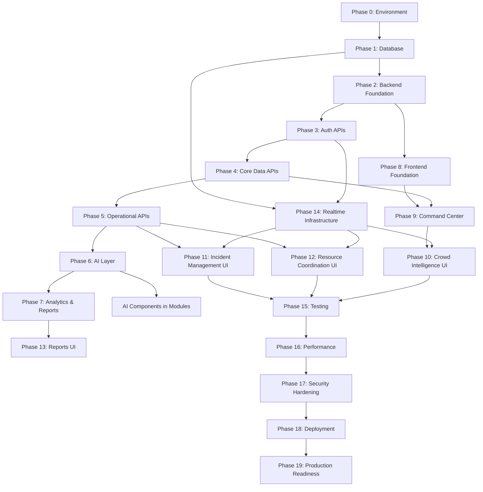

**Why this order:**

1. **Database first:** Every other layer depends on it. RLS must be correct from the start — retrofitting is dangerous.
2. **Backend before frontend:** Frontend needs real API endpoints (not mocks) to avoid integration bugs discovered at the end.
3. **Auth before any other API:** Every endpoint requires authentication. Building auth first means every subsequent endpoint gets security baked in.
4. **Realtime alongside data APIs:** Realtime channels mirror the API data model — built after DB is stable.
5. **AI layer after operational APIs:** AI context builders rely on incident, crowd, and resource data — these must exist first.
6. **Testing throughout, formalized in Phase 15:** Unit and integration tests are written with each phase. Phase 15 formalizes E2E, load, and security tests.

### 3.2 Critical Path

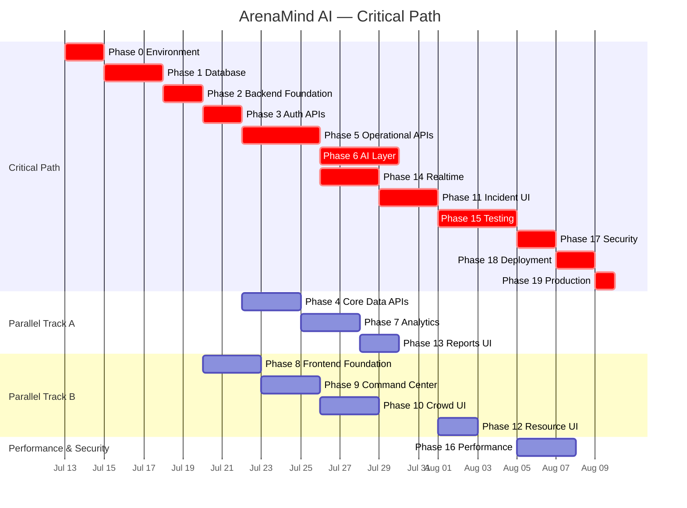

### 3.3 Milestone Gates

| Milestone                 | Gate Criteria                                           | Target Date   |
| ------------------------- | ------------------------------------------------------- | ------------- |
| **M0: Foundation Ready**  | DB migrations applied, auth working, CI green           | End of Week 1 |
| **M1: Backend Complete**  | All 86 endpoints implemented, integration tests passing | End of Week 3 |
| **M2: Frontend Alpha**    | All modules rendering with real data, no mocks          | End of Week 5 |
| **M3: AI Live**           | All 6 AI features operational, streaming working        | End of Week 4 |
| **M4: Realtime Live**     | All 6 channels delivering events < 200ms                | End of Week 5 |
| **M5: Test Suite Green**  | Unit/integration/E2E all passing                        | End of Week 6 |
| **M6: Security Hardened** | No P0/P1 security findings                              | End of Week 7 |
| **M7: Production Ready**  | All 150+ checklist items complete                       | End of Week 8 |

### 3.4 Go / No-Go Criteria

**Go criteria (ALL must be met before production):**

```
✅ All 86 API endpoints returning correct responses
✅ All 6 Realtime channels delivering events
✅ All 6 AI features operational
✅ All 35+ tables with RLS policies verified
✅ Unit test coverage ≥ 80%
✅ No open P0 or P1 bugs
✅ P99 latency targets met (per ASD Section 33)
✅ Zero critical security findings
✅ Accessibility: WCAG 2.1 AA compliant (axe-core clean)
✅ Production deployment successful on staging
✅ Rollback procedure tested
✅ Health endpoint returning 200
✅ AI hallucination guard functioning (tested)
✅ Phase transition flow working end-to-end
```

**No-Go triggers:**

```
🛑 Any cross-stadium data access possible via API
🛑 AI recommendation served without human review option
🛑 JWT can be bypassed on any operational endpoint
🛑 Crowd heatmap P99 > 500ms
🛑 Phase transition race condition reproducible
```

---

## 4. Team Structure

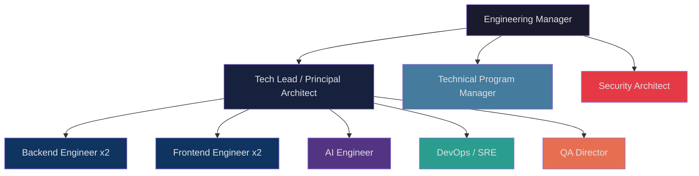

### Role Responsibilities

| Role                    | Primary Responsibility                                         | Ownership         |
| ----------------------- | -------------------------------------------------------------- | ----------------- |
| **Engineering Manager** | Delivery oversight, unblocking, stakeholder communication      | Project delivery  |
| **Tech Lead / Arch**    | Architecture decisions, PR reviews, technical standards        | Technical quality |
| **TPM**                 | Sprint planning, risk tracking, milestone monitoring           | Schedule          |
| **Backend Engineer 1**  | DB migrations, auth, core data APIs, AI layer                  | Phases 1–6        |
| **Backend Engineer 2**  | Operational APIs, analytics, reports, search                   | Phases 5, 7       |
| **Frontend Engineer 1** | Design system, layout, auth, command center, crowd module      | Phases 8–10       |
| **Frontend Engineer 2** | Incident module, resource module, reports UI, forms            | Phases 11–13      |
| **AI Engineer**         | Prompt library, context builder, Gemini integration, AI safety | Phase 6, 14       |
| **DevOps / SRE**        | CI/CD, Supabase config, Vercel config, environments            | Phases 0, 18, 28  |
| **QA Director**         | Test strategy, RLS tests, load tests, E2E, acceptance          | Phase 15          |
| **Security Architect**  | Security review, RLS audit, secrets audit, pen test            | Phase 17          |

---

## 5. Git Strategy

### 5.1 Repository Structure

```
arenamind-ai/                   ← Root repository (GitHub)
├── .github/
│   ├── workflows/              ← CI/CD pipelines
│   │   ├── ci.yml             ← PR checks
│   │   ├── deploy-staging.yml ← main branch deploy
│   │   └── deploy-prod.yml    ← manual production deploy
│   ├── PULL_REQUEST_TEMPLATE.md
│   └── CODEOWNERS
├── src/                       ← Next.js app source
├── supabase/                  ← Supabase config
│   ├── migrations/            ← SQL migrations (numbered)
│   ├── seed/                  ← Seed data scripts
│   └── functions/             ← Edge functions (if any)
├── k6/                        ← Load test scripts
├── tests/                     ← Test suites
│   ├── unit/
│   ├── integration/
│   └── e2e/                   ← Playwright tests
├── docs/                      ← Engineering documentation
└── scripts/                   ← Developer utility scripts
```

### 5.2 Branch Strategy

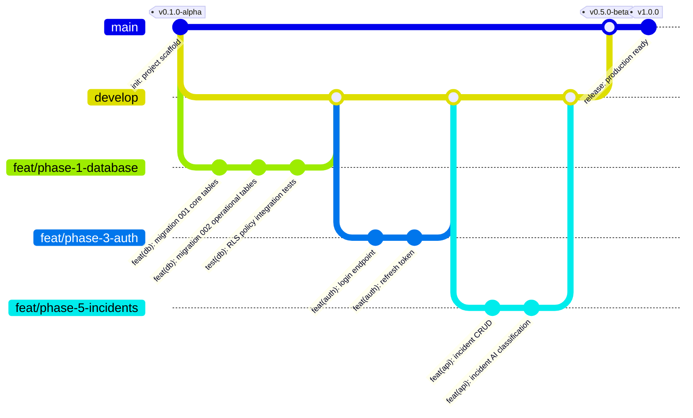

### 5.3 Branch Naming Convention

```
feat/{phase-number}-{short-description}   → feat/phase-6-ai-operational-summary
fix/{issue-number}-{short-description}    → fix/412-crowd-data-rls-bypass
chore/{description}                       → chore/update-dependencies
docs/{description}                        → docs/update-api-spec-examples
test/{description}                        → test/add-incident-rls-integration-tests
hotfix/{issue-number}-{description}       → hotfix/501-phase-transition-race-condition
refactor/{description}                    → refactor/extract-supabase-client-util
perf/{description}                        → perf/crowd-heatmap-query-optimization
```

### 5.4 Commit Convention (Conventional Commits)

```
type(scope): subject

body (optional — explain WHY, not WHAT)

footer (optional — issue references, breaking changes)

TYPES: feat | fix | chore | docs | test | refactor | perf | ci | build | revert

SCOPES: db | auth | api | ai | ui | realtime | infra | config | types | utils

Examples:
feat(api): add incident creation endpoint
test(db): add RLS cross-stadium access tests
fix(ai): handle Gemini timeout with exponential retry
perf(db): add covering index for crowd_data heatmap query
feat(ui): implement zone density heatmap component
ci: add axe-core accessibility check to CI pipeline
```

### 5.5 Pull Request Rules

```yaml
# .github/branch-protection.yml (conceptual)
main:
  required_status_checks:
    - lint
    - typecheck
    - unit-tests
    - integration-tests
    - build
    - security-scan
  required_reviews: 1 # Tech Lead must approve
  dismiss_stale_reviews: true
  require_linear_history: true # No merge commits
  allow_force_pushes: false

develop:
  required_status_checks:
    - lint
    - typecheck
    - unit-tests
  required_reviews: 1
```

### 5.6 Merge Strategy

```
Feature → develop:   Squash merge (clean history)
develop → main:      Merge commit (preserves develop history)
Hotfix → main:       Cherry-pick + merge to develop
```

### 5.7 Tagging and Releases

```
v0.1.0-alpha    → Project scaffold ready
v0.5.0-beta     → Backend + AI complete (internal demo)
v0.9.0-rc       → Feature complete, testing in progress
v1.0.0          → Production release
v1.0.x          → Hotfix releases
```

---

## 6. High-Level Roadmap

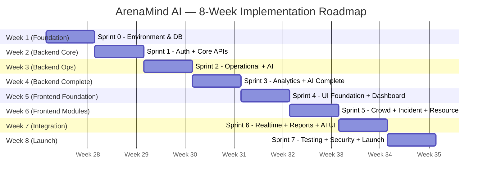

---

## 7. Sprint Plan

### Sprint 0 — Foundation (Week 1)

**Sprint Goal:** Every engineer can run the project locally, CI is green, DB is migrated, authentication works.

**Duration:** 5 days

**Deliverables:**

- Next.js 15 monorepo scaffolded with TypeScript strict
- Supabase project created (dev + staging environments)
- GitHub repository with branch protection rules
- GitHub Actions CI pipeline (lint, typecheck, unit tests, build)
- All DB migrations 001–005 applied to dev
- All RLS policies applied
- Seed data loaded (stadiums, matches, incident types, resource types)
- `/api/v1/health` endpoint returning 200
- Developer README complete

**Sprint 0 Task Breakdown:**

| Task                                                                      | Owner     | Est | Priority |
| ------------------------------------------------------------------------- | --------- | --- | -------- |
| Initialize Next.js 15 (`npx create-next-app@latest`)                      | Tech Lead | 1h  | P0       |
| Configure TypeScript strict mode                                          | BE1       | 30m | P0       |
| Configure ESLint + Prettier + commitlint                                  | BE1       | 1h  | P0       |
| Create GitHub repository + branch protection                              | DevOps    | 30m | P0       |
| Create Supabase projects (dev, staging)                                   | DevOps    | 1h  | P0       |
| Create `.env.local` template                                              | DevOps    | 30m | P0       |
| Write migration 001 (stadiums, matches, zones, users)                     | BE1       | 3h  | P0       |
| Write migration 002 (incidents, resources, crowd_data, alerts)            | BE1       | 4h  | P0       |
| Write migration 003 (ai_recommendations, ai_call_logs, ai_feedback)       | AI Eng    | 3h  | P0       |
| Write migration 004 (kpi_snapshots, health_scores, reports)               | BE2       | 2h  | P0       |
| Write migration 005 (audit_logs, notifications, job_queue, system tables) | BE2       | 2h  | P0       |
| Write RLS policies for all 35 tables                                      | BE1       | 4h  | P0       |
| Write indexes (covering, GIN, partial)                                    | BE1       | 2h  | P0       |
| Write triggers (updated_at, audit, alert threshold)                       | BE1       | 2h  | P0       |
| Write seed data (16 stadiums, match types, incident types)                | BE2       | 2h  | P0       |
| Implement `/api/v1/health` endpoint                                       | BE1       | 30m | P0       |
| Write middleware (CORS, security headers, correlation ID)                 | BE1       | 2h  | P0       |
| Configure Supabase client utilities                                       | BE1       | 1h  | P0       |
| Set up GitHub Actions CI (lint, typecheck, build)                         | DevOps    | 2h  | P0       |
| Write RLS integration test suite (cross-stadium access)                   | QA        | 3h  | P0       |
| Write developer README                                                    | TPM       | 1h  | P1       |

**Definition of Done — Sprint 0:**

- `npm run dev` starts without errors
- `npm run lint` passes with zero warnings
- `npm run typecheck` passes with zero errors
- All migrations applied successfully to dev Supabase
- `npx supabase db diff` shows no drift
- RLS integration tests: 100% pass
- `/api/v1/health` returns 200 in Postman
- CI pipeline green on PR to develop

---

### Sprint 1 — Authentication + Core Data APIs (Week 2)

**Sprint Goal:** A user can log in, receive a JWT, and query stadiums, matches, zones, and weather.

**Deliverables:**

- All 5 auth endpoints functional
- Supabase Auth custom JWT claims hook
- Middleware: JWT verification + rate limiting
- All 3 stadium endpoints
- All 5 match endpoints (including phase transition)
- Zone endpoints (detail + update)
- Weather endpoints
- Settings + feature flags endpoints
- Integration tests for all new endpoints

**Key Tasks:**

| Task                                                               | Owner | Est | Priority |
| ------------------------------------------------------------------ | ----- | --- | -------- |
| Implement POST /auth/login                                         | BE1   | 2h  | P0       |
| Implement POST /auth/refresh                                       | BE1   | 1h  | P0       |
| Implement POST /auth/logout                                        | BE1   | 30m | P0       |
| Implement POST /auth/forgot-password                               | BE1   | 30m | P0       |
| Write Supabase Auth custom claims hook                             | BE1   | 2h  | P0       |
| Implement JWT middleware (verify + extract)                        | BE1   | 2h  | P0       |
| Implement rate limiting middleware                                 | BE1   | 2h  | P0       |
| Implement GET /stadiums + detail                                   | BE2   | 1h  | P0       |
| Implement GET /stadiums/:id/zones                                  | BE2   | 1h  | P0       |
| Implement GET /matches (list + active + detail)                    | BE2   | 2h  | P0       |
| Implement PATCH /matches/:id/phase (SERIALIZABLE transaction)      | BE1   | 3h  | P0       |
| Implement GET /matches/:id/summary                                 | BE2   | 2h  | P1       |
| Implement GET/PATCH /zones/:id                                     | BE2   | 1h  | P1       |
| Implement GET/POST /weather                                        | BE2   | 1h  | P1       |
| Implement GET /settings + PATCH                                    | BE2   | 1h  | P2       |
| Implement GET /feature-flags + PATCH                               | BE2   | 30m | P2       |
| Write integration tests for auth endpoints                         | QA    | 3h  | P0       |
| Write integration tests for RBAC (coordinator cannot change phase) | QA    | 2h  | P0       |

---

### Sprint 2 — Operational APIs + AI Layer (Week 3)

**Sprint Goal:** Operations team can create incidents, manage resources, and receive AI classification and recommendations.

**Deliverables:**

- All 9 incident endpoints (including AI classification trigger)
- All 7 resource endpoints (assign/release)
- Accessibility (3 endpoints)
- Alerts + Notifications (5 endpoints)
- Crowd data endpoints (6)
- AI prompt library (6 templates in DB)
- AI context builder
- POST /ai/operational-summary (streaming + buffered)
- POST /ai/incident-classify (auto-triggered post-creation)
- POST /ai/incident-recommend

**Key Tasks:**

| Task                                                      | Owner  | Est | Priority |
| --------------------------------------------------------- | ------ | --- | -------- |
| Implement GET/POST /incidents (+ pagination)              | BE1    | 4h  | P0       |
| Implement GET/PATCH/DELETE /incidents/:id                 | BE1    | 2h  | P0       |
| Implement incident actions (GET/POST)                     | BE1    | 2h  | P0       |
| Implement incident attachments (GET/POST)                 | BE2    | 2h  | P1       |
| Implement GET/POST /resources                             | BE2    | 2h  | P0       |
| Implement PATCH/DELETE /resources/:id                     | BE2    | 1h  | P0       |
| Implement POST /resources/:id/assign + release            | BE2    | 2h  | P0       |
| Implement accessibility endpoints (3)                     | BE2    | 2h  | P1       |
| Implement alerts endpoints (2)                            | BE2    | 1h  | P1       |
| Implement notifications endpoints (3)                     | BE2    | 2h  | P1       |
| Implement crowd data endpoints (6)                        | BE1    | 3h  | P0       |
| Seed AI prompt templates (6) in DB                        | AI Eng | 2h  | P0       |
| Build AI context builder (parallel 6-query fetch)         | AI Eng | 4h  | P0       |
| Integrate @google/generative-ai SDK                       | AI Eng | 1h  | P0       |
| Implement Zod output schema validator                     | AI Eng | 3h  | P0       |
| Implement POST /ai/operational-summary (SSE + buffered)   | AI Eng | 4h  | P0       |
| Implement POST /ai/incident-classify                      | AI Eng | 3h  | P0       |
| Auto-trigger classify after incident creation (job queue) | AI Eng | 2h  | P0       |
| Implement POST /ai/incident-recommend                     | AI Eng | 2h  | P0       |
| Implement PATCH /ai/recommendations/:id (accept/dismiss)  | BE1    | 2h  | P0       |
| Implement POST /ai/recommendations/:id/feedback           | BE1    | 1h  | P1       |
| Write integration tests for incidents RLS                 | QA     | 3h  | P0       |
| Write AI safety tests (malformed Gemini output)           | QA     | 2h  | P0       |

---

### Sprint 3 — Analytics, Reports, Files, Search + AI Complete (Week 4)

**Sprint Goal:** Full backend API surface complete. AI executive summary and shift handover live.

**Deliverables:**

- POST /ai/crowd-recommendations
- POST /ai/executive-summary (streaming)
- POST /ai/shift-handover
- GET /ai/metrics (admin)
- Analytics endpoints (4)
- KPI snapshot cron job
- Health score calculation
- Report generation (async)
- PDF export
- File upload/download
- Search endpoint (full-text)
- Admin endpoints (3)
- All 86 endpoints live and tested

**Key Tasks:**

| Task                                                       | Owner  | Est | Priority |
| ---------------------------------------------------------- | ------ | --- | -------- |
| Implement POST /ai/crowd-recommendations                   | AI Eng | 2h  | P0       |
| Implement POST /ai/executive-summary (SSE streaming)       | AI Eng | 3h  | P0       |
| Implement POST /ai/shift-handover                          | AI Eng | 2h  | P0       |
| Implement GET /ai/metrics (admin)                          | AI Eng | 2h  | P1       |
| Implement retry logic for Gemini failures (3x exp backoff) | AI Eng | 2h  | P0       |
| Implement GET /analytics + /kpis + /health-score           | BE2    | 3h  | P0       |
| Implement GET /phase-timeline                              | BE2    | 1h  | P1       |
| Implement KPI snapshot cron (every 5 min, job_queue)       | BE1    | 3h  | P0       |
| Implement health score PostgreSQL function                 | BE1    | 2h  | P0       |
| Implement POST /reports/generate (async)                   | BE2    | 3h  | P1       |
| Implement report PDF export (Puppeteer)                    | BE2    | 4h  | P1       |
| Implement GET /reports/download (signed URL)               | BE2    | 1h  | P1       |
| Implement POST /files/upload (Supabase Storage)            | BE2    | 2h  | P0       |
| Implement GET/DELETE /files/:id                            | BE2    | 1h  | P1       |
| Implement POST /files/:id/signed-url                       | BE2    | 30m | P1       |
| Implement GET /search (FTS with pg_trgm)                   | BE1    | 3h  | P0       |
| Implement admin endpoints (audit-logs, ai-metrics, users)  | BE1    | 3h  | P1       |
| Implement GET /health/ai + /health/db                      | BE1    | 1h  | P0       |
| Final API integration test pass (all 86 endpoints)         | QA     | 4h  | P0       |
| OpenAPI contract test pass                                 | QA     | 2h  | P1       |

---

### Sprint 4 — Frontend Foundation + Command Center (Week 5)

**Sprint Goal:** A user can log in, see the Command Center dashboard with live KPI strip, health score, and weather.

**Deliverables:**

- Next.js App Router layout structure
- CSS design system (variables, typography, utilities)
- Google Fonts (Inter) loaded
- All shared components (Button, Badge, Card, Input, Modal, Toast)
- Auth layout + Login page
- Protected route middleware
- Dashboard layout (Sidebar + TopBar)
- Command Center page (KPI Strip, Health Gauge, Match Phase, Weather, AI Summary Card)
- Supabase SSR client configured

**Key Tasks:**

| Task                                                                      | Owner | Est | Priority |
| ------------------------------------------------------------------------- | ----- | --- | -------- |
| Create app directory structure (layout.tsx, page.tsx)                     | FE1   | 2h  | P0       |
| Configure Google Fonts (Inter)                                            | FE1   | 30m | P0       |
| Write CSS design system (index.css — colors, tokens, spacing, typography) | FE1   | 4h  | P0       |
| Build Button component (variants: primary, ghost, danger)                 | FE1   | 1h  | P0       |
| Build Badge component (severity tiers, status)                            | FE1   | 1h  | P0       |
| Build Card component (glass-morphism style)                               | FE1   | 30m | P0       |
| Build Input/Select/Textarea components                                    | FE1   | 2h  | P0       |
| Build Modal component (portal-based, trap focus)                          | FE1   | 2h  | P0       |
| Build Toast notification system                                           | FE1   | 2h  | P0       |
| Build Tooltip component                                                   | FE1   | 30m | P1       |
| Configure Supabase SSR client (@supabase/ssr)                             | FE2   | 1h  | P0       |
| Implement login page (form + auth.signIn)                                 | FE2   | 2h  | P0       |
| Implement protected route middleware (next.js middleware.ts)              | FE2   | 1h  | P0       |
| Build DashboardLayout (Sidebar + TopBar)                                  | FE1   | 3h  | P0       |
| Build Sidebar navigation (match selector, module nav, user card)          | FE1   | 2h  | P0       |
| Build TopBar (match name, phase, connection status)                       | FE1   | 1h  | P0       |
| Build KPI Strip (4 live metric cards)                                     | FE1   | 2h  | P0       |
| Build Health Score Gauge (SVG arc animation)                              | FE1   | 3h  | P0       |
| Build Match Phase Indicator (horizontal stepper)                          | FE2   | 2h  | P0       |
| Build Weather Widget                                                      | FE2   | 1h  | P1       |
| Build AI Summary Card (text display + streaming text render)              | FE2   | 3h  | P0       |
| Wire Command Center to real API data                                      | FE1   | 3h  | P0       |
| Implement useMatchData hook (TanStack Query)                              | FE1   | 1h  | P0       |

---

### Sprint 5 — Crowd Intelligence + Incident + Resource Modules (Week 6)

**Sprint Goal:** Full operational functionality. Operators can monitor crowd density, manage incidents, and coordinate resources in real-time.

**Deliverables:**

- Stadium heatmap (SVG density visualization)
- Crowd trend chart (Recharts)
- Zone detail drawer
- Incident feed (sortable, filterable)
- Incident creation form
- Incident detail drawer with action timeline
- AI recommendation display (accept/dismiss)
- Resource board (Kanban-style)
- Resource assign/release modal

**Key Tasks:**

| Task                                                                 | Owner | Est | Priority |
| -------------------------------------------------------------------- | ----- | --- | -------- |
| Build SvgHeatmap component (density color-coded zones)               | FE1   | 5h  | P0       |
| Build ZoneDensityCard component                                      | FE1   | 1h  | P0       |
| Build CrowdTrendChart (Recharts LineChart)                           | FE1   | 2h  | P0       |
| Build ZoneDetailDrawer (side panel)                                  | FE2   | 2h  | P1       |
| Implement useCrowdData hook (TanStack Query)                         | FE1   | 1h  | P0       |
| Build IncidentFeed (virtualized list, sort, filter)                  | FE2   | 4h  | P0       |
| Build IncidentRow component (severity badge, status, zone, timer)    | FE2   | 1h  | P0       |
| Build CreateIncidentForm (multi-field form with validation)          | FE2   | 3h  | P0       |
| Build IncidentDetailDrawer (full drawer, action timeline)            | FE2   | 4h  | P0       |
| Build IncidentActionTimeline (chronological event list)              | FE2   | 2h  | P0       |
| Build AIRecommendationPanel (streaming text, accept/dismiss buttons) | FE2   | 4h  | P0       |
| Build AIStreamingText component (SSE consumer)                       | FE2   | 2h  | P0       |
| Build ResourceBoard (Kanban: available/deployed/assigned columns)    | FE2   | 4h  | P1       |
| Build ResourceCard component                                         | FE2   | 1h  | P1       |
| Build AssignResourceModal (incident selector + confirm)              | FE2   | 2h  | P1       |
| Implement useIncidents hook (TanStack Query + optimistic updates)    | FE2   | 2h  | P0       |
| Implement useResources hook                                          | FE2   | 1h  | P1       |
| Accessibility: keyboard navigation for all modals/forms              | FE1   | 3h  | P0       |
| Component tests for IncidentFeed, IncidentForm                       | QA    | 3h  | P0       |

---

### Sprint 6 — Realtime + Reports UI + Accessibility Module (Week 7)

**Sprint Goal:** Dashboard operates in real-time — incidents appear as they are created, crowd density updates live, phase changes broadcast immediately.

**Deliverables:**

- 6 Supabase Realtime channel subscriptions live
- Presence protocol
- Reconnection + polling fallback
- Reports & Analytics UI (charts, report generator)
- Accessibility requests module
- Alerts & Notifications UI
- Animations and micro-interactions

**Key Tasks:**

| Task                                                        | Owner  | Est | Priority |
| ----------------------------------------------------------- | ------ | --- | -------- |
| Implement useCrowdRealtime hook (crowd_data channel)        | AI Eng | 2h  | P0       |
| Implement useIncidentRealtime hook (incidents channel)      | AI Eng | 2h  | P0       |
| Implement useResourceRealtime hook (resources channel)      | AI Eng | 1h  | P0       |
| Implement usePhaseRealtime hook (matches channel)           | AI Eng | 1h  | P0       |
| Implement useNotificationRealtime hook                      | AI Eng | 1h  | P0       |
| Implement usePresence hook (online users)                   | AI Eng | 2h  | P1       |
| Implement exponential backoff reconnection logic            | AI Eng | 2h  | P0       |
| Implement polling fallback (5s when Realtime down)          | AI Eng | 2h  | P0       |
| Build optimistic updates for incident creation              | FE2    | 2h  | P0       |
| Build AnalyticsDashboard (chart grid, KPI tiles)            | FE2    | 4h  | P1       |
| Build HealthScoreChart (trend line with Recharts)           | FE1    | 2h  | P1       |
| Build IncidentsByTierChart (stacked bar)                    | FE2    | 2h  | P1       |
| Build ReportGenerator (form + async polling for completion) | FE2    | 3h  | P1       |
| Build ReportViewer (rendered report display)                | FE2    | 2h  | P1       |
| Build AccessibilityRequestBoard                             | FE2    | 3h  | P2       |
| Build NotificationPanel (slide-in drawer)                   | FE1    | 2h  | P1       |
| Build AlertBanner (priority alerts, auto-dismiss)           | FE1    | 2h  | P0       |
| Add hover animations + entrance animations (CSS)            | FE1    | 3h  | P1       |
| Add Tier 1 incident alert modal (full-screen overlay)       | FE1    | 2h  | P0       |
| Online user presence indicators in TopBar                   | FE1    | 1h  | P2       |
| Realtime integration tests (WebSocket event delivery < 2s)  | QA     | 3h  | P0       |

---

### Sprint 7 — Testing, Performance, Security, Production (Week 8)

**Sprint Goal:** Production-ready. All tests green, performance targets met, security hardened, deployed.

**Deliverables:**

- E2E Playwright tests (5 critical flows)
- k6 load tests passing
- axe-core accessibility tests passing
- Security audit complete
- Performance optimization complete
- Vercel production deployment configured
- Supabase production configuration
- Monitoring dashboards live
- Post-launch runbook written

**Key Tasks:**

| Task                                                            | Owner  | Est | Priority |
| --------------------------------------------------------------- | ------ | --- | -------- |
| Write E2E: Login flow                                           | QA     | 2h  | P0       |
| Write E2E: Incident creation + AI classification                | QA     | 3h  | P0       |
| Write E2E: Phase transition (OM only)                           | QA     | 2h  | P0       |
| Write E2E: AI recommendation accept flow                        | QA     | 2h  | P0       |
| Write E2E: Crowd alert trigger → notification                   | QA     | 2h  | P0       |
| Run k6 dashboard load test (50 VUs, 5 min)                      | QA     | 1h  | P0       |
| Run k6 AI endpoint load test (AI rate limit verification)       | QA     | 1h  | P0       |
| Run axe-core on all pages                                       | QA     | 2h  | P0       |
| Visual regression test baseline                                 | QA     | 2h  | P1       |
| Next.js bundle analysis (next-bundle-analyzer)                  | FE1    | 1h  | P0       |
| React Query cache configuration                                 | FE1    | 2h  | P0       |
| Server Component audit (move non-interactive to RSC)            | FE1    | 3h  | P1       |
| DB query EXPLAIN ANALYZE review (crowd heatmap + incident list) | BE1    | 2h  | P0       |
| AI response caching (recommendations < 15 min)                  | AI Eng | 2h  | P1       |
| Security headers audit (securityheaders.com)                    | SEC    | 1h  | P0       |
| CORS configuration lock-down                                    | SEC    | 1h  | P0       |
| RLS penetration test (manual + automated)                       | SEC    | 4h  | P0       |
| Secrets audit (grep for secrets in codebase)                    | SEC    | 1h  | P0       |
| npm audit (zero critical/high vulnerabilities)                  | SEC    | 1h  | P0       |
| Configure Vercel production deployment                          | DevOps | 2h  | P0       |
| Configure Supabase production project                           | DevOps | 2h  | P0       |
| Environment variable audit (prod vs staging)                    | DevOps | 1h  | P0       |
| Run production smoke tests                                      | QA     | 1h  | P0       |
| Test rollback procedure                                         | DevOps | 1h  | P0       |
| Write post-launch monitoring runbook                            | SRE    | 2h  | P0       |
| Final production readiness checklist sign-off                   | EM     | 1h  | P0       |

---

## 8. Phase 0 — Environment & Project Foundation

### 8.1 Project Initialization

```bash
# Step 1: Create Next.js 15 app
npx create-next-app@latest arenamind-ai \
  --typescript \
  --app \
  --src-dir \
  --import-alias "@/*" \
  --no-tailwind

# Step 2: Install core dependencies
npm install @supabase/supabase-js @supabase/ssr @google/generative-ai zod

# Step 3: Install dev dependencies
npm install -D \
  @types/node \
  eslint eslint-config-next \
  prettier eslint-config-prettier \
  @commitlint/cli @commitlint/config-conventional \
  husky lint-staged \
  vitest @vitest/ui \
  @playwright/test \
  next-bundle-analyzer

# Step 4: Install Supabase CLI
npm install -D supabase
```

### 8.2 TypeScript Configuration

```json
// tsconfig.json
{
  "compilerOptions": {
    "target": "ES2022",
    "lib": ["dom", "dom.iterable", "esnext"],
    "allowJs": false,
    "skipLibCheck": true,
    "strict": true,
    "noUncheckedIndexedAccess": true,
    "forceConsistentCasingInFileNames": true,
    "module": "esnext",
    "moduleResolution": "bundler",
    "resolveJsonModule": true,
    "isolatedModules": true,
    "jsx": "preserve",
    "incremental": true,
    "plugins": [{ "name": "next" }],
    "paths": {
      "@/*": ["./src/*"]
    }
  }
}
```

### 8.3 Project Directory Structure

```
src/
├── app/                           ← Next.js App Router
│   ├── (auth)/                    ← Auth layout group
│   │   └── login/
│   │       └── page.tsx
│   ├── (dashboard)/               ← Dashboard layout group
│   │   ├── layout.tsx             ← DashboardLayout (Sidebar + TopBar)
│   │   └── [matchId]/             ← Match-scoped pages
│   │       ├── page.tsx           ← Command Center (/)
│   │       ├── crowd/page.tsx     ← Crowd Intelligence
│   │       ├── incidents/page.tsx ← Incident Management
│   │       ├── resources/page.tsx ← Resource Coordination
│   │       ├── accessibility/page.tsx
│   │       ├── analytics/page.tsx
│   │       └── reports/page.tsx
│   ├── api/
│   │   └── v1/                    ← REST API routes
│   │       ├── auth/[...route]/route.ts
│   │       ├── users/[[...params]]/route.ts
│   │       ├── stadiums/[[...params]]/route.ts
│   │       ├── matches/[[...params]]/route.ts
│   │       ├── zones/[[...params]]/route.ts
│   │       ├── ai/[feature]/route.ts
│   │       ├── search/route.ts
│   │       ├── files/[[...params]]/route.ts
│   │       ├── notifications/[[...params]]/route.ts
│   │       ├── settings/[[...params]]/route.ts
│   │       ├── admin/[[...params]]/route.ts
│   │       └── health/[[...params]]/route.ts
│   ├── layout.tsx                 ← Root layout (fonts, metadata)
│   └── middleware.ts              ← Auth + rate limit + CORS
│
├── components/
│   ├── ui/                        ← Design system components
│   │   ├── Button.tsx
│   │   ├── Badge.tsx
│   │   ├── Card.tsx
│   │   ├── Input.tsx
│   │   ├── Select.tsx
│   │   ├── Modal.tsx
│   │   ├── Toast.tsx
│   │   ├── Tooltip.tsx
│   │   └── index.ts
│   ├── layout/                    ← Layout components
│   │   ├── Sidebar.tsx
│   │   ├── TopBar.tsx
│   │   └── DashboardLayout.tsx
│   ├── dashboard/                 ← Command center components
│   │   ├── KpiStrip.tsx
│   │   ├── HealthScoreGauge.tsx
│   │   ├── MatchPhaseIndicator.tsx
│   │   ├── WeatherWidget.tsx
│   │   └── AiSummaryCard.tsx
│   ├── crowd/                     ← Crowd intelligence components
│   │   ├── StadiumHeatmap.tsx
│   │   ├── ZoneDensityCard.tsx
│   │   ├── CrowdTrendChart.tsx
│   │   └── ZoneDetailDrawer.tsx
│   ├── incidents/                 ← Incident management components
│   │   ├── IncidentFeed.tsx
│   │   ├── IncidentRow.tsx
│   │   ├── CreateIncidentForm.tsx
│   │   ├── IncidentDetailDrawer.tsx
│   │   ├── IncidentActionTimeline.tsx
│   │   └── AiRecommendationPanel.tsx
│   ├── resources/                 ← Resource components
│   │   ├── ResourceBoard.tsx
│   │   ├── ResourceCard.tsx
│   │   └── AssignResourceModal.tsx
│   ├── analytics/                 ← Analytics/Reports components
│   │   ├── AnalyticsDashboard.tsx
│   │   ├── ReportGenerator.tsx
│   │   └── ReportViewer.tsx
│   └── realtime/                  ← Realtime hooks and providers
│       ├── RealtimeProvider.tsx
│       └── ConnectionStatus.tsx
│
├── hooks/                         ← React hooks
│   ├── useMatchData.ts
│   ├── useCrowdData.ts
│   ├── useIncidents.ts
│   ├── useResources.ts
│   ├── useNotifications.ts
│   ├── useCrowdRealtime.ts
│   ├── useIncidentRealtime.ts
│   ├── usePhaseRealtime.ts
│   └── usePresence.ts
│
├── lib/                           ← Shared utilities
│   ├── supabase/
│   │   ├── client.ts              ← Browser client
│   │   ├── server.ts              ← Server client (cookies)
│   │   ├── admin.ts               ← Service role client
│   │   └── realtime.ts            ← Channel utilities
│   ├── ai/
│   │   ├── gemini.ts              ← Gemini SDK wrapper
│   │   ├── context-builder.ts     ← 6-query parallel context fetch
│   │   ├── prompt-loader.ts       ← DB prompt template loader
│   │   ├── output-validator.ts    ← Zod schema validators per feature
│   │   └── streaming.ts           ← SSE streaming helpers
│   ├── api/
│   │   ├── response.ts            ← wrapSuccess, wrapError, wrapPaginated
│   │   ├── errors.ts              ← APIError class + error codes
│   │   └── pagination.ts          ← Cursor encoder/decoder
│   ├── validation/
│   │   └── schemas/               ← Zod request schemas per endpoint
│   └── utils/
│       ├── date.ts
│       ├── format.ts
│       └── constants.ts
│
├── styles/
│   └── index.css                  ← Global design system CSS
│
└── types/
    ├── database.ts                ← Generated from Supabase (supabase gen types)
    ├── api.ts                     ← API request/response types
    └── ui.ts                      ← UI-specific types
```

### 8.4 Environment Configuration

```bash
# .env.local (developer local — NEVER commit)
NEXT_PUBLIC_SUPABASE_URL=https://your-project.supabase.co
NEXT_PUBLIC_SUPABASE_ANON_KEY=your_anon_key_here
SUPABASE_SERVICE_ROLE_KEY=your_service_role_key_here    # Server only
GEMINI_API_KEY=your_gemini_api_key_here                 # Server only
ALLOWED_ORIGINS=http://localhost:3000
NODE_ENV=development
NEXT_PUBLIC_APP_VERSION=1.0.0-dev

# Vercel (staging + production) — set via Vercel dashboard
# Production uses different Supabase project + service key
```

---

## 9. Phase 1 — Database Implementation

### 9.1 Migration Execution Order

**Rule:** Migrations are irreversible in production. Every migration must have a corresponding `down` script. Migrations are numbered sequentially and never modified after application.

```
001_core_entities.sql         → stadiums, matches, zones, users
002_operational_tables.sql    → incidents, incident_types, incident_actions,
                                 resources, resource_types, resource_assignments,
                                 resource_movements, crowd_data, queue_data,
                                 accessibility_requests, weather_data, alerts,
                                 alert_thresholds
003_ai_tables.sql             → ai_recommendations, ai_call_logs, ai_feedback,
                                 ai_prompt_templates
004_analytics_tables.sql      → kpi_snapshots, health_scores, reports,
                                 report_exports, phase_transitions
005_system_tables.sql         → audit_logs, activity_logs, notifications,
                                 system_settings, feature_flags, job_queue,
                                 dead_letter_queue, rate_limits, files, error_logs
006_indexes.sql               → All covering indexes, GIN indexes, partial indexes
007_triggers.sql              → updated_at trigger, audit trigger, alert threshold trigger
008_functions.sql             → calculate_health_score(), check_rate_limit(),
                                 get_crowd_summary()
009_rls_policies.sql          → All RLS policies for 35 tables
010_seed_data.sql             → Dev seed: 16 stadiums, incident types, resource types,
                                 prompt templates, test users, sample matches
```

### 9.2 RLS Policy Architecture

**Pattern per table:**

```sql
-- Pattern: Operational table (incidents example)
ALTER TABLE incidents ENABLE ROW LEVEL SECURITY;

-- SELECT: All authenticated users can read their stadium's incidents
CREATE POLICY "incidents_select_authenticated"
ON incidents FOR SELECT
TO authenticated
USING (
  stadium_id = (
    SELECT (raw_app_meta_data->>'stadium_id')::uuid
    FROM auth.users
    WHERE id = auth.uid()
  )
  AND deleted_at IS NULL
);

-- INSERT: OM, DM, Coordinator can create incidents
CREATE POLICY "incidents_insert_operational"
ON incidents FOR INSERT
TO authenticated
WITH CHECK (
  stadium_id = (
    SELECT (raw_app_meta_data->>'stadium_id')::uuid
    FROM auth.users WHERE id = auth.uid()
  )
  AND (
    SELECT raw_app_meta_data->>'user_role'
    FROM auth.users WHERE id = auth.uid()
  ) IN ('operations_manager', 'deputy_manager', 'coordinator')
);

-- UPDATE: OM, DM, Coordinator can update (not closed incidents)
CREATE POLICY "incidents_update_operational"
ON incidents FOR UPDATE
TO authenticated
USING (
  stadium_id = (SELECT (raw_app_meta_data->>'stadium_id')::uuid FROM auth.users WHERE id = auth.uid())
  AND deleted_at IS NULL
  AND status NOT IN ('closed')
  AND (SELECT raw_app_meta_data->>'user_role' FROM auth.users WHERE id = auth.uid())
      IN ('operations_manager', 'deputy_manager', 'coordinator')
)
WITH CHECK (
  stadium_id = (SELECT (raw_app_meta_data->>'stadium_id')::uuid FROM auth.users WHERE id = auth.uid())
);

-- DELETE (soft): OM, DM only
CREATE POLICY "incidents_soft_delete"
ON incidents FOR UPDATE
TO authenticated
USING (
  stadium_id = (SELECT (raw_app_meta_data->>'stadium_id')::uuid FROM auth.users WHERE id = auth.uid())
  AND status = 'open'
  AND (SELECT raw_app_meta_data->>'user_role' FROM auth.users WHERE id = auth.uid())
      IN ('operations_manager', 'deputy_manager')
);

-- Service role: bypass RLS for AI inserts
-- (Service role key automatically bypasses RLS in Supabase)
```

### 9.3 Critical Indexes

```sql
-- 006_indexes.sql

-- Crowd heatmap (primary query path — must be < 50ms P99)
CREATE INDEX idx_crowd_data_match_zone_time
ON crowd_data (match_id, zone_id, recorded_at DESC);
-- Query: WHERE match_id = ? ORDER BY recorded_at DESC DISTINCT ON zone_id

-- Incident list (operational dashboard primary query)
CREATE INDEX idx_incidents_match_status_tier
ON incidents (match_id, status, severity_tier, created_at DESC)
WHERE deleted_at IS NULL;

-- AI recommendations (active recommendations lookup)
CREATE INDEX idx_ai_recommendations_match_active
ON ai_recommendations (match_id, feature_name, created_at DESC)
WHERE action_taken IS NULL AND expires_at > NOW();

-- Notifications (user notification inbox)
CREATE INDEX idx_notifications_user_unread
ON notifications (user_id, created_at DESC)
WHERE is_read = FALSE AND deleted_at IS NULL;

-- Full-text search (incidents)
CREATE INDEX idx_incidents_fts
ON incidents USING GIN (to_tsvector('english', title || ' ' || description));

-- Rate limiting (sliding window check)
CREATE INDEX idx_rate_limits_key_window
ON rate_limits (key, window_start);

-- Audit logs (admin query — append-only, BIGSERIAL)
CREATE INDEX idx_audit_logs_table_record
ON audit_logs (table_name, record_id, created_at DESC);
```

### 9.4 Trigger Implementation

```sql
-- 007_triggers.sql

-- updated_at trigger (applied to all tables with updated_at column)
CREATE OR REPLACE FUNCTION set_updated_at()
RETURNS TRIGGER AS $$
BEGIN
  NEW.updated_at = NOW();
  RETURN NEW;
END;
$$ LANGUAGE plpgsql;

-- Apply to operational tables
CREATE TRIGGER trg_incidents_updated_at BEFORE UPDATE ON incidents
FOR EACH ROW EXECUTE FUNCTION set_updated_at();

-- Audit trigger (immutable log of all changes)
CREATE OR REPLACE FUNCTION create_audit_log()
RETURNS TRIGGER AS $$
BEGIN
  INSERT INTO audit_logs (
    table_name, record_id, operation, old_data, new_data,
    performed_by, stadium_id, created_at
  ) VALUES (
    TG_TABLE_NAME,
    COALESCE(NEW.id::text, OLD.id::text),
    TG_OP,
    CASE WHEN TG_OP != 'INSERT' THEN to_jsonb(OLD) ELSE NULL END,
    CASE WHEN TG_OP != 'DELETE' THEN to_jsonb(NEW) ELSE NULL END,
    auth.uid(),
    COALESCE(NEW.stadium_id, OLD.stadium_id),
    NOW()
  );
  RETURN COALESCE(NEW, OLD);
END;
$$ LANGUAGE plpgsql SECURITY DEFINER;

-- Alert threshold trigger (on crowd_data INSERT)
CREATE OR REPLACE FUNCTION check_crowd_alert_threshold()
RETURNS TRIGGER AS $$
DECLARE
  v_threshold RECORD;
BEGIN
  SELECT at.* INTO v_threshold
  FROM alert_thresholds at
  JOIN zones z ON z.id = NEW.zone_id
  WHERE z.id = NEW.zone_id
    AND at.metric_type = 'crowd_density_pct'
    AND at.is_active = TRUE
    AND NEW.density_pct >= at.threshold_value
  ORDER BY at.threshold_value DESC
  LIMIT 1;

  IF FOUND THEN
    -- Insert alert if not already active for this zone
    INSERT INTO alerts (match_id, stadium_id, zone_id, alert_type, severity, message)
    SELECT NEW.match_id, z.stadium_id, NEW.zone_id, 'crowd_threshold', v_threshold.severity_level,
           format('Zone density at %.1f%% — threshold %.0f%% exceeded', NEW.density_pct, v_threshold.threshold_value)
    FROM zones z WHERE z.id = NEW.zone_id
    ON CONFLICT DO NOTHING;
  END IF;
  RETURN NEW;
END;
$$ LANGUAGE plpgsql SECURITY DEFINER;

CREATE TRIGGER trg_crowd_data_alert_check
AFTER INSERT ON crowd_data
FOR EACH ROW EXECUTE FUNCTION check_crowd_alert_threshold();
```

### 9.5 Database Rollback Strategy

```sql
-- Each migration has a corresponding down migration:

-- down_001_core_entities.sql
DROP TABLE IF EXISTS users CASCADE;
DROP TABLE IF EXISTS zones CASCADE;
DROP TABLE IF EXISTS matches CASCADE;
DROP TABLE IF EXISTS stadiums CASCADE;

-- Rollback execution order: reverse of apply order
-- 010 → 009 → 008 → 007 → 006 → 005 → 004 → 003 → 002 → 001
```

**Rollback Rules:**

- Never rollback production migrations — create a new migration to fix
- Rollback only in dev/staging environments
- All schema changes must be backward-compatible for at least one version

---

## 10. Phase 2 — Backend Foundation

### 10.1 Supabase Client Utilities

**Why three separate clients:** Security separation prevents accidental use of service role key in browser-accessible code.

```typescript
// lib/supabase/client.ts — Browser-side (uses anon key)
// Used in: React components, client-side hooks
import { createBrowserClient } from '@supabase/ssr';
export function createClient() {
  return createBrowserClient<Database>(
    process.env.NEXT_PUBLIC_SUPABASE_URL!,
    process.env.NEXT_PUBLIC_SUPABASE_ANON_KEY!
  );
}

// lib/supabase/server.ts — Server-side (reads cookies for JWT)
// Used in: Server Components, Route Handlers
import { createServerClient } from '@supabase/ssr';
import { cookies } from 'next/headers';
export function createServerSupabaseClient() {
  const cookieStore = cookies();
  return createServerClient<Database>(
    process.env.NEXT_PUBLIC_SUPABASE_URL!,
    process.env.NEXT_PUBLIC_SUPABASE_ANON_KEY!,
    { cookies: { get: (name) => cookieStore.get(name)?.value, ... } }
  );
}

// lib/supabase/admin.ts — Service role (bypasses RLS)
// Used in: AI inserts, cron jobs, system operations
// ⚠️ NEVER import this in client-side code
import { createClient } from '@supabase/supabase-js';
export const adminSupabase = createClient<Database>(
  process.env.NEXT_PUBLIC_SUPABASE_URL!,
  process.env.SUPABASE_SERVICE_ROLE_KEY!
);
```

### 10.2 Middleware Implementation

```typescript
// src/middleware.ts

export async function middleware(request: NextRequest) {
  const pathname = request.nextUrl.pathname;

  // Layer 1: CORS preflight handling
  if (request.method === 'OPTIONS') return handleCorsPrelight(request);

  // Layer 2: Skip auth for public endpoints
  const isPublicPath = PUBLIC_PATHS.some((p) => pathname.startsWith(p));

  // Layer 3: JWT verification for protected endpoints
  if (!isPublicPath && pathname.startsWith('/api/v1/')) {
    const token = extractBearerToken(request);
    if (!token) return unauthorizedResponse('NO_TOKEN');

    const { user, error } = await verifySupabaseJWT(token);
    if (error || !user) return unauthorizedResponse('TOKEN_INVALID');

    // Layer 4: Inject auth context into headers for Route Handlers
    const requestHeaders = new Headers(request.headers);
    requestHeaders.set('X-User-ID', user.id);
    requestHeaders.set('X-Stadium-ID', user.app_metadata.stadium_id ?? '');
    requestHeaders.set('X-User-Role', user.app_metadata.user_role ?? '');
    requestHeaders.set('X-Request-ID', request.headers.get('X-Request-ID') ?? crypto.randomUUID());

    // Layer 5: Rate limiting
    const rateCheck = await checkRateLimit(user.id, pathname);
    if (!rateCheck.allowed) return rateLimitResponse(rateCheck);

    const response = NextResponse.next({ request: { headers: requestHeaders } });
    addSecurityHeaders(response);
    response.headers.set('X-Request-ID', requestHeaders.get('X-Request-ID')!);
    return response;
  }

  const response = NextResponse.next();
  addSecurityHeaders(response);
  return response;
}

export const config = {
  matcher: ['/api/v1/:path*', '/(dashboard)/:path*'],
};
```

### 10.3 Response Helpers

```typescript
// lib/api/response.ts

export function wrapSuccess<T>(data: T, status = 200): NextResponse {
  return NextResponse.json(
    {
      success: true,
      data,
      meta: {
        timestamp: new Date().toISOString(),
        requestId: headers().get('X-Request-ID') ?? 'unknown',
        version: '1.0.0',
      },
    },
    { status }
  );
}

export function wrapError(
  code: string,
  message: string,
  status: number,
  options?: { details?: string; fieldErrors?: FieldError[]; retryAfter?: number }
): NextResponse {
  return NextResponse.json(
    {
      success: false,
      error: { code, message, ...options },
      meta: {
        timestamp: new Date().toISOString(),
        requestId: headers().get('X-Request-ID') ?? 'unknown',
      },
    },
    { status }
  );
}

export function wrapPaginated<T>(data: T[], pagination: PaginationMeta): NextResponse {
  return NextResponse.json({
    success: true,
    data,
    pagination,
    meta: {
      timestamp: new Date().toISOString(),
      requestId: headers().get('X-Request-ID') ?? 'unknown',
      version: '1.0.0',
    },
  });
}
```

---

## 11. Phase 3 — Authentication APIs

### 11.1 Implementation Sequence

```
1. POST /api/v1/auth/login         → Supabase signInWithPassword
2. POST /api/v1/auth/refresh       → Supabase refreshSession
3. POST /api/v1/auth/logout        → Supabase signOut
4. POST /api/v1/auth/forgot-password → Supabase resetPasswordForEmail
5. POST /api/v1/auth/reset-password → Supabase updateUser
6. Supabase Auth Hook              → Custom JWT claims injection
```

### 11.2 Custom JWT Claims Hook

```sql
-- Supabase Auth hook — executed after user creation
-- Adds stadium_id and user_role to JWT app_metadata

CREATE OR REPLACE FUNCTION public.handle_new_user_jwt_claims()
RETURNS json AS $$
DECLARE
  v_user RECORD;
BEGIN
  SELECT u.stadium_id, u.role
  INTO v_user
  FROM public.users u
  WHERE u.id = (SELECT id FROM auth.users WHERE email = NEW.email LIMIT 1);

  RETURN json_build_object(
    'stadium_id', v_user.stadium_id,
    'user_role', v_user.role
  );
END;
$$ LANGUAGE plpgsql SECURITY DEFINER;
```

**Why custom claims:** Avoids a database lookup on every request. Stadium ID and role are embedded in the JWT and extracted in middleware without a DB round-trip.

---

## 12. Phase 4 — Core Data APIs

### 12.1 Implementation Priority

| Priority | Endpoints                | Reason                                  |
| -------- | ------------------------ | --------------------------------------- |
| P0       | GET /matches/active      | Required by frontend on every page load |
| P0       | GET /stadiums/:id/zones  | Required for heatmap + incident forms   |
| P0       | PATCH /matches/:id/phase | Core operational function               |
| P1       | GET /matches (list)      | Match selector in sidebar               |
| P1       | GET /stadiums            | Stadium context                         |
| P2       | PATCH /zones/:id         | Configuration — not match-day critical  |
| P2       | GET/PATCH /settings      | Admin configuration                     |

### 12.2 Phase Transition Implementation (Critical)

```typescript
// POST /api/v1/matches/[matchId]/phase — requires SERIALIZABLE isolation

const VALID_TRANSITIONS: Record<MatchPhase, MatchPhase[]> = {
  pre_event:    ['gate_opening'],
  gate_opening: ['fan_arrival'],
  fan_arrival:  ['pre_kickoff'],
  pre_kickoff:  ['match_live'],
  match_live:   ['halftime'],
  halftime:     ['second_half'],
  second_half:  ['full_time'],
  full_time:    ['crowd_exit'],
  crowd_exit:   ['post_event'],
  post_event:   [],
};

export async function patchPhase(matchId: string, toPhase: MatchPhase, userId: string) {
  // Use admin client for SERIALIZABLE transaction
  const { data, error } = await adminSupabase.rpc('transition_match_phase', {
    p_match_id: matchId,
    p_to_phase: toPhase,
    p_user_id: userId,
  });

  if (error?.code === '23514') throw new APIError('INVALID_PHASE_TRANSITION', ...);
  if (error?.code === '40001') throw new APIError('PHASE_TRANSITION_CONFLICT', ...);
  return data;
}
```

```sql
-- PostgreSQL function with SERIALIZABLE isolation
CREATE OR REPLACE FUNCTION transition_match_phase(
  p_match_id UUID, p_to_phase TEXT, p_user_id UUID
) RETURNS matches AS $$
DECLARE
  v_match matches;
  v_valid_transitions TEXT[];
BEGIN
  -- Lock the match row for update (serializable isolation handles race)
  SELECT * INTO v_match FROM matches WHERE id = p_match_id FOR UPDATE;

  -- Validate transition
  v_valid_transitions := CASE v_match.current_phase
    WHEN 'pre_event' THEN ARRAY['gate_opening']
    WHEN 'gate_opening' THEN ARRAY['fan_arrival']
    -- ... etc
    ELSE ARRAY[]::TEXT[]
  END;

  IF NOT (p_to_phase = ANY(v_valid_transitions)) THEN
    RAISE EXCEPTION 'INVALID_PHASE_TRANSITION' USING ERRCODE = '23514';
  END IF;

  -- Update match
  UPDATE matches SET current_phase = p_to_phase::match_phase WHERE id = p_match_id
  RETURNING * INTO v_match;

  -- Record transition
  INSERT INTO phase_transitions (match_id, from_phase, to_phase, initiated_by)
  VALUES (p_match_id, v_match.current_phase, p_to_phase, p_user_id);

  RETURN v_match;
END;
$$ LANGUAGE plpgsql;

-- Execute with SERIALIZABLE isolation
BEGIN TRANSACTION ISOLATION LEVEL SERIALIZABLE;
SELECT transition_match_phase($1, $2, $3);
COMMIT;
```

---

## 13. Phase 5 — Operational APIs

### 13.1 Incident API Implementation Order

```
1. GET /matches/:matchId/incidents          → List (pagination, filters)
2. POST /matches/:matchId/incidents         → Create + async AI classification trigger
3. GET /matches/:matchId/incidents/:id      → Detail (with embedded actions)
4. PATCH /matches/:matchId/incidents/:id    → Update (business rule enforcement)
5. GET /matches/:matchId/incidents/:id/actions → Timeline
6. POST /matches/:matchId/incidents/:id/actions → Add note
7. DELETE /matches/:matchId/incidents/:id   → Soft delete
8. GET/POST /incidents/:id/attachments      → File attachments
9. AI Classification trigger (async job)   → fires after POST /incidents
```

### 13.2 Cursor Pagination Implementation

```typescript
// lib/api/pagination.ts

export function encodeCursor(row: { created_at: string; id: string }): string {
  return Buffer.from(JSON.stringify(row)).toString('base64url');
}

export function decodeCursor(cursor: string): { created_at: string; id: string } {
  return JSON.parse(Buffer.from(cursor, 'base64url').toString('utf8'));
}

// In incident list query:
const query = supabase
  .from('incidents')
  .select('*, zones(name, short_code)')
  .eq('match_id', matchId)
  .is('deleted_at', null)
  .order('created_at', { ascending: false })
  .order('id', { ascending: false }); // Tiebreaker for stable pagination

if (cursor) {
  const decoded = decodeCursor(cursor);
  query
    .lt('created_at', decoded.created_at)
    .or(`created_at.eq.${decoded.created_at},id.lt.${decoded.id}`);
}

query.limit(limit + 1); // Fetch one extra to determine hasMore

const data = await query;
const hasMore = data.length > limit;
const items = hasMore ? data.slice(0, limit) : data;
const nextCursor = hasMore ? encodeCursor(items[items.length - 1]) : null;
```

### 13.3 Crowd Data Pipeline

```
Hardware/Simulation → POST /crowd/data (service role)
                    → bulk INSERT crowd_data (partitioned)
                    → check_crowd_alert_threshold() trigger fires
                    → INSERT alerts if threshold exceeded
                    → Supabase Realtime broadcasts to crowd-{matchId} channel
                    → INSERT notifications for critical alerts
                    → Frontend heatmap updates in < 1 second
```

---

## 14. Phase 6 — AI Layer

### 14.1 AI Implementation Architecture

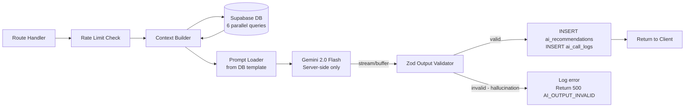

### 14.2 Prompt Template System

```sql
-- Prompt templates stored in DB (version-controlled, hot-swappable)
-- ai_prompt_templates table

INSERT INTO ai_prompt_templates (name, version, feature_name, system_prompt, user_prompt_template, output_schema, is_active)
VALUES (
  'operational-summary-v1',
  '1.0',
  'operational_summary',
  'You are ArenaMind AI, an expert FIFA World Cup stadium operations assistant...',
  'Current match context: {{context_json}}\n\nGenerate an operational briefing...',
  '{"type":"object","properties":{"summary":{"type":"string"},"keyConcerns":{"type":"array"},...}}',
  TRUE
);
```

### 14.3 Context Builder

```typescript
// lib/ai/context-builder.ts

export async function buildOperationalContext(matchId: string, windowMinutes = 15) {
  // 6 parallel queries — all must complete before calling Gemini
  const [match, incidents, crowd, resources, weather, phase] = await Promise.all([
    adminSupabase.from('matches').select('*, stadiums(name, capacity)').eq('id', matchId).single(),
    adminSupabase
      .from('incidents')
      .select('id, title, severity_tier, status, zone_id, created_at')
      .eq('match_id', matchId)
      .gte('created_at', new Date(Date.now() - windowMinutes * 60 * 1000).toISOString())
      .is('deleted_at', null),
    adminSupabase.rpc('get_crowd_summary', { p_match_id: matchId }),
    adminSupabase
      .from('resources')
      .select('id, name, status, zone_id, resource_types(name)')
      .eq('match_id', matchId),
    adminSupabase
      .from('weather_data')
      .select('*')
      .eq('match_id', matchId)
      .order('recorded_at', { ascending: false })
      .limit(1)
      .single(),
    adminSupabase
      .from('phase_transitions')
      .select('*')
      .eq('match_id', matchId)
      .order('created_at', { ascending: false })
      .limit(5),
  ]);

  return {
    match: match.data,
    incidents: incidents.data ?? [],
    crowdSummary: crowd.data,
    resources: resources.data ?? [],
    weather: weather.data,
    recentPhaseHistory: phase.data ?? [],
    generatedAt: new Date().toISOString(),
    contextWindowMinutes: windowMinutes,
  };
}
```

### 14.4 Gemini Integration

```typescript
// lib/ai/gemini.ts

import { GoogleGenerativeAI } from '@google/generative-ai';

const genAI = new GoogleGenerativeAI(process.env.GEMINI_API_KEY!);

export const geminiModel = genAI.getGenerativeModel({
  model: 'gemini-2.0-flash',
  generationConfig: {
    temperature: 0.2, // Low temperature for operational precision
    topP: 0.8,
    maxOutputTokens: 2048,
    responseMimeType: 'application/json', // Force structured output
  },
  safetySettings: [
    { category: 'HARM_CATEGORY_HARASSMENT', threshold: 'BLOCK_MEDIUM_AND_ABOVE' },
    { category: 'HARM_CATEGORY_HATE_SPEECH', threshold: 'BLOCK_MEDIUM_AND_ABOVE' },
  ],
});

// Retry wrapper with exponential backoff
export async function callGeminiWithRetry<T>(
  prompt: string,
  outputSchema: z.ZodSchema<T>,
  maxRetries = 3
): Promise<{ data: T; tokensUsed: number; latencyMs: number }> {
  const startTime = Date.now();

  for (let attempt = 1; attempt <= maxRetries; attempt++) {
    try {
      const result = await geminiModel.generateContent(prompt);
      const text = result.response.text();
      const parsed = JSON.parse(text);

      // Zod validation — hallucination guard
      const validated = outputSchema.safeParse(parsed);
      if (!validated.success) {
        throw new AIOutputValidationError('AI response failed schema validation', validated.error);
      }

      return {
        data: validated.data,
        tokensUsed: result.response.usageMetadata?.totalTokenCount ?? 0,
        latencyMs: Date.now() - startTime,
      };
    } catch (error) {
      if (attempt === maxRetries) throw error;

      const delay = Math.pow(2, attempt) * 500; // 1s, 2s, 4s
      await sleep(delay);
    }
  }
  throw new Error('Unreachable');
}
```

### 14.5 AI Output Schemas (Hallucination Guards)

```typescript
// lib/ai/output-validator.ts

// Operational Summary output schema
export const OperationalSummaryOutputSchema = z.object({
  summary: z.string().min(50).max(1000),
  keyConcerns: z.array(z.string().min(10).max(200)).max(5),
  positiveIndicators: z.array(z.string().min(10).max(200)).max(5),
  recommendedFocus: z.string().min(10).max(300),
  phaseAssessment: z.string().min(10).max(300),
  overallHealthScore: z.number().int().min(0).max(100),
});

// Incident Classification output schema
export const IncidentClassifyOutputSchema = z.object({
  type: z.string().min(3).max(100),
  tier: z.union([z.literal(1), z.literal(2), z.literal(3), z.literal(4)]),
  confidence: z.number().min(0).max(1),
  rationale: z.string().min(20).max(500),
  recommendedResponse: z.string().min(10).max(500),
  urgent: z.boolean(),
});

// Incident Recommendation output schema
export const IncidentRecommendOutputSchema = z.object({
  immediateActions: z.array(z.string()).min(1).max(5),
  resourceDispatch: z
    .array(
      z.object({
        resourceType: z.string(),
        quantity: z.number().int().min(1),
        destinationZone: z.string(),
        priority: z.enum(['low', 'medium', 'high', 'critical']),
        suggestedResourceId: z.string().uuid().nullable().optional(),
      })
    )
    .max(5),
  crowdManagement: z.array(z.string()).max(3),
  communicationSteps: z.array(z.string()).max(5),
  estimatedResolutionTime: z.string().max(50),
  rationale: z.string().min(20).max(500),
});
```

### 14.6 AI Streaming Implementation

```typescript
// AI route handler — supports both streaming and buffered modes

export async function POST(request: NextRequest) {
  const acceptsStream = request.headers.get('Accept')?.includes('text/event-stream');

  if (acceptsStream) {
    const encoder = new TextEncoder();
    const stream = new ReadableStream({
      async start(controller) {
        try {
          controller.enqueue(
            encoder.encode(
              `event: start\ndata: ${JSON.stringify({ recommendationId, feature })}\n\n`
            )
          );

          const geminiStream = await geminiModel.generateContentStream(prompt);
          let fullText = '';

          for await (const chunk of geminiStream.stream) {
            const text = chunk.text();
            fullText += text;
            controller.enqueue(
              encoder.encode(`event: chunk\ndata: ${JSON.stringify({ text })}\n\n`)
            );
          }

          // Validate full text after streaming completes
          const validated = outputSchema.safeParse(JSON.parse(fullText));
          if (!validated.success) {
            controller.enqueue(
              encoder.encode(
                `event: error\ndata: ${JSON.stringify({ code: 'AI_OUTPUT_INVALID' })}\n\n`
              )
            );
          } else {
            await saveRecommendation(validated.data);
            controller.enqueue(
              encoder.encode(
                `event: complete\ndata: ${JSON.stringify({ recommendationId, confidence })}\n\n`
              )
            );
          }
        } finally {
          controller.enqueue(encoder.encode('event: end\ndata: {}\n\n'));
          controller.close();
        }
      },
    });

    return new Response(stream, {
      headers: {
        'Content-Type': 'text/event-stream',
        'Cache-Control': 'no-cache',
        Connection: 'keep-alive',
      },
    });
  }

  // Buffered path
  const result = await callGeminiWithRetry(prompt, outputSchema);
  const saved = await saveRecommendation(result.data);
  return wrapSuccess(saved);
}
```

---

## 15. Phase 7 — Analytics, Reports, Files, Search

### 15.1 KPI Snapshot Cron Job

```typescript
// Background job: runs every 5 minutes via job_queue

export async function processKpiSnapshotJob(job: JobQueueRecord) {
  const matchId = job.payload.matchId as string;

  // Parallel queries for all KPI components
  const [incidents, crowd, resources, accessibility] = await Promise.all([
    getIncidentStats(matchId),
    getCrowdStats(matchId),
    getResourceStats(matchId),
    getAccessibilityStats(matchId),
  ]);

  const healthScore = calculateHealthScore(incidents, crowd, resources, accessibility);

  await adminSupabase.from('kpi_snapshots').insert({
    match_id: matchId,
    stadium_id: job.payload.stadiumId,
    active_incidents: incidents.active,
    tier1_incidents: incidents.tier1,
    crowd_density_pct: crowd.overallDensity,
    peak_zone_density_pct: crowd.peakDensity,
    resources_available: resources.available,
    resources_deployed: resources.deployed,
    overall_health_score: healthScore.overall,
    incident_score: healthScore.incident,
    crowd_score: healthScore.crowd,
    resource_score: healthScore.resource,
    captured_at: new Date().toISOString(),
  });
}
```

### 15.2 Health Score Calculation

```sql
-- PostgreSQL function: calculate_health_score()
-- Inputs: match_id, point-in-time
-- Formula: weighted average of 4 component scores

CREATE OR REPLACE FUNCTION calculate_health_score(p_match_id UUID)
RETURNS INTEGER AS $$
DECLARE
  v_incident_score INTEGER;
  v_crowd_score INTEGER;
  v_resource_score INTEGER;
  v_accessibility_score INTEGER;
  v_final_score INTEGER;
BEGIN
  -- Incident score: 100 minus penalties for active incidents by tier
  SELECT GREATEST(0, 100
    - (COUNT(*) FILTER (WHERE severity_tier = 1 AND status = 'active') * 25)
    - (COUNT(*) FILTER (WHERE severity_tier = 2 AND status = 'active') * 10)
    - (COUNT(*) FILTER (WHERE severity_tier = 3 AND status = 'active') * 3)
    - (COUNT(*) FILTER (WHERE severity_tier = 4 AND status = 'active') * 1))
  INTO v_incident_score FROM incidents
  WHERE match_id = p_match_id AND deleted_at IS NULL;

  -- Crowd score: penalty for zones above thresholds
  SELECT GREATEST(0, 100
    - (COUNT(*) FILTER (WHERE density_pct > 95) * 20)
    - (COUNT(*) FILTER (WHERE density_pct BETWEEN 85 AND 95) * 8))
  INTO v_crowd_score FROM crowd_data_latest_per_zone
  WHERE match_id = p_match_id;

  -- Weighted average: Incidents 40%, Crowd 35%, Resource 15%, Accessibility 10%
  v_final_score := (v_incident_score * 0.40 + v_crowd_score * 0.35 +
                    v_resource_score * 0.15 + v_accessibility_score * 0.10)::INTEGER;

  RETURN GREATEST(0, LEAST(100, v_final_score));
END;
$$ LANGUAGE plpgsql;
```

---

## 16. Phase 8 — Frontend Foundation

### 16.1 Design System CSS

```css
/* styles/index.css — Complete design system */

/* Google Fonts */
@import url('https://fonts.googleapis.com/css2?family=Inter:wght@300;400;500;600;700;800&display=swap');

/* ─── Design Tokens ─── */
:root {
  /* Color Palette */
  --color-primary: hsl(217, 91%, 60%); /* Electric blue */
  --color-primary-dark: hsl(217, 91%, 48%);
  --color-accent: hsl(280, 87%, 65%); /* Violet */
  --color-success: hsl(152, 69%, 48%);
  --color-warning: hsl(38, 92%, 55%);
  --color-danger: hsl(0, 85%, 60%);
  --color-critical: hsl(0, 85%, 55%);

  /* Severity tiers */
  --severity-1: hsl(0, 85%, 60%); /* Critical red */
  --severity-2: hsl(28, 90%, 55%); /* Urgent orange */
  --severity-3: hsl(38, 92%, 55%); /* Warning yellow */
  --severity-4: hsl(217, 91%, 60%); /* Info blue */

  /* Crowd density */
  --density-critical: hsl(0, 85%, 55%); /* >95% */
  --density-high: hsl(28, 90%, 55%); /* 85–95% */
  --density-elevated: hsl(38, 92%, 55%); /* 65–85% */
  --density-normal: hsl(152, 69%, 48%); /* <65% */
  --density-sparse: hsl(217, 30%, 60%); /* <30% */

  /* Surface (dark mode default) */
  --surface-bg: hsl(220, 23%, 8%);
  --surface-card: hsl(220, 20%, 12%);
  --surface-card-hover: hsl(220, 20%, 15%);
  --surface-border: hsl(220, 15%, 20%);
  --surface-input: hsl(220, 20%, 14%);

  /* Text */
  --text-primary: hsl(210, 30%, 95%);
  --text-secondary: hsl(210, 15%, 65%);
  --text-muted: hsl(210, 10%, 45%);

  /* Glassmorphism */
  --glass-bg: rgba(255, 255, 255, 0.04);
  --glass-border: rgba(255, 255, 255, 0.08);
  --glass-blur: blur(12px);

  /* Spacing */
  --spacing-xs: 4px;
  --spacing-sm: 8px;
  --spacing-md: 16px;
  --spacing-lg: 24px;
  --spacing-xl: 32px;
  --spacing-2xl: 48px;

  /* Border radius */
  --radius-sm: 6px;
  --radius-md: 10px;
  --radius-lg: 16px;
  --radius-xl: 24px;

  /* Typography */
  --font-family: 'Inter', system-ui, -apple-system, sans-serif;
  --font-mono: 'JetBrains Mono', 'Fira Code', monospace;

  /* Transitions */
  --transition-fast: 150ms ease;
  --transition-medium: 250ms ease;
  --transition-slow: 350ms cubic-bezier(0.4, 0, 0.2, 1);

  /* Shadows */
  --shadow-card: 0 4px 24px rgba(0, 0, 0, 0.4);
  --shadow-elevated: 0 8px 40px rgba(0, 0, 0, 0.6);
  --shadow-glow-blue: 0 0 24px rgba(59, 130, 246, 0.3);
  --shadow-glow-red: 0 0 24px rgba(239, 68, 68, 0.4);
}

/* ─── Base Styles ─── */
* {
  box-sizing: border-box;
  margin: 0;
  padding: 0;
}
html {
  font-size: 16px;
  scroll-behavior: smooth;
}
body {
  font-family: var(--font-family);
  background: var(--surface-bg);
  color: var(--text-primary);
  line-height: 1.6;
  -webkit-font-smoothing: antialiased;
}

/* ─── Glassmorphism Card ─── */
.card-glass {
  background: var(--glass-bg);
  border: 1px solid var(--glass-border);
  backdrop-filter: var(--glass-blur);
  border-radius: var(--radius-lg);
  box-shadow: var(--shadow-card);
  transition:
    border-color var(--transition-fast),
    transform var(--transition-medium);
}
.card-glass:hover {
  border-color: rgba(255, 255, 255, 0.15);
  transform: translateY(-1px);
}

/* ─── Severity Badge ─── */
.badge-severity-1 {
  background: var(--severity-1);
  color: white;
}
.badge-severity-2 {
  background: var(--severity-2);
  color: white;
}
.badge-severity-3 {
  background: var(--severity-3);
  color: black;
}
.badge-severity-4 {
  background: var(--severity-4);
  color: white;
}

/* ─── Crowd Density Colors ─── */
.density-critical {
  background: var(--density-critical);
}
.density-high {
  background: var(--density-high);
}
.density-elevated {
  background: var(--density-elevated);
}
.density-normal {
  background: var(--density-normal);
}
.density-sparse {
  background: var(--density-sparse);
}

/* ─── Animations ─── */
@keyframes pulse-red {
  0%,
  100% {
    box-shadow: 0 0 0 0 rgba(239, 68, 68, 0.4);
  }
  50% {
    box-shadow: 0 0 0 8px rgba(239, 68, 68, 0);
  }
}

@keyframes slide-in-right {
  from {
    transform: translateX(100%);
    opacity: 0;
  }
  to {
    transform: translateX(0);
    opacity: 1;
  }
}

@keyframes fade-in {
  from {
    opacity: 0;
    transform: translateY(8px);
  }
  to {
    opacity: 1;
    transform: translateY(0);
  }
}

.animate-fade-in {
  animation: fade-in 0.3s ease forwards;
}
.animate-pulse-red {
  animation: pulse-red 2s infinite;
}
.animate-slide-in {
  animation: slide-in-right 0.25s ease;
}

/* ─── Focus Styles (Accessibility) ─── */
:focus-visible {
  outline: 2px solid var(--color-primary);
  outline-offset: 2px;
  border-radius: 4px;
}
```

### 16.2 Layout Architecture

```typescript
// app/(dashboard)/layout.tsx

export default async function DashboardLayout({ children }) {
  const supabase = createServerSupabaseClient();
  const { data: { user } } = await supabase.auth.getUser();
  if (!user) redirect('/login');

  const { data: activeMatch } = await supabase
    .from('matches')
    .select('id, home_team, away_team, current_phase, stadiums(name)')
    .eq('match_status', 'active')
    .single();

  return (
    <div className="dashboard-layout">
      <Sidebar user={user} activeMatchId={activeMatch?.id} />
      <main className="dashboard-main">
        <TopBar match={activeMatch} user={user} />
        <div className="dashboard-content">{children}</div>
      </main>
    </div>
  );
}
```

---

## 17. Phase 9 — Command Center Dashboard

### 17.1 Command Center Architecture

```
Page: /[matchId]  (Command Center)
├── KpiStrip               ← 4 live metric cards (active incidents, crowd, resources, health)
├── MatchPhaseIndicator    ← Horizontal phase stepper
├── Row 1
│   ├── HealthScoreGauge   ← Animated SVG arc (60% width)
│   └── WeatherWidget      ← Current conditions + operational note (40% width)
├── Row 2
│   ├── AiSummaryCard      ← Latest AI operational summary (60% width)
│   └── QuickAccessLinks   ← Most-used module shortcuts (40% width)
└── ActiveAlertsBanner     ← Full-width scrolling critical alerts
```

### 17.2 Health Score Gauge Component

```tsx
// components/dashboard/HealthScoreGauge.tsx

export function HealthScoreGauge({ score }: { score: number }) {
  const angle = (score / 100) * 180; // 0-180 degrees (semicircle)
  const color =
    score >= 80
      ? 'var(--color-success)'
      : score >= 60
        ? 'var(--color-warning)'
        : 'var(--color-danger)';

  // SVG arc path calculation
  const radius = 80;
  const cx = 100;
  const cy = 100;
  const startAngle = -180;
  const endAngle = startAngle + angle;

  return (
    <div
      className="health-gauge card-glass"
      role="meter"
      aria-valuenow={score}
      aria-valuemin={0}
      aria-valuemax={100}
    >
      <svg viewBox="0 0 200 120" width="200" aria-hidden="true">
        {/* Background arc */}
        <path
          d={describeArc(cx, cy, radius, -180, 0)}
          fill="none"
          stroke="var(--surface-border)"
          strokeWidth="12"
          strokeLinecap="round"
        />
        {/* Score arc — animated */}
        <path
          d={describeArc(cx, cy, radius, -180, endAngle)}
          fill="none"
          stroke={color}
          strokeWidth="12"
          strokeLinecap="round"
          style={{ transition: 'stroke-dashoffset 1.5s cubic-bezier(0.4, 0, 0.2, 1)' }}
        />
      </svg>
      <div className="gauge-score" style={{ color }}>
        <span className="score-number">{score}</span>
        <span className="score-label">/ 100</span>
      </div>
      <p className="gauge-label">Stadium Health Score</p>
    </div>
  );
}
```

---

## 18. Phase 10 — Crowd Intelligence Module

### 18.1 Heatmap Component Architecture

```tsx
// components/crowd/StadiumHeatmap.tsx
// SVG-based stadium map with density color-coded zones

export function StadiumHeatmap({ zones, crowdData }: HeatmapProps) {
  const getDensityClass = (densityPct: number): string => {
    if (densityPct >= 95) return 'density-critical';
    if (densityPct >= 85) return 'density-high';
    if (densityPct >= 65) return 'density-elevated';
    if (densityPct >= 30) return 'density-normal';
    return 'density-sparse';
  };

  return (
    <div className="heatmap-container card-glass">
      <svg
        viewBox="0 0 800 600"
        role="img"
        aria-label="Stadium crowd density heatmap"
        className="stadium-svg"
      >
        <defs>
          <radialGradient id="glow-critical">
            <stop offset="0%" stopColor="var(--density-critical)" stopOpacity="0.8" />
            <stop offset="100%" stopColor="var(--density-critical)" stopOpacity="0.2" />
          </radialGradient>
        </defs>

        {zones.map((zone) => {
          const crowd = crowdData.find((c) => c.zoneId === zone.id);
          const densityClass = getDensityClass(crowd?.densityPct ?? 0);
          const isCritical = (crowd?.densityPct ?? 0) >= 95;

          return (
            <g
              key={zone.id}
              role="button"
              tabIndex={0}
              aria-label={`${zone.name}: ${crowd?.densityPct?.toFixed(0)}% capacity`}
              onClick={() => onZoneClick(zone)}
              onKeyDown={(e) => e.key === 'Enter' && onZoneClick(zone)}
            >
              <path
                d={zone.svgPath}
                className={`zone-path ${densityClass} ${isCritical ? 'animate-pulse-red' : ''}`}
                style={{ transition: 'fill 0.5s ease' }}
              />
              <text x={zone.labelX} y={zone.labelY} className="zone-label">
                {crowd?.densityPct?.toFixed(0)}%
              </text>
            </g>
          );
        })}
      </svg>

      <HeatmapLegend />
    </div>
  );
}
```

---

## 19. Phase 11 — Incident Management Module

### 19.1 Incident Feed with Real-time Updates

```tsx
// components/incidents/IncidentFeed.tsx
// Critical: Tier 1 incidents trigger full-screen overlay

export function IncidentFeed({ matchId }: { matchId: string }) {
  const { incidents, isLoading } = useIncidents(matchId);
  const [selectedIncident, setSelectedIncident] = useState<Incident | null>(null);

  // Real-time updates (handled by useIncidentRealtime hook)
  useIncidentRealtime(matchId, {
    onNewIncident: (incident) => {
      queryClient.invalidateQueries(['incidents', matchId]);
      if (incident.severityTier === 1) {
        showTier1Alert(incident); // Full-screen overlay for critical
      }
    },
    onIncidentUpdate: () => {
      queryClient.invalidateQueries(['incidents', matchId]);
    },
  });

  return (
    <div className="incident-feed card-glass" role="list" aria-label="Incident feed">
      <IncidentFeedHeader total={incidents?.pagination.total} />
      <IncidentFilters onFilterChange={setFilters} />

      <div className="incident-list">
        {incidents?.data.map((incident, i) => (
          <IncidentRow
            key={incident.id}
            incident={incident}
            onClick={() => setSelectedIncident(incident)}
            style={{ '--delay': `${i * 30}ms` } as React.CSSProperties}
            className="animate-fade-in"
          />
        ))}
      </div>

      {selectedIncident && (
        <IncidentDetailDrawer
          incident={selectedIncident}
          onClose={() => setSelectedIncident(null)}
          matchId={matchId}
        />
      )}
    </div>
  );
}
```

### 19.2 AI Recommendation Panel

```tsx
// components/incidents/AiRecommendationPanel.tsx

export function AiRecommendationPanel({ incidentId, matchId }: Props) {
  const [recommendation, setRecommendation] = useState<AIRecommendation | null>(null);
  const [streamText, setStreamText] = useState('');
  const [isStreaming, setIsStreaming] = useState(false);
  const { userRole } = useAuth();
  const canAct = ['operations_manager', 'deputy_manager'].includes(userRole);

  const generateRecommendation = async () => {
    setIsStreaming(true);
    setStreamText('');

    const response = await fetch('/api/v1/ai/incident-recommend', {
      method: 'POST',
      headers: {
        Authorization: `Bearer ${await getToken()}`,
        'Content-Type': 'application/json',
        Accept: 'text/event-stream',
      },
      body: JSON.stringify({ incidentId, matchId }),
    });

    const reader = response.body!.getReader();
    const decoder = new TextDecoder();

    while (true) {
      const { done, value } = await reader.read();
      if (done) break;

      const events = decoder.decode(value).split('\n\n');
      for (const event of events) {
        if (event.startsWith('data:')) {
          const data = JSON.parse(event.slice(5).trim());
          if (event.startsWith('event: chunk')) {
            setStreamText((prev) => prev + data.text);
          }
          if (event.startsWith('event: complete')) {
            setRecommendation(data);
            setIsStreaming(false);
          }
        }
      }
    }
  };

  const handleDecision = async (action: 'accepted' | 'dismissed') => {
    await fetch(`/api/v1/ai/recommendations/${recommendation!.id}`, {
      method: 'PATCH',
      headers: { Authorization: `Bearer ${await getToken()}`, 'Content-Type': 'application/json' },
      body: JSON.stringify({ action }),
    });
    // Optimistically update UI
    setRecommendation((prev) => (prev ? { ...prev, actionTaken: action } : null));
  };

  return (
    <div className="ai-panel card-glass" aria-live="polite" aria-label="AI Recommendation">
      <div className="ai-panel-header">
        <GeminiIcon />
        <span>AI Recommendation</span>
        {recommendation?.confidence && <ConfidenceBadge confidence={recommendation.confidence} />}
      </div>

      {isStreaming && (
        <div className="streaming-text">
          <StreamingCursor />
          <p>{streamText}</p>
        </div>
      )}

      {recommendation && !isStreaming && (
        <>
          <RecommendationContent recommendation={recommendation} />
          {canAct && !recommendation.actionTaken && (
            <div className="action-buttons">
              <Button variant="success" onClick={() => handleDecision('accepted')}>
                Accept Recommendation
              </Button>
              <Button variant="ghost" onClick={() => handleDecision('dismissed')}>
                Dismiss
              </Button>
            </div>
          )}
          {recommendation.actionTaken && (
            <DecisionBadge action={recommendation.actionTaken} actedAt={recommendation.actedAt} />
          )}
        </>
      )}

      {!recommendation && !isStreaming && canAct && (
        <Button variant="primary" onClick={generateRecommendation}>
          Generate AI Recommendation
        </Button>
      )}
    </div>
  );
}
```

---

## 20. Phase 12 — Resource Coordination Module

### 20.1 Resource Board Architecture

```
ResourceBoard
├── StatusColumn: Available (green)
│   └── ResourceCard × N (draggable in future v2)
├── StatusColumn: Deployed (blue)
│   └── ResourceCard × N
├── StatusColumn: Incident Assigned (red)
│   └── ResourceCard × N
└── StatusColumn: Off Duty (gray)
    └── ResourceCard × N
```

Each `ResourceCard` shows: resource type icon, name, identifier, zone, staff count, assign button (if available).

---

## 21. Phase 13 — Reports & Analytics Module

### 21.1 Async Report Generation Pattern

```tsx
// Report generation with polling

async function generateReport(matchId: string, reportType: string) {
  // 1. Trigger generation (returns 202 Accepted)
  const { data } = await fetch('/api/v1/matches/{matchId}/reports/generate', {
    method: 'POST',
    body: JSON.stringify({ reportType, title }),
  }).then((r) => r.json());

  const reportId = data.reportId;

  // 2. Poll until complete (max 30 polls × 2s = 60 second timeout)
  for (let i = 0; i < 30; i++) {
    await sleep(2000);
    const { data: report } = await fetch(`/api/v1/matches/{matchId}/reports/${reportId}`).then(
      (r) => r.json()
    );

    if (report.status === 'complete') return report;
    if (report.status === 'error') throw new Error('Report generation failed');
  }
  throw new Error('Report generation timed out');
}
```

---

## 22. Phase 14 — Realtime Infrastructure

### 22.1 Realtime Provider Architecture

```tsx
// components/realtime/RealtimeProvider.tsx

export function RealtimeProvider({ matchId, userId, children }: Props) {
  const [connectionStatus, setConnectionStatus] = useState<ConnectionStatus>('connecting');
  const [retryCount, setRetryCount] = useState(0);

  useEffect(() => {
    const channels = [
      createCrowdChannel(matchId),
      createIncidentChannel(matchId),
      createResourceChannel(matchId),
      createPhaseChannel(matchId),
      createNotificationChannel(userId),
      createAccessibilityChannel(matchId),
    ];

    // Subscribe all channels
    const unsubscribers = channels.map((ch) => {
      ch.subscribe((status) => {
        if (status === 'SUBSCRIBED') {
          setConnectionStatus('connected');
          setRetryCount(0);
        }
        if (['CLOSED', 'CHANNEL_ERROR'].includes(status)) {
          handleDisconnection();
        }
      });
      return () => supabase.removeChannel(ch);
    });

    return () => unsubscribers.forEach((u) => u());
  }, [matchId, userId]);

  return (
    <RealtimeContext.Provider value={{ connectionStatus, retryCount }}>
      <ConnectionStatusBadge status={connectionStatus} />
      {children}
    </RealtimeContext.Provider>
  );
}
```

### 22.2 Optimistic Updates Pattern

```typescript
// Optimistic update for incident creation

async function createIncidentOptimistic(data: CreateIncidentInput) {
  const tempId = `temp-${Date.now()}`;
  const tempIncident = { ...data, id: tempId, status: 'open', createdAt: new Date().toISOString() };

  // Optimistically add to UI immediately (< 16ms response)
  queryClient.setQueryData(['incidents', matchId], (old: IncidentList) => ({
    ...old,
    data: [tempIncident, ...old.data],
  }));

  try {
    const real = await apiCreateIncident(data);
    // Replace temp with real data from server
    queryClient.setQueryData(['incidents', matchId], (old: IncidentList) => ({
      ...old,
      data: old.data.map((i) => (i.id === tempId ? real : i)),
    }));
  } catch (error) {
    // Rollback on failure
    queryClient.setQueryData(['incidents', matchId], (old: IncidentList) => ({
      ...old,
      data: old.data.filter((i) => i.id !== tempId),
    }));
    toast.error('Failed to create incident. Please try again.');
    throw error;
  }
}
```

---

## 23. Phase 15 — Testing Roadmap

### 23.1 Testing Architecture

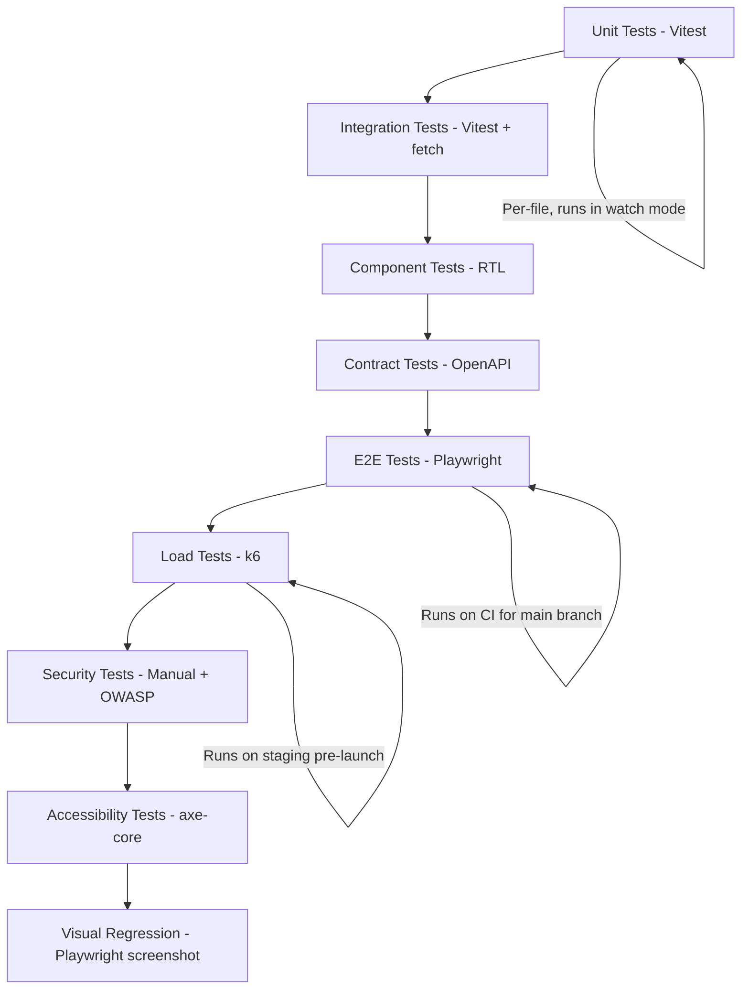

### 23.2 Unit Test Coverage Targets

| Area                     | Target | Rationale                                 |
| ------------------------ | ------ | ----------------------------------------- |
| Zod validation schemas   | 100%   | Every validation rule must be tested      |
| API response helpers     | 100%   | These are the foundation of all endpoints |
| AI output validators     | 100%   | Hallucination guards must be reliable     |
| Business logic functions | 80%    | Health score, phase transition validation |
| Utility functions        | 100%   | Date formatters, cursor encoder/decoder   |
| React hooks              | 70%    | Core data hooks tested                    |

### 23.3 RLS Integration Test Suite

```typescript
// tests/integration/rls/incidents.test.ts

describe('Incidents RLS', () => {
  let stadiumAOM: TestUser; // Operations Manager, Stadium A
  let stadiumBOM: TestUser; // Operations Manager, Stadium B
  let stadiumAMatch: string;
  let stadiumBMatch: string;

  beforeAll(async () => {
    stadiumAOM = await createTestUser('stadium-a', 'operations_manager');
    stadiumBOM = await createTestUser('stadium-b', 'operations_manager');
    stadiumAMatch = await createTestMatch('stadium-a');
    stadiumBMatch = await createTestMatch('stadium-b');
  });

  it('Stadium A OM can read Stadium A incidents', async () => {
    const res = await api.get(`/matches/${stadiumAMatch}/incidents`, stadiumAOM.token);
    expect(res.status).toBe(200);
  });

  it('Stadium A OM CANNOT read Stadium B incidents (RLS must block)', async () => {
    const res = await api.get(`/matches/${stadiumBMatch}/incidents`, stadiumAOM.token);
    expect(res.status).toBe(404); // Match not visible → 404
  });

  it('Coordinator can create incidents', async () => {
    const coord = await createTestUser('stadium-a', 'coordinator');
    const res = await api.post(`/matches/${stadiumAMatch}/incidents`, coord.token, {
      title: 'Test incident',
      description: 'Integration test incident',
      severityTier: 4,
    });
    expect(res.status).toBe(201);
  });

  it('ReadOnly user CANNOT create incidents (403)', async () => {
    const ro = await createTestUser('stadium-a', 'read_only');
    const res = await api.post(`/matches/${stadiumAMatch}/incidents`, ro.token, {
      title: 'Test',
      description: 'Integration test',
      severityTier: 4,
    });
    expect(res.status).toBe(403);
  });

  it('Only OM can change phase', async () => {
    const dm = await createTestUser('stadium-a', 'deputy_manager');
    const res = await api.patch(`/matches/${stadiumAMatch}/phase`, dm.token, {
      toPhase: 'gate_opening',
    });
    expect(res.status).toBe(403);
  });
});
```

### 23.4 E2E Test Suite (Playwright)

```typescript
// tests/e2e/01-incident-creation.spec.ts

test.describe('Incident Creation + AI Classification', () => {
  test('Operations Manager can create Tier 1 incident and receive AI classification', async ({
    page,
  }) => {
    // 1. Login
    await page.goto('/login');
    await page.fill('[data-testid="email-input"]', 'om@test.arenamind.ai');
    await page.fill('[data-testid="password-input"]', 'TestP@ss2026!');
    await page.click('[data-testid="login-button"]');
    await page.waitForURL('/**/incidents');

    // 2. Open incident creation form
    await page.click('[data-testid="create-incident-btn"]');
    await expect(page.locator('[data-testid="incident-form"]')).toBeVisible();

    // 3. Fill form
    await page.fill('[data-testid="incident-title"]', 'E2E Test — Tier 1 Medical Emergency');
    await page.fill(
      '[data-testid="incident-description"]',
      'Fan collapsed near Gate 3, Zone C. Appears unresponsive.'
    );
    await page.selectOption('[data-testid="severity-tier"]', '1');

    // 4. Submit
    await page.click('[data-testid="submit-incident-btn"]');

    // 5. Verify incident appears in feed
    await expect(page.locator('[data-testid="incident-feed"]')).toContainText(
      'E2E Test — Tier 1 Medical Emergency'
    );

    // 6. Wait for AI classification (async job)
    await page.waitForSelector('[data-testid="ai-classification-badge"]', { timeout: 10000 });
    await expect(page.locator('[data-testid="ai-confidence"]')).toBeVisible();
  });
});
```

### 23.5 k6 Load Test

```javascript
// k6/dashboard-load.js
// Simulates 50 concurrent users during match day for 5 minutes

import http from 'k6/http';
import { check, sleep } from 'k6';

export const options = {
  vus: 50,
  duration: '5m',
  thresholds: {
    'http_req_duration{endpoint:crowd}': ['p(99)<50'], // Crowd heatmap P99 < 50ms
    'http_req_duration{endpoint:incidents}': ['p(99)<100'], // Incident list P99 < 100ms
    'http_req_duration{endpoint:kpis}': ['p(99)<200'], // KPI strip P99 < 200ms
    http_req_failed: ['rate<0.005'], // <0.5% failure
  },
};

export default function () {
  const matchId = __ENV.TEST_MATCH_ID;
  const headers = { Authorization: `Bearer ${__ENV.TEST_TOKEN}` };

  http.get(`/api/v1/matches/${matchId}/crowd/current`, { headers, tags: { endpoint: 'crowd' } });
  http.get(`/api/v1/matches/${matchId}/incidents?limit=25`, {
    headers,
    tags: { endpoint: 'incidents' },
  });
  http.get(`/api/v1/matches/${matchId}/kpis`, { headers, tags: { endpoint: 'kpis' } });
  http.get(`/api/v1/matches/${matchId}/health-score`, { headers, tags: { endpoint: 'health' } });

  sleep(3); // 3s think time
}
```

---

## 24. Phase 16 — Performance Optimization

### 24.1 Server Component Audit

**Rule:** If a component doesn't need user interaction or browser APIs, make it a Server Component.

```
Server Components (no 'use client'):
  - DashboardLayout
  - Sidebar (static nav items)
  - WeatherWidget (data fetch in server)
  - MatchPhaseIndicator (display only)
  - StaticZoneList

Client Components (needs 'use client'):
  - KpiStrip (Realtime updates)
  - HealthScoreGauge (animation)
  - StadiumHeatmap (interaction + Realtime)
  - IncidentFeed (Realtime + forms)
  - AiRecommendationPanel (streaming SSE)
  - All form components
```

### 24.2 TanStack Query Configuration

```typescript
// app/providers.tsx

const queryClient = new QueryClient({
  defaultOptions: {
    queries: {
      staleTime: 30 * 1000, // 30 seconds
      gcTime: 5 * 60 * 1000, // 5 minutes cache
      refetchOnWindowFocus: false, // Realtime handles updates
      retry: (failureCount, error) => {
        if (error instanceof APIError && [401, 403, 404].includes(error.status)) return false;
        return failureCount < 3;
      },
    },
  },
});
```

### 24.3 Database Query Optimization

```sql
-- Before optimization (slow — row-by-row)
SELECT DISTINCT ON (zone_id) * FROM crowd_data
WHERE match_id = $1 ORDER BY zone_id, recorded_at DESC;

-- After optimization (fast — index-only scan on covering index)
SELECT cd.*
FROM crowd_data cd
INNER JOIN (
  SELECT zone_id, MAX(recorded_at) AS latest
  FROM crowd_data
  WHERE match_id = $1
  GROUP BY zone_id
) latest ON cd.zone_id = latest.zone_id AND cd.recorded_at = latest.latest
WHERE cd.match_id = $1;

-- With covering index: idx_crowd_data_match_zone_time
-- Expected: P99 < 15ms even with 1M rows (partition per match)
```

---

## 25. Phase 17 — Security Hardening

### 25.1 Security Checklist

```
AUTHENTICATION
  ✅ JWT signature verified on every protected route
  ✅ Token expiry enforced (1 hour access, 7 days refresh)
  ✅ Refresh token rotation (each refresh issues new refresh token)
  ✅ Session invalidation on logout (Supabase signOut)
  ✅ Login rate limit: 5 attempts per 5 minutes per IP

AUTHORIZATION
  ✅ RLS enabled on all 35 tables
  ✅ Cross-stadium access impossible at DB level
  ✅ Role-based middleware checks on all operational endpoints
  ✅ Service role key only used server-side (never in client bundle)

INPUT VALIDATION
  ✅ Zod validation on all request bodies
  ✅ UUID validation on all path parameters
  ✅ SQL injection impossible (parameterized queries via Supabase SDK)
  ✅ String sanitization on all user-input fields
  ✅ File type validation on uploads
  ✅ File size limits enforced

HTTP SECURITY
  ✅ HTTPS enforced (HSTS header)
  ✅ Strict CORS origin whitelist
  ✅ X-Frame-Options: DENY
  ✅ X-Content-Type-Options: nosniff
  ✅ Content-Security-Policy configured
  ✅ Referrer-Policy: strict-origin-when-cross-origin

AI SECURITY
  ✅ Gemini API key server-only (SUPABASE env var)
  ✅ All AI outputs validated via Zod before storage
  ✅ Prompt injection prevention (context sanitized before insertion)
  ✅ AI recommendations require human decision (no auto-execute)
  ✅ 15-minute recommendation expiry enforced

SECRETS
  ✅ Zero secrets in codebase (grep verified)
  ✅ Zero secrets in git history (verified)
  ✅ All secrets in Vercel environment variables
  ✅ Service role key: server-only (SUPABASE_SERVICE_ROLE_KEY — no NEXT_PUBLIC_)
  ✅ Gemini key: server-only (GEMINI_API_KEY — no NEXT_PUBLIC_)

DEPENDENCIES
  ✅ npm audit: zero critical/high vulnerabilities
  ✅ Dependabot enabled on GitHub repository
```

### 25.2 Penetration Testing Scope

```
IN SCOPE:
  - All /api/v1/* endpoints
  - Authentication bypass attempts
  - JWT manipulation (algorithm confusion, claim tampering)
  - Cross-stadium access attempts (IDOR)
  - SQL injection via query parameters
  - XSS via incident title/description
  - File upload abuse (malicious file type, path traversal)
  - Rate limit bypass attempts
  - AI prompt injection

OUT OF SCOPE:
  - Supabase infrastructure (covered by Supabase security program)
  - Vercel infrastructure
  - Google Cloud infrastructure
```

---

## 26. Phase 18 — Deployment Roadmap

### 26.1 Environment Topology

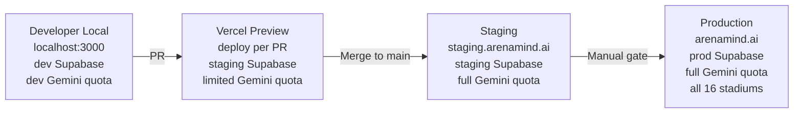

### 26.2 Vercel Configuration

```json
// vercel.json
{
  "regions": ["iad1"], // IAD1 (US East — close to Google Cloud)
  "functions": {
    "src/app/api/**/*.ts": {
      "maxDuration": 30 // 30s max for AI endpoints (Gemini can be slow)
    }
  },
  "headers": [
    {
      "source": "/api/v1/(.*)",
      "headers": [
        { "key": "X-Robots-Tag", "value": "noindex" } // Don't index API routes
      ]
    }
  ]
}
```

### 26.3 Supabase Production Configuration

```
Production Supabase project setup:
  ✅ Separate project from dev/staging (different project ID, different keys)
  ✅ Point-in-Time Recovery (PITR) enabled
  ✅ Connection pooling: PgBouncer (transaction mode, pool size 25)
  ✅ SSL enforcement: required (reject unencrypted connections)
  ✅ Auth email templates: branded ArenaMind AI templates
  ✅ Realtime: enabled, publication includes all operational tables
  ✅ Storage: buckets configured (incident-attachments, reports, avatars)
  ✅ Service role key: rotated (fresh production key, never shared with dev)
```

### 26.4 Rollback Procedure

```bash
# Option 1: Vercel instant rollback (for frontend/API changes)
# Via Vercel dashboard: Deployments → Previous deployment → Promote

# Option 2: Database migration rollback
# For DB-breaking changes (pre-production only):
npx supabase db diff --schema public > diff.sql
npx supabase migration new rollback_001
# Edit migration: apply down_001 SQL
npx supabase db push

# Rollback trigger criteria:
# - P99 latency > 2× baseline for 5 consecutive minutes
# - Error rate > 5% for 2 consecutive minutes
# - Any cross-stadium data access confirmed
# - AI serving recommendations without human review option
```

---

## 27. Phase 19 — Production Readiness

### 27.1 Production Readiness Checklist

#### Architecture

```
[ ] All 86 API endpoints implemented and tested
[ ] All 35 DB tables created with RLS
[ ] All 6 Realtime channels functional
[ ] All 6 AI features operational
[ ] Phase transition race condition tested and safe
[ ] Polling fallback tested with Realtime disabled
[ ] AI hallucination guard tested with malformed Gemini output
[ ] Rate limiting tested at capacity limits
```

#### Database

```
[ ] All migrations applied to production Supabase
[ ] Seed data applied (stadiums, incident types, prompt templates)
[ ] All indexes created and verified
[ ] All triggers tested (updated_at, audit, alert threshold)
[ ] PITR enabled on production
[ ] Connection pool configured (PgBouncer)
[ ] Row count estimates reasonable for expected load
[ ] No unindexed foreign keys
[ ] Crowd data partition strategy applied
```

#### Security

```
[ ] npm audit: zero critical/high vulnerabilities
[ ] Secrets audit: zero secrets in codebase or git history
[ ] RLS penetration test: zero bypass found
[ ] Security headers: A grade on securityheaders.com
[ ] CORS: whitelist restricted to production domain only
[ ] JWT refresh token rotation enabled
[ ] Rate limiting: all tiers verified
[ ] File upload: type and size limits enforced
[ ] AI prompt injection: mitigated
```

#### Performance

```
[ ] Crowd heatmap P99 < 50ms (load tested)
[ ] Incident list P99 < 100ms (load tested)
[ ] AI operational summary P99 < 6,000ms (tested)
[ ] Bundle size: initial load < 200KB gzipped
[ ] Lighthouse score: ≥ 90 Performance
[ ] Core Web Vitals: LCP < 2.5s, FID < 100ms, CLS < 0.1
```

#### Accessibility

```
[ ] axe-core: zero violations on all pages
[ ] Keyboard navigation: all modals, forms, interactive elements
[ ] Screen reader: tested on VoiceOver (Mac) and NVDA (Windows)
[ ] Color contrast: WCAG AA compliant (4.5:1 text, 3:1 UI)
[ ] Focus management: correct focus trap in modals
[ ] ARIA labels: all interactive elements labeled
```

#### Monitoring

```
[ ] /api/v1/health returning 200
[ ] Vercel Analytics configured
[ ] Error alerts configured (Vercel + Supabase)
[ ] AI call success rate monitoring active
[ ] Crowd data ingestion lag monitoring active
[ ] Uptime monitor configured (external: e.g., Uptime Robot)
```

#### Documentation

```
[ ] README.md: complete developer guide
[ ] DEPLOYMENT.md: deployment runbook
[ ] INCIDENT_RESPONSE.md: on-call runbook
[ ] API documentation: OpenAPI spec accessible
[ ] All inline JSDoc comments complete
```

#### Hackathon Submission

```
[ ] Demo video recorded (< 5 minutes)
[ ] Live demo URL accessible with demo credentials
[ ] Repository public or shared with judges
[ ] README: hackathon-specific section
[ ] All 6 AI features demonstrable in demo
[ ] Phase transition demo working
[ ] Crowd alert trigger demo working
[ ] Multi-user presence demo (two browser windows)
```

---

## 28. CI/CD Pipeline

### 28.1 GitHub Actions — PR CI Pipeline

```yaml
# .github/workflows/ci.yml

name: CI — Pull Request Checks

on:
  pull_request:
    branches: [main, develop]

concurrency:
  group: ${{ github.workflow }}-${{ github.ref }}
  cancel-in-progress: true

jobs:
  lint:
    name: Lint & Format Check
    runs-on: ubuntu-latest
    steps:
      - uses: actions/checkout@v4
      - uses: actions/setup-node@v4
        with: { node-version: '20', cache: 'npm' }
      - run: npm ci
      - run: npm run lint
      - run: npm run format:check

  typecheck:
    name: TypeScript Check
    runs-on: ubuntu-latest
    steps:
      - uses: actions/checkout@v4
      - uses: actions/setup-node@v4
        with: { node-version: '20', cache: 'npm' }
      - run: npm ci
      - run: npm run typecheck

  unit-tests:
    name: Unit Tests
    runs-on: ubuntu-latest
    steps:
      - uses: actions/checkout@v4
      - uses: actions/setup-node@v4
        with: { node-version: '20', cache: 'npm' }
      - run: npm ci
      - run: npm run test:unit -- --coverage
      - uses: actions/upload-artifact@v4
        with:
          name: coverage-report
          path: coverage/

  integration-tests:
    name: Integration Tests (RLS + API)
    runs-on: ubuntu-latest
    services:
      supabase:
        image: supabase/postgres:15.1.0.117
        env:
          POSTGRES_PASSWORD: postgres
        ports: ['5432:5432']
    env:
      NEXT_PUBLIC_SUPABASE_URL: ${{ secrets.TEST_SUPABASE_URL }}
      NEXT_PUBLIC_SUPABASE_ANON_KEY: ${{ secrets.TEST_SUPABASE_ANON_KEY }}
      SUPABASE_SERVICE_ROLE_KEY: ${{ secrets.TEST_SERVICE_ROLE_KEY }}
      GEMINI_API_KEY: ${{ secrets.GEMINI_API_KEY_TEST }}
    steps:
      - uses: actions/checkout@v4
      - uses: actions/setup-node@v4
        with: { node-version: '20', cache: 'npm' }
      - run: npm ci
      - run: npm run test:integration

  build:
    name: Next.js Build
    runs-on: ubuntu-latest
    env:
      NEXT_PUBLIC_SUPABASE_URL: ${{ secrets.TEST_SUPABASE_URL }}
      NEXT_PUBLIC_SUPABASE_ANON_KEY: ${{ secrets.TEST_SUPABASE_ANON_KEY }}
    steps:
      - uses: actions/checkout@v4
      - uses: actions/setup-node@v4
        with: { node-version: '20', cache: 'npm' }
      - run: npm ci
      - run: npm run build
      - uses: actions/upload-artifact@v4
        with: { name: build-output, path: .next/ }

  security-scan:
    name: Security Scan
    runs-on: ubuntu-latest
    steps:
      - uses: actions/checkout@v4
      - uses: actions/setup-node@v4
        with: { node-version: '20', cache: 'npm' }
      - run: npm ci
      - run: npm audit --audit-level=high
      - uses: snyk/actions/node@master  # Dependency vulnerability scan
        env: { SNYK_TOKEN: ${{ secrets.SNYK_TOKEN }} }

  accessibility:
    name: Accessibility Check
    runs-on: ubuntu-latest
    needs: [build]
    steps:
      - uses: actions/checkout@v4
      - run: npm ci
      - run: npm run test:a11y  # axe-core via Playwright

  all-checks-passed:
    name: All Checks Passed
    runs-on: ubuntu-latest
    needs: [lint, typecheck, unit-tests, integration-tests, build, security-scan]
    steps:
      - run: echo "All CI checks passed ✅"
```

### 28.2 GitHub Actions — Staging Deploy

```yaml
# .github/workflows/deploy-staging.yml

name: Deploy to Staging

on:
  push:
    branches: [main]

jobs:
  deploy-staging:
    name: Deploy to Staging (Vercel)
    runs-on: ubuntu-latest
    environment:
      name: staging
      url: https://staging.arenamind.ai
    steps:
      - uses: actions/checkout@v4
      - uses: amondnet/vercel-action@v25
        with:
          vercel-token: ${{ secrets.VERCEL_TOKEN }}
          vercel-org-id: ${{ secrets.VERCEL_ORG_ID }}
          vercel-project-id: ${{ secrets.VERCEL_PROJECT_ID }}
          scope: ${{ secrets.VERCEL_ORG_ID }}
          alias-domains: staging.arenamind.ai

  smoke-tests-staging:
    name: Smoke Tests on Staging
    runs-on: ubuntu-latest
    needs: [deploy-staging]
    steps:
      - uses: actions/checkout@v4
      - run: npm ci
      - run: npm run test:smoke
        env: { BASE_URL: 'https://staging.arenamind.ai' }
```

### 28.3 CI/CD Flow Diagram

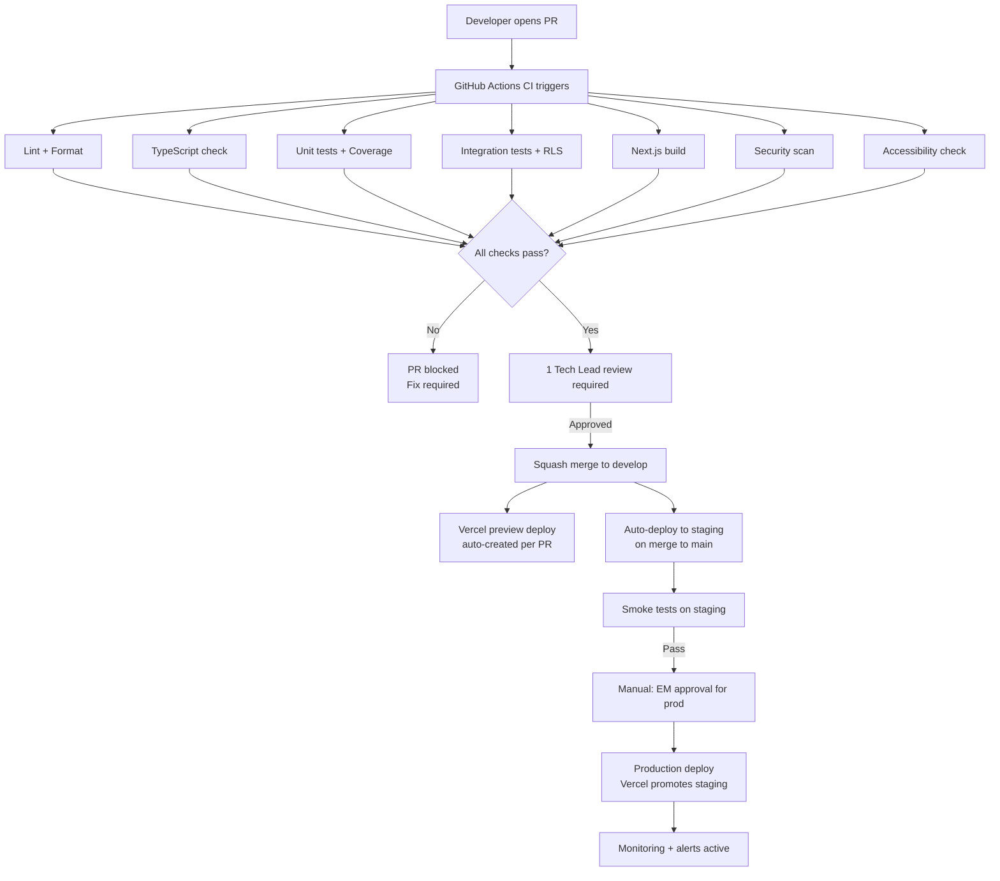

---

## 29. Dependency Graph

### 29.1 Infrastructure Dependencies

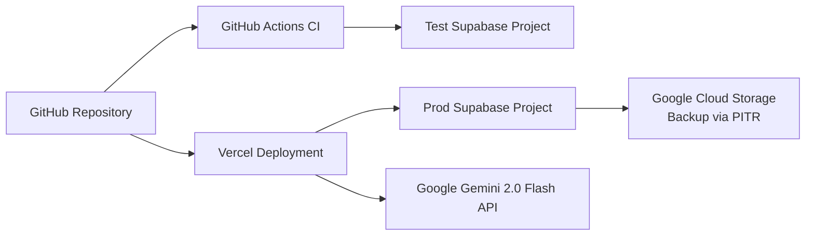

### 29.2 Module Dependency Graph

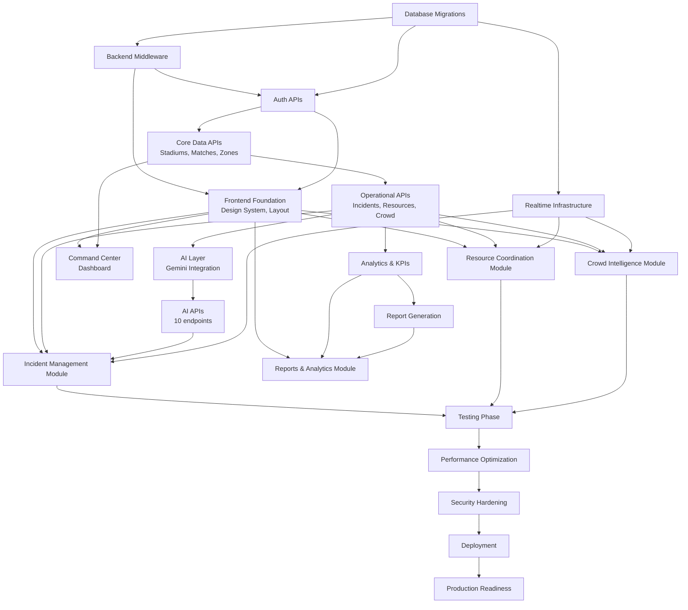

---

## 30. Risk Register

| ID  | Risk                                                               | Probability | Impact   | Score       | Mitigation                                                                                             | Contingency                                                                                |
| --- | ------------------------------------------------------------------ | ----------- | -------- | ----------- | ------------------------------------------------------------------------------------------------------ | ------------------------------------------------------------------------------------------ |
| R01 | Gemini API quota exhausted during peak match day demo              | Medium      | High     | 🔴 High     | Implement AI rate limiting (10/min/stadium); cache recommendations; monitor token usage                | Fallback: serve last valid recommendation; display "AI temporarily unavailable" message    |
| R02 | Supabase Realtime connection limits exceeded (16 stadiums × users) | Low         | High     | 🟡 Medium   | Monitor concurrent connections; implement connection pooling in client; limit channels to 6 per client | Fallback: polling every 5 seconds — already designed                                       |
| R03 | PostgreSQL RLS policy performance degradation on crowd_data        | Low         | High     | 🟡 Medium   | Covering index + partition by match_id; EXPLAIN ANALYZE all RLS queries; run load tests                | Add materialized view for crowd_data if P99 exceeds 100ms                                  |
| R04 | AI hallucination in critical Tier 1 recommendation                 | Low         | Critical | 🔴 High     | Zod output schema validation; confidence threshold display; human decision mandatory                   | Schema validation catch → return 500, log to error_logs; never serve unvalidated AI output |
| R05 | Phase transition race condition in production                      | Low         | High     | 🟡 Medium   | SERIALIZABLE isolation in PostgreSQL function; load test with concurrent phase changes                 | Detect via 409 CONFLICT response; retry with fresh state                                   |
| R06 | Hackathon time pressure (8 weeks is tight)                         | High        | High     | 🔴 Critical | Vertical slice development; no gold-plating; MVP features first; P0/P1 only in early sprints           | Descope: Transportation and Parking modules (accessibility + reports sufficient for demo)  |
| R07 | Vercel timeout on AI endpoints (30s limit)                         | Medium      | Medium   | 🟡 Medium   | Streaming SSE reduces time-to-first-byte; 30s Vercel function timeout in vercel.json                   | Move AI proxy to Google Cloud Run (separate long-running service)                          |
| R08 | Supabase Auth custom claims hook complexity                        | Medium      | Medium   | 🟡 Medium   | Test hook in dev environment first; document edge cases; have rollback migration ready                 | Fallback: fetch role from DB on each request (adds ~5ms)                                   |
| R09 | CSS design system inconsistency across modules                     | Medium      | Low      | 🟢 Low      | Design tokens defined in Sprint 0; all teams use same CSS variables; no hardcoded colors               | UI Engineer reviews all components before merge                                            |
| R10 | Browser WebSocket support issues                                   | Low         | Low      | 🟢 Low      | Supabase Realtime is widely supported; polling fallback designed                                       | Fallback: polling every 5 seconds                                                          |
| R11 | Third-party API downtime (Gemini)                                  | Medium      | Medium   | 🟡 Medium   | Retry logic (3x exp backoff); fallback message; AI unavailable = non-blocking                          | System remains operational; AI features show "unavailable" banner                          |
| R12 | Database migration error on production                             | Low         | Critical | 🔴 High     | All migrations tested on staging; down migrations ready; staging identical to prod                     | Never run untested migrations on prod; always test on staging first                        |
| R13 | PDF generation performance (Puppeteer)                             | Medium      | Low      | 🟢 Low      | Report generation is async (background job); users poll for completion                                 | Alternative: use server-side HTML-to-PDF library (e.g., jsPDF)                             |
| R14 | Demo environment not ready for hackathon submission                | Medium      | Critical | 🔴 High     | Staging = production-identical; demo deployed by Day 50 (Week 7)                                       | Have local demo as fallback; record demo video in Week 7                                   |
| R15 | TypeScript strict mode discovery (existing type issues)            | Medium      | Low      | 🟢 Low      | Strict mode from Day 0; no migration cost                                                              | N/A — strict from the start                                                                |

### 30.1 Risk Heat Map

```
IMPACT
Critical │ R04    R12         R14
High     │ R01  R03  R05    R06
Medium   │     R02  R07  R08  R11
Low      │ R10  R09  R13  R15
         └──────────────────────
           Low  Med  High  Critical
                PROBABILITY
```

---

## 31. Definition of Done

### 31.1 Story Definition of Done

A user story is **Done** when:

```
CODE
  ✅ Feature implemented and working end-to-end
  ✅ TypeScript: zero type errors, no `any` types
  ✅ ESLint: zero warnings or errors
  ✅ Code formatted with Prettier

TESTING
  ✅ Unit tests written for all new functions
  ✅ Unit test coverage ≥ 80% for new code
  ✅ Integration tests passing for new API endpoints
  ✅ RLS tests: if DB is involved, access control tested

QUALITY
  ✅ PR reviewed and approved by Tech Lead
  ✅ No TODO comments (or tracked as GitHub issue)
  ✅ API matches ASD specification (schema contract)
  ✅ Database matches DDD specification

ACCESSIBILITY (UI stories only)
  ✅ axe-core: zero violations
  ✅ Keyboard navigation functional
  ✅ ARIA labels on all interactive elements

DOCUMENTATION
  ✅ JSDoc on all exported functions
  ✅ PR description: what + why + testing steps
```

### 31.2 Feature Definition of Done

A feature is **Done** when all constituent stories are Done, PLUS:

```
  ✅ Integration tests passing for all stories in the feature
  ✅ QA sign-off (manual test on staging)
  ✅ Demo-able on staging environment
  ✅ No P1 or P2 bugs open
  ✅ Performance within targets (P99 latency)
  ✅ Security: no new vulnerabilities introduced
```

### 31.3 Sprint Definition of Done

A sprint is **Done** when:

```
  ✅ All committed stories meet Story DoD
  ✅ All feature tests green in staging
  ✅ Sprint demo completed with stakeholder sign-off
  ✅ Technical debt items tracked in GitHub Issues
  ✅ CI pipeline green on main
  ✅ Staging deployment successful and accessible
  ✅ Sprint retrospective completed
```

### 31.4 Release Definition of Done

A release is **Done** when:

```
  ✅ All features meet Feature DoD
  ✅ Full test suite passing:
      - Unit tests (≥ 80% coverage)
      - Integration tests (RLS, API contracts)
      - E2E tests (5 critical flows)
      - Load tests (50 VUs, P99 targets met)
      - Accessibility tests (axe-core clean)
  ✅ Security scan: zero critical/high vulnerabilities
  ✅ Performance: Lighthouse ≥ 90, Core Web Vitals passing
  ✅ Production readiness checklist: 100% complete
  ✅ Rollback tested and documented
  ✅ Monitoring active and alerting
```

### 31.5 Production Definition of Done

```
  ✅ Release DoD satisfied
  ✅ Production deployment successful
  ✅ Smoke tests passing in production
  ✅ Health endpoint returning 200
  ✅ All 6 Realtime channels connected
  ✅ AI endpoints responding < 8 seconds
  ✅ Demo credentials created and tested
  ✅ Post-launch runbook written
  ✅ On-call rotation established (for hackathon demo period)
```

---

## 32. Release Management

### 32.1 Release Stages

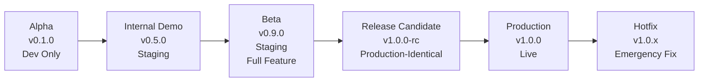

| Stage             | Version   | Criteria                                   | Audience               |
| ----------------- | --------- | ------------------------------------------ | ---------------------- |
| **Alpha**         | v0.1.0    | Scaffold + DB + Auth working               | Dev team only          |
| **Internal Demo** | v0.5.0    | Backend complete, AI working, basic UI     | Engineering team       |
| **Beta**          | v0.9.0    | All features complete, testing in progress | Internal stakeholders  |
| **RC**            | v1.0.0-rc | Feature freeze, all tests passing          | QA + final review      |
| **Production**    | v1.0.0    | All release gates met, deployed to prod    | Hackathon judges, demo |

### 32.2 Hotfix Strategy

```bash
# Hotfix for production bug
git checkout main
git checkout -b hotfix/501-cross-stadium-rls-bypass

# Fix the bug
# Run targeted tests
npm run test:unit -- --grep "RLS"
npm run test:integration -- --grep "cross-stadium"

# Commit
git commit -m "fix(rls): prevent cross-stadium access via archived match lookup"

# PR to main (emergency review — 1 approver sufficient)
# After merge: tag v1.0.1
# Cherry-pick to develop branch
git checkout develop
git cherry-pick {hotfix-commit-hash}
```

---

## 33. Post-Launch Operations

### 33.1 Monitoring Dashboard

```
Monitors to establish at launch:

1. Uptime monitoring (external)
   Tool: Uptime Robot (free) or Checkly
   Endpoint: GET /api/v1/health
   Frequency: every 1 minute
   Alert: email + Slack on 2 consecutive failures

2. AI service monitoring
   Metric: AI call success rate (from ai_call_logs)
   Alert: < 95% success rate in past 10 minutes
   Source: Supabase Studio query / cron job

3. Crowd data ingestion monitoring
   Metric: Last crowd_data INSERT timestamp
   Alert: > 2 minutes since last INSERT during active match
   Source: PostgreSQL scheduled check

4. Error rate monitoring
   Tool: Vercel Analytics + custom error_logs table
   Alert: > 1% HTTP 5xx in past 5 minutes

5. Realtime connection monitoring
   Metric: Active Realtime subscriptions
   Source: Supabase Realtime dashboard
```

### 33.2 Incident Response Runbook

```
SEVERITY 1 — SERVICE DOWN (all users affected)
  Response time: < 5 minutes
  Actions:
    1. Check /api/v1/health endpoint
    2. Check Vercel deployment status
    3. Check Supabase dashboard
    4. Check recent deployments (Vercel)
    5. If recent deploy: rollback immediately
    6. If infrastructure: contact Supabase/Vercel support
    7. Post status update (if public demo impacted)

SEVERITY 2 — AI SERVICE DEGRADED (AI features unavailable)
  Response time: < 15 minutes
  Actions:
    1. Check /api/v1/health/ai endpoint
    2. Check Gemini API status (https://aistudio.google.com)
    3. Check rate limit usage (ai_call_logs table)
    4. All operational features remain functional
    5. Post banner in app: "AI features temporarily unavailable"
    6. Monitor for recovery

SEVERITY 3 — PERFORMANCE DEGRADED (latency elevated)
  Response time: < 30 minutes
  Actions:
    1. Check Supabase performance dashboard
    2. Run EXPLAIN ANALYZE on slow queries
    3. Check connection pool utilization
    4. Check for missing indexes (table scans)
    5. If crowd_data: verify partition in use
```

### 33.3 Post-Launch Maintenance Schedule

| Activity                         | Frequency     | Owner              |
| -------------------------------- | ------------- | ------------------ |
| Dependency updates               | Weekly        | DevOps             |
| Security vulnerability scan      | Weekly        | Security Architect |
| Database performance review      | Per match day | BE1                |
| AI prompt performance review     | Per week      | AI Engineer        |
| AI call log cleanup (> 30 days)  | Monthly       | BE1                |
| Crowd data archival              | Post-match    | BE2                |
| Test suite update (new features) | Per sprint    | QA                 |
| Documentation update             | Per sprint    | TPM                |

---

## 34. Engineering Checklists

### 34.1 Database Implementation Checklist

| Task                               | Owner  | Status | Verification                                      |
| ---------------------------------- | ------ | ------ | ------------------------------------------------- |
| Migration 001 — Core entities      | BE1    | ⬜     | `SELECT count(*) FROM stadiums` returns seed data |
| Migration 002 — Operational tables | BE1    | ⬜     | All FK constraints pass                           |
| Migration 003 — AI tables          | AI Eng | ⬜     | Prompt templates loaded                           |
| Migration 004 — Analytics tables   | BE2    | ⬜     | Tables created                                    |
| Migration 005 — System tables      | BE2    | ⬜     | job_queue functional                              |
| All indexes applied                | BE1    | ⬜     | EXPLAIN shows index scans                         |
| All triggers applied               | BE1    | ⬜     | updated_at changes on update                      |
| All functions created              | BE1    | ⬜     | calculate_health_score() returns 0-100            |
| All RLS policies applied           | BE1    | ⬜     | Cross-stadium access blocked                      |
| Seed data applied                  | BE2    | ⬜     | 16 stadiums present                               |
| Down migrations written            | BE1    | ⬜     | Can rollback in staging                           |
| Supabase types generated           | BE1    | ⬜     | `npx supabase gen types typescript`               |

### 34.2 API Implementation Checklist

| Module                 | Endpoints | Implemented | Integration Test | RLS Verified |
| ---------------------- | --------- | ----------- | ---------------- | ------------ |
| Authentication         | 5         | ⬜          | ⬜               | N/A          |
| Users                  | 5         | ⬜          | ⬜               | ⬜           |
| Stadiums               | 3         | ⬜          | ⬜               | ⬜           |
| Matches                | 5         | ⬜          | ⬜               | ⬜           |
| Zones                  | 3         | ⬜          | ⬜               | ⬜           |
| Crowd Intelligence     | 6         | ⬜          | ⬜               | ⬜           |
| Incidents              | 9         | ⬜          | ⬜               | ⬜           |
| Resources              | 7         | ⬜          | ⬜               | ⬜           |
| Accessibility          | 3         | ⬜          | ⬜               | ⬜           |
| Alerts & Notifications | 5         | ⬜          | ⬜               | ⬜           |
| Weather                | 2         | ⬜          | ⬜               | ⬜           |
| AI                     | 10        | ⬜          | ⬜               | ⬜           |
| Analytics & KPIs       | 4         | ⬜          | ⬜               | ⬜           |
| Reports                | 5         | ⬜          | ⬜               | ⬜           |
| Files                  | 4         | ⬜          | ⬜               | ⬜           |
| Search                 | 1         | ⬜          | ⬜               | ⬜           |
| Settings               | 4         | ⬜          | ⬜               | ⬜           |
| Admin                  | 3         | ⬜          | ⬜               | ⬜           |
| System Health          | 3         | ⬜          | ⬜               | N/A          |

### 34.3 Frontend Implementation Checklist

| Component                     | Implemented | a11y | Responsive | Tests |
| ----------------------------- | ----------- | ---- | ---------- | ----- |
| CSS Design System (index.css) | ⬜          | N/A  | N/A        | N/A   |
| Button (all variants)         | ⬜          | ⬜   | N/A        | ⬜    |
| Badge (severity, status)      | ⬜          | ⬜   | N/A        | ⬜    |
| Card (glass-morphism)         | ⬜          | N/A  | ⬜         | ⬜    |
| Modal (focus trap)            | ⬜          | ⬜   | ⬜         | ⬜    |
| Toast system                  | ⬜          | ⬜   | ⬜         | ⬜    |
| Login Page                    | ⬜          | ⬜   | ⬜         | ⬜    |
| Dashboard Layout              | ⬜          | ⬜   | ⬜         | ⬜    |
| Sidebar                       | ⬜          | ⬜   | ⬜         | ⬜    |
| KPI Strip                     | ⬜          | ⬜   | ⬜         | ⬜    |
| Health Score Gauge            | ⬜          | ⬜   | ⬜         | ⬜    |
| Stadium Heatmap               | ⬜          | ⬜   | ⬜         | ⬜    |
| Crowd Trend Chart             | ⬜          | ⬜   | ⬜         | ⬜    |
| Incident Feed                 | ⬜          | ⬜   | ⬜         | ⬜    |
| Create Incident Form          | ⬜          | ⬜   | ⬜         | ⬜    |
| AI Recommendation Panel       | ⬜          | ⬜   | ⬜         | ⬜    |
| Resource Board                | ⬜          | ⬜   | ⬜         | ⬜    |
| Analytics Dashboard           | ⬜          | ⬜   | ⬜         | ⬜    |
| Report Generator              | ⬜          | ⬜   | ⬜         | ⬜    |
| Notification Panel            | ⬜          | ⬜   | ⬜         | ⬜    |

### 34.4 AI Implementation Checklist

| Task                                 | Owner  | Status | Verification                                 |
| ------------------------------------ | ------ | ------ | -------------------------------------------- |
| Prompt templates seeded (6)          | AI Eng | ⬜     | SELECT count(*) FROM ai_prompt_templates = 6 |
| Context builder (6 parallel queries) | AI Eng | ⬜     | Context builds in < 500ms                    |
| Gemini SDK integrated                | AI Eng | ⬜     | Test call returns valid JSON                 |
| Zod output schemas (6)               | AI Eng | ⬜     | Schema rejects malformed output              |
| Streaming SSE handler                | AI Eng | ⬜     | Stream delivers first chunk < 1s             |
| AI rate limiting (10/min/stadium)    | AI Eng | ⬜     | 11th call returns 429                        |
| Retry logic (3x exp backoff)         | AI Eng | ⬜     | 3 retries then fails gracefully              |
| ai_call_logs INSERT on every call    | AI Eng | ⬜     | Logs appear in DB after call                 |
| Accept/dismiss expiry enforcement    | AI Eng | ⬜     | Expired recommendation → 422                 |
| Hallucination guard tested           | AI Eng | ⬜     | Malformed JSON → 500, not served to user     |

---

## 35. Estimation Summary

### 35.1 Complexity Estimates

| Component                       | Complexity | Reason                                                      |
| ------------------------------- | ---------- | ----------------------------------------------------------- |
| Database migrations (35 tables) | Medium     | Well-defined schema; RLS adds complexity                    |
| Auth APIs                       | Low        | Supabase handles most logic                                 |
| Incident CRUD                   | Medium     | Cursor pagination, optimistic updates, RLS                  |
| Phase transition                | High       | SERIALIZABLE transaction, race condition protection         |
| AI Context Builder              | High       | 6 parallel queries, error aggregation                       |
| AI Streaming SSE                | High       | ReadableStream API, SSE protocol, error handling            |
| Stadium Heatmap                 | High       | SVG path generation, real-time color updates, accessibility |
| Realtime Infrastructure         | High       | 6 channels, reconnection, polling fallback                  |
| Report PDF Generation           | Medium     | Async job, Puppeteer setup                                  |
| Full-text Search                | Medium     | PostgreSQL FTS + GIN index                                  |
| KPI Snapshot Cron               | Low        | Straightforward aggregation SQL                             |

### 35.2 Critical Path Timeline

```
Week 1: DB + Auth + CI                (Foundation sprint)
Week 2: Core + Operational APIs       (Backend core)
Week 3: AI Layer + Operational APIs 2 (Backend complete partial)
Week 4: Analytics + Reports + Search  (Backend complete)
Week 5: Frontend Foundation + Dashboard (UI foundation)
Week 6: Crowd + Incident + Resource modules (UI features)
Week 7: Realtime + Reports UI + Integration (Full integration)
Week 8: Testing + Security + Launch  (Production)
```

---

## 36. Appendices

### Appendix A — npm Scripts

```json
// package.json — scripts section
{
  "scripts": {
    "dev": "next dev",
    "build": "next build",
    "start": "next start",
    "lint": "eslint src --ext .ts,.tsx --max-warnings 0",
    "format": "prettier --write 'src/**/*.{ts,tsx,css}'",
    "format:check": "prettier --check 'src/**/*.{ts,tsx,css}'",
    "typecheck": "tsc --noEmit",
    "test:unit": "vitest run src --coverage",
    "test:unit:watch": "vitest watch src",
    "test:integration": "vitest run tests/integration",
    "test:e2e": "playwright test",
    "test:e2e:ui": "playwright test --ui",
    "test:a11y": "playwright test tests/accessibility",
    "test:smoke": "playwright test tests/smoke",
    "test:all": "npm run test:unit && npm run test:integration && npm run test:e2e",
    "db:types": "npx supabase gen types typescript --project-id $PROJECT_ID > src/types/database.ts",
    "db:migrate": "npx supabase db push",
    "db:reset": "npx supabase db reset",
    "db:diff": "npx supabase db diff",
    "analyze": "ANALYZE=true next build"
  }
}
```

### Appendix B — Hackathon Demo Script

```
DEMO SEQUENCE (5 minutes):

[0:00 - 0:30] Introduction + Login as Operations Manager

[0:30 - 1:00] Command Center
  - Show KPI Strip (live values)
  - Show Health Score Gauge
  - Show current match phase
  - Trigger AI Operational Summary → show streaming text

[1:00 - 2:00] Crowd Intelligence
  - Show stadium heatmap with density colors
  - Point to Zone C (critical — 91%)
  - Show crowd trend chart
  - Show alert appearing as zone crosses threshold

[2:00 - 3:30] Incident Management
  - Create Tier 1 medical incident
  - Show AI auto-classification appearing (< 10 seconds)
  - Click "Generate AI Recommendation"
  - Show streaming recommendation
  - Click "Accept Recommendation"
  - Show decision recorded and locked

[3:30 - 4:00] Phase Transition
  - Transition match from "match_live" to "halftime"
  - Show phase indicator update
  - Show KPI recalculation

[4:00 - 4:30] Multi-user Realtime
  - Open second browser window as Deputy Manager
  - Create incident in Window 1
  - Show incident appear in Window 2 in < 1 second

[4:30 - 5:00] Reports
  - Generate AI Executive Summary
  - Download PDF
  - Close: "ArenaMind AI — real-time intelligence for FIFA 2026"
```

### Appendix C — Key Commands for Developers

```bash
# First-time setup
git clone https://github.com/org/arenamind-ai.git
cd arenamind-ai
npm install
cp .env.example .env.local
# Fill in .env.local with dev Supabase + Gemini credentials

# Start dev server
npm run dev

# Apply DB migrations
npx supabase db push

# Regenerate TypeScript types from DB
npm run db:types

# Run all tests
npm run test:all

# Check bundle size
npm run analyze
```

---

_Document End_

---

> **ArenaMind AI** — Enterprise Implementation Plan  
> _Version 1.0.0 | July 13, 2026_  
> _Engineering Execution Blueprint — The definitive implementation guide for ArenaMind AI._  
> _Derived from: PRD v1.0.0 + TRD v1.0.0 + SAD v1.0.0 + Design Brief v1.0.0 + DDD v1.0.0 + ASD v1.0.0_  
> _This document becomes the Engineering Authority for implementation decisions._
