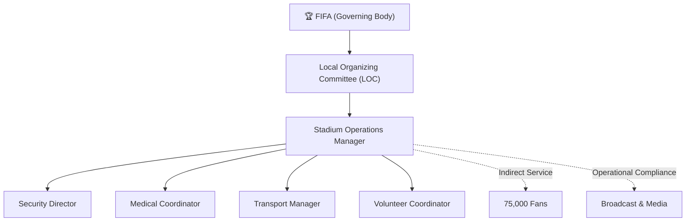
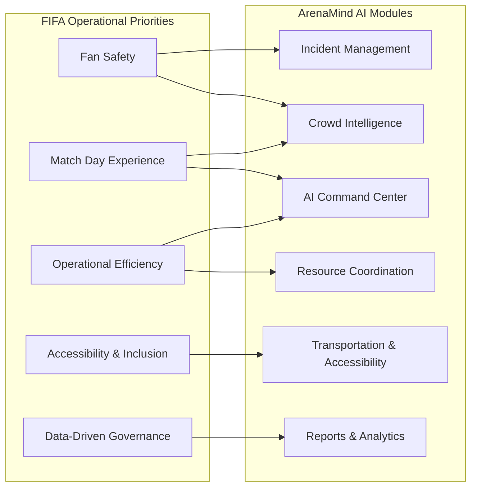
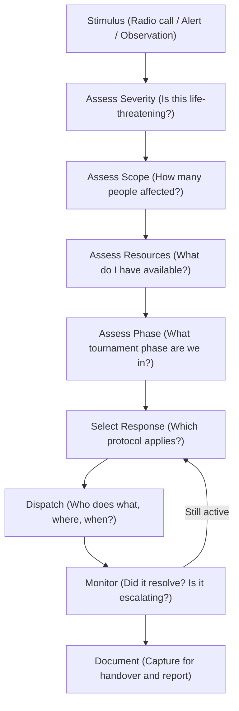
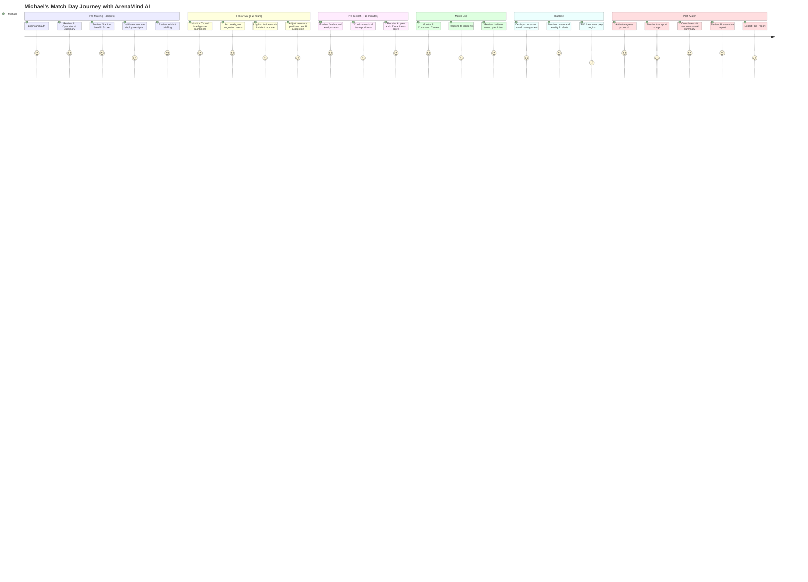
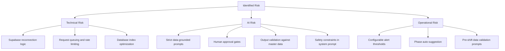
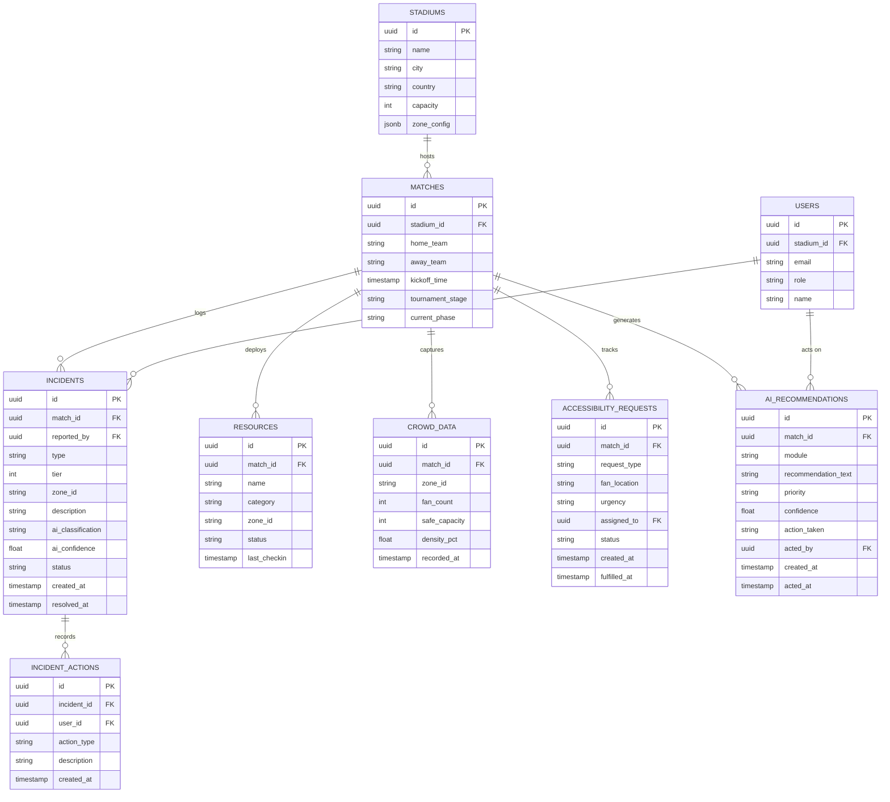
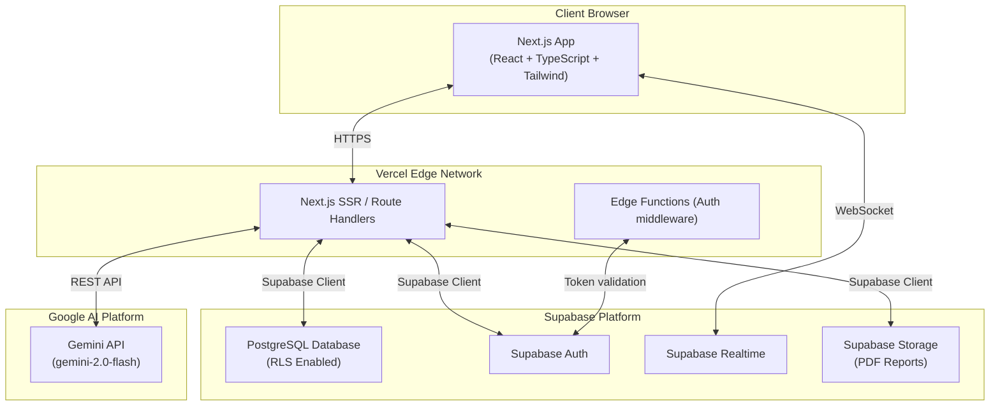

# ArenaMind AI — Product Requirements Document

> **Product Name:** ArenaMind AI  
> **Tagline:** The Intelligent Stadium Operations Copilot  
> **Version:** 1.0.0  
> **Document Status:** APPROVED — Single Source of Truth  
> **Last Updated:** July 12, 2026  
> **Document Owner:** Product & Engineering Leadership  
> **Classification:** Internal — Hackathon Submission Package

---

## Table of Contents

1. [Executive Summary](#1-executive-summary)
2. [Vision](#2-vision)
3. [Problem Statement](#3-problem-statement)
4. [Business Context](#4-business-context)
5. [Challenge Alignment](#5-challenge-alignment)
6. [Target User](#6-target-user)
7. [User Journey](#7-user-journey)
8. [Goals](#8-goals)
9. [Out of Scope](#9-out-of-scope)
10. [Product Scope](#10-product-scope)
11. [Core Modules](#11-core-modules)
12. [Detailed Features](#12-detailed-features)
13. [Tournament Timeline Intelligence](#13-tournament-timeline-intelligence)
14. [Functional Requirements](#14-functional-requirements)
15. [Non-Functional Requirements](#15-non-functional-requirements)
16. [AI Requirements](#16-ai-requirements)
17. [Success Metrics](#17-success-metrics)
18. [Risks](#18-risks)
19. [Assumptions](#19-assumptions)
20. [Future Enhancements](#20-future-enhancements)
21. [Glossary](#21-glossary)
22. [Appendix](#22-appendix)

---

## 1. Executive Summary

ArenaMind AI is an AI-powered operational copilot purpose-built for stadium operations management during the FIFA World Cup 2026. It serves as the central nervous system of a stadium's operations command center — continuously synthesizing live crowd intelligence, incident data, resource status, and transportation logistics into actionable operational guidance for the Stadium Operations Manager.

Unlike traditional stadium management systems, which present raw data and leave interpretation to human operators, ArenaMind AI acts as an intelligent co-decision-maker. It monitors up to 80,000+ concurrent fans across 16 host stadiums, anticipates operational friction before it becomes a crisis, recommends proportional responses calibrated to the specific tournament phase, and documents every operational decision into structured post-event analytics.

The product is designed for a hackathon submission targeting FIFA World Cup 2026 operational excellence, with a software architecture realistic enough to be evaluated for production deployment: Next.js frontend, TypeScript, Tailwind CSS, shadcn/ui component library, Supabase PostgreSQL with Row Level Security, Supabase Auth and Storage, Gemini AI, and Vercel deployment.

This PRD is the single source of truth for all engineering, design, AI, and product decisions. Every component, screen, API, database schema, and AI prompt specification derives from this document.

---

## 2. Vision

> **"Every stadium operation decision, at every World Cup match, should be informed, not instinctive."**

ArenaMind AI's vision is to transform stadium operations from a reactive, experience-dependent discipline into a proactive, intelligence-driven practice — enabling operations managers to move from crisis responders to strategic orchestrators.

By the time FIFA World Cup 2026 concludes, ArenaMind AI should have:

- Reduced average incident response time by providing AI-generated response playbooks within seconds of detection.
- Enabled data-informed shift handovers that compress 30-minute debriefs into 3-minute structured summaries.
- Built the foundational data architecture from which FIFA can continuously improve operational standards across future tournaments.

The product aspires to become what an experienced, always-on operational advisor would be — one who has internalized the operational history of every World Cup, knows every gate's bottleneck pattern, understands how crowd behavior shifts between match phases, and never sleeps.

---

## 3. Problem Statement

### 3.1 The Scale Challenge

FIFA World Cup 2026 is the largest sporting event in history by venue count, spanning **16 stadiums across 3 countries** (USA, Canada, Mexico), 104 matches over 39 days, and an estimated **5 million+ fan attendees**. Each match-day operational cycle involves:

- Coordinating 500–2,000 operational staff per venue
- Managing fans entering, moving within, and exiting a venue over a 5–6 hour window
- Simultaneously tracking security incidents, medical events, crowd density anomalies, transportation delays, and accessibility needs
- Making consequential operational decisions under extreme time pressure and sensory overload

### 3.2 The Human Limits Problem

Stadium Operations Managers today rely on:

| Current Tool                    | Limitation                                                                   |
| ------------------------------- | ---------------------------------------------------------------------------- |
| Walkie-talkies & radio          | No shared situational awareness; serial, not parallel communication          |
| Spreadsheet-based shift plans   | Static; cannot adapt to real-time conditions                                 |
| CCTV monitoring                 | High cognitive load; human attention cannot monitor all zones simultaneously |
| Verbal incident reports         | Unstructured; data lost after each match                                     |
| Experience-based intuition      | Non-transferable; inconsistent between managers                              |
| Manual KPI reports (post-event) | Too late to influence operations; incomplete                                 |

The consequence is predictable: **incidents escalate because detection is late, response is slow, and coordination is fragmented.**

### 3.3 The Data Fragmentation Problem

Existing stadium data — crowd counts, incident logs, resource rosters, transport status — exists in multiple siloed systems that do not communicate. An Operations Manager must mentally synthesize inputs from a CCTV feed, a radio call, a logistics spreadsheet, and a staffing roster simultaneously. This cognitive overload is the primary cause of delayed decisions during high-pressure operational windows.

### 3.4 The Knowledge Transfer Problem

Operational knowledge accumulated across a tournament — which gates bottleneck, which zones go critical at halftime, which communication protocols work — lives in the heads of individual staff and is never systematically captured. This knowledge walks out the door after every shift, and is unavailable to the next manager or to FIFA's institutional learning.

---

## 4. Business Context

### 4.1 Tournament Scale (FIFA World Cup 2026)

| Metric                      | Value                              |
| --------------------------- | ---------------------------------- |
| Total Matches               | 104                                |
| Host Cities                 | 16 (USA: 11, Canada: 2, Mexico: 3) |
| Host Stadiums               | 16                                 |
| Estimated Fan Attendance    | 5.5 million+                       |
| Match Days                  | 39                                 |
| Largest Stadium Capacity    | ~105,000 (Estadio Azteca)          |
| Average Stadium Capacity    | ~68,000                            |
| Operational Staff per Match | 500–2,000 per venue                |

### 4.2 Operational Complexity Factors

- **Multi-national regulatory environments**: Security, medical, and crowd management regulations differ across the USA, Canada, and Mexico.
- **Fan diversity**: Fans from 200+ nations, speaking dozens of languages, arriving via multiple transport modes.
- **Match criticality gradient**: Group stage, knockout, semi-final, and final matches carry progressively higher operational stakes.
- **Weather variability**: Outdoor stadiums in July face heat management, lightning protocols, and potential rain procedures.
- **Broadcast and VIP obligations**: FIFA's commercial obligations require near-zero disruption to broadcast operations and VIP experiences.

### 4.3 Stakeholder Map



### 4.4 Market Opportunity

While ArenaMind AI is built for the FIFA hackathon context, the underlying product architecture addresses a real and underserved market: **mega-event operational intelligence**. The global event management software market is valued at over $11B and growing, with zero dominant players offering AI-native, tournament-lifecycle-aware operational copilots for stadium-scale events.

---

## 5. Challenge Alignment

### 5.1 FIFA Hackathon Challenge Statement

The challenge requests a GenAI-enabled solution that enhances **stadium operations** and the **tournament experience** for FIFA World Cup 2026.

### 5.2 ArenaMind AI's Direct Alignment

| Challenge Dimension                | How ArenaMind AI Addresses It                                                                                                                              |
| ---------------------------------- | ---------------------------------------------------------------------------------------------------------------------------------------------------------- |
| **Stadium Operations Enhancement** | Provides AI-generated operational summaries, stadium health scoring, and AI-recommended actions that replace fragmented manual coordination                |
| **Tournament Experience**          | By reducing congestion, accelerating incident response, and optimizing crowd flow, fans experience faster entry, shorter queues, and safer environments    |
| **GenAI Enablement**               | Gemini AI is used throughout the product for natural language summaries, incident classification, crowd pattern explanation, and shift handover generation |
| **Real-time Decision Support**     | The AI Command Center provides continuous operational awareness with phase-aware recommendations                                                           |
| **Data-Driven Operations**         | All operational events are captured, enabling post-tournament analytics and institutional learning                                                         |
| **Scalability Across 16 Venues**   | Multi-tenant Supabase architecture supports all 16 host stadiums simultaneously                                                                            |
| **Accessibility Compliance**       | Dedicated Transportation & Accessibility module ensures FIFA's inclusion obligations are operationally supported                                           |

### 5.3 FIFA's Stated Operational Priorities (Alignment Map)



---

## 6. Target User

### 6.1 Primary Persona: The Stadium Operations Manager

> **Persona Name:** Michael Chen  
> **Role:** Stadium Operations Manager  
> **Venue:** SoFi Stadium, Los Angeles — FIFA World Cup 2026  
> **Employer:** Local Organizing Committee (contracted by FIFA)  
> **Experience:** 14 years in major event operations (Super Bowl, LA28 prep, Rose Bowl)

#### 6.1.1 Responsibilities

Michael is accountable for the entire operational envelope of match day:

| Domain                          | Specific Responsibilities                                                                           |
| ------------------------------- | --------------------------------------------------------------------------------------------------- |
| **Crowd Management**            | Ensuring safe ingress, egress, and in-stadium circulation for 70,240 fans                           |
| **Incident Command**            | First-line decision authority for operational incidents (medical, security, crowd, infrastructure)  |
| **Resource Orchestration**      | Deploying and redeploying security, medical, volunteers, and equipment across 40+ operational zones |
| **Transportation Coordination** | Overseeing shuttle operations, parking, and fan transport to/from the venue                         |
| **Regulatory Compliance**       | Ensuring all operations meet FIFA standards, local fire code, ADA requirements, and OSHA guidelines |
| **Communication**               | Bridging FIFA match commissioner, local police, fire department, and internal operational teams     |
| **Shift Handover**              | Conducting formal handover briefings for multi-shift match-day teams                                |
| **Post-Event Reporting**        | Compiling operational incident logs and KPI reports for the LOC and FIFA                            |

#### 6.1.2 Cognitive Environment on Match Day

| Time Window                 | What Michael is Simultaneously Managing                                     |
| --------------------------- | --------------------------------------------------------------------------- |
| T-3 hours (Gate Opening)    | Staff deployment, gate readiness checks, transport arrival status           |
| T-1 hour (Fan Arrival Peak) | Crowd density at entry gates, early incident logs, queue management         |
| T-15 mins (Pre-Kickoff)     | Final gate closures, inside-stadium zone density, elevated security posture |
| Match Live                  | Security sweeps, medical standby, broadcast zone management                 |
| Halftime                    | Concession crush management, restroom queues, fan re-entry                  |
| Full Time                   | Egress planning, transport activation, post-event resource stand-down       |

#### 6.1.3 Pain Points

1. **Information overload without synthesis** — Michael receives radio calls, CCTV feeds, and verbal reports simultaneously, but has no tool that synthesizes these into a single operational picture.
2. **No predictive capability** — By the time a bottleneck is visible, it has already become a problem. There is no system that warns him 15 minutes before a gate reaches capacity.
3. **Manual incident documentation** — Writing incident reports during live operations means either delayed documentation or incomplete records.
4. **Experience dependency** — When Michael is unavailable, his deputy lacks the same pattern recognition, creating operational inconsistency.
5. **Shift handover gaps** — Outgoing and incoming shifts share an incomplete operational picture; critical context is lost.
6. **Post-event reporting burden** — Compiling KPI reports takes 2–4 hours post-match using data from multiple systems.
7. **No AI-assisted recommendation** — Every decision depends entirely on Michael's judgment, with no independent verification or alternative scenario analysis.

#### 6.1.4 Goals

| Priority | Goal                                                                                |
| -------- | ----------------------------------------------------------------------------------- |
| 1        | Maintain zero life-threatening incidents through early detection and rapid response |
| 2        | Achieve smooth fan ingress — all fans inside within 30 minutes of gate opening      |
| 3        | Keep egress time under 45 minutes for 90% of fans post-match                        |
| 4        | Maintain medical response time under 4 minutes for any in-stadium event             |
| 5        | Complete all post-event reporting within 60 minutes of stadium clearance            |
| 6        | Conduct a structured, complete shift handover in under 5 minutes                    |

#### 6.1.5 Decision-Making Process

Michael's operational decision-making follows a mental model that ArenaMind AI must mirror:



ArenaMind AI accelerates steps B through F by providing pre-computed severity scores, scope estimates, available resource inventories, and phase-appropriate protocol suggestions — reducing Michael's decision cycle from minutes to seconds.

### 6.2 Secondary Personas

| Persona                       | Role                                             | Use of ArenaMind AI                                    |
| ----------------------------- | ------------------------------------------------ | ------------------------------------------------------ |
| **Deputy Operations Manager** | Handles sub-domains and acts as Michael's backup | Reads AI summaries, manages specific module dashboards |
| **Security Director**         | Manages all security personnel and protocols     | Views Security zone data in Resource Coordination      |
| **Medical Coordinator**       | Manages first aid and medical teams              | Accesses medical resource status and incident flags    |
| **Volunteer Coordinator**     | Oversees 200–500 match-day volunteers            | Views volunteer deployment and zone coverage           |
| **FIFA Match Commissioner**   | FIFA's official representative per match         | Reviews AI executive summary and incident log          |
| **Transport Manager**         | Oversees parking, shuttles, and fan transport    | Accesses Transportation & Accessibility module         |

---

## 7. User Journey

### 7.1 End-to-End Match Day Journey



### 7.2 Step-by-Step Journey Narrative

#### Step 1: Login and Authentication (T-4 hours)

Michael opens ArenaMind AI on his operations laptop and his deputy's tablet. Supabase Auth verifies his identity and role. The system loads SoFi Stadium's operational profile — today's match (USA vs. Mexico), expected attendance (69,800), weather (92°F, sunny, heat advisory), and any pre-loaded risk flags from intelligence reports. He sees the current tournament phase: **Pre-Event**.

#### Step 2: AI Operational Briefing

The AI Command Center displays an auto-generated **Operational Summary** for this match, synthesizing: weather conditions, attendance forecast, historical crowd behavior for this fixture type, staffing levels, and any open incidents from previous shifts. The AI flags one item: _"Based on the USA vs. Mexico rivalry history, elevated rivalry-related crowd tension is probable. Security posture recommendation: Enhanced."_

#### Step 3: Shift Briefing and Resource Validation

Michael reviews the AI-generated **Shift Briefing** — a structured pre-shift document listing all deployed resources, their zones, communication channels, and key risk factors. He adjusts two security positions in Gate C (which the AI flagged as historically undercovered for this match type) and confirms the updated deployment.

#### Step 4: Gate Opening and Fan Arrival Monitoring

At T-2 hours, gates open. Michael shifts focus to the **Crowd Intelligence** module. The AI displays real-time gate utilization heatmaps and projects: _"Gate A is on track to reach 85% capacity within 22 minutes. Recommend opening overflow lane 2A. Historical data shows this reduces queue time by 14 minutes."_ Michael authorizes the lane opening via a one-click action.

#### Step 5: Incident Management During Fan Arrival

At T-90 minutes, a medical event is reported via radio. Michael opens the **Incident Management** module, where the AI has already pre-classified it as a _"Tier 2 — Medical: Suspected Heat Exhaustion"_ based on the radio report text (submitted by his deputy). The AI recommends: _"Deploy Medical Team B from Gate D; estimated arrival: 2 minutes. Alert nearest first aid station. No fan evacuation required at this stage."_ Michael approves and dispatches with a single action.

#### Step 6: Pre-Kickoff Readiness Check

At T-15 minutes, the AI generates a **Pre-Kickoff Readiness Score** — a composite indicator across crowd density (within thresholds), incident queue (2 open, both Tier 3), medical coverage (100%), and transport status (shuttle delay flagged). Michael uses the score to make a final briefing decision: hold the pre-match communication cadence.

#### Step 7: Match Live Monitoring

During the match, Michael maintains continuous awareness via the AI Command Center. The system operates in a reduced-alert mode — fewer incoming fans means lower crowd pressure, but security posture remains elevated (Tier 1 rivalry match). The AI passively monitors and surfaces only significant deviations from expected parameters.

#### Step 8: Halftime Operations

The AI triggers a **Halftime Protocol Recommendation** 5 minutes before halftime: _"Concession zones B2, C1, and D3 predicted to exceed 90% density within 3 minutes of halftime whistle. Recommend pre-positioning 8 crowd management stewards."_ Michael approves the pre-positioning order.

#### Step 9: Post-Match Egress

At full time, the AI transitions to **Egress Mode** — generating a phased fan release plan optimized for transport capacity and gate throughput. It monitors real-time exit density and alerts Michael when sector 7 exit flow drops below expected rate, recommending a crowd management resource redeployment.

#### Step 10: Shift Handover and Reporting

With the stadium at 20% capacity, Michael initiates the **Shift Handover** workflow. The AI generates a structured handover summary: all incidents (status, actions taken, open items), resource deployment changes, crowd flow deviations from baseline, and 3 recommended actions for the post-event shift. Michael reviews, annotates, and marks it complete. The incoming shift manager receives the summary on their device.

Michael then exports the **AI Executive Summary** as a PDF — a complete operational record of the match day — and submits it to the FIFA Match Commissioner.

---

## 8. Goals

### 8.1 Business Goals

| ID    | Goal                                                                | Success Indicator                                                                    |
| ----- | ------------------------------------------------------------------- | ------------------------------------------------------------------------------------ |
| BG-01 | Demonstrate FIFA-evaluable operational software capability          | Positive evaluation from hackathon judges; demo-ready for FIFA review                |
| BG-02 | Position ArenaMind AI as a viable commercial product post-hackathon | Architecture and codebase of production quality                                      |
| BG-03 | Establish AI-native stadium operations as a new product category    | Document all architectural decisions clearly enough for future fundraising materials |

### 8.2 Operational Goals

| ID    | Goal                                          | Success Indicator                                                                |
| ----- | --------------------------------------------- | -------------------------------------------------------------------------------- |
| OG-01 | Reduce time-to-decision for incident response | AI recommendation delivered within 10 seconds of incident creation               |
| OG-02 | Enable proactive crowd management             | Congestion predicted 15+ minutes before threshold breach                         |
| OG-03 | Reduce shift handover time                    | AI-generated handover summary complete in under 2 minutes                        |
| OG-04 | Eliminate post-event reporting burden         | Full AI executive summary generated within 5 minutes of match end                |
| OG-05 | Improve resource utilization                  | AI optimization suggestions for resource redeployment throughout the match cycle |

### 8.3 AI Goals

| ID    | Goal                                                | Success Indicator                                                       |
| ----- | --------------------------------------------------- | ----------------------------------------------------------------------- |
| AG-01 | Provide contextually accurate operational summaries | Summaries require minimal manual correction (<10% edit rate)            |
| AG-02 | Generate phase-appropriate recommendations          | 90%+ of recommendations tagged correctly to active tournament phase     |
| AG-03 | Classify incidents accurately                       | AI incident tier classification matches human override in 85%+ of cases |
| AG-04 | Synthesize multi-module data coherently             | AI summaries reference data from at least 3 operational modules         |
| AG-05 | Produce explainable AI outputs                      | Every AI recommendation includes a plain-language rationale             |

### 8.4 Accessibility Goals

| ID    | Goal                                                  | Success Indicator                                                                |
| ----- | ----------------------------------------------------- | -------------------------------------------------------------------------------- |
| AC-01 | Track all accessibility requests in real time         | Zero untracked wheelchair assistance or elevator requests during live operation  |
| AC-02 | WCAG 2.1 AA compliance for the ArenaMind AI interface | No major WCAG violations in automated accessibility audit                        |
| AC-03 | Support multi-lingual AI outputs                      | AI summaries available in English, Spanish, and French (FIFA official languages) |

---

## 9. Out of Scope

> [!IMPORTANT]
> The following are explicitly excluded from ArenaMind AI MVP. Inclusion of any of these would compromise the focus and delivery quality of the core product.

| Out-of-Scope Item                                           | Reason for Exclusion                                                                                                                                                          |
| ----------------------------------------------------------- | ----------------------------------------------------------------------------------------------------------------------------------------------------------------------------- |
| **Fan-facing mobile application**                           | ArenaMind AI is an operations tool, not a consumer product. Fan experience is improved indirectly through better operations.                                                  |
| **CCTV video processing or computer vision**                | Hardware integration and video AI are infrastructure concerns beyond the product's scope. Crowd data is assumed to come from sensor/ticketing inputs.                         |
| **Real-time communication platform (chat, VoIP)**           | Walkie-talkie and radio communication remain the operational communication standard. ArenaMind AI supplements, not replaces, communications infrastructure.                   |
| **Ticketing and access control**                            | Ticketing system integration is a separate FIFA technology stack. ArenaMind AI consumes entry event data but does not manage ticket validation.                               |
| **Staff scheduling and HR management**                      | Pre-event shift planning is performed in existing HR/scheduling systems. ArenaMind AI consumes the deployed roster; it does not create it.                                    |
| **Financial management and procurement**                    | Budgets, vendor contracts, and procurement are out of scope.                                                                                                                  |
| **Fan sentiment analysis from social media**                | Social media monitoring is a separate intelligence function outside stadium operations.                                                                                       |
| **Autonomous AI decision execution**                        | ArenaMind AI recommends actions; all operational decisions require human approval. The system never dispatches resources or escalates incidents without manager confirmation. |
| **Third-party hardware integrations (sensors, turnstiles)** | For hackathon purposes, sensor data is simulated. Production integration with physical hardware is a post-MVP engineering effort.                                             |
| **Multi-match simultaneous management**                     | Each instance of ArenaMind AI is scoped to a single stadium for a single match. Cross-venue federation is a future capability.                                                |

---

## 10. Product Scope

### 10.1 Scope Definition

ArenaMind AI is a **web-based, single-page operational dashboard** designed for use on a desktop or large tablet by a Stadium Operations Manager and their command center team. It operates in the context of a single active match at a single stadium.

### 10.2 Platform Scope

| Dimension            | Scope                                                           |
| -------------------- | --------------------------------------------------------------- |
| **Platform**         | Web application (browser-based)                                 |
| **Primary Device**   | Desktop / large laptop (1440px+ screen)                         |
| **Secondary Device** | Large tablet (landscape mode, 1024px+)                          |
| **Authentication**   | Role-based (Operations Manager, Deputy, Coordinator, Read-Only) |
| **Data Boundary**    | Single stadium, single match                                    |
| **AI Scope**         | Gemini API (Google) for all language model tasks                |
| **Data Storage**     | Supabase PostgreSQL                                             |
| **Deployment**       | Vercel (frontend) + Supabase (backend/database)                 |

### 10.3 Feature Scope Map

```mermaid
graph TD
    ArenaMind["ArenaMind AI Platform"]

    ArenaMind --> M1["AI Command Center"]
    ArenaMind --> M2["Crowd Intelligence"]
    ArenaMind --> M3["Incident Management"]
    ArenaMind --> M4["Resource Coordination"]
    ArenaMind --> M5["Transportation & Accessibility"]
    ArenaMind --> M6["Reports & Analytics"]

    M1 --> F1a["AI Operational Summary"]
    M1 --> F1b["Stadium Health Score"]
    M1 --> F1c["Live Operational Status"]
    M1 --> F1d["Critical Alerts"]
    M1 --> F1e["AI Recommended Actions"]
    M1 --> F1f["Shift Handover Summary"]
    M1 --> F1g["Operational KPIs"]

    M2 --> F2a["Live Crowd Density"]
    M2 --> F2b["Congestion Prediction"]
    M2 --> F2c["Queue Monitoring"]
    M2 --> F2d["Gate Utilization"]
    M2 --> F2e["Crowd Trend Analysis"]
    M2 --> F2f["AI Crowd Recommendations"]

    M3 --> F3a["AI Incident Classification"]
    M3 --> F3b["Incident Priority"]
    M3 --> F3c["Response Recommendation"]
    M3 --> F3d["Incident Timeline"]
    M3 --> F3e["Resource Assignment"]
    M3 --> F3f["Resolution Tracking"]

    M4 --> F4a["Security Deployment"]
    M4 --> F4b["Medical Teams"]
    M4 --> F4c["Volunteers"]
    M4 --> F4d["Equipment"]
    M4 --> F4e["Workforce Optimization"]
    M4 --> F4f["AI Resource Suggestions"]

    M5 --> F5a["Parking Status"]
    M5 --> F5b["Shuttle Monitoring"]
    M5 --> F5c["Accessibility Requests"]
    M5 --> F5d["Wheelchair Assistance"]
    M5 --> F5e["Elevator Monitoring"]
    M5 --> F5f["AI Routing Suggestions"]

    M6 --> F6a["AI Reports"]
    M6 --> F6b["Executive Summary"]
    M6 --> F6c["Crowd Analytics"]
    M6 --> F6d["Incident Analytics"]
    M6 --> F6e["Resource Analytics"]
    M6 --> F6f["PDF Export"]
```



---

## 11. Core Modules

### 11.1 Module 1: AI Command Center

The AI Command Center is the **primary home screen** and the operational nerve center of ArenaMind AI. It is the first view a manager sees upon login and the view they return to most frequently throughout the match day.

**Purpose:** Provide a single, unified operational picture of the entire stadium at any given moment, enriched with AI interpretation and recommended actions.

**Design Principle:** The Command Center must answer three questions immediately upon view:

1. _What is the current state of the stadium?_ (Stadium Health Score, Live Status)
2. _What is most urgent right now?_ (Critical Alerts, AI Recommendations)
3. _What happened and what's next?_ (Operational Summary, KPIs)

**Key Characteristics:**

- Auto-refreshes every 30 seconds without full page reload
- AI Operational Summary regenerates every 10 minutes or on demand
- Tournament phase indicator always visible in the header
- Stadium Health Score displayed as a persistent, color-coded indicator

### 11.2 Module 2: Crowd Intelligence

The Crowd Intelligence module translates raw crowd data into operational intelligence. It is the highest-used module during the Fan Arrival and Egress phases.

**Purpose:** Give the Operations Manager continuous awareness of where fans are, where they're going, and where congestion will occur — before it occurs.

**Design Principle:** Information density is high, but cognitive load must remain low. The module uses spatial visualizations (zone maps), not just numbers.

**Key Characteristics:**

- Stadium zone map displayed as primary visualization
- Each zone shows real-time density (% of safe capacity)
- Color coding: Green (0–60%), Amber (61–80%), Red (81–100%), Critical (>100%)
- AI congestion predictions displayed on a 15-minute rolling forecast horizon
- Gate utilization shown as throughput rate (fans/minute) vs. design capacity

### 11.3 Module 3: Incident Management

Incident Management is the **highest-stakes module** in ArenaMind AI. It must be functional under extreme time pressure, with zero ambiguity in the UI.

**Purpose:** Capture, classify, prioritize, and track all operational incidents from first report to resolution, with AI assistance at each stage.

**Design Principle:** Optimized for speed of input. Creating a new incident should take under 30 seconds. AI classification should be instant.

**Key Characteristics:**

- Incidents classified into: Medical, Security, Crowd, Infrastructure, Fire/Evacuation, VIP, Broadcast
- Priority tiers: Tier 1 (Life-threatening), Tier 2 (Operational Critical), Tier 3 (Operational), Tier 4 (Advisory)
- All incidents maintain a chronological timeline of all actions taken
- Resolution status tracked: Open → Active → Monitoring → Resolved → Closed

### 11.4 Module 4: Resource Coordination

Resource Coordination gives the Operations Manager visibility into the deployment and availability of every operational resource category.

**Purpose:** Ensure that the right resources are in the right place at the right time, with AI identifying gaps and optimization opportunities.

**Design Principle:** Resources are presented by category, with zone assignments visible and availability status immediately clear.

**Key Characteristics:**

- Resources categorized: Security, Medical, Volunteers, Equipment
- Each resource unit has: name/ID, current zone, status (deployed/available/off-duty), last check-in
- AI Workforce Optimization suggests redeployment based on crowd density delta and incident queue
- AI Resource Suggestions are phase-aware (different suggestions at Fan Arrival vs. Egress)

### 11.5 Module 5: Transportation & Accessibility

This module addresses the operational dimension of fan transportation logistics and the legal/ethical obligation of accessibility management.

**Purpose:** Monitor all transportation modalities serving the venue and track all accessibility-related service requests in real time.

**Design Principle:** Accessibility requests are treated as high-priority operational items, not secondary concerns. The module visually separates transportation (bulk logistics) from accessibility (individual service).

**Key Characteristics:**

- Transportation tracked by mode: Shuttle, Parking, Train, Drop-off
- Accessibility requests: Wheelchair assistance, Elevator access, Mobility aid, Medical companion escort
- All open accessibility requests shown with assigned staff member and ETA
- AI Routing Suggestions account for accessibility constraints when recommending crowd flow changes

### 11.6 Module 6: Reports & Analytics

Reports & Analytics serves both real-time operational governance and post-event institutional learning.

**Purpose:** Generate structured, AI-enriched operational reports that serve the Operations Manager's immediate post-match needs and FIFA's long-term data governance requirements.

**Design Principle:** Reports are not data dumps. Every report section includes an AI narrative interpretation of the data.

**Key Characteristics:**

- AI Executive Summary: 500–800 word narrative of the entire match-day operation
- Analytics charts: Pre-built, auto-populated from Supabase operational data
- PDF Export: Formatted, branded PDF suitable for FIFA submission
- Exportable data includes: incidents, crowd flow, resource utilization, KPIs, AI recommendations log

---

## 12. Detailed Features

### 12.1 AI Operational Summary

| Attribute            | Detail                                                                                                                                                                                                         |
| -------------------- | -------------------------------------------------------------------------------------------------------------------------------------------------------------------------------------------------------------- |
| **Purpose**          | Generate a plain-English narrative of current stadium operational status                                                                                                                                       |
| **Inputs**           | Stadium Health Score, active incidents count and tier distribution, crowd density across zones, resource availability percentages, current tournament phase, weather data, match context (teams, kickoff time) |
| **Outputs**          | 150–250 word AI-generated narrative paragraph; key operational status tags (e.g., "Crowd: Nominal", "Security: Elevated", "Medical: Ready")                                                                    |
| **User Value**       | Replaces 10-minute radio roundup with an instant, always-current situational briefing                                                                                                                          |
| **AI Involvement**   | Gemini API prompt: structured JSON operational data → natural language summary                                                                                                                                 |
| **Dependencies**     | All operational modules must provide current state data; current tournament phase                                                                                                                              |
| **Success Criteria** | Generated in under 8 seconds; requires no editing in 80%+ of cases; correctly identifies the most operationally significant item                                                                               |

**Prompt Strategy Note:** The prompt for this feature explicitly instructs Gemini to: (1) open with the most critical issue if one exists, (2) use specific numbers from the data (not generics), (3) reference the current tournament phase, and (4) close with one priority action.

---

### 12.2 Stadium Health Score

| Attribute            | Detail                                                                                                                                                                                                 |
| -------------------- | ------------------------------------------------------------------------------------------------------------------------------------------------------------------------------------------------------ |
| **Purpose**          | Express the overall operational readiness/status of the stadium as a single numerical score                                                                                                            |
| **Inputs**           | Weighted composite of: crowd density variance (25%), active incident tier distribution (30%), resource coverage percentage (20%), transport status (15%), accessibility request fulfillment rate (10%) |
| **Outputs**          | Score: 0–100 (displayed as large numeral); Grade: A (85–100), B (70–84), C (55–69), D (40–54), F (<40); Color: Green/Amber/Red/Critical; Trend indicator (↑/↓/→)                                       |
| **User Value**       | Single-glance operational health assessment; removes need to mentally synthesize multiple data streams                                                                                                 |
| **AI Involvement**   | Score calculation is algorithmic (deterministic). AI provides a one-sentence interpretation of score trend and primary driver                                                                          |
| **Dependencies**     | All five other modules must be operational and reporting data                                                                                                                                          |
| **Success Criteria** | Score updates every 60 seconds; trend interpretation is accurate in 90%+ of scenarios tested                                                                                                           |

**Scoring Formula:**

```
Health Score =
  (100 - crowd_pressure_index) × 0.25 +
  (100 - incident_pressure_index) × 0.30 +
  resource_coverage_pct × 0.20 +
  transport_health_pct × 0.15 +
  accessibility_fulfillment_pct × 0.10
```

Where:

- `crowd_pressure_index` = weighted average of zone density % above 60% threshold
- `incident_pressure_index` = (Tier1 × 40) + (Tier2 × 20) + (Tier3 × 10) + (Tier4 × 5), normalized to 100

---

### 12.3 Live Operational Status

| Attribute            | Detail                                                                                                                  |
| -------------------- | ----------------------------------------------------------------------------------------------------------------------- |
| **Purpose**          | Provide a real-time, at-a-glance status panel for each major operational domain                                         |
| **Inputs**           | Current data from all six modules                                                                                       |
| **Outputs**          | Status cards for: Crowd, Security, Medical, Transport, Accessibility, Incidents — each with status label and key metric |
| **User Value**       | Eliminates the need to navigate between modules to assess overall operational posture                                   |
| **AI Involvement**   | None — purely data-driven status aggregation                                                                            |
| **Dependencies**     | All modules providing live data                                                                                         |
| **Success Criteria** | Updates within 30 seconds of underlying data change; no stale status displayed                                          |

---

### 12.4 Critical Alerts

| Attribute            | Detail                                                                                                                                                                 |
| -------------------- | ---------------------------------------------------------------------------------------------------------------------------------------------------------------------- |
| **Purpose**          | Surface only the highest-priority operational items requiring immediate manager attention                                                                              |
| **Inputs**           | Incident queue (Tier 1 and Tier 2 only), crowd density threshold breaches (>85%), resource coverage drops below 70%, accessibility request unfulfilled for >10 minutes |
| **Outputs**          | Alert cards with: category icon, plain-language alert text, time elapsed, one-click action button                                                                      |
| **User Value**       | Cuts through operational noise; ensures critical items never get buried                                                                                                |
| **AI Involvement**   | AI generates the plain-language alert description from raw event data                                                                                                  |
| **Dependencies**     | Incident Management, Crowd Intelligence, Resource Coordination modules                                                                                                 |
| **Success Criteria** | Zero Tier 1 incidents that do not appear in Critical Alerts within 60 seconds of creation                                                                              |

---

### 12.5 AI Recommended Actions

| Attribute            | Detail                                                                                                                                                  |
| -------------------- | ------------------------------------------------------------------------------------------------------------------------------------------------------- |
| **Purpose**          | Provide proactive, context-aware operational recommendations without waiting for the manager to ask                                                     |
| **Inputs**           | Stadium Health Score, active alerts, crowd density predictions, resource availability, current tournament phase, time to kickoff/halftime/final whistle |
| **Outputs**          | Ordered list of 3–5 specific, actionable recommendations with plain-language rationale                                                                  |
| **User Value**       | Acts as an experienced operational advisor — the "second opinion" the manager doesn't always have access to                                             |
| **AI Involvement**   | Gemini API generates recommendations from structured operational data + phase context. Each recommendation includes a confidence level and rationale.   |
| **Dependencies**     | All modules; current tournament phase; historical pattern data (embedded in prompt as few-shot examples)                                                |
| **Success Criteria** | At least one recommendation accepted and acted upon by manager in 70%+ of match-day intervals; no recommendations that contradict open safety protocols |

**Recommendation Format:**

```
[Priority: HIGH] Open overflow lane 2A at Gate C
Reason: Gate C queue density is at 78% and trending upward at 3% per minute.
Based on current inflow rate, Gate C will reach critical threshold in approximately
18 minutes. Opening overflow lane 2A has historically reduced queue time by 12–16 minutes.
Confidence: 87%
Action: [Acknowledge] [Dispatch] [Dismiss]
```

---

### 12.6 Shift Handover Summary

| Attribute            | Detail                                                                                                                                                                                                                                                 |
| -------------------- | ------------------------------------------------------------------------------------------------------------------------------------------------------------------------------------------------------------------------------------------------------ |
| **Purpose**          | Generate a complete, structured operational handover document for the incoming shift                                                                                                                                                                   |
| **Inputs**           | All incidents (with status and actions taken), crowd flow deviations from baseline, resource deployment changes made during the shift, AI recommendations log (which were accepted/dismissed), any open accessibility requests, current stadium status |
| **Outputs**          | Structured handover document: (1) Shift Overview, (2) Incidents Log, (3) Crowd Flow Summary, (4) Resource Changes, (5) Open Items, (6) Priority Actions for Next Shift                                                                                 |
| **User Value**       | Replaces a 20–30 minute verbal debrief with a 3-minute structured review                                                                                                                                                                               |
| **AI Involvement**   | Gemini API synthesizes all shift data into the narrative sections. Operations Manager reviews and annotates before marking as complete.                                                                                                                |
| **Dependencies**     | Complete operational data for the current shift; Incident Management; Resource Coordination                                                                                                                                                            |
| **Success Criteria** | Generated in under 90 seconds; incoming shift manager confirms understanding within 5 minutes                                                                                                                                                          |

---

### 12.7 Operational KPIs

| Attribute            | Detail                                                                                                         |
| -------------------- | -------------------------------------------------------------------------------------------------------------- |
| **Purpose**          | Track pre-defined operational performance metrics throughout the match day                                     |
| **Inputs**           | Crowd density data, incident counts and resolution times, resource deployment levels, fan ingress/egress rates |
| **Outputs**          | KPI cards with current value, target, and trend; displayed in a persistent strip on the Command Center         |
| **User Value**       | Provides an always-visible performance tracking layer without requiring navigation to Reports                  |
| **AI Involvement**   | None — KPI calculation is deterministic. AI commentary available on demand for KPI interpretation.             |
| **Dependencies**     | Crowd Intelligence, Incident Management, Resource Coordination                                                 |
| **Success Criteria** | KPIs update every 60 seconds; all targets defined before match-day and visible in UI                           |

**Standard KPI Set:**

| KPI                               | Target                    | Source                         |
| --------------------------------- | ------------------------- | ------------------------------ |
| Fan Ingress Rate                  | >2,000 fans/min           | Crowd Intelligence             |
| Gate Utilization                  | 85–95% of design capacity | Crowd Intelligence             |
| Avg. Incident Response Time       | <4 minutes                | Incident Management            |
| Open Tier 1/2 Incidents           | 0 / <2                    | Incident Management            |
| Resource Coverage                 | >90% of zones covered     | Resource Coordination          |
| Accessibility Request Fulfillment | 100% within 10 min        | Transportation & Accessibility |
| Stadium Health Score              | >75                       | AI Command Center              |

---

### 12.8 Live Crowd Density

| Attribute            | Detail                                                                                      |
| -------------------- | ------------------------------------------------------------------------------------------- |
| **Purpose**          | Display real-time fan density across all stadium zones on an interactive visual map         |
| **Inputs**           | Simulated sensor data (fan count per zone, zone safe capacity)                              |
| **Outputs**          | Color-coded zone map; density percentage per zone; aggregate stadium occupancy              |
| **User Value**       | Instant spatial awareness of crowd distribution without physical walkthrough                |
| **AI Involvement**   | None — pure data visualization                                                              |
| **Dependencies**     | Supabase real-time data subscription; stadium zone configuration                            |
| **Success Criteria** | Zone density updates within 30 seconds; map renders correctly at all supported screen sizes |

---

### 12.9 Congestion Prediction

| Attribute            | Detail                                                                                                                                                                               |
| -------------------- | ------------------------------------------------------------------------------------------------------------------------------------------------------------------------------------ |
| **Purpose**          | Forecast which zones will exceed safe density thresholds in the next 15 minutes                                                                                                      |
| **Inputs**           | Current crowd density per zone, inflow rate per gate, historical crowd movement patterns by tournament phase, time to next crowd-triggering event (kickoff, halftime, final whistle) |
| **Outputs**          | Prediction cards per zone: "Zone B2: Predicted to reach 88% in ~12 minutes"; visual overlay on zone map                                                                              |
| **User Value**       | Transforms crowd management from reactive to proactive — the single highest-value operational capability                                                                             |
| **AI Involvement**   | Gemini interprets prediction outputs and generates a plain-language congestion forecast narrative                                                                                    |
| **Dependencies**     | Live Crowd Density data; current tournament phase; historical movement patterns (embedded in Supabase)                                                                               |
| **Success Criteria** | Prediction accuracy: correct threshold identification in >75% of cases across demo scenarios                                                                                         |

---

### 12.10 Queue Monitoring

| Attribute            | Detail                                                                                              |
| -------------------- | --------------------------------------------------------------------------------------------------- |
| **Purpose**          | Track queue lengths at gates, concession stands, and restrooms                                      |
| **Inputs**           | Queue length (fan count), average throughput rate, zone type                                        |
| **Outputs**          | Queue status per location: queue length, estimated wait time, trend (growing/stable/clearing)       |
| **User Value**       | Allows targeted intervention at high-wait locations before queues become safety hazards             |
| **AI Involvement**   | AI generates wait time estimates from throughput-vs-queue-length formulas; flags outlier wait times |
| **Dependencies**     | Crowd Intelligence data feed; location master data                                                  |
| **Success Criteria** | Queue wait time estimates within ±3 minutes of actual in demo scenarios                             |

---

### 12.11 Gate Utilization

| Attribute            | Detail                                                                                                                |
| -------------------- | --------------------------------------------------------------------------------------------------------------------- |
| **Purpose**          | Monitor throughput performance of each stadium entry gate                                                             |
| **Inputs**           | Fans processed per minute per gate; gate design throughput; queue length at gate                                      |
| **Outputs**          | Throughput rate vs. target; utilization percentage; performance trend                                                 |
| **User Value**       | Identifies underperforming or overloaded gates enabling rebalancing                                                   |
| **AI Involvement**   | AI flags gates where throughput is >20% below design rate and suggests causes (staffing, equipment, queue management) |
| **Dependencies**     | Crowd Intelligence data feed; gate configuration master data                                                          |
| **Success Criteria** | Gate utilization data updates within 60 seconds; AI flagging accuracy >80% in demo scenarios                          |

---

### 12.12 AI Incident Classification

| Attribute            | Detail                                                                                                                                       |
| -------------------- | -------------------------------------------------------------------------------------------------------------------------------------------- |
| **Purpose**          | Automatically classify new incidents by type and priority tier                                                                               |
| **Inputs**           | Incident description text (submitted by operations staff), zone where incident occurred, current tournament phase, surrounding crowd density |
| **Outputs**          | Incident type (Medical, Security, Crowd, Infrastructure, etc.); Priority tier (1–4); Confidence score                                        |
| **User Value**       | Eliminates classification delay; ensures consistent priority triage regardless of staff experience level                                     |
| **AI Involvement**   | Gemini API classifies based on description text and context. Classification can be overridden by the manager.                                |
| **Dependencies**     | Incident Management module; incident type taxonomy; priority tier definitions                                                                |
| **Success Criteria** | Classification agreement with manager override in >85% of cases; classification delivered in <5 seconds                                      |

---

### 12.13 Response Recommendation

| Attribute            | Detail                                                                                                                                                  |
| -------------------- | ------------------------------------------------------------------------------------------------------------------------------------------------------- |
| **Purpose**          | For each new incident, generate a specific, step-by-step response recommendation                                                                        |
| **Inputs**           | Incident type, priority tier, zone, available resources in/near zone, current tournament phase, time constraints                                        |
| **Outputs**          | Step-by-step response plan: recommended teams to dispatch, actions to take, communication steps, escalation triggers                                    |
| **User Value**       | Provides an operational checklist under pressure, preventing omission of critical response steps                                                        |
| **AI Involvement**   | Gemini generates response recommendation from incident data + resource availability. Recommendations reference specific available resources by name/ID. |
| **Dependencies**     | Incident data; Resource Coordination module (for available resources); Historical protocol database                                                     |
| **Success Criteria** | Recommendation references correct available resources in >90% of cases; no recommendations that violate safety protocol definitions                     |

---

### 12.14 AI Resource Suggestions

| Attribute            | Detail                                                                                                                                                   |
| -------------------- | -------------------------------------------------------------------------------------------------------------------------------------------------------- |
| **Purpose**          | Recommend optimal redeployment of resources across zones based on current demand                                                                         |
| **Inputs**           | Current resource deployment (zone × resource type × count), crowd density per zone, open incident demands, current phase, upcoming phase transition time |
| **Outputs**          | Redeployment suggestions: "Move 4 security stewards from Zone A (low density) to Zone D (approaching threshold)"                                         |
| **User Value**       | Eliminates the need for the manager to mentally optimize resource allocation across 40+ zones                                                            |
| **AI Involvement**   | Gemini generates suggestions from resource/crowd data. Suggestions include specific source zone, destination zone, resource count, and rationale.        |
| **Dependencies**     | Resource Coordination data; Crowd Intelligence data; current phase                                                                                       |
| **Success Criteria** | Manager accepts or partially accepts suggestions in >60% of cases                                                                                        |

---

### 12.15 AI Routing Suggestions (Transportation)

| Attribute            | Detail                                                                                                                               |
| -------------------- | ------------------------------------------------------------------------------------------------------------------------------------ |
| **Purpose**          | Recommend crowd flow routing changes that account for transportation capacity and accessibility constraints                          |
| **Inputs**           | Shuttle capacity and utilization; parking lot fill rates; accessibility request distribution; crowd exit flow patterns               |
| **Outputs**          | Routing suggestions: gate-to-transport routing recommendations, accessibility-priority routing, estimated congestion clearance times |
| **User Value**       | Optimizes the most complex operational moment (post-match egress) while protecting accessibility-dependent fans                      |
| **AI Involvement**   | Gemini synthesizes transportation data + accessibility requests + crowd flow to generate routing plan narrative                      |
| **Dependencies**     | Transportation & Accessibility module; Crowd Intelligence (egress data)                                                              |
| **Success Criteria** | Routing suggestions account for all open accessibility requests; suggestions validated as directionally correct in demo scenarios    |

---

### 12.16 AI Executive Summary (Reports)

| Attribute            | Detail                                                                                                                                                                       |
| -------------------- | ---------------------------------------------------------------------------------------------------------------------------------------------------------------------------- |
| **Purpose**          | Generate a complete, professionally written operational summary of the entire match day                                                                                      |
| **Inputs**           | All operational data collected during the match day: incidents (all tiers), crowd flow data, resource utilization, KPI trends, AI recommendations log, weather, match result |
| **Outputs**          | 500–800 word executive summary in professional operational report style; appendix tables with incident log and KPI data                                                      |
| **User Value**       | Replaces 2–4 hours of manual post-event report writing with a 5-minute AI-generation-and-review process                                                                      |
| **AI Involvement**   | Gemini generates the narrative from a comprehensive structured data payload. Manager reviews and edits before export.                                                        |
| **Dependencies**     | Complete operational data for the match day; Reports & Analytics module                                                                                                      |
| **Success Criteria** | Generated in <30 seconds; narrative is factually accurate to underlying data; suitable for submission to FIFA LOC without major editing                                      |

---

## 13. Tournament Timeline Intelligence

### 13.1 Phase Definition

ArenaMind AI is aware of the operational phase at all times. The phase is set manually by the Operations Manager at phase transitions, with optional auto-suggestion based on time-to-kickoff.

| Phase ID | Phase Name   | Typical Duration        | Primary Operational Focus                          |
| -------- | ------------ | ----------------------- | -------------------------------------------------- |
| PH-01    | Pre-Event    | T-4h to T-2h            | Staff deployment, gate readiness, transport prep   |
| PH-02    | Gate Opening | T-2h to T-90m           | Gate activation, steward positioning               |
| PH-03    | Fan Arrival  | T-90m to T-30m          | Ingress management, crowd flow, early incidents    |
| PH-04    | Pre-Kickoff  | T-30m to T-0            | Final checks, high-security posture, media/VIP     |
| PH-05    | Match Live   | Kickoff to HT-5m        | Reduced crowd pressure, security, concession areas |
| PH-06    | Halftime     | HT to HT+15m            | Concession surge, restroom management, re-entry    |
| PH-07    | Second Half  | HT+15m to FT-10m        | Match live operations, predictive egress prep      |
| PH-08    | Full Time    | FT to FT+15m            | Initial egress activation, transport surge         |
| PH-09    | Crowd Exit   | FT+15m to Stadium Clear | Full egress management, transport operations       |
| PH-10    | Post-Event   | Stadium Clear onward    | Debrief, reporting, shift handover                 |

### 13.2 Phase-Aware AI Behavior

```mermaid
graph TD
    Phase["Current Tournament Phase"]
    Phase --> PH01["PH-01: Pre-Event"]
    Phase --> PH02["PH-02: Gate Opening"]
    Phase --> PH03["PH-03: Fan Arrival"]
    Phase --> PH04["PH-04: Pre-Kickoff"]
    Phase --> PH05["PH-05: Match Live"]
    Phase --> PH06["PH-06: Halftime"]
    Phase --> PH07["PH-07: Second Half"]
    Phase --> PH08["PH-08: Full Time"]
    Phase --> PH09["PH-09: Crowd Exit"]
    Phase --> PH10["PH-10: Post-Event"]

    PH01 --> AI01["AI Focus: Readiness audit, deployment gap detection"]
    PH02 --> AI02["AI Focus: Gate throughput calibration, queue seed monitoring"]
    PH03 --> AI03["AI Focus: Ingress rate, congestion early warning, incident triage"]
    PH04 --> AI04["AI Focus: Density finalization, security uplift, VIP protocol"]
    PH05 --> AI05["AI Focus: In-stadium zone management, concession monitoring"]
    PH06 --> AI06["AI Focus: Concession surge prediction, re-entry management"]
    PH07 --> AI07["AI Focus: Egress pre-positioning recommendation"]
    PH08 --> AI08["AI Focus: Egress activation, transport coordination"]
    PH09 --> AI09["AI Focus: Egress flow optimization, accessibility priority"]
    PH10 --> AI10["AI Focus: Shift handover generation, executive summary"]
```



### 13.3 Phase-Specific Recommendation Examples

| Phase            | Example AI Recommendation                                                                                                                                                                     | Rationale                                              |
| ---------------- | --------------------------------------------------------------------------------------------------------------------------------------------------------------------------------------------- | ------------------------------------------------------ |
| **Pre-Event**    | "Security deployment in sectors B and D is at 65% of planned roster. 8 staff remain unassigned. Recommend confirming assignments before Gate Opening."                                        | Resource gap visible before operations begin           |
| **Gate Opening** | "Gate throughput calibration shows Gate F processing at 840 fans/min vs. design capacity of 1,200. Recommend adding one scanning lane before Fan Arrival peak."                               | Early underperformance detected before queue forms     |
| **Fan Arrival**  | "Zone C2 crowd density is at 71% and trending at +4%/min. Predicted to reach 85% threshold in 8 minutes. Open overflow corridor OC-3."                                                        | Proactive congestion prevention                        |
| **Pre-Kickoff**  | "All gates approaching close. Activate secondary security sweep protocol for Sections 110–130. High-rivalry match protocol requires 100% steward coverage."                                   | Phase-specific security escalation                     |
| **Halftime**     | "Concession Area B2 queue estimated at 9-minute wait. 6 concession stewards currently in low-density Zone A. Recommend temporary redeployment."                                               | Resource optimization at phase-specific pressure point |
| **Full Time**    | "Activate Egress Phase: Open all 12 exit gates. Recommend Sector 300-level fans exit via Gate G to reduce congestion on primary exit corridor."                                               | Egress flow optimization at phase trigger              |
| **Crowd Exit**   | "Shuttle Bay 2 has 40-minute wait. Recommend redirecting 200 fans currently en route via Gate B to Gate E for shorter shuttle access."                                                        | Transport optimization during egress                   |
| **Post-Event**   | "All fans have cleared. Initiating shift handover summary generation. 7 incidents logged: 1 Tier 2 (resolved), 6 Tier 3 (all resolved). Recommend reviewing Tier 2 incident before handover." | Automated post-event workflow trigger                  |

### 13.4 Phase Transition Protocol

When the Operations Manager changes the active phase:

1. **AI Operational Summary** regenerates immediately with phase-aware context.
2. **Recommended Actions** refresh with phase-specific recommendations.
3. **KPI targets** may adjust (e.g., ingress rate KPI becomes irrelevant during Match Live phase).
4. **Critical Alert thresholds** may adjust (e.g., crowd density thresholds are tighter during Pre-Kickoff).
5. **A phase transition log entry** is written to the operational record.

---

## 14. Functional Requirements

### 14.1 Authentication & Authorization

| ID         | Requirement                                                                                                       |
| ---------- | ----------------------------------------------------------------------------------------------------------------- |
| FR-AUTH-01 | The system shall authenticate users via Supabase Auth using email/password                                        |
| FR-AUTH-02 | The system shall support four roles: `operations_manager`, `deputy_manager`, `coordinator`, `read_only`           |
| FR-AUTH-03 | Row Level Security in Supabase shall enforce data access boundaries by stadium and match                          |
| FR-AUTH-04 | Sessions shall expire after 8 hours (one shift); re-authentication required                                       |
| FR-AUTH-05 | Role-based UI: only `operations_manager` and `deputy_manager` may approve AI recommendations and create incidents |
| FR-AUTH-06 | All authentication events shall be logged with timestamp, user ID, and IP address                                 |

### 14.2 AI Command Center

| ID        | Requirement                                                                                             |
| --------- | ------------------------------------------------------------------------------------------------------- |
| FR-CMD-01 | The Command Center shall be the default landing page post-login                                         |
| FR-CMD-02 | The AI Operational Summary shall be generated on page load and refreshable on demand                    |
| FR-CMD-03 | Stadium Health Score shall update every 60 seconds using the defined scoring formula                    |
| FR-CMD-04 | Live Operational Status shall display status indicators for all six modules with last-updated timestamp |
| FR-CMD-05 | Critical Alerts shall update in real time via Supabase Realtime subscription                            |
| FR-CMD-06 | AI Recommended Actions shall refresh every 10 minutes or when triggered by a Critical Alert             |
| FR-CMD-07 | The current tournament phase shall be persistently visible and editable from the Command Center header  |
| FR-CMD-08 | Shift Handover Summary generation shall be triggered manually by the Operations Manager                 |
| FR-CMD-09 | Operational KPIs shall display current value, target, and trend arrow updated every 60 seconds          |
| FR-CMD-10 | All AI-generated content shall display its generation timestamp and a "Regenerate" button               |

### 14.3 Crowd Intelligence

| ID        | Requirement                                                                                                     |
| --------- | --------------------------------------------------------------------------------------------------------------- |
| FR-CRW-01 | The stadium zone map shall display all defined zones with real-time density color coding                        |
| FR-CRW-02 | Zone density shall update every 30 seconds via Supabase Realtime                                                |
| FR-CRW-03 | Clicking a zone shall open a zone detail panel showing density trend (last 30 min), queue data, and AI analysis |
| FR-CRW-04 | Congestion Prediction shall calculate forward-looking density projections at 5, 10, and 15-minute intervals     |
| FR-CRW-05 | Queue monitoring shall display queue length, throughput rate, and estimated wait time per queue location        |
| FR-CRW-06 | Gate Utilization shall display throughput vs. design capacity for all active entry gates                        |
| FR-CRW-07 | AI Crowd Recommendations shall refresh when congestion prediction thresholds are breached                       |
| FR-CRW-08 | The Crowd Trend Analysis chart shall display aggregate stadium occupancy over the last 2 hours                  |

### 14.4 Incident Management

| ID        | Requirement                                                                                               |
| --------- | --------------------------------------------------------------------------------------------------------- |
| FR-INC-01 | A new incident shall be creatable in under 30 seconds via a modal form                                    |
| FR-INC-02 | Incident creation form fields: Zone, Description (free text), Reporter name, Time                         |
| FR-INC-03 | Upon submission, AI shall classify the incident within 5 seconds and display type + tier + confidence     |
| FR-INC-04 | The manager shall be able to override AI classification with a single dropdown selection                  |
| FR-INC-05 | AI Response Recommendation shall be generated within 8 seconds of incident creation                       |
| FR-INC-06 | The incident timeline shall record every action with timestamp and user who performed it                  |
| FR-INC-07 | Resource assignment to an incident shall update the resource's status in the Resource Coordination module |
| FR-INC-08 | Incident resolution shall require a resolution description before status change to "Resolved"             |
| FR-INC-09 | Tier 1 incidents shall trigger an immediate Critical Alert on the Command Center                          |
| FR-INC-10 | The incident list shall be filterable by: type, tier, status, zone, and time range                        |
| FR-INC-11 | All incidents shall be persisted in Supabase and included in post-event analytics                         |

### 14.5 Resource Coordination

| ID        | Requirement                                                                                       |
| --------- | ------------------------------------------------------------------------------------------------- |
| FR-RES-01 | All operational resources shall be pre-loaded from the match configuration before match day       |
| FR-RES-02 | Each resource record shall contain: ID, name/unit, category, assigned zone, status, last check-in |
| FR-RES-03 | Resource status shall be manually updatable by coordinators                                       |
| FR-RES-04 | AI Resource Suggestions shall be generated every 15 minutes or on demand                          |
| FR-RES-05 | Accepting an AI suggestion shall update the affected resources' zone assignments                  |
| FR-RES-06 | The Workforce Optimization view shall display a coverage matrix: zones vs. resource types         |
| FR-RES-07 | Equipment tracking shall include: location, operational status, last inspection timestamp         |
| FR-RES-08 | Resource data shall be filterable by: category, zone, status                                      |

### 14.6 Transportation & Accessibility

| ID        | Requirement                                                                                                    |
| --------- | -------------------------------------------------------------------------------------------------------------- |
| FR-TRN-01 | Parking lots shall display fill percentage with real-time updates every 5 minutes                              |
| FR-TRN-02 | Shuttle routes shall display current status: On Time, Delayed, Full, Out of Service                            |
| FR-TRN-03 | Accessibility requests shall be creatable by any authenticated user                                            |
| FR-TRN-04 | Each accessibility request shall include: request type, fan location, fan description, urgency, assigned staff |
| FR-TRN-05 | Unassigned accessibility requests shall trigger an alert in the Critical Alerts panel after 5 minutes          |
| FR-TRN-06 | Elevator monitoring shall display operational status of all venue elevators                                    |
| FR-TRN-07 | AI Routing Suggestions shall account for active accessibility requests when recommending exit routing          |
| FR-TRN-08 | All accessibility requests shall be logged and included in the post-event report                               |

### 14.7 Reports & Analytics

| ID        | Requirement                                                                                                                                                                           |
| --------- | ------------------------------------------------------------------------------------------------------------------------------------------------------------------------------------- |
| FR-RPT-01 | The AI Executive Summary shall be generatable at any point during or after the match                                                                                                  |
| FR-RPT-02 | The Executive Summary shall include sections: Operations Overview, Incident Summary, Crowd Flow Analysis, Resource Utilization, Key Decisions Made, Recommendations for Future Events |
| FR-RPT-03 | Crowd Analytics chart shall display: fan ingress curve, peak density by zone, egress curve                                                                                            |
| FR-RPT-04 | Incident Analytics shall display: incidents by type, tier, zone, and resolution time distribution                                                                                     |
| FR-RPT-05 | Resource Analytics shall display: coverage percentage over time, redeployment count, AI suggestion acceptance rate                                                                    |
| FR-RPT-06 | PDF Export shall generate a formatted, branded document with all report sections and data tables                                                                                      |
| FR-RPT-07 | All reports shall be downloadable and storable in Supabase Storage                                                                                                                    |
| FR-RPT-08 | The AI Recommendations Log shall be included in reports: timestamp, recommendation, action taken (accepted/dismissed)                                                                 |

---

## 15. Non-Functional Requirements

### 15.1 Performance

| ID          | Requirement                                  | Target                                   |
| ----------- | -------------------------------------------- | ---------------------------------------- |
| NFR-PERF-01 | Initial page load time (Time to Interactive) | <3 seconds on standard broadband         |
| NFR-PERF-02 | AI summary generation response time          | <8 seconds                               |
| NFR-PERF-03 | AI incident classification response time     | <5 seconds                               |
| NFR-PERF-04 | Real-time data updates (Supabase Realtime)   | <2 seconds from data change to UI update |
| NFR-PERF-05 | Stadium Health Score recalculation           | <1 second                                |
| NFR-PERF-06 | PDF report generation                        | <30 seconds                              |
| NFR-PERF-07 | Page navigation between modules              | <500ms                                   |

### 15.2 Scalability

| ID          | Requirement                                                                                               |
| ----------- | --------------------------------------------------------------------------------------------------------- |
| NFR-SCAL-01 | The architecture shall support 16 independent stadium instances (multi-tenant via Supabase RLS)           |
| NFR-SCAL-02 | Each stadium instance shall support up to 50 concurrent authenticated users                               |
| NFR-SCAL-03 | The database design shall support up to 10,000 incident records per match without performance degradation |
| NFR-SCAL-04 | The AI layer shall handle up to 100 Gemini API calls per hour per stadium instance                        |
| NFR-SCAL-05 | Vercel deployment shall auto-scale frontend serving with zero manual intervention                         |

### 15.3 Reliability

| ID         | Requirement                                                                                                                                                        |
| ---------- | ------------------------------------------------------------------------------------------------------------------------------------------------------------------ |
| NFR-REL-01 | System availability during match operations: 99.9% uptime                                                                                                          |
| NFR-REL-02 | All operational data shall be persisted to Supabase within 5 seconds of creation                                                                                   |
| NFR-REL-03 | If Gemini API is unavailable, the system shall degrade gracefully (AI sections show "AI unavailable — manual mode" and all data-driven features remain functional) |
| NFR-REL-04 | If Supabase Realtime subscription drops, the system shall automatically reconnect within 30 seconds                                                                |
| NFR-REL-05 | No operational data shall be lost due to browser refresh or session expiration (all writes persist immediately)                                                    |

### 15.4 Security

| ID         | Requirement                                                                                       |
| ---------- | ------------------------------------------------------------------------------------------------- |
| NFR-SEC-01 | All data in transit shall use TLS 1.3 encryption                                                  |
| NFR-SEC-02 | All data at rest in Supabase shall be encrypted using AES-256                                     |
| NFR-SEC-03 | Row Level Security shall ensure stadium-level data isolation                                      |
| NFR-SEC-04 | API keys (Gemini, Supabase) shall be stored as Vercel environment variables, never in client code |
| NFR-SEC-05 | All Gemini API calls shall be proxied through Next.js Route Handlers (server-side only)           |
| NFR-SEC-06 | Authentication tokens shall be stored in HTTP-only cookies, not localStorage                      |
| NFR-SEC-07 | All user actions on incidents and resources shall be logged with user ID and timestamp            |

### 15.5 Accessibility

| ID         | Requirement                                                                                                |
| ---------- | ---------------------------------------------------------------------------------------------------------- |
| NFR-ACC-01 | The UI shall meet WCAG 2.1 Level AA compliance                                                             |
| NFR-ACC-02 | All interactive elements shall be keyboard-navigable                                                       |
| NFR-ACC-03 | Color coding (density heatmap, health score) shall always include a non-color indicator (text label, icon) |
| NFR-ACC-04 | All data tables shall include proper ARIA roles and column headers                                         |
| NFR-ACC-05 | Font minimum size: 14px for body text; 12px for secondary labels                                           |
| NFR-ACC-06 | Alert and critical information shall not rely on color alone                                               |

### 15.6 Maintainability

| ID         | Requirement                                                                                            |
| ---------- | ------------------------------------------------------------------------------------------------------ |
| NFR-MNT-01 | All components shall be built using shadcn/ui with consistent design tokens                            |
| NFR-MNT-02 | Gemini prompt templates shall be stored in a centralized `prompts/` directory as TypeScript constants  |
| NFR-MNT-03 | All Supabase queries shall be typed using generated Supabase TypeScript types                          |
| NFR-MNT-04 | Each module shall be implemented as an independent Next.js page/route with its own data-fetching logic |
| NFR-MNT-05 | The scoring formula for Stadium Health Score shall be configurable via a `config/scoring.ts` file      |

### 15.7 Availability

| ID         | Requirement                                                                                                                            |
| ---------- | -------------------------------------------------------------------------------------------------------------------------------------- |
| NFR-AVL-01 | The system shall be available 24/7 during the tournament window (June 11 – July 19, 2026)                                              |
| NFR-AVL-02 | Planned maintenance windows shall occur between 2:00 AM and 5:00 AM local stadium time only                                            |
| NFR-AVL-03 | Supabase Free/Pro tier shall be sufficient for hackathon demonstration; production deployment requires Supabase Business or Enterprise |

---

## 16. AI Requirements

### 16.1 Where AI Is Used

| Feature                          | AI Task                                        | Model  | Justification                                            |
| -------------------------------- | ---------------------------------------------- | ------ | -------------------------------------------------------- |
| AI Operational Summary           | Natural language synthesis of operational data | Gemini | Requires language understanding and narrative generation |
| Stadium Health Score             | One-sentence trend interpretation              | Gemini | Short contextual explanation of computed score           |
| Critical Alert descriptions      | Plain-language alert text generation           | Gemini | Structured data → human-readable alert narrative         |
| AI Recommended Actions           | Proactive operational recommendations          | Gemini | Requires multi-variable reasoning and phase context      |
| Shift Handover Summary           | Structured document synthesis                  | Gemini | Complex multi-section document generation                |
| AI Incident Classification       | Type and tier classification                   | Gemini | Text classification with operational context             |
| Incident Response Recommendation | Step-by-step response plan                     | Gemini | Procedural generation requiring resource awareness       |
| Congestion narrative             | Natural language explanation of prediction     | Gemini | Data interpretation in operational language              |
| AI Crowd Recommendations         | Specific crowd flow recommendations            | Gemini | Multi-variable optimization expressed in language        |
| AI Resource Suggestions          | Redeployment recommendations                   | Gemini | Resource optimization with zone context                  |
| AI Routing Suggestions           | Transportation routing narrative               | Gemini | Multi-constraint routing expressed in language           |
| AI Executive Summary             | Full match-day operational report              | Gemini | Long-form structured report generation                   |

### 16.2 Where AI Is NOT Used

| Feature                          | Reason AI Is Not Used                                                    |
| -------------------------------- | ------------------------------------------------------------------------ |
| Stadium Health Score calculation | Deterministic weighted formula — AI would add latency without value      |
| Crowd density visualization      | Raw data display — accuracy requires exact numbers, not AI approximation |
| Incident timeline recording      | Factual chronological log — must be exact, not interpreted               |
| Gate throughput calculation      | Mathematical computation from sensor data                                |
| Resource status updates          | Direct user input — no interpretation required                           |
| KPI metric calculations          | Mathematical aggregation of operational data                             |
| Authentication and authorization | Security-critical — rule-based, not AI-based                             |
| PDF report structure             | Template-based rendering — AI contributes content but not layout         |
| Supabase data persistence        | Infrastructure operation                                                 |

### 16.3 Prompt Strategy

#### 16.3.1 Principles

1. **Structured Input, Structured Framing:** Every Gemini prompt receives a structured JSON data payload representing the current operational state. The prompt instructs Gemini to reason from the data, not hallucinate missing information.

2. **Phase Context Always Present:** Every prompt includes the current tournament phase as a named parameter. This constrains the response to phase-relevant recommendations.

3. **Role-Based Persona:** Every prompt begins with a system-level persona instruction: _"You are ArenaMind AI, an operational copilot assisting a Stadium Operations Manager at the FIFA World Cup 2026. Your role is to provide clear, specific, and actionable operational guidance."_

4. **Explicit Format Instructions:** Prompts specify the exact output format (e.g., "respond in 150–200 words", "provide exactly 3–5 bullet points", "use operational report language").

5. **No Hallucination Safeguards:** Prompts include explicit instructions: _"Base all recommendations strictly on the provided data. If data is insufficient, state what additional information is needed. Do not invent metrics, staff names, or operational events."_

6. **Confidence and Rationale Required:** For all recommendation prompts, the output format requires a confidence level and rationale. This is enforced via prompt instruction and output parsing.

#### 16.3.2 Prompt Template Structure

```
[System Persona]
You are ArenaMind AI, an operational copilot for Stadium Operations Managers at the FIFA World Cup 2026.
Provide clear, specific, and actionable operational guidance based only on the data provided.

[Operational Context]
Stadium: {stadium_name}
Match: {home_team} vs {away_team}
Tournament Phase: {current_phase}
Time: {current_time} | Kickoff: {kickoff_time}
Weather: {weather_conditions}

[Module-Specific Data]
{structured_json_payload}

[Task Instruction]
{specific_task_instruction_with_format_requirement}

[Constraints]
- Base all outputs strictly on the provided data
- Do not invent or extrapolate missing data
- Use operational language appropriate for an emergency operations center
- If data is insufficient, say so explicitly
```

### 16.4 Recommendation Strategy

AI recommendations follow a three-tier decision framework:

| Tier          | Trigger                                              | AI Behavior                                       | Manager Action Required      |
| ------------- | ---------------------------------------------------- | ------------------------------------------------- | ---------------------------- |
| **Proactive** | System detects developing condition from trend data  | AI recommends action before threshold is breached | One-click approve or dismiss |
| **Reactive**  | System detects threshold breach or incident creation | AI recommends immediate response                  | One-click approve or dismiss |
| **Requested** | Manager manually triggers "Get Recommendations"      | AI generates fresh recommendations on demand      | Review and act               |

All recommendations include:

- **Action:** What to do (specific, not generic)
- **Reason:** Why (referencing specific data points)
- **Confidence:** Percentage (displayed as Low/Medium/High)
- **Priority:** High / Medium / Low
- **Expiry:** Recommendation is time-tagged; stale recommendations (>15 min) are auto-dismissed

### 16.5 Human Oversight

> [!IMPORTANT]
> ArenaMind AI operates on a strict **"Recommend, Never Execute"** principle.

| Rule                              | Implementation                                                                         |
| --------------------------------- | -------------------------------------------------------------------------------------- |
| No autonomous dispatch            | AI suggestions are displayed; all resource deployments require manager confirmation    |
| No autonomous incident escalation | AI classifies and recommends; manager approves or overrides classification             |
| No autonomous phase change        | Phase changes require manual confirmation from the Operations Manager                  |
| Override always available         | Every AI classification, recommendation, and summary can be overridden by a human      |
| Audit trail                       | Every AI recommendation and the human decision (accepted/modified/dismissed) is logged |

### 16.6 Fallback Behavior

| Failure Scenario             | System Behavior                                                                                                                                                   |
| ---------------------------- | ----------------------------------------------------------------------------------------------------------------------------------------------------------------- |
| **Gemini API unavailable**   | AI sections display "AI analysis unavailable — manual mode active". All data-driven features (crowd map, incident list, resource status) remain fully functional. |
| **Gemini API slow (>15s)**   | Loading indicator with timeout; after 15 seconds, display "AI analysis timed out — please retry" with manual retry button                                         |
| **Insufficient data for AI** | AI displays "Insufficient data for analysis — [specify what's missing]" rather than generating a low-quality output                                               |
| **Malformed AI output**      | Response parsing fails gracefully; display "Unable to parse AI response — please retry" without exposing raw output                                               |
| **Rate limit exceeded**      | Exponential backoff retry (max 3 attempts); display user-friendly message if all retries fail                                                                     |

---

## 17. Success Metrics

### 17.1 Operational KPIs

| KPI                                  | Target                                                    | Measurement Method              |
| ------------------------------------ | --------------------------------------------------------- | ------------------------------- |
| Mean Incident Response Time          | <4 minutes from creation to resource dispatch             | Incident timestamps in Supabase |
| Stadium Health Score (Match Average) | >75 throughout match operational window                   | Health Score audit log          |
| AI Recommendation Acceptance Rate    | >60% of recommendations accepted                          | AI recommendations log          |
| Shift Handover Time                  | <5 minutes from initiation to incoming shift confirmation | Shift handover event timestamps |
| Post-Event Report Generation Time    | <10 minutes (including AI generation + review)            | User session analytics          |
| Accessibility Request Fulfillment    | 100% of requests fulfilled within 10 minutes              | Accessibility request log       |
| Critical Alert False Positive Rate   | <10%                                                      | Manager dismissal reason log    |

### 17.2 AI KPIs

| KPI                                | Target                                         | Measurement Method                |
| ---------------------------------- | ---------------------------------------------- | --------------------------------- |
| AI Summary Generation Success Rate | >99% (excluding API outages)                   | Gemini API response logs          |
| Incident Classification Accuracy   | >85% agreement with human override             | Incident override audit log       |
| Congestion Prediction Accuracy     | >75% of predicted breaches occur within ±5 min | Prediction vs. actual density log |
| Average AI Response Latency        | <8 seconds (p95)                               | API response time logs            |
| AI Hallucination Detection         | 0 confirmed data hallucinations in demo        | Manual review of AI outputs       |

### 17.3 Product KPIs (Hackathon Context)

| KPI                                        | Target                                                  |
| ------------------------------------------ | ------------------------------------------------------- |
| Demo completion — all 6 modules functional | 100%                                                    |
| Live demo duration                         | 8–12 minutes without crash                              |
| Judging criteria coverage                  | All 5 FIFA evaluation dimensions addressed              |
| PRD completeness                           | All 22 sections complete                                |
| Documentation readiness                    | Engineering-ready; no additional clarification required |

---

## 18. Risks

### 18.1 Operational Risks

| Risk                                                             | Probability | Impact | Mitigation                                                                                              |
| ---------------------------------------------------------------- | ----------- | ------ | ------------------------------------------------------------------------------------------------------- |
| AI Operational Summary contains incorrect data                   | Medium      | High   | Prompt engineering with strict data grounding; manager always reviews before acting                     |
| Critical Alert threshold misconfiguration causes false positives | Medium      | Medium | Configurable thresholds; manager can suppress non-critical alert categories                             |
| Tournament phase not updated timely                              | Medium      | Medium | System suggests phase change based on time; phase is prominently displayed for easy update              |
| Shift handover data incomplete due to late incident logging      | Medium      | High   | System prompts users to log incidents before shift end; AI flags any unlogged radio events from summary |

### 18.2 Technical Risks

| Risk                                                              | Probability | Impact | Mitigation                                                                                  |
| ----------------------------------------------------------------- | ----------- | ------ | ------------------------------------------------------------------------------------------- |
| Supabase Realtime connection instability                          | Medium      | High   | Reconnection logic with fallback polling every 30 seconds                                   |
| Vercel cold start latency degrading AI response                   | Low         | Medium | Vercel Serverless functions are always-warm for Route Handlers in Pro tier                  |
| Gemini API rate limits reached during high-activity match phases  | Low         | Medium | Request queuing; priority given to Tier 1 incident classification over background summaries |
| PDF generation timeout for large datasets                         | Low         | Low    | Chunked data loading; progress indicator; retry mechanism                                   |
| Supabase query performance degradation under high incident volume | Low         | Medium | Indexed queries on match_id, zone_id, status, created_at                                    |

### 18.3 AI Risks

| Risk                                                             | Probability | Impact   | Mitigation                                                                                                                                    |
| ---------------------------------------------------------------- | ----------- | -------- | --------------------------------------------------------------------------------------------------------------------------------------------- |
| Gemini hallucinates staff names, resource IDs, or zone numbers   | Medium      | High     | Prompts explicitly instruct: "use only IDs and data provided in the payload"; output parsing validates all referenced IDs against master data |
| AI recommendation is operationally unsafe                        | Low         | Critical | Human approval required for all recommendations; safety protocol constraints embedded in system prompt                                        |
| AI classification biased toward common incident types            | Medium      | Medium   | Prompt includes full taxonomy with examples; all four tiers defined with examples                                                             |
| AI Operational Summary fails to identify the most critical issue | Medium      | High     | Prompt explicitly instructs: "if any Tier 1 or Tier 2 incidents are active, open with them"                                                   |
| AI outputs are inconsistent between requests                     | Medium      | Low      | System-level persona + structured prompt format reduces variance; operational nature means variance is expected and managed                   |

### 18.4 Mitigation Strategy Summary



---

## 19. Assumptions

| ID    | Assumption                                                                                             | Implication                                                                                 |
| ----- | ------------------------------------------------------------------------------------------------------ | ------------------------------------------------------------------------------------------- |
| AS-01 | Crowd density data is available as a simulated feed from Supabase for hackathon purposes               | No hardware integration required; demo uses realistic simulated sensor data                 |
| AS-02 | Stadium zone configurations (zone IDs, capacities, gate assignments) are pre-loaded per stadium        | A `stadium_configuration` table in Supabase is seeded for each supported venue              |
| AS-03 | Operations Manager has reliable internet connectivity throughout the match day                         | No offline mode is required for MVP                                                         |
| AS-04 | The Gemini API is available and responsive during all demo scenarios                                   | Fallback UX is implemented but not expected to be needed during demo                        |
| AS-05 | All operational data in the demo environment is simulated — no real fan PII is processed               | No GDPR/CCPA compliance requirements for hackathon                                          |
| AS-06 | The product will be demonstrated for one configured stadium and one match                              | Multi-stadium federation is not required for MVP validation                                 |
| AS-07 | Tournament phase changes are made manually by the Operations Manager at the correct operational moment | Auto-detection from time-to-kickoff is a convenience feature, not a reliability requirement |
| AS-08 | The shadcn/ui component library provides sufficient UI component coverage                              | Custom component development is minimized to speed development                              |
| AS-09 | Gemini API (gemini-1.5-pro or gemini-2.0-flash) provides sufficient quality for all AI tasks           | No fine-tuning or custom model training is required                                         |
| AS-10 | The hackathon demo environment will have Supabase Pro or equivalent capacity                           | Database connection limits are not a concern during demo                                    |

---

## 20. Future Enhancements

> [!NOTE]
> The following are explicitly POST-MVP capabilities. None of these are in scope for the hackathon delivery. They are documented to demonstrate the product's long-term roadmap viability.

### 20.1 Phase 2 (0–6 months post-hackathon)

| Enhancement                   | Description                                                                                            |
| ----------------------------- | ------------------------------------------------------------------------------------------------------ |
| **Multi-stadium federation**  | A cross-venue dashboard for the FIFA Operations Director showing all 16 stadiums simultaneously        |
| **Real hardware integration** | APIs to connect with turnstile systems, parking sensors, and shuttle GPS trackers                      |
| **Mobile companion app**      | A read-only companion view for field supervisors on iOS/Android                                        |
| **Push notifications**        | Native browser push notifications for Critical Alerts when the manager is not looking at the dashboard |
| **Historical trend database** | Persistent cross-match historical data enabling true ML-based prediction models                        |

### 20.2 Phase 3 (6–18 months post-hackathon)

| Enhancement                      | Description                                                                                                    |
| -------------------------------- | -------------------------------------------------------------------------------------------------------------- |
| **Computer vision integration**  | CCTV feeds analyzed by computer vision models for automated density detection                                  |
| **Predictive incident modeling** | Machine learning models trained on FIFA historical incident data to predict incident probability by match type |
| **Voice interface**              | Hands-free AI interaction for Operations Managers on the field via voice commands                              |
| **Automated shift scheduling**   | AI-generated pre-event shift deployment plans based on match risk profile                                      |
| **Fan-facing integration**       | Crowd flow recommendations pushed to fan app (queue wait time, gate suggestions)                               |
| **Multi-language AI outputs**    | Full AI output in Spanish, French, Portuguese, Arabic, and German                                              |

### 20.3 Phase 4 (18–36 months — Enterprise Product)

| Enhancement                           | Description                                                                                         |
| ------------------------------------- | --------------------------------------------------------------------------------------------------- |
| **FIFA Institutional Knowledge Base** | AI trained on FIFA's complete operational handbook, enabling regulation-aware recommendations       |
| **Custom risk models per stadium**    | Per-venue tuned risk models accounting for local infrastructure, crowd demographics, and geography  |
| **Inter-agency data sharing**         | Secure data sharing with local police, fire department, and emergency services                      |
| **Autonomous resource scheduling**    | Within pre-defined safe parameters, AI autonomously adjusts resource positioning (with audit trail) |
| **Digital twin integration**          | 3D stadium model with real-time overlay of operational data                                         |

---

## 21. Glossary

| Term                       | Definition                                                                                                                                    |
| -------------------------- | --------------------------------------------------------------------------------------------------------------------------------------------- |
| **ArenaMind AI**           | The AI-powered stadium operations copilot described in this PRD                                                                               |
| **Command Center**         | The physical Operations Command Center where the Operations Manager works during a match; also the name of the primary module                 |
| **Congestion Prediction**  | A forward-looking estimate of zone crowd density, calculated from current density and inflow rate                                             |
| **Critical Alert**         | An automated notification triggered by a threshold breach or Tier 1/2 incident                                                                |
| **Crowd Pressure Index**   | A composite metric representing the aggregate crowd management challenge across all zones at a given moment                                   |
| **FIFA LOC**               | FIFA Local Organizing Committee — the entity responsible for each host city's World Cup operations                                            |
| **Gate Utilization**       | The ratio of actual throughput to design capacity for a stadium entry gate                                                                    |
| **Gemini API**             | Google's large language model API used for all AI capabilities in ArenaMind AI                                                                |
| **Health Score**           | A 0–100 composite score representing overall stadium operational status at a given moment                                                     |
| **Incident**               | Any operational event requiring a formal response and tracking within ArenaMind AI                                                            |
| **Incident Tier**          | The priority classification of an incident: Tier 1 (life-threatening), Tier 2 (operational critical), Tier 3 (operational), Tier 4 (advisory) |
| **KPI**                    | Key Performance Indicator — a pre-defined metric used to evaluate operational performance                                                     |
| **Match Commissioner**     | FIFA's official representative present at each match, responsible for regulatory compliance                                                   |
| **Operations Manager**     | The Stadium Operations Manager — the primary user of ArenaMind AI                                                                             |
| **Phase**                  | One of 10 defined operational periods within the match-day timeline                                                                           |
| **RLS**                    | Row Level Security — Supabase's mechanism for enforcing data access policies at the database level                                            |
| **Shift Handover**         | The formal transfer of operational responsibility between shifts                                                                              |
| **Stadium Health Score**   | See "Health Score"                                                                                                                            |
| **Supabase Realtime**      | Supabase's WebSocket-based service for pushing database changes to connected clients in real time                                             |
| **Tournament Phase**       | See "Phase"                                                                                                                                   |
| **Workforce Optimization** | The process of reassigning operational resources across zones to match demand                                                                 |
| **Zone**                   | A defined section of the stadium with a unique ID, designated safe capacity, and geographic boundary                                          |

---

## 22. Appendix

### Appendix A: Stadium Zone Reference Architecture

A standard FIFA World Cup host stadium is divided into the following operational zone categories. ArenaMind AI's data model supports this taxonomy.

| Zone Category        | Examples                                | Managed By                                 |
| -------------------- | --------------------------------------- | ------------------------------------------ |
| Entry Gates          | Gate A, B, C ...                        | Crowd Intelligence, Resource Coordination  |
| Seating Sectors      | Lower Tier 100s, 200s, 300s; Upper Tier | Crowd Intelligence                         |
| Concourse Zones      | North Concourse, South Concourse        | Crowd Intelligence, Resource Coordination  |
| Concession Areas     | C1, C2, B2, D3                          | Crowd Intelligence, Queue Monitoring       |
| Restroom Facilities  | R-North, R-South (per level)            | Queue Monitoring                           |
| Medical Stations     | First Aid A, B, C                       | Resource Coordination                      |
| VIP & Media Areas    | VIP Lounge, Media Tribunes              | Incident Management, Resource Coordination |
| Parking Lots         | P1-P8                                   | Transportation & Accessibility             |
| Shuttle Bays         | Bay 1–6                                 | Transportation & Accessibility             |
| Accessibility Points | Accessible Entry A, Elevator E1–E6      | Transportation & Accessibility             |

### Appendix B: Incident Type Taxonomy

| Incident Type   | Sub-types                                                      | Default Tier            |
| --------------- | -------------------------------------------------------------- | ----------------------- |
| Medical         | Heat exhaustion, cardiac event, injury, mental health          | 1–3 (based on severity) |
| Security        | Crowd disorder, assault, suspicious item, unauthorized access  | 1–3                     |
| Crowd           | Overcrowding, crush risk, fan altercation, pitch invasion      | 1–3                     |
| Infrastructure  | Power failure, CCTV failure, elevator failure, facility damage | 2–4                     |
| Fire/Evacuation | Smoke detected, fire alarm, evacuation required                | 1–2                     |
| VIP/Protocol    | VIP access disruption, media zone breach, protocol violation   | 3–4                     |
| Broadcast       | Camera position disruption, signal failure                     | 3–4                     |
| Weather         | Lightning protocol, extreme heat advisory, storm warning       | 2–3                     |

### Appendix C: Data Model Overview



### Appendix D: API Route Structure

| Route                           | Method    | Purpose                                     | Auth Required      |
| ------------------------------- | --------- | ------------------------------------------- | ------------------ |
| `/api/ai/operational-summary`   | POST      | Generate AI Operational Summary             | Yes                |
| `/api/ai/incident-classify`     | POST      | Classify incident type and tier             | Yes                |
| `/api/ai/incident-recommend`    | POST      | Generate incident response recommendation   | Yes                |
| `/api/ai/crowd-recommendations` | POST      | Generate crowd management recommendations   | Yes                |
| `/api/ai/resource-suggestions`  | POST      | Generate resource redeployment suggestions  | Yes                |
| `/api/ai/shift-handover`        | POST      | Generate shift handover summary             | Yes                |
| `/api/ai/executive-summary`     | POST      | Generate full match-day executive summary   | Yes                |
| `/api/ai/routing-suggestions`   | POST      | Generate transportation routing suggestions | Yes                |
| `/api/incidents`                | GET/POST  | Fetch/Create incidents                      | Yes                |
| `/api/incidents/[id]`           | GET/PATCH | Get/Update specific incident                | Yes                |
| `/api/resources`                | GET/PATCH | Fetch/Update resources                      | Yes                |
| `/api/crowd-data`               | GET       | Fetch crowd density data                    | Yes                |
| `/api/health-score`             | GET       | Get calculated health score                 | Yes                |
| `/api/reports/export`           | POST      | Trigger PDF export                          | Yes                |
| `/api/matches/[id]/phase`       | PATCH     | Update tournament phase                     | Yes (Manager only) |

### Appendix E: Deployment Architecture



### Appendix F: FIFA World Cup 2026 Host Venues Reference

| Stadium                 | City             | Country | Capacity |
| ----------------------- | ---------------- | ------- | -------- |
| Estadio Azteca          | Mexico City      | Mexico  | ~87,500  |
| AT&T Stadium            | Arlington, TX    | USA     | ~80,000  |
| MetLife Stadium         | New York/NJ      | USA     | ~82,500  |
| Rose Bowl Stadium       | Los Angeles, CA  | USA     | ~88,565  |
| SoFi Stadium            | Inglewood, CA    | USA     | ~70,240  |
| Levi's Stadium          | Santa Clara, CA  | USA     | ~68,500  |
| Estadio BBVA            | Monterrey        | Mexico  | ~51,348  |
| Estadio Akron           | Guadalajara      | Mexico  | ~49,850  |
| Mercedes-Benz Stadium   | Atlanta, GA      | USA     | ~71,000  |
| Arrowhead Stadium       | Kansas City, MO  | USA     | ~76,416  |
| Geodis Park             | Nashville, TN    | USA     | ~30,000  |
| NRG Stadium             | Houston, TX      | USA     | ~72,220  |
| Lincoln Financial Field | Philadelphia, PA | USA     | ~68,532  |
| Gillette Stadium        | Foxborough, MA   | USA     | ~65,878  |
| Hard Rock Stadium       | Miami, FL        | USA     | ~65,326  |
| BC Place                | Vancouver        | Canada  | ~54,500  |
| BMO Field               | Toronto          | Canada  | ~30,000  |

---

_Document End_

---

> **ArenaMind AI** — The Intelligent Stadium Operations Copilot  
> _Prepared for FIFA World Cup 2026 Hackathon Evaluation_  
> _Version 1.0.0 | July 12, 2026_  
> _This document is the single source of truth for all ArenaMind AI engineering, design, and product decisions._
