# ArenaMind AI — System Architecture Document

> **Product:** ArenaMind AI — The Intelligent Stadium Operations Copilot  
> **Document Type:** System Architecture Document (SAD)  
> **Version:** 1.0.0  
> **Status:** APPROVED — Architecture Bible  
> **Last Updated:** July 12, 2026  
> **Document Owner:** Principal Architecture, Distinguished Engineering  
> **References:** [PRD v1.0.0](./ArenaMind_AI_PRD.md) · [TRD v1.0.0](./ArenaMind_AI_TRD.md)  
> **Classification:** Internal — Architecture

---

## Table of Contents

1. [Executive Summary](#1-executive-summary)
2. [Architecture Principles](#2-architecture-principles)
3. [C4 Architecture Model](#3-c4-architecture-model)
4. [High-Level System Architecture](#4-high-level-system-architecture)
5. [Application Architecture](#5-application-architecture)
6. [Request Lifecycle](#6-request-lifecycle)
7. [Authentication Architecture](#7-authentication-architecture)
8. [Authorization Architecture](#8-authorization-architecture)
9. [AI System Architecture](#9-ai-system-architecture)
10. [Prompt Execution Pipeline](#10-prompt-execution-pipeline)
11. [Data Flow Architecture](#11-data-flow-architecture)
12. [Event Flow Architecture](#12-event-flow-architecture)
13. [Realtime Architecture](#13-realtime-architecture)
14. [Deployment Architecture](#14-deployment-architecture)
15. [Infrastructure Architecture](#15-infrastructure-architecture)
16. [Security Architecture](#16-security-architecture)
17. [Scalability Architecture](#17-scalability-architecture)
18. [Fault Tolerance Architecture](#18-fault-tolerance-architecture)
19. [Monitoring Architecture](#19-monitoring-architecture)
20. [Sequence Diagrams](#20-sequence-diagrams)
21. [State Diagrams](#21-state-diagrams)
22. [Component Communication Matrix](#22-component-communication-matrix)
23. [API Communication Matrix](#23-api-communication-matrix)
24. [Database Communication Matrix](#24-database-communication-matrix)
25. [Architecture Decision Records](#25-architecture-decision-records)
26. [Future Architecture Evolution](#26-future-architecture-evolution)
27. [Appendix](#27-appendix)

---

## 1. Executive Summary

ArenaMind AI is a cloud-native, AI-augmented operational platform designed to serve as the central intelligence layer for FIFA World Cup 2026 stadium operations. Its architecture is built on three non-negotiable constraints derived from the operational domain:

**Constraint 1: Safety-critical correctness.** Stadium operations decisions affect the physical safety of tens of thousands of people. The architecture cannot tolerate data staleness or silent failures in the operational path. Every component must degrade visibly rather than silently.

**Constraint 2: Human sovereignty over AI outputs.** The architecture structurally enforces that the AI layer has read-only access to operational state and write access only to its own audit table. No AI output can mutate operational state without traversing a separate, human-initiated code path.

**Constraint 3: Low latency under adversarial load.** A match-day command center operates with high cognitive pressure and zero tolerance for UI lag. The architecture front-loads data to the server render cycle, uses edge-cached static assets, and constrains AI calls to bounded latency windows with hard timeouts and explicit fallback states.

The resulting architecture is a **monolithic-frontend / serverless-backend / managed-data** design. This is not a distributed microservices system — the operational complexity of managing service mesh, inter-service authentication, and distributed tracing at hackathon scale would dwarf the product value delivered. The architecture deploys as a single Next.js application on Vercel, backed by a single Supabase project, calling a single Google Gemini API endpoint, with all complexity managed through internal module boundaries, Supabase's built-in platform capabilities, and Next.js's layered rendering model.

This document describes how every component in this architecture communicates, where trust boundaries exist, how data flows from creation to consumption, and how the system behaves under failure conditions. It is the Architecture Bible — the document that every engineering decision is validated against.

---

## 2. Architecture Principles

### 2.1 Principle Overview

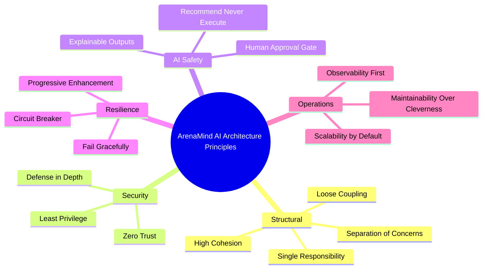

### 2.2 Principle Definitions

| #   | Principle                           | Architectural Expression                                                                                                                                                                                                                                                                      |
| --- | ----------------------------------- | --------------------------------------------------------------------------------------------------------------------------------------------------------------------------------------------------------------------------------------------------------------------------------------------- |
| P01 | **Single Responsibility**           | Each module (Crowd, Incidents, Resources, Transport, Reports, Command Center) owns exactly one operational domain. No cross-domain business logic exists inside a module.                                                                                                                     |
| P02 | **Loose Coupling**                  | Modules communicate via shared data layer (Supabase) and typed API contracts. No module imports another module's internal components.                                                                                                                                                         |
| P03 | **High Cohesion**                   | All related functionality for a domain (UI, hooks, services, validators, prompts) lives in a single directory. Moving a module must require touching only its directory.                                                                                                                      |
| P04 | **Separation of Concerns**          | Rendering logic (React), data fetching (TanStack Query), business logic (service layer), and data persistence (Supabase) are strictly separated. No component performs data transformation beyond rendering.                                                                                  |
| P05 | **Defense in Depth**                | Authorization is enforced at three independent layers: database (RLS), server (Route Handler guards), and client (conditional rendering). Defeating any single layer does not compromise the system.                                                                                          |
| P06 | **Zero Trust**                      | No component trusts another component's identity claim implicitly. Every Route Handler re-validates the session cookie. RLS validates `auth.uid()` independently of any application claim.                                                                                                    |
| P07 | **Least Privilege**                 | The Supabase anon key cannot write to operational tables (RLS prevents it). The Gemini API key is accessible only to Route Handler code running server-side. Each user role has the minimum permissions required for their function.                                                          |
| P08 | **AI Safety — Human Approval**      | The AI pipeline has exactly two write operations permitted: (1) INSERT into `ai_recommendations` (its own audit table), and (2) UPDATE `ai_recommendations.action_taken` after human decision. All other write paths require a human-initiated action through a separate Route Handler.       |
| P09 | **Fail Gracefully**                 | Every AI-powered UI section renders a meaningful fallback state when Gemini is unavailable. No module page crashes; each has an error boundary. Realtime disconnection falls back to polling without user-visible failure.                                                                    |
| P10 | **Observability First**             | Every Route Handler emits a structured log event. Every AI call logs to `ai_call_logs`. Every authentication event is audited. No significant system event occurs without a corresponding log record.                                                                                         |
| P11 | **Scalability**                     | Stateless serverless functions scale horizontally by default. Database connections are pooled via pgbouncer. Realtime subscriptions are scoped to match-level channels (not global). AI rate limiting is enforced per stadium-match pair.                                                     |
| P12 | **Maintainability Over Cleverness** | Prompt templates are version-tagged TypeScript constants. Scoring weights are configuration files. Alert thresholds are configuration files. No magic numbers exist in business logic.                                                                                                        |
| P13 | **Progressive Enhancement**         | Core operational data (incident list, crowd density, resource status) is server-rendered and functional without JavaScript. AI-enriched features layer on top. The system is useful even if client-side JavaScript fails to hydrate.                                                          |
| P14 | **Recommend, Never Execute**        | This principle is enforced architecturally, not just by convention. The AI layer has no code path that can write to `incidents`, `resources`, `matches`, or any operational table. The only mechanism to mutate operational state is a human-triggered `fetch()` to a mutation Route Handler. |

---

## 3. C4 Architecture Model

### 3.1 Level 1 — System Context Diagram

> Shows ArenaMind AI as a black box and its external actors and systems.

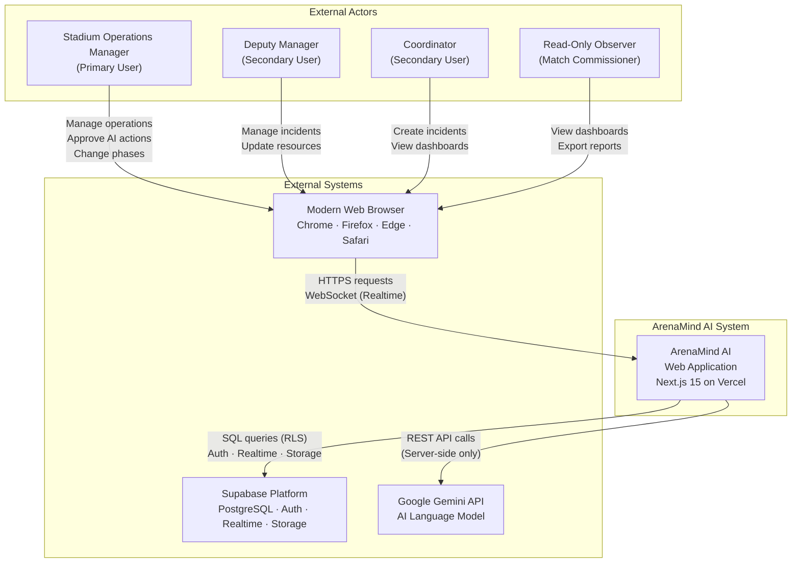

**Boundary analysis:**

- ArenaMind AI has **zero direct integration** with physical stadium hardware (sensors, turnstiles, CCTV). These are future-phase integrations.
- The Gemini API is exclusively called from the server boundary — **no browser-to-Gemini direct calls** exist.
- Supabase Realtime creates a persistent WebSocket from the browser to Supabase directly — this is the only client-to-infrastructure direct connection outside the Next.js application.

---

### 3.2 Level 2 — Container Diagram

> Shows the major deployable/runnable units that make up ArenaMind AI.

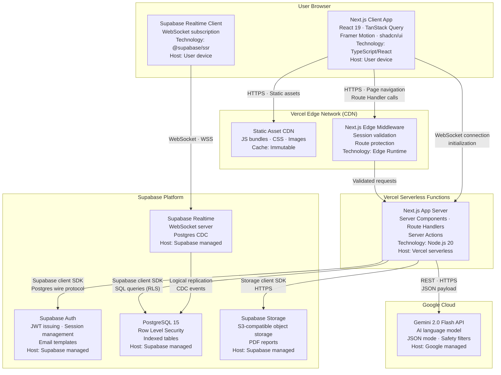

---

### 3.3 Level 3 — Component Diagram: AI Command Center Module

> Shows the internal components of the highest-value module.

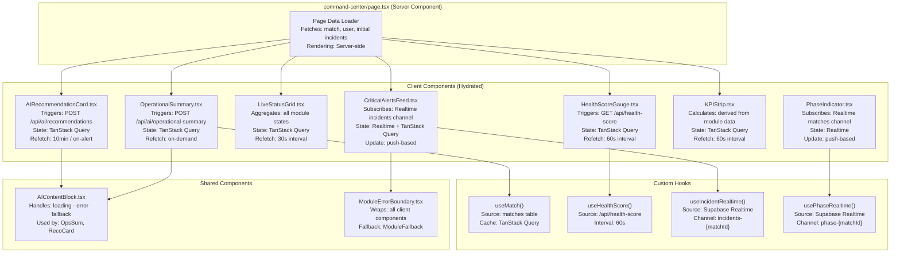

---

### 3.4 Level 3 — Component Diagram: AI Layer

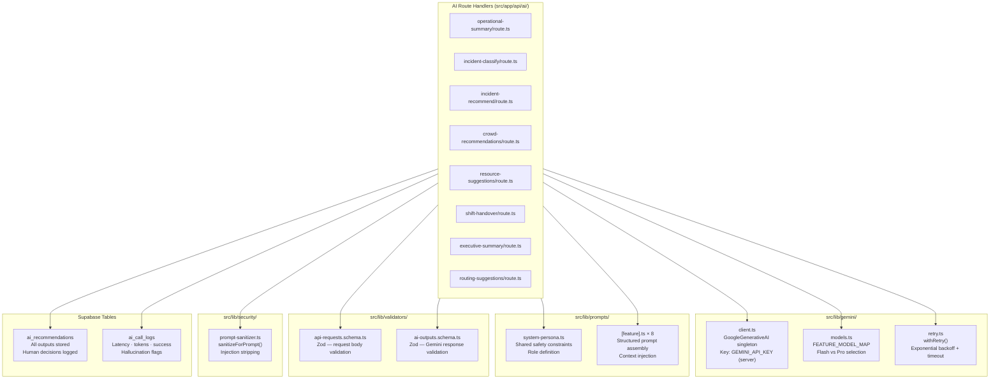

---

### 3.5 Level 4 — Code-Level Diagram: Route Handler Internal Architecture

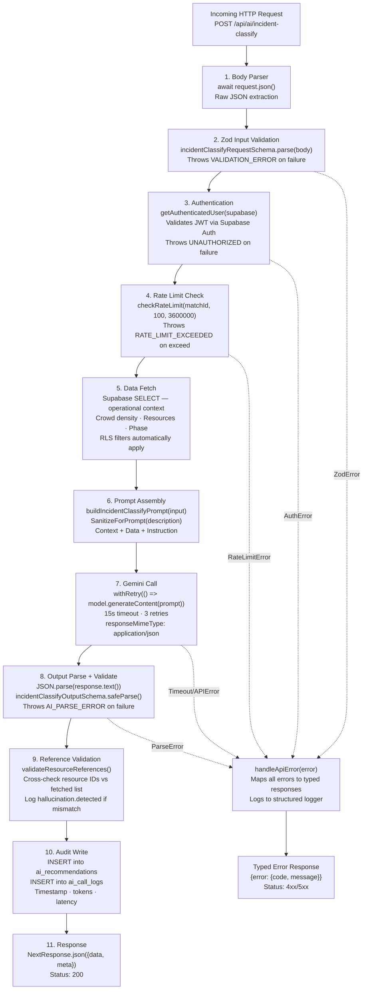

---

## 4. High-Level System Architecture

### 4.1 Six-Layer Architecture View

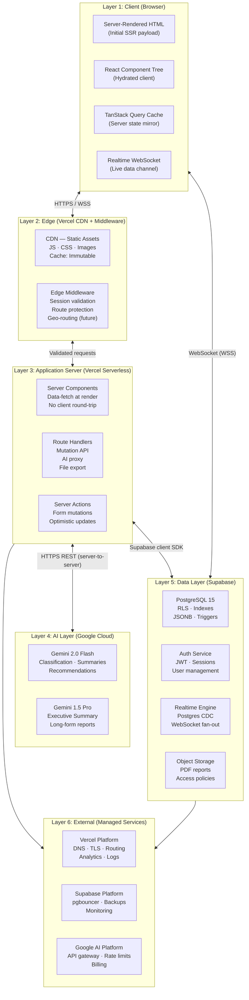

### 4.2 Technology Stack per Layer

| Layer          | Technology                                                        | Host                           | Scaling Model             |
| -------------- | ----------------------------------------------------------------- | ------------------------------ | ------------------------- |
| Client         | React 19, TanStack Query, Framer Motion, shadcn/ui                | User browser                   | N/A                       |
| Edge           | Vercel Edge Network, Next.js Middleware (Edge Runtime)            | Vercel PoP (200+ locations)    | Automatic CDN replication |
| Application    | Next.js 15, Server Components, Route Handlers, Server Actions     | Vercel Serverless (Node.js 20) | Serverless auto-scale     |
| AI             | Gemini 2.0 Flash, Gemini 1.5 Pro                                  | Google Cloud                   | Managed by Google         |
| Data           | PostgreSQL 15, Supabase Realtime, Supabase Auth, Supabase Storage | Supabase managed cloud         | Supabase platform-managed |
| Infrastructure | Vercel platform, Supabase platform, Google AI platform            | Multi-cloud managed            | Platform-managed          |

---

## 5. Application Architecture

### 5.1 Seven-Layer Application Architecture

```mermaid
graph LR
    subgraph Presentation["Presentation Layer\n(React Components)"]
        Pages["Pages\n6 module pages"]
        Components["Components\nUI primitives + domain"]
        Layouts["Layouts\nDashboard shell"]
    end

    subgraph ServerLayer["Server Layer\n(Next.js Server)"]
        SC["Server Components\nSSR data fetch"]
        RH["Route Handlers\nAPI endpoints"]
        SA["Server Actions\nForm mutations"]
        MW["Middleware\nAuth + routing"]
    end

    subgraph BusinessLayer["Business Logic Layer\n(Service Layer)"]
        IncidentSvc["incident.service"]
        ResourceSvc["resource.service"]
        CrowdSvc["crowd.service"]
        HealthSvc["health-score.service"]
        PhaseSvc["phase.service"]
        ReportSvc["report.service"]
        AccessSvc["accessibility.service"]
    end

    subgraph AILayer["AI Layer\n(Gemini Pipeline)"]
        PromptBuilder["Prompt Builders\n8 templates"]
        ContextBuilder["Context Builder\nData aggregator"]
        SafetyLayer["Safety Layer\nSanitization + validation"]
        GeminiProxy["Gemini Proxy\nRetry + timeout"]
        OutputValidator["Output Validator\nZod schemas"]
        AuditLogger["Audit Logger\nai_recommendations"]
    end

    subgraph DataAccessLayer["Data Access Layer\n(Supabase SDK)"]
        SupaClient["Supabase Server Client\nPer-request instance"]
        QueryBuilder["Query Builder\nTyped Postgres queries"]
        RLSEnforcer["RLS Enforcer\nAutomatic (DB-level)"]
        RTSubscriber["Realtime Subscriber\nBrowser client"]
    end

    subgraph InfraLayer["Infrastructure Layer\n(Platform Services)"]
        AuthPlatform["Supabase Auth\nJWT management"]
        DBPlatform["PostgreSQL 15\nIndexes + triggers"]
        RTPlatform["Supabase Realtime\nCDC + WebSocket"]
        StoragePlatform["Supabase Storage\nObject store"]
    end

    subgraph ExternalLayer["External Services Layer"]
        GeminiAPI["Gemini API\ngoogle.generativeai"]
        VercelPlatform["Vercel\nDeploy + CDN + Logs"]
    end

    Presentation <--> ServerLayer
    ServerLayer <--> BusinessLayer
    BusinessLayer <--> AILayer
    BusinessLayer <--> DataAccessLayer
    AILayer <--> DataAccessLayer
    DataAccessLayer <--> InfraLayer
    AILayer <--> ExternalLayer
    InfraLayer <--> ExternalLayer
```

### 5.2 Module Boundary Architecture

Each of the 6 product modules is architecturally isolated. The following rules enforce module boundaries:

```mermaid
graph TD
    subgraph Rule["Module Boundary Rules"]
        R1["Rule 1: No cross-module component imports\ncommand-center CANNOT import from incidents/"]
        R2["Rule 2: Shared UI lives in components/shared/\nNot in any module directory"]
        R3["Rule 3: Shared hooks live in hooks/\nWith module-scoped data fetching"]
        R4["Rule 4: API routes are module-scoped\n/api/incidents/** owns incident data"]
        R5["Rule 5: AI prompts are feature-scoped\nOne prompt template per AI feature"]
    end

    subgraph Modules["Module Isolation"]
        M1["command-center/\nOwns: health score, AI summary, KPIs"]
        M2["crowd-intelligence/\nOwns: crowd density, prediction, queues"]
        M3["incidents/\nOwns: incident CRUD, AI classification"]
        M4["resources/\nOwns: resource status, deployment, AI suggestions"]
        M5["transportation/\nOwns: parking, shuttles, accessibility"]
        M6["reports/\nOwns: analytics, AI summary, PDF export"]
    end

    subgraph SharedBoundary["Shared Infrastructure (Cross-Module)"]
        SharedUI["components/shared/\nAIContentBlock · ErrorBoundary · LoadingSkeleton"]
        SharedLib["lib/\nsupabase/ · auth/ · prompts/ · validators/"]
        SharedTypes["types/\nDomain types · Database types"]
        SharedConfig["config/\nScoring · Thresholds · Phases"]
    end

    Modules --> SharedBoundary
    Rule -.->|"Enforced by ESLint + code review"| Modules
```

---

## 6. Request Lifecycle

### 6.1 Standard Server-Rendered Page Load

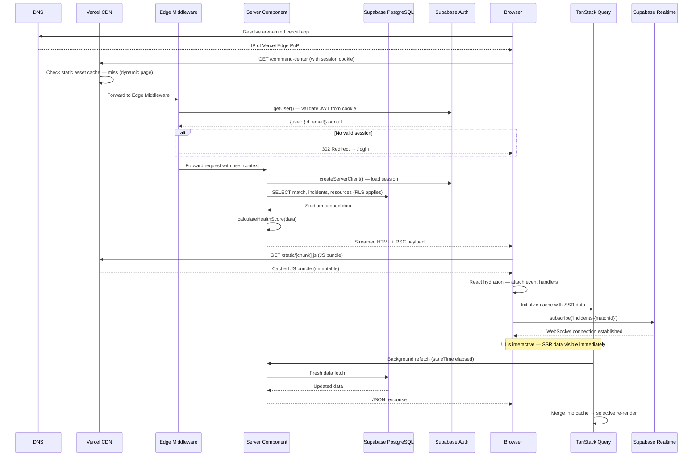

### 6.2 AI Feature Request Lifecycle

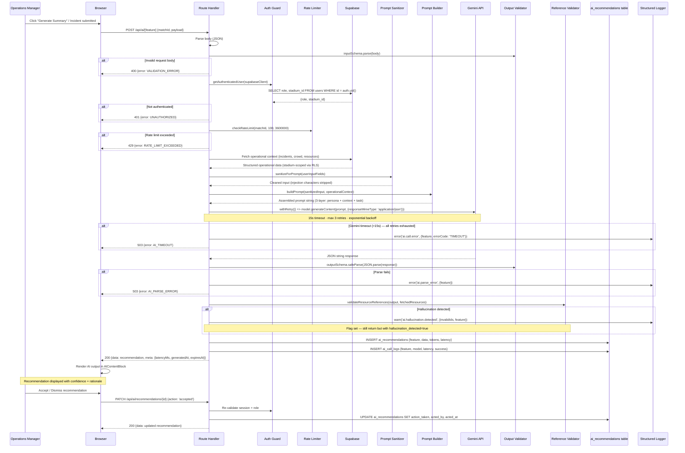

### 6.3 Realtime Push Update Lifecycle

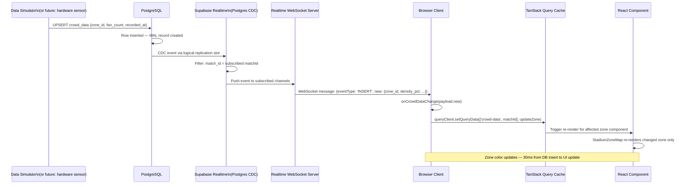

### 6.4 Mutation via Server Action Lifecycle

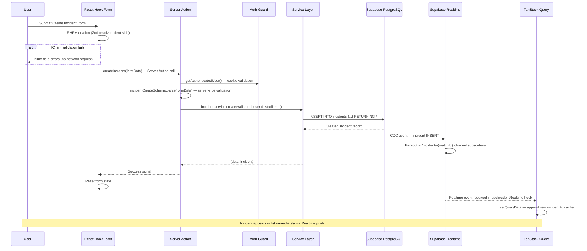

---

## 7. Authentication Architecture

### 7.1 Complete Authentication Flow

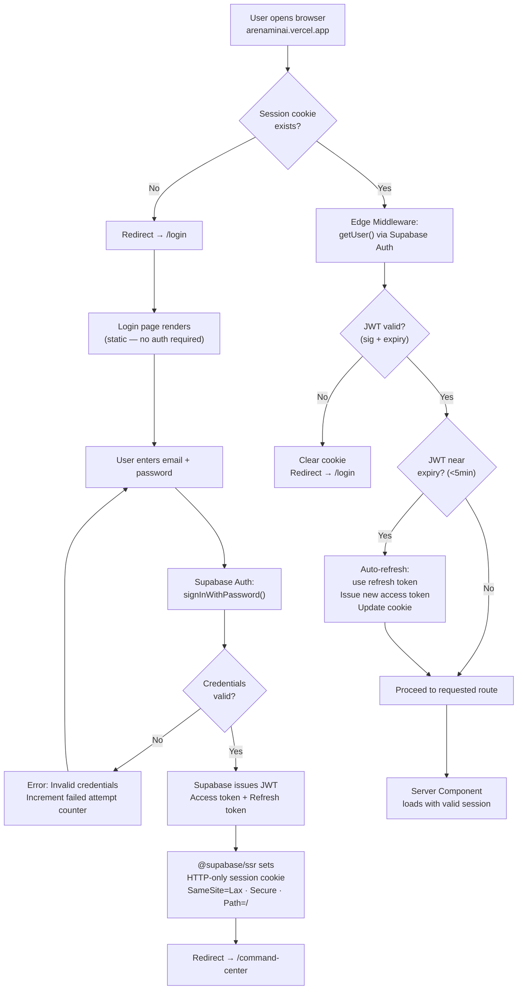

### 7.2 JWT Token Architecture

```mermaid
graph LR
    subgraph JWTStructure["JWT Token Structure (Supabase)"]
        Header["Header\nalg: HS256\ntyp: JWT"]
        Payload["Payload\nsub: user_id (UUID)\nemail: user@email.com\nrole: authenticated\nstadium_id: (from metadata)\nexp: now + 8 hours\niat: issued_at"]
        Signature["Signature\nHMAC-SHA256\n(Supabase JWT secret)"]
    end

    subgraph CookieConfig["Cookie Configuration"]
        Name["Name: sb-{project-ref}-auth-token"]
        HTTPOnly["HttpOnly: true\n(no JS access)"]
        Secure["Secure: true\n(HTTPS only)"]
        SameSite["SameSite: Lax\n(CSRF protection)"]
        Path["Path: /\n(all routes)"]
        MaxAge["Max-Age: 28800s\n(8 hours)"]
    end

    subgraph ServerValidation["Server-Side Validation"]
        MW["Middleware\ngetUser() → validate JWT sig"]
        SC["Server Component\ncreateServerClient() → read session"]
        RH["Route Handler\ncreateServerClient() → read session"]
    end

    JWTStructure --> CookieConfig
    CookieConfig --> ServerValidation
```

### 7.3 Session Expiry and Refresh Architecture

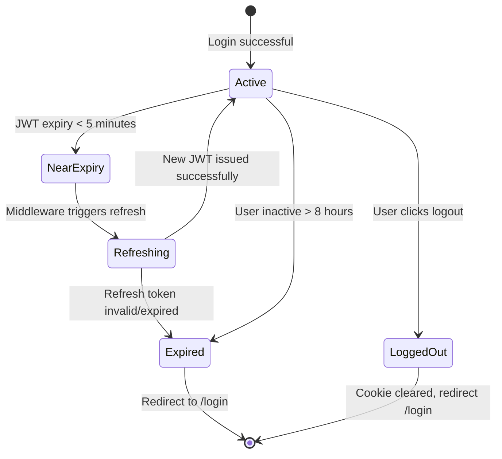

---

## 8. Authorization Architecture

### 8.1 Three-Layer Authorization Flow

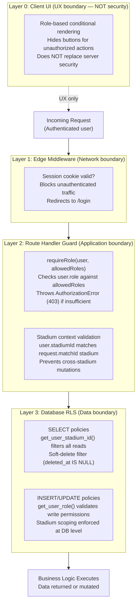

### 8.2 Role Permission Flow

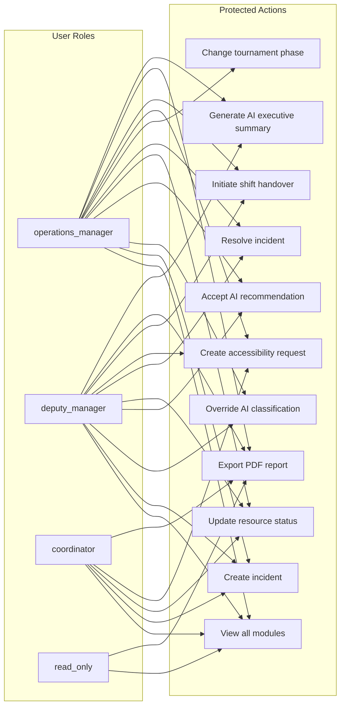

### 8.3 RLS Enforcement Architecture

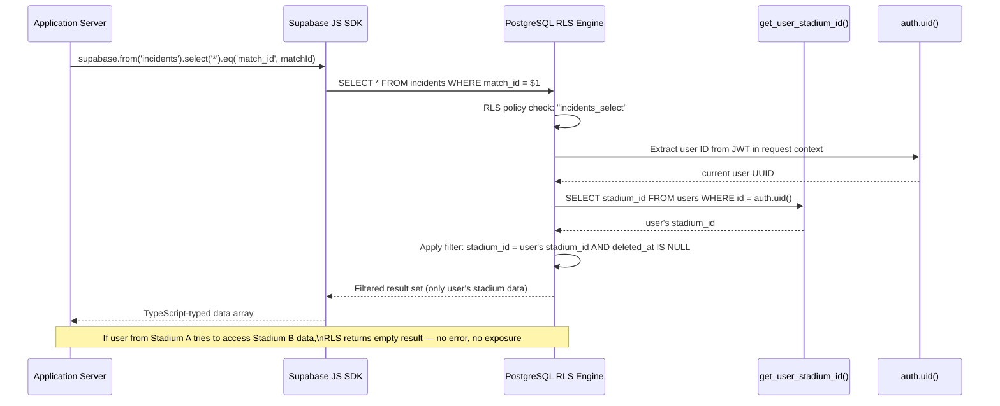

---

## 9. AI System Architecture

### 9.1 AI System Overview

```mermaid
graph TB
    subgraph Input["Input Layer"]
        UserAction["User Action\n(incident submit, button click)"]
        OperationalData["Operational Data\n(from Supabase)"]
        PhaseContext["Phase Context\n(current tournament phase)"]
    end

    subgraph ContextBuilder["Context Builder"]
        DataAggregator["Data Aggregator\nFetch crowd + incidents + resources\nSingle batched Supabase query"]
        DataSerializer["Data Serializer\nConvert to structured JSON\nCalculate derived metrics"]
        ContextPackage["Context Package\n{stadium, match, phase, weather,\nincidents, crowd, resources}"]
    end

    subgraph SafetyLayer["Safety Layer"]
        InputSanitizer["Input Sanitizer\nsanitizeForPrompt()\nInjection character removal\nLength truncation (1000 chars)"]
        SafetySettings["Gemini Safety Settings\nHARM_CATEGORY_DANGEROUS_CONTENT: BLOCK_MEDIUM\nHARM_CATEGORY_HARASSMENT: BLOCK_LOW\nHARM_CATEGORY_HATE_SPEECH: BLOCK_LOW"]
    end

    subgraph PromptLayer["Prompt Assembly Layer"]
        PersonaLayer["System Persona\nRole definition\nSafety constraints\nOperational language rules"]
        ContextLayer["Operational Context\nMatch · Stadium · Phase\nWeather · Time"]
        TaskLayer["Feature-Specific Task\nData payload\nOutput schema definition\nFormat instructions"]
    end

    subgraph ExecutionLayer["Execution Layer"]
        ModelSelector["Model Selector\nFEATURE_MODEL_MAP\nFlash vs Pro"]
        RetryEngine["Retry Engine\nwithRetry()\n3 attempts · exponential backoff\n15s timeout"]
        GeminiCall["Gemini API Call\ngenerateContent()\nresponseMimeType: application/json"]
    end

    subgraph ValidationLayer["Output Validation Layer"]
        JSONParser["JSON Parser\nJSON.parse(response.text())"]
        ZodValidator["Zod Schema Validator\noutputSchema.safeParse()"]
        ReferenceValidator["Reference Validator\nvalidateResourceReferences()\nvalidateZoneReferences()"]
        HallucinationDetector["Hallucination Detector\nCross-check AI output IDs\nvs fetched data IDs"]
    end

    subgraph HumanApprovalLayer["Human Approval Layer"]
        RecommendationDisplay["Recommendation Display\nText · Confidence · Rationale\nAction buttons: Accept/Dismiss"]
        ApprovalGate["Approval Gate\nHuman must click Accept/Dismiss\nAI cannot self-approve"]
        ConsequenceAction["Consequence Action\nSeparate Route Handler\nRequires role validation\nUpdates operational tables"]
    end

    subgraph AuditLayer["Audit Layer"]
        RecommendationStore["ai_recommendations INSERT\nAll AI outputs stored\nWith prompt_version"]
        CallLogStore["ai_call_logs INSERT\nLatency · tokens · success\nHallucination flag"]
        HumanDecisionUpdate["ai_recommendations UPDATE\naction_taken · acted_by · acted_at\nOn human decision"]
    end

    Input --> ContextBuilder
    ContextBuilder --> SafetyLayer
    SafetyLayer --> PromptLayer
    PromptLayer --> ExecutionLayer
    ExecutionLayer --> ValidationLayer
    ValidationLayer --> HumanApprovalLayer
    HumanApprovalLayer --> AuditLayer
```

### 9.2 AI Feature Mapping

| Feature                 | Module         | Model   | Input Complexity                   | Output Complexity              | Human Action            |
| ----------------------- | -------------- | ------- | ---------------------------------- | ------------------------------ | ----------------------- |
| Operational Summary     | Command Center | Flash   | High (multi-domain)                | Medium (narrative + tags)      | Acknowledge/Regenerate  |
| Incident Classification | Incidents      | Flash   | Low (text + context)               | Low (type + tier + confidence) | Override or Accept      |
| Response Recommendation | Incidents      | Flash   | Medium (incident + resources)      | High (step-by-step plan)       | Accept/Dispatch/Dismiss |
| Crowd Recommendations   | Crowd Intel    | Flash   | Medium (crowd data + phase)        | Medium (action list)           | Accept/Dismiss          |
| Resource Suggestions    | Resources      | Flash   | Medium (resource + crowd matrix)   | Medium (redeployment list)     | Accept/Dismiss          |
| Routing Suggestions     | Transportation | Flash   | Medium (transport + accessibility) | Medium (routing narrative)     | Accept/Dismiss          |
| Shift Handover Summary  | Command Center | Flash   | High (full shift data)             | High (structured document)     | Review/Annotate         |
| Executive Summary       | Reports        | **Pro** | Very High (entire match day)       | Very High (800-word report)    | Review/Edit/Export      |

### 9.3 Human Approval Gate Architecture

```mermaid
graph TD
    AIOutput["AI Recommendation\nStored in ai_recommendations\nExpires in 15 minutes"]

    AIOutput --> Display["Display in UI\nAIRecommendationCard\nwith Accept / Dismiss buttons"]

    Display --> HumanDecision{"Human\nDecision"}

    HumanDecision -->|"Accept (PATCH /api/ai/recommendations/{id})"| ApproveFlow
    HumanDecision -->|"Dismiss (PATCH /api/ai/recommendations/{id})"| DismissFlow
    HumanDecision -->|"Ignore (15 min elapsed)"| ExpireFlow

    subgraph ApproveFlow["Approval Flow"]
        AuthCheck["Re-validate role:\noperations_manager / deputy_manager"]
        UpdateRec["UPDATE ai_recommendations\naction_taken = 'accepted'\nacted_by = userId\nacted_at = now()"]
        TriggerAction["Trigger consequence action\n(e.g., resource redeployment\nrequires SEPARATE form submission)"]
    end

    subgraph DismissFlow["Dismissal Flow"]
        DismissUpdate["UPDATE ai_recommendations\naction_taken = 'dismissed'\ndismiss_reason = optional text"]
    end

    subgraph ExpireFlow["Expiry Flow"]
        MarkExpired["Scheduled job (future) OR\non next fetch: filter expires_at < now()\nMark as 'expired'"]
    end

    Note["ARCHITECTURAL CONSTRAINT:\nAccepting a recommendation does NOT\nautomatically change any operational state.\nThe manager must separately confirm\nresource moves, phase changes, etc.\nvia their respective action forms."]

    ApproveFlow -.-> Note
```

---

## 10. Prompt Execution Pipeline

### 10.1 Complete Prompt Pipeline

```mermaid
flowchart TD
    T0["Trigger Event\n(User action or timer)"]

    subgraph Step1["Step 1: Input Validation"]
        IV["Zod inputSchema.parse(requestBody)\nRejects malformed requests before any DB access"]
    end

    subgraph Step2["Step 2: Authentication & Authorization"]
        AA["getAuthenticatedUser(supabase)\nrequireRole(user, allowedRoles)\ncheckRateLimit(matchId, 100/hr)"]
    end

    subgraph Step3["Step 3: Operational Context Fetch"]
        CF["Single batched Supabase query\nSELECT: match + crowd + incidents + resources + phase\nRLS automatically scopes to user's stadium"]
    end

    subgraph Step4["Step 4: Context Serialization"]
        CS["Transform raw DB rows to prompt-ready JSON\nCalculate derived metrics (density%, coverage%)\nAggregate counts (tier1Count, avgDensity)"]
    end

    subgraph Step5["Step 5: Input Sanitization"]
        IS["sanitizeForPrompt(userInputFields)\nStrip injection tokens (INST, ChatML, code blocks)\nTruncate to 1000 characters"]
    end

    subgraph Step6["Step 6: Prompt Assembly"]
        PA["Layer 1: SYSTEM_PERSONA (constant)\nLayer 2: Operational Context (per request)\nLayer 3: Task + Data + Output Schema (per feature)"]
    end

    subgraph Step7["Step 7: Model Selection & Execution"]
        ME["FEATURE_MODEL_MAP[feature]\nwithRetry(() => model.generateContent(prompt))\nresponseMimeType: 'application/json'\n15s timeout · 3 attempts"]
    end

    subgraph Step8["Step 8: Output Validation"]
        OV["JSON.parse(response.text())\noutputSchema.safeParse(parsed)\nvalidateResourceReferences(output, fetchedResources)\nLog hallucination if detected"]
    end

    subgraph Step9["Step 9: Audit Storage"]
        AS["INSERT ai_recommendations {feature, data, promptVersion, tokens, latency}\nINSERT ai_call_logs {model, latency, success, validationPassed, hallucinationDetected}"]
    end

    subgraph Step10["Step 10: Response Delivery"]
        RD["NextResponse.json({data: recommendation, meta: {latencyMs, generatedAt, expiresAt}})\nStatus: 200"]
    end

    T0 --> Step1 --> Step2 --> Step3 --> Step4 --> Step5 --> Step6 --> Step7 --> Step8 --> Step9 --> Step10

    Step1 -.->|"ZodError → 400"| ErrorExit["handleApiError()\nTyped error response"]
    Step2 -.->|"AuthError/RateLimit → 401/403/429"| ErrorExit
    Step7 -.->|"Timeout/APIError → 503"| ErrorExit
    Step8 -.->|"ParseError → 503"| ErrorExit
```

### 10.2 Prompt Version Control Flow

```mermaid
graph LR
    subgraph Development["Development Phase"]
        PV1["PROMPT_VERSION = 'feature-v1.0'\nexported from prompts/feature.ts"]
        CodeReview["Code Review\nPrompt change requires\nexplicit reviewer approval"]
        Deploy["Deploy to production\nVersion string in codebase"]
    end

    subgraph Runtime["Runtime Phase"]
        StoreVersion["ai_recommendations.prompt_version\n= 'feature-v1.0'\nStored with every output"]
        AuditQuery["SELECT * FROM ai_recommendations\nWHERE prompt_version = 'feature-v1.0'\nAnalyze acceptance rate"]
    end

    subgraph Iteration["Iteration Phase"]
        Analyze["Analyze acceptance rate\nby prompt version\nIdentify underperforming prompts"]
        Increment["Increment version:\n'feature-v1.0' → 'feature-v1.1'\nUpdate prompt template"]
        Compare["A/B compare:\naccept_rate by version\nhallucinationRate by version"]
    end

    Development --> Runtime
    Runtime --> Iteration
    Iteration --> Development
```

---

## 11. Data Flow Architecture

### 11.1 Complete Data Flow Diagram

```mermaid
graph TD
    subgraph DataSources["Data Sources"]
        SimData["Simulation Data\n(crowd_data, queue_data inserts)\nSource: scripts/simulate.ts"]
        UserInput["User Input\n(incident form, resource update)\nSource: React forms"]
        AIOutput["AI Output\n(ai_recommendations)\nSource: Gemini API via Route Handler"]
        SysEvents["System Events\n(phase transitions, auth events)\nSource: Server Actions"]
    end

    subgraph ValidationPoints["Validation Points (V)"]
        V1["V1: Client-side Zod\n(React Hook Form resolver)\nPrevents bad form submissions"]
        V2["V2: Server-side Zod\n(Route Handler)\nPrevents bad API payloads"]
        V3["V3: DB Constraints\n(CHECK, NOT NULL, FK)\nLast-line structural validation"]
        V4["V4: RLS Policies\n(Supabase PostgreSQL)\nData access scoping"]
        V5["V5: Zod Output Schema\n(AI response parsing)\nPrevents malformed AI data"]
    end

    subgraph PersistenceLayer["Persistence Layer (Supabase PostgreSQL)"]
        OperationalTables["Operational Tables\nincidents · resources · crowd_data\nqueue_data · accessibility_requests"]
        AITables["AI Audit Tables\nai_recommendations · ai_call_logs"]
        ConfigTables["Configuration Tables\nstadiums · matches · users"]
        TransitionTables["Transition Tables\nphase_transitions · incident_actions"]
    end

    subgraph CachingPoints["Caching Points (C)"]
        C1["C1: Vercel CDN\nStatic assets — immutable"]
        C2["C2: TanStack Query Cache\nServer state — staleTime per query"]
        C3["C3: React Server Component Cache\n(per-request) — no-store for operational data"]
    end

    subgraph LoggingPoints["Logging Points (L)"]
        L1["L1: Route Handler Logger\nEvery API call: event, userId, latency"]
        L2["L2: AI Call Logger\nEvery Gemini call: tokens, latency, success"]
        L3["L3: Supabase Auth Logs\nEvery auth event: login, logout, failed"]
        L4["L4: Audit Log Table\nEvery state mutation: who, what, when"]
    end

    subgraph ConsumptionLayer["Consumption Layer"]
        SSR["Server Component Render\nInitial page data"]
        TQRefetch["TanStack Query Refetch\nBackground refresh"]
        RealtimePush["Realtime Push\nLive updates"]
        AIContext["AI Context Fetch\nPre-prompt data load"]
    end

    DataSources --> ValidationPoints
    ValidationPoints --> PersistenceLayer
    PersistenceLayer --> CachingPoints
    PersistenceLayer --> LoggingPoints
    PersistenceLayer --> ConsumptionLayer
```

### 11.2 Data Ownership Matrix

| Table                    | Owner                | Readers           | AI Reads               | Realtime          | Write Roles                             |
| ------------------------ | -------------------- | ----------------- | ---------------------- | ----------------- | --------------------------------------- |
| `stadiums`               | System Admin         | All authenticated | ✅ (context)           | ❌                | Admin only                              |
| `matches`                | System Admin + OM    | All authenticated | ✅ (context + phase)   | ✅ (phase change) | OM only                                 |
| `users`                  | System Admin         | Self + Admin      | ❌                     | ❌                | Admin only                              |
| `incidents`              | Incident Module      | All authenticated | ✅ (context + summary) | ✅                | OM, DM, Coord                           |
| `incident_actions`       | Incident Module      | All authenticated | ❌                     | ❌                | OM, DM                                  |
| `resources`              | Resource Module      | All authenticated | ✅ (for dispatch reco) | ✅                | OM, DM, Coord                           |
| `crowd_data`             | Simulation / Sensors | All authenticated | ✅ (density context)   | ✅                | System (service role)                   |
| `queue_data`             | Simulation / Sensors | All authenticated | ✅ (queue context)     | ❌                | System (service role)                   |
| `accessibility_requests` | Transport Module     | All authenticated | ✅ (routing context)   | ✅                | OM, DM, Coord                           |
| `ai_recommendations`     | AI Layer             | All authenticated | Self-write only        | ❌                | AI service role + OM/DM (update action) |
| `ai_call_logs`           | AI Layer             | Admin/Monitoring  | ❌                     | ❌                | AI service role                         |
| `phase_transitions`      | Phase Module         | All authenticated | ❌                     | ❌                | OM only                                 |

---

## 12. Event Flow Architecture

### 12.1 Incident Created — Event Flow

```mermaid
graph LR
    E1["User submits\nCreate Incident form"]
    E2["Client: RHF validates\n(Zod resolver)"]
    E3["Server Action:\nincident.service.create()"]
    E4["DB: INSERT incidents\n(with ai_classification=NULL)"]
    E5["DB: Realtime CDC\nincident INSERT event"]
    E6["Route Handler:\nPOST /api/ai/incident-classify"]
    E7["Gemini: Classification\n(type, tier, confidence)"]
    E8["DB: UPDATE incidents\nSET ai_classification, ai_confidence"]
    E9["Route Handler:\nPOST /api/ai/incident-recommend"]
    E10["Gemini: Response recommendation\n(step-by-step plan)"]
    E11["DB: INSERT ai_recommendations\n(incident response plan)"]
    E12["Realtime: Push to\n'incidents-{matchId}' channel"]
    E13["Browser: New incident\nappears in IncidentList"]
    E14["Command Center:\nCriticalAlertsFeed updates\n(if Tier 1 or 2)"]
    E15["KPIStrip:\nOpen incident count updates"]

    E1 --> E2 --> E3 --> E4 --> E5
    E3 --> E6 --> E7 --> E8
    E6 --> E9 --> E10 --> E11
    E5 --> E12 --> E13 --> E14
    E13 --> E15
```

### 12.2 AI Recommendation Accepted — Event Flow

```mermaid
graph LR
    A1["Manager clicks\n'Accept' on recommendation"]
    A2["PATCH /api/ai/recommendations/{id}\n{action: 'accepted'}"]
    A3["Auth guard:\nrequireRole(OM or DM)"]
    A4["DB: UPDATE ai_recommendations\naction_taken='accepted'\nacted_by=userId\nacted_at=now()"]
    A5["Logger: info('ai_recommendation.accepted')\n{feature, recommendationId, userId}"]
    A6["UI: Recommendation card\nshows 'Accepted' badge\nAccept button disabled"]
    A7["Manager performs\nconsequence action separately\n(e.g., resource form submit)"]

    A1 --> A2 --> A3 --> A4
    A4 --> A5
    A4 --> A6
    A6 --> A7

    Note["ARCHITECTURAL NOTE:\nAcceptance updates ONLY the audit record.\nThe actual operational consequence (deploying resources,\nopening gates, etc.) requires the manager to take\na SEPARATE action via the appropriate module form.\nThis enforces the Human Approval principle."]
    A7 -.-> Note
```

### 12.3 Phase Transition — Event Flow

```mermaid
graph TD
    P1["Operations Manager\nchanges phase in PhaseIndicator"]
    P2["PATCH /api/matches/{id}/phase\n{currentPhase: 'match_live'}"]
    P3["Auth: requireRole(operations_manager)"]
    P4["DB: UPDATE matches\nSET current_phase = 'match_live'"]
    P5["DB: INSERT phase_transitions\n{fromPhase, toPhase, initiatedBy, notes}"]
    P6["DB: Realtime CDC\nmatches UPDATE event"]
    P7["Realtime: Push to\n'phase-{matchId}' channel"]
    P8["Browser: usePhaseRealtime\nhook receives update"]
    P9["TanStack Query:\nInvalidate all phase-dependent queries"]

    subgraph AIReactions["AI Re-generation (cascaded)"]
        P10["POST /api/ai/operational-summary\nRegenerates with new phase context"]
        P11["POST /api/ai/recommendations\nRegenerates with phase-appropriate actions"]
        P12["Config: thresholds.ts\nUpdates alert thresholds for new phase"]
    end

    P1 --> P2 --> P3 --> P4 --> P5 --> P6 --> P7 --> P8 --> P9
    P9 --> P10
    P9 --> P11
    P9 --> P12
```

### 12.4 Report Generation — Event Flow

```mermaid
graph TD
    R1["Manager clicks\n'Generate Executive Summary'"]
    R2["POST /api/ai/executive-summary\n{matchId}"]
    R3["Auth: requireRole(OM or DM)"]
    R4["report.service.aggregateMatchData(matchId)"]

    subgraph DataAggregation["Data Aggregation (Single Supabase transaction)"]
        R4a["SELECT all incidents (all tiers, all statuses)"]
        R4b["SELECT crowd_data time-series\n(aggregated: avg, peak, by zone)"]
        R4c["SELECT resources with deployment changes"]
        R4d["SELECT ai_recommendations log\n(accepted/dismissed rates)"]
        R4e["SELECT phase_transitions timeline"]
        R4f["SELECT accessibility_requests log"]
    end

    R5["Serialize to comprehensive JSON payload\n~3000-5000 tokens of context"]
    R6["Gemini 1.5 Pro:\ngenerateContent(executiveSummaryPrompt)\nOutput: 500-800 word report"]
    R7["Zod: executiveSummaryOutputSchema.parse()"]
    R8["DB: INSERT ai_recommendations\n(executive summary stored)"]
    R9["Manager reviews + optionally edits"]
    R10["Click 'Export PDF'"]
    R11["POST /api/reports/export\n{matchId, summary, format: 'pdf'}"]
    R12["pdf/generator.ts:\nGenerate formatted PDF\nWith branding + data tables"]
    R13["Supabase Storage:\nUpload PDF to 'reports/{matchId}.pdf'\nWith stadium-scoped access policy"]
    R14["Signed URL returned\nBrowser initiates download"]

    R1 --> R2 --> R3 --> R4
    R4 --> R4a & R4b & R4c & R4d & R4e & R4f
    R4a & R4b & R4c & R4d & R4e & R4f --> R5
    R5 --> R6 --> R7 --> R8 --> R9 --> R10 --> R11 --> R12 --> R13 --> R14
```

### 12.5 Shift Handover — Event Flow

```mermaid
graph LR
    H1["Manager clicks\n'Initiate Shift Handover'"]
    H2["ShiftHandoverModal opens\n(Client Component)"]
    H3["POST /api/ai/shift-handover\n{matchId, shiftStartTime}"]
    H4["Auth: requireRole(OM or DM)"]
    H5["Fetch full shift data:\nIncidents + Actions + Resources\nChanges + AI Recommendation log\nAccessibility requests"]
    H6["Gemini Flash:\nbuildShiftHandoverPrompt(shiftData)\nOutputs structured handover document"]
    H7["Zod: shiftHandoverOutputSchema.parse()"]
    H8["Display in ShiftHandoverModal\nWith section: Incidents · Crowd ·\nResources · Open Items · Priorities"]
    H9["Manager reviews\nOptionally annotates sections"]
    H10["Click 'Complete Handover'"]
    H11["DB: INSERT ai_recommendations\n(handover document stored)\naction_taken = 'accepted'"]
    H12["Incoming shift manager\nViews handover on their device"]

    H1 --> H2 --> H3 --> H4 --> H5 --> H6 --> H7 --> H8 --> H9 --> H10 --> H11 --> H12
```

---

## 13. Realtime Architecture

### 13.1 Supabase Realtime System Architecture

```mermaid
graph TB
    subgraph PostgreSQL["PostgreSQL 15 (Supabase Managed)"]
        WAL["Write-Ahead Log (WAL)\nLogical replication slot\nCaptures all INSERT/UPDATE/DELETE"]
        Tables["Realtime-enabled Tables\ncrowd_data · incidents · resources\naccessibility_requests · matches"]
    end

    subgraph RealtimeEngine["Supabase Realtime Engine"]
        CDCConsumer["CDC Consumer\nConsumes WAL events\nFilters by subscribed table + row filter"]
        ChannelRouter["Channel Router\nRoutes events to matching channels\ne.g., 'incidents-{matchId}'"]
        AuthFilter["Auth Filter\nValidates subscriber JWT\nApplies RLS to push events"]
        WSServer["WebSocket Server\nMaintains persistent connections\nFan-out to subscribers"]
    end

    subgraph BrowserClient["Browser Client (per active user)"]
        SupabaseClient["createBrowserClient()\n(@supabase/ssr)"]
        Channel1["channel('crowd-{matchId}')\nFilter: match_id=eq.{matchId}"]
        Channel2["channel('incidents-{matchId}')\nFilter: match_id=eq.{matchId}"]
        Channel3["channel('phase-{matchId}')\nFilter: id=eq.{matchId}"]
        Channel4["channel('resources-{matchId}')\nFilter: match_id=eq.{matchId}"]
        Channel5["channel('accessibility-{matchId}')\nFilter: match_id=eq.{matchId}"]
        TQIntegration["queryClient.setQueryData()\nMerge push events into TanStack cache\nTrigger selective React re-renders"]
    end

    WAL --> CDCConsumer
    CDCConsumer --> ChannelRouter
    ChannelRouter --> AuthFilter
    AuthFilter --> WSServer
    WSServer <-->|"WSS"| SupabaseClient
    SupabaseClient --> Channel1 & Channel2 & Channel3 & Channel4 & Channel5
    Channel1 & Channel2 & Channel3 & Channel4 & Channel5 --> TQIntegration
```

### 13.2 Realtime Reconnection Architecture

```mermaid
stateDiagram-v2
    [*] --> Connecting: Component mounts\nsupabase.channel().subscribe()

    Connecting --> Connected: WebSocket handshake successful
    Connecting --> Reconnecting: Connection refused (network)

    Connected --> Active: Subscription confirmed
    Active --> DataReceiving: Events arriving
    DataReceiving --> Active: Event processed → cache updated

    Active --> Dropped: Network interruption\nWebSocket closed
    DataReceiving --> Dropped: Message delivery failure

    Dropped --> Reconnecting: Auto-reconnect triggered
    Reconnecting --> BackoffWait1: Attempt 1 fails → wait 1s
    BackoffWait1 --> BackoffWait2: Attempt 2 fails → wait 2s
    BackoffWait2 --> BackoffWait4: Attempt 3 fails → wait 4s
    BackoffWait4 --> BackoffWait8: Attempt 4 fails → wait 8s
    BackoffWait8 --> BackoffWait30: Attempt 5+ fails → wait 30s (max)

    BackoffWait1 --> Connecting: Retry
    BackoffWait2 --> Connecting: Retry
    BackoffWait4 --> Connecting: Retry
    BackoffWait8 --> Connecting: Retry
    BackoffWait30 --> Connecting: Retry

    Connected --> Polling: Reconnect failed after 5 attempts\nFallback: REST polling every 30s
    Polling --> Active: WebSocket re-established
    Polling --> Polling: Continue polling (degraded mode)

    Active --> [*]: Component unmounts\nsupabase.removeChannel()
```

### 13.3 Polling Fallback Architecture

When Realtime is unavailable, TanStack Query's `refetchInterval` acts as the fallback:

```mermaid
graph LR
    subgraph Normal["Normal Mode (Realtime Active)"]
        RT["Realtime Push\nUpdate interval: ~30s (simulation)\nLatency: <500ms from DB write"]
    end

    subgraph Fallback["Fallback Mode (Realtime Unavailable)"]
        Poll["TanStack Query Polling\nrefetchInterval: 30000ms\nLatency: 0-30s from DB write"]
    end

    subgraph Detection["Detection Logic"]
        ChannelStatus["channel.subscribe() status\n'CHANNEL_ERROR' → switch to polling\n'SUBSCRIBED' → disable polling"]
    end

    subgraph UserExperience["User Experience"]
        Normal --> UX1["Near-real-time updates\n~500ms from DB to UI"]
        Fallback --> UX2["Periodic updates\nMax 30s stale data\n'Reconnecting...' badge shown"]
    end

    Detection --> Normal
    Detection --> Fallback
```

---

## 14. Deployment Architecture

### 14.1 Complete Deployment Topology

```mermaid
graph TB
    subgraph Internet["Public Internet"]
        User["Browser\nOperations Manager"]
    end

    subgraph DNS["DNS Layer"]
        CloudflareDNS["DNS Resolution\narenamind.vercel.app\n→ Vercel Edge IP"]
    end

    subgraph VercelEdge["Vercel Edge Network (Global PoPs)"]
        PoP_LAX["PoP: Los Angeles\n(Primary — US matches)"]
        PoP_NYC["PoP: New York"]
        PoP_MEX["PoP: Mexico City\n(Mexico matches)"]
        PoP_TOR["PoP: Toronto\n(Canada matches)"]
        EdgeFunctions["Edge Functions\nNext.js Middleware\nAuth validation\nRoute protection"]
        StaticCache["CDN Cache\nJS bundles · CSS · Fonts\nCache-Control: immutable"]
    end

    subgraph VercelServerless["Vercel Serverless Functions (Node.js 20)"]
        NextServer["Next.js Application\nServer Components\nRoute Handlers\nServer Actions"]
    end

    subgraph SupabaseCloud["Supabase Cloud (AWS us-east-1)"]
        subgraph SupabaseDB["Database Cluster"]
            PrimaryDB["PostgreSQL Primary\n(Read + Write)"]
            ReadReplica["Read Replica (future)\n(Read-only queries)"]
            PgBouncer["PgBouncer\nConnection pooler\nMax: 200 connections"]
        end
        SupabaseAuthSvc["Auth Service\nGoTrue (Supabase Auth)\nJWT issuing + validation"]
        SupabaseRealtimeSvc["Realtime Service\nElixir Phoenix\nWebSocket + CDC"]
        SupabaseStorageSvc["Storage Service\nS3-compatible\nSignature-based access"]
        SupabaseAPIGateway["PostgREST API Gateway\n(used by Supabase SDK)"]
    end

    subgraph GoogleCloud["Google Cloud Platform"]
        GeminiGateway["Gemini API Gateway\ngenerativelanguage.googleapis.com\nRate limiting · Auth · Routing"]
        GeminiModel["Gemini 2.0 Flash\n+ Gemini 1.5 Pro\nManagedInference"]
    end

    User -->|"HTTPS"| DNS
    DNS --> PoP_LAX & PoP_NYC & PoP_MEX & PoP_TOR
    PoP_LAX --> StaticCache
    PoP_LAX --> EdgeFunctions
    EdgeFunctions --> NextServer
    NextServer -->|"Supabase SDK\nHTTPS + WebSocket"| PgBouncer
    PgBouncer --> PrimaryDB
    NextServer --> SupabaseAuthSvc
    NextServer --> SupabaseStorageSvc
    NextServer -->|"HTTPS REST\nGEMINI_API_KEY header"| GeminiGateway
    GeminiGateway --> GeminiModel
    User -->|"WSS (WebSocket)"| SupabaseRealtimeSvc
    SupabaseRealtimeSvc --> PrimaryDB
```

### 14.2 Environment Architecture

```mermaid
graph LR
    subgraph Dev["Development Environment"]
        LocalNext["Next.js Dev Server\nlocalhost:3000"]
        LocalSupabase["Local Supabase\nlocalhost:54321\n(Docker)"]
        LocalGemini["Gemini API\n(live calls with dev key)"]
    end

    subgraph Preview["Preview Environment"]
        VercelPreview["Vercel Preview Deploy\n{pr-hash}.vercel.app"]
        StagingSupabase["Supabase Staging Project\nSeparate project from prod"]
        PreviewGemini["Gemini API\n(dev key, limited quota)"]
    end

    subgraph Production["Production Environment"]
        VercelProd["Vercel Production\narenamind.vercel.app"]
        ProdSupabase["Supabase Production Project\nFull capacity + backups"]
        ProdGemini["Gemini API\n(production key, full quota)"]
    end

    Dev -->|"PR opened"| Preview
    Preview -->|"PR merged to main"| Production
```

### 14.3 TLS and HTTPS Architecture

```mermaid
graph LR
    Browser["Browser\nHTTPS enforcement"]
    -->|"TLS 1.3\nHSTS: max-age=63072000"| VercelTLS["Vercel\nAutomatic TLS\nLet's Encrypt / Vercel cert"]
    VercelTLS -->|"Internal\nHTTPS"| SupaTLS["Supabase\nTLS 1.3\nAll connections encrypted"]
    VercelTLS -->|"HTTPS\nAPI Key in header"| GeminiTLS["Google APIs\nTLS 1.3"]
    Browser -->|"WSS (WebSocket Secure)\nTLS 1.3"| SupaRT["Supabase Realtime\nWSS endpoint"]
```

---

## 15. Infrastructure Architecture

### 15.1 Network Topology

```mermaid
graph TB
    subgraph PublicInternet["Public Internet (Untrusted Zone)"]
        EndUser["End User Browser\nOperations Command Center"]
    end

    subgraph CDNZone["CDN Zone (Vercel Edge)"]
        subgraph EdgePoPs["Edge Points of Presence"]
            LAX["Los Angeles PoP"]
            NYC["New York PoP"]
            MEX["Mexico City PoP"]
            TOR["Toronto PoP"]
        end
        EdgeCache["Static Asset Cache\nImmutable content caching"]
        EdgeMiddleware_Net["Edge Middleware\nAuth guard · routing"]
    end

    subgraph ApplicationZone["Application Zone (Vercel Serverless)"]
        AppServer["Next.js Serverless Functions\nNode.js 20 runtime\nAuto-scaled"]
    end

    subgraph DataZone["Data Zone (Supabase Managed Cloud)"]
        subgraph DatabaseTier["Database Tier"]
            PGPrimary["PostgreSQL Primary\n(ACID, RLS, Triggers)"]
            PgPool["PgBouncer Pool\n(connection management)"]
        end
        subgraph ServiceTier["Platform Services"]
            AuthSvc_Net["Auth Service"]
            RTSvc_Net["Realtime Service"]
            StoreSvc_Net["Storage Service"]
        end
    end

    subgraph AIZone["AI Zone (Google Cloud)"]
        GeminiEndpoint["Gemini API Endpoint\ngenerativelanguage.googleapis.com"]
    end

    EndUser -->|"HTTPS 443"| EdgePoPs
    EdgePoPs --> EdgeCache
    EdgePoPs --> EdgeMiddleware_Net
    EdgeMiddleware_Net -->|"HTTPS (internal)"| AppServer
    AppServer -->|"HTTPS 443 + SDK"| PgPool
    PgPool --> PGPrimary
    AppServer -->|"HTTPS 443"| AuthSvc_Net
    AppServer -->|"HTTPS 443"| StoreSvc_Net
    AppServer -->|"HTTPS 443"| GeminiEndpoint
    EndUser -->|"WSS 443"| RTSvc_Net
    RTSvc_Net --> PGPrimary
```

### 15.2 Serverless Function Architecture

```mermaid
graph TD
    subgraph VercelFunctions["Vercel Serverless Functions"]
        FuncPool["Function Instance Pool\n(auto-scaled 0 → N)"]

        subgraph Invocation["Per-Invocation Lifecycle"]
            ColdStart["Cold Start (first invocation)\n~100-300ms initialization"]
            WarmExec["Warm Execution\n~10-50ms startup"]
            RequestProc["Request Processing"]
            Cleanup["Cleanup + return"]
        end

        subgraph Resources["Per-Function Resources"]
            Memory["Memory: 1024MB default"]
            Timeout["Execution timeout: 10s (Edge) / 60s (Node.js)"]
            Concurrency["Concurrency: Unlimited (serverless)"]
        end
    end

    subgraph Concerns["Architectural Concerns"]
        GeminiLatency["AI Route Handlers need up to 15s\n→ Must use Node.js runtime (not Edge)\n→ Set maxDuration = 30 in route config"]
        ConnectionPool["Each function invocation creates\na new Supabase client\n→ PgBouncer manages pooling\n→ createServerClient() is lightweight"]
    end

    FuncPool --> Invocation
    FuncPool --> Resources
    Resources --> Concerns
```

---

## 16. Security Architecture

### 16.1 Trust Boundary Diagram

```mermaid
graph TB
    subgraph Zone0["Zone 0: Public Internet (Untrusted)"]
        PublicUser["Anonymous User\nUntrusted — no claims validated"]
        AttackSurface["Attack Vectors:\nBrute force login\nPath traversal\nRequest flooding"]
    end

    subgraph Zone1["Zone 1: CDN / Edge (Partially Trusted)"]
        CDNLayer["Vercel CDN\nStatic content only\nNo secrets accessible"]
        EdgeMW["Edge Middleware\nSession validation\nRoute protection\nRedirects only — no data access"]
        TrustBoundary1["Trust Boundary 1:\nAll requests must have valid session cookie\nOR be redirected to /login"]
    end

    subgraph Zone2["Zone 2: Application Server (Conditionally Trusted)"]
        AppCode["Next.js Server Functions\nAll secrets accessible (env vars)\nAll Supabase operations via SDK\nGemini calls proxied here"]
        TrustBoundary2["Trust Boundary 2:\nSession validated per request\nRole checked per operation\nRLS enforced by DB regardless"]
    end

    subgraph Zone3["Zone 3: Database (Trusted — Enforced)"]
        RLSEngine["PostgreSQL RLS\nauth.uid() validated independently\nNo application code can bypass\nSoftware-defined multi-tenancy"]
        TrustBoundary3["Trust Boundary 3:\nEven if application code is compromised,\nRLS prevents cross-stadium data access\nNo SQL injection possible (parameterized queries)"]
    end

    subgraph Zone4["Zone 4: AI System (Isolated Trusted)"]
        GeminiProxy["Gemini API Proxy\nServer-side only\nAPI key in env var (never in client)\nRate limited per stadium"]
        AIBoundary["AI Trust Boundary:\nAI output cannot mutate operational tables\nAll AI writes go to ai_recommendations only\nHuman approval required for consequences"]
    end

    subgraph Zone5["Zone 5: Secrets (Highly Trusted)"]
        EnvVars["Vercel Environment Variables\nGEMINI_API_KEY\nSUPABASE_SERVICE_ROLE_KEY\nNever in client bundle\nNever in logs"]
    end

    PublicUser --> Zone1
    AttackSurface -.->|"Mitigated by"| TrustBoundary1
    Zone1 --> Zone2
    Zone2 --> Zone3
    Zone2 --> Zone4
    Zone4 --> Zone3
    Zone5 --> Zone2
```

### 16.2 Defense in Depth Layers

```mermaid
graph LR
    Attack["Attack Attempt"]

    L1["Layer 1: TLS 1.3\nEncrypts all traffic\nPrevents MITM"]
    L2["Layer 2: HTTPS-only\nHSTS preload\nPrevents protocol downgrade"]
    L3["Layer 3: Security Headers\nCSP · X-Frame-Options · NOSNIFF\nPrevents XSS · Clickjacking"]
    L4["Layer 4: Edge Middleware\nSession cookie validation\nBlocks unauthenticated access"]
    L5["Layer 5: Zod Validation\nAll inputs validated\nRejects malformed payloads"]
    L6["Layer 6: Auth Guard\nRole enforcement\nBlocks unauthorized operations"]
    L7["Layer 7: RLS Policies\nDatabase-level isolation\nPrevents cross-stadium access"]
    L8["Layer 8: Prompt Sanitizer\nStrips injection tokens\nPrevents prompt injection"]
    L9["Layer 9: Output Validation\nZod parses AI responses\nRejects malformed AI output"]
    L10["Layer 10: Audit Logs\nAll mutations recorded\nDetects anomalous patterns"]

    Attack --> L1 --> L2 --> L3 --> L4 --> L5 --> L6 --> L7 --> L8 --> L9 --> L10
```

### 16.3 Threat Model and Mitigations

| Threat                        | Attack Vector                                     | Mitigation                                                                                      | Layer      |
| ----------------------------- | ------------------------------------------------- | ----------------------------------------------------------------------------------------------- | ---------- |
| **Credential theft**          | Phishing, brute force                             | HTTP-only cookies prevent JS theft; Supabase rate-limits login attempts                         | Auth       |
| **Session hijacking**         | Cookie theft via XSS                              | HttpOnly cookie prevents JS access; CSP prevents XSS                                            | Edge + App |
| **Cross-stadium data access** | API call with valid session but different stadium | RLS `get_user_stadium_id()` enforced at DB; Route Handler checks `user.stadiumId`               | DB + App   |
| **Privilege escalation**      | Coordinator acting as Manager                     | `requireRole()` in Route Handler; RLS write policies check `get_user_role()`                    | App + DB   |
| **Prompt injection**          | Malicious incident description                    | `sanitizeForPrompt()` strips injection tokens; content delimiters in prompt                     | AI         |
| **SQL injection**             | Malformed API payload                             | Supabase SDK parameterized queries; Zod validation before any query                             | App + DB   |
| **API key exposure**          | Client-side JavaScript inspection                 | `GEMINI_API_KEY` is server-only env var; CSP blocks external scripts                            | Secrets    |
| **Clickjacking**              | Embedded iframe attacks                           | `X-Frame-Options: DENY`; CSP `frame-ancestors 'none'`                                           | Edge       |
| **Data exfiltration via AI**  | AI prompt asks to return all data                 | Prompts explicitly instruct AI not to expose raw data; output Zod schemas limit shape           | AI         |
| **CSRF**                      | Cross-site form submission                        | SameSite=Lax cookie prevents cross-site submission; Server Actions use built-in CSRF protection | Auth       |

---

## 17. Scalability Architecture

### 17.1 Scalability Dimensions

```mermaid
graph TB
    subgraph Dimensions["Scalability Dimensions"]
        D1["User Concurrency\n50 concurrent users per stadium\n16 stadiums = 800 concurrent users max"]
        D2["Data Volume\n10,000 incidents per match\nCrowd data: ~2,880 rows/hour (30s interval × 40 zones × 60/30 × 60)"]
        D3["AI Request Volume\n100 calls/hour per stadium\n1,600 total calls/hour at full scale"]
        D4["Realtime Subscriptions\n5 channels × 50 users = 250 subscriptions per stadium\n4,000 total subscriptions at scale"]
    end

    subgraph ScalingMechanisms["Scaling Mechanisms"]
        S1["Vercel Serverless\nAuto-scales to any concurrency\nStateless functions — no shared state"]
        S2["PgBouncer\nPools DB connections\n50 users → 5-10 actual DB connections\n200 connection limit on Supabase Pro"]
        S3["Gemini API\nManaged by Google\nRate limit enforced per-stadium by our middleware\nNo shared quota contention"]
        S4["Supabase Realtime\nHandles 10,000+ concurrent connections\n250 subscriptions trivial for platform"]
    end

    Dimensions --> ScalingMechanisms
```

### 17.2 Horizontal Scaling Model

```mermaid
graph LR
    subgraph FrontendScaling["Frontend Scaling (Automatic)"]
        Req1["Request 1 → Function Instance A"]
        Req2["Request 2 → Function Instance B"]
        Req3["Request 3 → Function Instance C"]
        Note1["Vercel creates new function instances\nfor each concurrent request\nNo configuration needed"]
    end

    subgraph DatabaseScaling["Database Scaling (Managed)"]
        Pool["PgBouncer Pool\nTransaction mode pooling"]
        Primary["PostgreSQL Primary\n(all writes + reads)"]
        Note2["Connection pooling means\n50 concurrent users → 10 DB connections\nWell within Supabase Pro limits"]
    end

    subgraph RealtimeScaling["Realtime Scaling (Managed)"]
        RTCluster["Supabase Realtime Cluster\nElixir/OTP — highly concurrent\nHandles 1000s of WebSocket connections"]
        Note3["250 subscriptions per stadium\n4000 at 16-stadium scale\nTrival for Supabase platform"]
    end

    subgraph AIScaling["AI Scaling (Rate-Limited)"]
        RateLimiter["Per-Stadium Rate Limiter\n100 calls/hour cap\nPrevents cost explosion"]
        GeminiScale["Gemini API\nGoogle manages inference scaling\nNo infrastructure overhead for us"]
    end

    Req1 & Req2 & Req3 --> Pool
    Pool --> Primary
```

---

## 18. Fault Tolerance Architecture

### 18.1 Failure Mode Analysis

```mermaid
graph TD
    subgraph FailureModes["Failure Modes"]
        F1["Gemini API Unavailable"]
        F2["Gemini API Slow (>15s)"]
        F3["Supabase PostgreSQL Unavailable"]
        F4["Supabase Realtime Disconnected"]
        F5["Vercel Serverless Cold Start Spike"]
        F6["Network Timeout (Client-Server)"]
        F7["Malformed AI Response"]
        F8["Rate Limit Exceeded"]
    end

    subgraph Mitigations["Failure Mitigations"]
        M1["All AI UI sections degrade to\n'AI analysis unavailable'\nData features remain fully functional\nNo crash, no error screen"]
        M2["15s timeout triggers AITimeoutError\n503 response with retry UI\nRetry button in AIContentBlock"]
        M3["Server Components return error state\nModuleErrorBoundary shows fallback\nUser sees 'Data temporarily unavailable — retry'"]
        M4["Auto-reconnect with exponential backoff\nFallback to 30s REST polling\n'Reconnecting...' badge (non-blocking)"]
        M5["Edge Middleware runs on Edge Runtime\n(no cold start)\nServerless functions: ~300ms cold start\nAcceptable for operational use"]
        M6["TanStack Query retry (3 attempts)\nExponential backoff: 1s, 2s, 4s\nLast cached data shown with staleness indicator"]
        M7["Zod parse fails → AI_PARSE_ERROR\n503 response\nAI output discarded — no corrupt data reaches UI"]
        M8["429 response to client\nRetry-After header\nUI shows cooldown countdown"]
    end

    F1 --> M1
    F2 --> M2
    F3 --> M3
    F4 --> M4
    F5 --> M5
    F6 --> M6
    F7 --> M7
    F8 --> M8
```

### 18.2 Circuit Breaker Pattern — AI Layer

```mermaid
stateDiagram-v2
    [*] --> Closed: Initial state\nAll AI calls proceed normally

    Closed --> Open: Failure threshold reached\n(3+ failures in 60s window)

    Open --> HalfOpen: Recovery probe period\n(30 second wait)

    HalfOpen --> Closed: Probe call succeeds\nCircuit resets

    HalfOpen --> Open: Probe call fails\nRemain open (extend wait)

    state Closed {
        [*] --> Normal
        Normal --> FailureCount: Call fails
        FailureCount --> Normal: Call succeeds (reset counter)
        FailureCount --> Threshold: Counter >= 3 in 60s
    }

    state Open {
        [*] --> Blocking
        Blocking --> Blocking: All AI calls return\ncached response or\n503 immediately (no Gemini call)
    }

    state HalfOpen {
        [*] --> Probe
        Probe --> Probe: Single probe call allowed\nAll others still blocked
    }
```

### 18.3 Graceful Degradation Hierarchy

```mermaid
graph TD
    FullFunctionality["Full Functionality\nAll features operational"]

    Level1["Level 1 Degradation:\nGemini Unavailable\nAll data features operational\nAI panels show fallback message\nIncident management fully functional\nCrowd monitoring fully functional"]

    Level2["Level 2 Degradation:\nRealtime Disconnected\nAll features operational\nData refreshes every 30s via polling\nSmall 'reconnecting' indicator\nNo operational capability lost"]

    Level3["Level 3 Degradation:\nDatabase Slow / Partial Outage\nCached data shown with staleness indicator\nNew writes queued with retry\nCore operational data still visible"]

    Level4["Level 4 Degradation:\nApplication Server Error\nStatic error page (Vercel fallback)\nOut-of-band communication initiated\nNot operationally recoverable in real-time"]

    FullFunctionality --> Level1
    Level1 --> Level2
    Level2 --> Level3
    Level3 --> Level4

    Note["DESIGN PRINCIPLE:\nLevel 1 and Level 2 degradation must be\ncompletely transparent to operational capability.\nThe manager should be able to run a match\nat Level 1 or 2 without significant impairment."]
```

---

## 19. Monitoring Architecture

### 19.1 Observability Stack

```mermaid
graph TB
    subgraph DataSources["Observability Data Sources"]
        AppLogs["Application Logs\nstructured JSON from logger.ts\nRoute Handler events"]
        AILogs["AI Call Logs\nai_call_logs table\nLatency · tokens · errors"]
        AuthLogs["Auth Event Logs\nSupabase Auth dashboard\nLogin · logout · failed"]
        DBLogs["Database Query Logs\nSupabase dashboard\nSlow query detection"]
        RTLogs["Realtime Connection Logs\nSupabase Realtime dashboard\nConnection counts · errors"]
        ClientLogs["Client Error Logs\nBrowser console errors\nReact error boundaries"]
    end

    subgraph Metrics["Key Metrics Tracked"]
        PerfMetrics["Performance Metrics\nTTFB · LCP · TTI\nAI response latency p50/p95\nDB query latency"]
        AIMetrics["AI Metrics\nCall success rate\nAcceptance rate by feature\nHallucination detection rate\nToken usage per feature"]
        OpsMetrics["Operational Metrics\nActive incidents by tier\nAI recommendation acceptance rate\nHealth score over time\nPhase transition frequency"]
        SecurityMetrics["Security Metrics\nFailed auth attempts\nAuthorization rejections (403s)\nRate limit hits\nCross-stadium access attempts"]
    end

    subgraph HealthChecks["Health Checks"]
        Endpoint["/api/health Route Handler\nChecks: DB · Gemini · Realtime\nReturns: {database, gemini, realtime, timestamp}\nHTTP 200 or 503"]
        UptimeMonitor["Uptime monitoring\n(Vercel Monitoring or UptimeRobot)\nAlerts on 503 response"]
    end

    subgraph AuditTrail["Audit Trail"]
        AuditTable["Audit events in DB\nAll state mutations logged\nWho + What + When\nImmutable records"]
        AIAuditTrail["AI Recommendation Trail\nai_recommendations table\nFull prompt version + output stored\nHuman decision recorded"]
    end

    DataSources --> Metrics
    DataSources --> HealthChecks
    DataSources --> AuditTrail
```

### 19.2 AI-Specific Monitoring

```mermaid
graph LR
    subgraph AIMonitoringDashboard["AI Performance Monitoring (from ai_call_logs)"]
        M1["Success Rate\nSELECT count(*) WHERE success = true\n/ total × 100\nAlert if < 95%"]
        M2["Latency Percentiles\nSELECT percentile_cont(0.95) WITHIN GROUP\n(ORDER BY latency_ms)\nAlert if p95 > 10000ms"]
        M3["Token Usage\nSELECT sum(prompt_tokens + output_tokens)\nPer feature · Per hour\nCost monitoring"]
        M4["Hallucination Rate\nSELECT count(*) WHERE hallucination_detected = true\n/ total × 100\nAlert if > 5%"]
        M5["Output Validation Pass Rate\nSELECT count(*) WHERE output_validation_passed = false\nAlert if any failures"]
    end

    subgraph AcceptanceMonitoring["AI Acceptance Monitoring (from ai_recommendations)"]
        A1["Acceptance Rate by Feature\nSELECT feature, count(*) WHERE action_taken = 'accepted'\n/ total × 100\nTune prompts if < 60%"]
        A2["Dismissal Reasons\nSELECT dismiss_reason, count(*)\nTop reasons drive prompt iteration"]
        A3["Expiry Rate\nSELECT count(*) WHERE action_taken = 'expired'\n/ total × 100\nHigh expiry = recommendation not timely enough"]
    end
```

---

## 20. Sequence Diagrams

### 20.1 User Login

```mermaid
sequenceDiagram
    participant User
    participant Browser
    participant LoginPage as Login Page
    participant SupaAuth as Supabase Auth
    participant Middleware as Edge Middleware
    participant Dashboard as Command Center

    User->>Browser: Navigate to arenamind.vercel.app
    Browser->>Middleware: GET / (no session cookie)
    Middleware->>Middleware: getUser() → null
    Middleware-->>Browser: 302 → /login
    Browser->>LoginPage: GET /login
    LoginPage-->>Browser: Login page HTML (static)
    User->>Browser: Enter email + password → click Sign In
    Browser->>SupaAuth: signInWithPassword({email, password})
    SupaAuth->>SupaAuth: Validate credentials
    SupaAuth->>SupaAuth: Issue JWT (8h expiry) + refresh token
    SupaAuth-->>Browser: {session: {access_token, refresh_token, user}}
    Browser->>Browser: @supabase/ssr sets HTTP-only session cookie
    Browser->>Middleware: GET /command-center (with session cookie)
    Middleware->>SupaAuth: getUser() — validate JWT signature
    SupaAuth-->>Middleware: {user: {id, email}}
    Middleware-->>Browser: Proceed to Server Component render
    Browser->>Dashboard: Render Command Center
    Dashboard-->>User: Operational dashboard displayed
```

### 20.2 Dashboard Load

```mermaid
sequenceDiagram
    participant Browser
    participant Edge as Edge Middleware
    participant SC as Server Component
    participant DB as Supabase PostgreSQL
    participant Auth as Supabase Auth

    Browser->>Edge: GET /command-center (session cookie)
    Edge->>Auth: getUser() — session valid
    Auth-->>Edge: user context
    Edge->>SC: Render with user
    SC->>Auth: createServerClient() — load session
    par Parallel fetches
        SC->>DB: SELECT active match for user's stadium
    and
        SC->>DB: SELECT incidents WHERE status != 'closed' LIMIT 20
    and
        SC->>DB: SELECT resources WHERE status != 'off_duty'
    end
    DB-->>SC: Match + incidents + resources (all RLS-scoped)
    SC->>SC: calculateHealthScore(incidents, resources)
    SC-->>Browser: Streamed HTML with initial data
    Note over Browser: Page interactive immediately (SSR data visible)
    Browser->>Browser: React hydration
    Browser->>Browser: Initialize TanStack Query with SSR data
    Browser->>Browser: Setup Realtime subscriptions
    Browser->>Browser: Start polling intervals (60s KPIs, 30s status)
```

### 20.3 Create Incident

```mermaid
sequenceDiagram
    participant Manager
    participant Modal as CreateIncidentModal
    participant RHF as React Hook Form
    participant SA as Server Action (createIncident)
    participant AuthG as Auth Guard
    participant Svc as incident.service
    participant DB as Supabase
    participant AIRoute as POST /api/ai/incident-classify
    participant AIReco as POST /api/ai/incident-recommend
    participant Gemini as Gemini API
    participant RT as Supabase Realtime

    Manager->>Modal: Click "Create Incident"
    Modal-->>Manager: Modal opens with form
    Manager->>Modal: Fill: Zone, Description, Reporter
    Manager->>RHF: Click Submit
    RHF->>RHF: Client-side Zod validation
    RHF->>SA: createIncident(formData)
    SA->>AuthG: getAuthenticatedUser()
    SA->>SA: incidentCreateSchema.parse(formData)
    SA->>Svc: incident.service.create(validated, userId)
    Svc->>DB: INSERT incidents (ai_classification=NULL)
    DB-->>Svc: Created incident {id, ...}
    Svc-->>SA: success
    SA-->>Modal: success signal — close modal
    DB->>RT: CDC event — incident INSERT
    RT-->>Modal: Realtime push → incident list updates
    SA->>AIRoute: Trigger AI classification (async, non-blocking)
    AIRoute->>Gemini: buildIncidentClassifyPrompt → generateContent()
    Gemini-->>AIRoute: {type: 'Medical', tier: 2, confidence: 0.89}
    AIRoute->>DB: UPDATE incidents SET ai_classification, ai_confidence
    AIRoute->>AIReco: Trigger response recommendation (sequential)
    AIReco->>DB: Fetch available resources near zone
    AIReco->>Gemini: buildIncidentRecommendPrompt → generateContent()
    Gemini-->>AIReco: {immediateActions, dispatchRecommendation, ...}
    AIReco->>DB: INSERT ai_recommendations
    DB->>RT: CDC event — ai_recommendations INSERT (future Realtime)
    Note over Manager: AI classification badge appears on incident card
    Note over Manager: Response recommendation displayed in incident detail
```

### 20.4 AI Recommendation Flow

```mermaid
sequenceDiagram
    participant Manager
    participant UI as AIRecommendationCard
    participant RH as Route Handler
    participant DB as Supabase
    participant Gemini as Gemini API
    participant AuditDB as ai_recommendations

    UI->>RH: POST /api/ai/recommendations {matchId} (10-min interval)
    RH->>DB: Fetch full operational state (crowd + incidents + resources + phase)
    DB-->>RH: Structured operational context
    RH->>Gemini: buildResourceSuggestionsPrompt(context) → generateContent()
    Gemini-->>RH: [{action, reason, priority, confidence}] × 3-5
    RH->>RH: Zod validate output schema
    RH->>AuditDB: INSERT ai_recommendations {data, feature, promptVersion, expiresAt}
    AuditDB-->>RH: recommendationId
    RH-->>UI: {recommendations: [...], generatedAt, expiresAt}
    UI-->>Manager: Recommendation cards rendered
    Note over Manager: Each card shows: Action · Reason · Confidence · Priority
    Manager->>UI: Click "Accept" on recommendation
    UI->>RH: PATCH /api/ai/recommendations/{id} {action: 'accepted'}
    RH->>RH: requireRole(OM or DM)
    RH->>AuditDB: UPDATE SET action_taken='accepted', acted_by, acted_at
    AuditDB-->>RH: Updated record
    RH-->>UI: 200 success
    UI-->>Manager: Card shows "Accepted" — buttons disabled
    Note over Manager: Manager separately takes action (e.g., resource form)
```

### 20.5 Generate Executive Summary Report

```mermaid
sequenceDiagram
    participant Manager
    participant ReportUI as Reports Page
    participant RH as Route Handler
    participant ReportSvc as report.service
    participant DB as Supabase
    participant Gemini as Gemini 1.5 Pro
    participant Storage as Supabase Storage
    participant PDFGen as pdf/generator.ts

    Manager->>ReportUI: Click "Generate Executive Summary"
    ReportUI-->>Manager: Loading state (30s max)
    ReportUI->>RH: POST /api/ai/executive-summary {matchId}
    RH->>RH: requireRole(OM or DM)
    RH->>ReportSvc: aggregateMatchData(matchId)
    par Parallel data fetch
        ReportSvc->>DB: SELECT all incidents (all statuses) for match
    and
        ReportSvc->>DB: SELECT crowd_data time-series (aggregated)
    and
        ReportSvc->>DB: SELECT resources with deployment timeline
    and
        ReportSvc->>DB: SELECT ai_recommendations log
    and
        ReportSvc->>DB: SELECT phase_transitions timeline
    and
        ReportSvc->>DB: SELECT accessibility_requests log
    end
    DB-->>ReportSvc: All match data
    ReportSvc->>ReportSvc: Serialize to 3000-5000 token context
    RH->>Gemini: buildExecutiveSummaryPrompt(context) → generateContent()
    Note over Gemini: Gemini 1.5 Pro used for quality\nExpected latency: 5-15 seconds
    Gemini-->>RH: {executiveSummary, incidentSummary, crowdAnalysis, ...}
    RH->>RH: Zod validate executiveSummaryOutputSchema
    RH->>DB: INSERT ai_recommendations (summary stored)
    RH-->>ReportUI: {summary, generatedAt, recommendationId}
    ReportUI-->>Manager: Summary displayed for review
    Manager->>ReportUI: Review + optional edits
    Manager->>ReportUI: Click "Export PDF"
    ReportUI->>RH: POST /api/reports/export {matchId, editedSummary}
    RH->>PDFGen: generatePDF(summary, matchData)
    PDFGen-->>RH: PDF buffer
    RH->>Storage: Upload 'reports/{stadiumId}/{matchId}.pdf'
    Storage-->>RH: Signed URL (15 minutes)
    RH-->>ReportUI: {downloadUrl}
    ReportUI-->>Manager: Browser initiates PDF download
```

### 20.6 Tournament Phase Change

```mermaid
sequenceDiagram
    participant Manager
    participant PhaseUI as PhaseIndicator
    participant RH as Route Handler
    participant AuthG as Auth Guard
    participant DB as Supabase
    participant RT as Supabase Realtime
    participant TQ as TanStack Query
    participant OpsSum as OperationalSummary
    participant RecoCard as AIRecommendationCard

    Manager->>PhaseUI: Click phase dropdown → Select "Halftime"
    PhaseUI->>RH: PATCH /api/matches/{id}/phase {currentPhase: 'halftime'}
    RH->>AuthG: requireRole('operations_manager')
    RH->>DB: UPDATE matches SET current_phase = 'halftime'
    DB-->>RH: Updated match record
    RH->>DB: INSERT phase_transitions {fromPhase: 'match_live', toPhase: 'halftime', initiatedBy}
    DB-->>RH: Transition logged
    DB->>RT: CDC event — matches UPDATE (current_phase changed)
    RT-->>PhaseUI: Realtime push via 'phase-{matchId}' channel
    PhaseUI->>TQ: Invalidate all phase-dependent queries
    TQ->>OpsSum: Refetch trigger
    OpsSum->>RH: POST /api/ai/operational-summary {matchId}
    RH->>DB: Fetch context with phase = 'halftime'
    RH->>RH: buildOperationalSummaryPrompt (phase='halftime' in context)
    Note over RH: AI now generates halftime-specific analysis\n"Concession surge predicted in 3 minutes..."
    RH-->>OpsSum: New summary with halftime focus
    TQ->>RecoCard: Refetch trigger
    RecoCard->>RH: POST /api/ai/recommendations
    Note over RecoCard: New recommendations: concession steward redeployment,\nrestroom queue management, re-entry monitoring
    RH-->>RecoCard: Phase-appropriate recommendations
    PhaseUI-->>Manager: Phase indicator shows "HALFTIME"\nAI content updated with phase context
```

### 20.7 Realtime Crowd Density Update

```mermaid
sequenceDiagram
    participant Sim as Data Simulator
    participant DB as PostgreSQL
    participant WAL as Write-Ahead Log
    participant CDC as Supabase CDC Consumer
    participant RTServer as Realtime Server
    participant Browser as Browser (50 users)
    participant TQ as TanStack Query
    participant Map as StadiumZoneMap

    Sim->>DB: UPSERT crowd_data {match_id, zone_id: 'C2', fan_count: 1820, safe_capacity: 2000}
    Note over DB: density_pct = 1820/2000 × 100 = 91% (GENERATED column)
    DB->>WAL: Write-Ahead Log entry
    WAL->>CDC: Logical replication event
    CDC->>CDC: Filter: match_id = subscribed matchId
    CDC->>RTServer: Publish to 'crowd-{matchId}' channel
    RTServer->>RTServer: Fan-out to 50 subscribers

    par Fan-out to all subscribers
        RTServer-->>Browser: {eventType: 'INSERT', new: {zone_id: 'C2', density_pct: 91, ...}}
    and
        RTServer-->>Browser: (same for other 49 browsers)
    end

    Browser->>Browser: onCrowdDataChange handler
    Browser->>TQ: setQueryData(['crowd-data', matchId], updateZone('C2', newData))
    TQ->>Map: React re-render triggered for zone C2 only
    Map-->>Browser: Zone C2 color changes Green → Red (91% > 85% threshold)
    Note over Map: Total time: ~200-500ms from DB insert to UI update
    Map->>Browser: CongestionPrediction recalculates\n"Zone C2 predicted to reach 100% in ~9 minutes"
    Note over Browser: CriticalAlertsFeed may trigger if threshold crossed
```

### 20.8 Shift Handover

```mermaid
sequenceDiagram
    participant OutManager as Outgoing Manager
    participant Modal as ShiftHandoverModal
    participant RH as Route Handler
    participant DB as Supabase
    participant Gemini as Gemini Flash
    participant InManager as Incoming Manager

    OutManager->>Modal: Click "Initiate Shift Handover"
    Modal-->>OutManager: Modal opens with "Generating..." state
    Modal->>RH: POST /api/ai/shift-handover {matchId, shiftStartTime}
    RH->>RH: requireRole(OM or DM)
    par Fetch all shift data
        RH->>DB: SELECT incidents WHERE created_at > shiftStart
    and
        RH->>DB: SELECT incident_actions WHERE created_at > shiftStart
    and
        RH->>DB: SELECT resources with zone_change history
    and
        RH->>DB: SELECT ai_recommendations WHERE acted_at > shiftStart
    and
        RH->>DB: SELECT phase_transitions WHERE created_at > shiftStart
    and
        RH->>DB: SELECT accessibility_requests WHERE created_at > shiftStart
    end
    DB-->>RH: Complete shift data
    RH->>Gemini: buildShiftHandoverPrompt(shiftData)
    Note over Gemini: Outputs structured handover:\nShift Overview · Incidents · Resources\nOpen Items · Priorities for next shift
    Gemini-->>RH: Structured handover document
    RH->>RH: Zod: shiftHandoverOutputSchema.parse()
    RH->>DB: INSERT ai_recommendations {feature: 'shift-handover', data: handover}
    RH-->>Modal: {handover, generatedAt}
    Modal-->>OutManager: Handover document displayed in sections
    OutManager->>Modal: Review sections, add annotations
    OutManager->>Modal: Click "Complete Handover"
    Modal->>RH: PATCH /api/ai/recommendations/{id} {action: 'accepted'}
    RH->>DB: UPDATE ai_recommendations action_taken='accepted'
    RH-->>Modal: Success
    Modal-->>OutManager: "Handover Complete" confirmation
    Note over InManager: Incoming manager loads app on their device
    InManager->>DB: Session validated — same match, same stadium
    InManager->>DB: SELECT ai_recommendations WHERE feature='shift-handover' ORDER BY created_at DESC LIMIT 1
    DB-->>InManager: Latest handover document
    InManager-->>InManager: Handover summary displayed on Command Center
```

---

## 21. State Diagrams

### 21.1 Incident Lifecycle

```mermaid
stateDiagram-v2
    [*] --> Open: Incident created\n(AI classification pending)

    Open --> Open: AI classification received\n(ai_classification, ai_confidence updated)

    Open --> Active: Manager assigns resources\nor acknowledges incident

    Active --> Monitoring: Initial response deployed\nIncident under observation

    Monitoring --> Active: Situation escalates\n(tier elevated by manager)

    Monitoring --> Resolved: Situation controlled\nResolution description added

    Active --> Resolved: Direct resolution\nNo monitoring phase needed

    Resolved --> Closed: Shift end OR\nmanager formally closes

    Open --> Closed: Duplicate / Created in error\n(soft delete: deleted_at set)

    state Open {
        [*] --> Classifying: AI classification in progress
        Classifying --> Classified: AI returns type + tier + confidence
        Classified --> OverrideAvailable: Manager can override classification
    }

    state Active {
        [*] --> ResourcesDispatched: Resource assignment recorded
        ResourcesDispatched --> Monitoring_Sub: Situation being monitored
    }

    Closed --> [*]
```

### 21.2 Resource Lifecycle

```mermaid
stateDiagram-v2
    [*] --> Available: Pre-loaded from match config\nPre-event deployment

    Available --> Deployed: Zone assignment confirmed\nBy coordinator or manager

    Deployed --> Available: Reassigned to new zone\n(AI suggestion accepted or manual)

    Available --> IncidentAssigned: Assigned to specific incident\nBy manager accepting recommendation

    IncidentAssigned --> Deployed: Incident resolved\nReturn to zone deployment

    Deployed --> OffDuty: Shift end / break\nBy coordinator update

    OffDuty --> Available: Return from break

    Available --> Unavailable: Equipment fault / staff absent\nBy coordinator update

    Unavailable --> Available: Issue resolved\nBy coordinator update

    Unavailable --> [*]: Soft delete\n(deleted_at set)\nEnd of match cleanup

    state Deployed {
        [*] --> AtZone: Currently at assigned zone
        AtZone --> InTransit: Moving to new zone
        InTransit --> AtZone: Arrived at zone
    }
```

### 21.3 AI Recommendation Lifecycle

```mermaid
stateDiagram-v2
    [*] --> Generated: AI Route Handler completes\nGemini output validated\nINSERT ai_recommendations

    Generated --> Displayed: Fetched by client\nRendered in AIContentBlock

    Displayed --> Accepted: Manager clicks Accept\nRequires OM or DM role\nUPDATE action_taken='accepted'

    Displayed --> Dismissed: Manager clicks Dismiss\nOptional dismiss reason\nUPDATE action_taken='dismissed'

    Displayed --> Expired: expires_at < now()\n(15 minutes elapsed)\nRecommendation no longer shown

    Accepted --> ConsequenceAction: Manager takes operational action\n(separate form submission)\nRecommendation acceptance ≠ execution

    Dismissed --> [*]: Dismissed record retained\nFor prompt improvement analysis

    Expired --> [*]: Expired record retained\nFor timing analysis

    ConsequenceAction --> [*]: Consequence recorded in\noperational tables (incidents, resources)

    state Generated {
        [*] --> Audited: Stored with prompt_version\nTokens · latency · model logged
    }
```

### 21.4 Match Phase Lifecycle

```mermaid
stateDiagram-v2
    [*] --> PreEvent: Match created\nPhase: pre_event

    PreEvent --> GateOpening: Manager changes phase\nT-2 hours from kickoff

    GateOpening --> FanArrival: Manager changes phase\nT-90 minutes from kickoff

    FanArrival --> PreKickoff: Manager changes phase\nT-30 minutes from kickoff

    PreKickoff --> MatchLive: Manager changes phase\nKickoff time

    MatchLive --> Halftime: Manager changes phase\nHalftime whistle

    Halftime --> SecondHalf: Manager changes phase\nKickoff resumed

    SecondHalf --> FullTime: Manager changes phase\nFinal whistle

    FullTime --> CrowdExit: Manager changes phase\nEgress begins

    CrowdExit --> PostEvent: Manager changes phase\nStadium cleared

    PostEvent --> [*]: Match completed\nReport generated\nHandover complete

    note right of PreEvent: AI Focus: Readiness audit\nDeployment gap detection
    note right of FanArrival: AI Focus: Congestion prediction\nIngress rate monitoring
    note right of Halftime: AI Focus: Concession surge\nRe-entry management
    note right of CrowdExit: AI Focus: Egress optimization\nTransport coordination
    note right of PostEvent: AI Focus: Shift handover\nExecutive summary
```

---

## 22. Component Communication Matrix

### 22.1 Frontend Component-to-Backend Communication

| Component               | Endpoint/Channel                                               | Protocol               | Frequency                   | Auth                   | Caching                      |
| ----------------------- | -------------------------------------------------------------- | ---------------------- | --------------------------- | ---------------------- | ---------------------------- |
| `OperationalSummary`    | `POST /api/ai/operational-summary`                             | HTTPS                  | On-demand / 10-min interval | Session cookie         | TanStack staleTime: 10min    |
| `HealthScoreGauge`      | `GET /api/health-score`                                        | HTTPS                  | Every 60 seconds            | Session cookie         | TanStack staleTime: 60s      |
| `CriticalAlertsFeed`    | `channel('incidents-{matchId}')`                               | WebSocket (WSS)        | Real-time push              | JWT in Realtime header | Direct cache update          |
| `AIRecommendationCard`  | `POST /api/ai/recommendations`                                 | HTTPS                  | Every 10 minutes + on-alert | Session cookie         | TanStack staleTime: 10min    |
| `KPIStrip`              | `GET /api/health-score` + derived                              | HTTPS                  | Every 60 seconds            | Session cookie         | TanStack staleTime: 60s      |
| `PhaseIndicator`        | `channel('phase-{matchId}')` + `PATCH /api/matches/{id}/phase` | WSS + HTTPS            | Real-time push + on-change  | Session cookie         | Direct cache update          |
| `StadiumZoneMap`        | `channel('crowd-{matchId}')`                                   | WebSocket (WSS)        | Real-time push (~30s)       | JWT in Realtime header | Direct cache update          |
| `CreateIncidentModal`   | Server Action `createIncident()`                               | Direct (Server Action) | On form submit              | Session cookie         | N/A — mutation               |
| `IncidentList`          | `channel('incidents-{matchId}')` + `GET /api/incidents`        | WSS + HTTPS            | Real-time + initial fetch   | Session cookie         | TanStack staleTime: 30s      |
| `ResourceTable`         | `channel('resources-{matchId}')` + `GET /api/resources`        | WSS + HTTPS            | Real-time + initial         | Session cookie         | TanStack staleTime: 30s      |
| `ExecutiveSummaryPanel` | `POST /api/ai/executive-summary`                               | HTTPS                  | On-demand                   | Session cookie         | TanStack staleTime: Infinity |
| `ExportButton`          | `POST /api/reports/export`                                     | HTTPS                  | On-demand                   | Session cookie         | N/A — file download          |

---

## 23. API Communication Matrix

### 23.1 All API Endpoints

| Endpoint                        | Method | Caller                      | Auth          | Role Required     | DB Tables Read                                                                | DB Tables Written                                    | AI Involved                  |
| ------------------------------- | ------ | --------------------------- | ------------- | ----------------- | ----------------------------------------------------------------------------- | ---------------------------------------------------- | ---------------------------- |
| `/api/ai/operational-summary`   | POST   | OperationalSummary          | Session       | OM, DM            | matches, incidents, crowd_data, resources                                     | ai_recommendations, ai_call_logs                     | ✅ Gemini Flash              |
| `/api/ai/incident-classify`     | POST   | CreateIncidentModal (async) | Session       | OM, DM, Coord     | incidents, crowd_data                                                         | incidents (UPDATE), ai_recommendations, ai_call_logs | ✅ Gemini Flash              |
| `/api/ai/incident-recommend`    | POST   | IncidentDetail              | Session       | OM, DM            | incidents, resources                                                          | ai_recommendations, ai_call_logs                     | ✅ Gemini Flash              |
| `/api/ai/crowd-recommendations` | POST   | CrowdIntelligence           | Session       | OM, DM            | crowd_data, queue_data, matches                                               | ai_recommendations, ai_call_logs                     | ✅ Gemini Flash              |
| `/api/ai/resource-suggestions`  | POST   | ResourceCoordination        | Session       | OM, DM            | resources, crowd_data, incidents                                              | ai_recommendations, ai_call_logs                     | ✅ Gemini Flash              |
| `/api/ai/shift-handover`        | POST   | ShiftHandoverModal          | Session       | OM, DM            | incidents, incident_actions, resources, ai_recommendations, phase_transitions | ai_recommendations, ai_call_logs                     | ✅ Gemini Flash              |
| `/api/ai/executive-summary`     | POST   | ExecutiveSummaryPanel       | Session       | OM, DM            | ALL match tables                                                              | ai_recommendations, ai_call_logs                     | ✅ Gemini Pro                |
| `/api/ai/routing-suggestions`   | POST   | AIRoutingSuggestion         | Session       | OM, DM            | accessibility_requests, crowd_data, queue_data                                | ai_recommendations, ai_call_logs                     | ✅ Gemini Flash              |
| `/api/ai/recommendations/{id}`  | PATCH  | AI action buttons           | Session       | OM, DM            | —                                                                             | ai_recommendations                                   | ❌                           |
| `/api/incidents`                | GET    | IncidentList                | Session       | All               | incidents                                                                     | —                                                    | ❌                           |
| `/api/incidents`                | POST   | CreateIncidentModal         | Session       | OM, DM, Coord     | —                                                                             | incidents, incident_actions                          | ❌ (triggers async classify) |
| `/api/incidents/{id}`           | GET    | IncidentDetail              | Session       | All               | incidents, incident_actions                                                   | —                                                    | ❌                           |
| `/api/incidents/{id}`           | PATCH  | IncidentDetail              | Session       | OM, DM            | —                                                                             | incidents, incident_actions                          | ❌                           |
| `/api/resources`                | GET    | ResourceTable               | Session       | All               | resources                                                                     | —                                                    | ❌                           |
| `/api/resources`                | PATCH  | ResourceTable               | Session       | OM, DM, Coord     | —                                                                             | resources                                            | ❌                           |
| `/api/crowd-data`               | GET    | StadiumZoneMap              | Session       | All               | crowd_data                                                                    | —                                                    | ❌                           |
| `/api/health-score`             | GET    | HealthScoreGauge, KPIStrip  | Session       | All               | incidents, crowd_data, resources, accessibility_requests                      | —                                                    | ❌ (computed)                |
| `/api/matches/{id}/phase`       | PATCH  | PhaseIndicator              | Session       | **OM only**       | —                                                                             | matches, phase_transitions                           | ❌                           |
| `/api/reports/export`           | POST   | ExportButton                | Session       | OM, DM, Coord, RO | incidents, crowd_data, resources, ai_recommendations                          | — (Storage write)                                    | ❌                           |
| `/api/health`                   | GET    | Uptime monitors             | None (public) | —                 | —                                                                             | —                                                    | ❌                           |

---

## 24. Database Communication Matrix

### 24.1 Table Access by System Component

| Table                    | Server Components   | Route Handlers       | AI Layer                       | Supabase Realtime | RLS Scope                       |
| ------------------------ | ------------------- | -------------------- | ------------------------------ | ----------------- | ------------------------------- |
| `stadiums`               | READ (context)      | READ (context)       | READ (prompt context)          | ❌                | Own stadium only                |
| `matches`                | READ (match info)   | READ + WRITE (phase) | READ (context + phase)         | ✅ WRITE trigger  | Own stadium                     |
| `users`                  | READ (self)         | READ (auth guard)    | ❌                             | ❌                | Self only                       |
| `incidents`              | READ (list)         | READ + WRITE         | READ (summary + classify)      | ✅                | Own stadium + not deleted       |
| `incident_actions`       | READ (timeline)     | READ + WRITE         | ❌                             | ❌                | Own stadium (via incident join) |
| `resources`              | READ (list)         | READ + WRITE         | READ (dispatch recommendation) | ✅                | Own stadium + not deleted       |
| `crowd_data`             | READ (initial)      | READ                 | READ (density context)         | ✅                | Own stadium                     |
| `queue_data`             | READ (initial)      | READ                 | READ (queue context)           | ❌                | Own stadium                     |
| `accessibility_requests` | READ (list)         | READ + WRITE         | READ (routing context)         | ✅                | Own stadium                     |
| `ai_recommendations`     | ❌ (client-fetched) | READ + WRITE         | **Self-write only**            | ❌                | Own stadium                     |
| `ai_call_logs`           | ❌                  | WRITE (log only)     | **Self-write only**            | ❌                | Admin only                      |
| `phase_transitions`      | ❌                  | READ + WRITE         | ❌                             | ❌                | Own stadium                     |

---

## 25. Architecture Decision Records

### ADR-001: Next.js 15 with App Router

| Field                       | Detail                                                                                                                                                                                                                                                                                                                                                                                                                                                                         |
| --------------------------- | ------------------------------------------------------------------------------------------------------------------------------------------------------------------------------------------------------------------------------------------------------------------------------------------------------------------------------------------------------------------------------------------------------------------------------------------------------------------------------ |
| **Decision**                | Use Next.js 15 App Router as the application framework                                                                                                                                                                                                                                                                                                                                                                                                                         |
| **Context**                 | We need a framework that supports SSR (for initial operational data), client interactivity (for Realtime updates), and a native API layer (for AI proxying) — all within a single deployment unit.                                                                                                                                                                                                                                                                             |
| **Rationale**               | App Router's Server Components eliminate the client-side data waterfall that would add 1-2 seconds to the operational dashboard's initial load. Route Handlers provide a native proxy layer for Gemini API calls, keeping the API key server-side. Streaming + Suspense enables progressive rendering — the health score and status grid appear before the slower AI summary generates. The file-system router makes the 6-module architecture explicit at the codebase level. |
| **Alternatives Considered** | Remix (strong form handling, less Supabase ecosystem integration), Vite SPA (no SSR — unacceptable TTI), Next.js Pages Router (no Server Components — requires more client-side fetching)                                                                                                                                                                                                                                                                                      |
| **Trade-offs**              | App Router caching is complex — requires explicit `cache: 'no-store'` on all operational data fetches. Potential footguns for developers unfamiliar with Server Component rules.                                                                                                                                                                                                                                                                                               |
| **Scalability**             | Serverless functions auto-scale horizontally. No server state means no scaling bottleneck at the application layer.                                                                                                                                                                                                                                                                                                                                                            |
| **Security**                | API keys never reach the client. Edge Middleware runs before any function code, blocking unauthenticated traffic at the network boundary.                                                                                                                                                                                                                                                                                                                                      |

---

### ADR-002: Supabase as the Unified Data Platform

| Field                       | Detail                                                                                                                                                                                                                                                                                                                                                                                                                                                                                               |
| --------------------------- | ---------------------------------------------------------------------------------------------------------------------------------------------------------------------------------------------------------------------------------------------------------------------------------------------------------------------------------------------------------------------------------------------------------------------------------------------------------------------------------------------------- |
| **Decision**                | Use Supabase (PostgreSQL + Auth + Realtime + Storage) as the single data platform                                                                                                                                                                                                                                                                                                                                                                                                                    |
| **Context**                 | The system requires: relational ACID data storage, JWT-based authentication with database-level policy enforcement, WebSocket-based real-time data push, and object storage for PDF reports.                                                                                                                                                                                                                                                                                                         |
| **Rationale**               | Supabase delivers all four requirements from a single vendor with a unified SDK. This eliminates cross-service authentication complexity, reduces integration surface area, and keeps infrastructure management within the scope of a team building a hackathon product at production quality. RLS at the database layer provides multi-tenant isolation that no application-level code can bypass — an architectural safety property for a system handling operational data from multiple stadiums. |
| **Alternatives Considered** | Firebase (NoSQL unsuitable for relational analytics queries), PlanetScale + Clerk + Pusher (three vendors — integration overhead), Neon + Auth0 + Ably (same multi-vendor problem)                                                                                                                                                                                                                                                                                                                   |
| **Trade-offs**              | Vendor lock-in to Supabase platform. Mitigation: Supabase uses standard PostgreSQL — migrating the database to any PostgreSQL host is straightforward.                                                                                                                                                                                                                                                                                                                                               |
| **Scalability**             | PgBouncer connection pooling handles 50 concurrent users with 5-10 actual DB connections. Supabase Pro supports up to 200 pooled connections — sufficient for 16-stadium scale at 50 users/stadium.                                                                                                                                                                                                                                                                                                  |
| **Security**                | RLS is enforced at the database layer — not in application code. Even a compromised Route Handler cannot return data from another stadium. This is a fundamental security guarantee.                                                                                                                                                                                                                                                                                                                 |

---

### ADR-003: Google Gemini 2.0 Flash as Primary AI Model

| Field                       | Detail                                                                                                                                                                                                                                                                                                                                                                                                           |
| --------------------------- | ---------------------------------------------------------------------------------------------------------------------------------------------------------------------------------------------------------------------------------------------------------------------------------------------------------------------------------------------------------------------------------------------------------------- |
| **Decision**                | Use `gemini-2.0-flash` as the primary AI model, with `gemini-1.5-pro` for executive summary only                                                                                                                                                                                                                                                                                                                 |
| **Context**                 | The system requires AI-generated content in <5 seconds (incident classify) and <8 seconds (summaries). The system also requires native JSON output mode with schema enforcement, and a 1M+ token context window for the executive summary.                                                                                                                                                                       |
| **Rationale**               | Flash model provides <2 second typical response times for most prompts — well within the PRD requirements. Flash costs approximately 10x less than Pro per token, keeping costs within the 100-calls/hour budget. Native JSON mode with schema validation eliminates brittle regex parsing of AI responses. The 1M context window accommodates the full match-day executive summary payload (~3000-5000 tokens). |
| **Alternatives Considered** | GPT-4o (higher cost, OpenAI-only JSON mode, no 1M context), Claude 3.5 Sonnet (no native JSON schema enforcement, higher cost for structured outputs), Llama 3 (requires inference infrastructure, no managed service)                                                                                                                                                                                           |
| **Trade-offs**              | Gemini Flash can occasionally produce lower-quality outputs than Pro for complex reasoning tasks. Mitigated by using Pro for the highest-complexity task (executive summary) and by tight prompt engineering with explicit output constraints.                                                                                                                                                                   |
| **Scalability**             | Google manages inference scaling. Our rate limiter (100 calls/hour per stadium) prevents cost explosion and ensures Gemini resource availability.                                                                                                                                                                                                                                                                |
| **Security**                | API key is stored as a Vercel environment variable. All Gemini calls are proxied through Route Handlers — the key never reaches the browser.                                                                                                                                                                                                                                                                     |

---

### ADR-004: Route Handlers as AI Proxy Layer

| Field                       | Detail                                                                                                                                                                                                                                                                                                                                                                                                                    |
| --------------------------- | ------------------------------------------------------------------------------------------------------------------------------------------------------------------------------------------------------------------------------------------------------------------------------------------------------------------------------------------------------------------------------------------------------------------------- |
| **Decision**                | All Gemini API calls are exclusively made from Next.js Route Handlers (server-side)                                                                                                                                                                                                                                                                                                                                       |
| **Context**                 | The Gemini API key must not be exposed to the browser. AI outputs must be validated and audited before reaching the UI. Rate limiting must be enforced at the server level.                                                                                                                                                                                                                                               |
| **Rationale**               | Route Handlers run in Node.js on Vercel's serverless infrastructure — process environment variables are inaccessible to client code. Centralizing all AI calls in Route Handlers enables: API key protection, rate limiting enforcement, output validation (Zod schemas), hallucination detection (reference validation), and audit logging (ai_recommendations, ai_call_logs) at a single, well-defined system boundary. |
| **Alternatives Considered** | Client-side Gemini SDK (exposes API key in browser bundle — unacceptable), Edge Functions for AI calls (Edge Runtime has no Node.js APIs needed for full SDK, 15s timeout insufficient), External AI microservice (adds deployment complexity, cross-service auth overhead)                                                                                                                                               |
| **Trade-offs**              | All AI latency includes Vercel serverless function initialization time. Mitigated by Vercel's warm function reuse for frequently called routes.                                                                                                                                                                                                                                                                           |
| **Scalability**             | Each Route Handler invocation is independent and stateless. Concurrency scales automatically with Vercel.                                                                                                                                                                                                                                                                                                                 |

---

### ADR-005: Server Components for Initial Data Fetching

| Field          | Detail                                                                                                                                                                                                                                                                                                                                                                          |
| -------------- | ------------------------------------------------------------------------------------------------------------------------------------------------------------------------------------------------------------------------------------------------------------------------------------------------------------------------------------------------------------------------------- |
| **Decision**   | Use Next.js Server Components for all initial page data fetching                                                                                                                                                                                                                                                                                                                |
| **Context**    | The operational dashboard must load with data immediately — a blank loading screen with client-side data fetching is unacceptable for a real-time operations tool.                                                                                                                                                                                                              |
| **Rationale**  | Server Components fetch data during server-side rendering, so the initial HTML payload contains actual operational data. The browser receives a populated dashboard, not a skeleton that needs to fetch data on load. This eliminates an entire client-server round-trip from the critical path, reducing perceived load time by 500ms-1500ms on typical broadband connections. |
| **Trade-offs** | Server Components cannot use React state or effects. Components that need live updates (Realtime subscriptions, polling) must be Client Components. This creates a clear boundary: Server Components for initial data, Client Components for ongoing live updates. The boundary is managed by the rendering strategy table defined in the TRD.                                  |

---

### ADR-006: Row Level Security as the Multi-Tenancy Strategy

| Field                       | Detail                                                                                                                                                                                                                                                                                                                                                                                                                                                                                                           |
| --------------------------- | ---------------------------------------------------------------------------------------------------------------------------------------------------------------------------------------------------------------------------------------------------------------------------------------------------------------------------------------------------------------------------------------------------------------------------------------------------------------------------------------------------------------- |
| **Decision**                | Implement Supabase RLS policies as the primary multi-tenancy mechanism, with stadium-level data isolation                                                                                                                                                                                                                                                                                                                                                                                                        |
| **Context**                 | ArenaMind AI supports 16 stadiums. A user authenticated to Stadium A must never be able to read or write Stadium B's operational data — including through clever API manipulation.                                                                                                                                                                                                                                                                                                                               |
| **Rationale**               | RLS policies are enforced by the PostgreSQL engine itself, not by application code. This means: (1) even if a Route Handler has a bug that fails to check the user's stadium, RLS prevents cross-stadium access; (2) direct Supabase SDK calls from the browser (using the anon key) are also RLS-protected; (3) the security property is testable with deterministic SQL queries. Application-level tenant isolation requires trusting every code path — RLS requires trusting only the database configuration. |
| **Alternatives Considered** | Application-level tenant filtering (WHERE stadium_id = user.stadiumId in every query — error-prone, any missed WHERE clause is a data leak), Separate databases per stadium (operationally complex, high cost, schema migrations 16x harder)                                                                                                                                                                                                                                                                     |
| **Trade-offs**              | RLS adds a small performance overhead (one additional function call per query to resolve `auth.uid()`). For operational queries returning tens to hundreds of rows, this overhead is negligible.                                                                                                                                                                                                                                                                                                                 |

---

### ADR-007: Supabase Realtime for Live Data Push

| Field                       | Detail                                                                                                                                                                                                                                                                                                                                                                                                                                                                                          |
| --------------------------- | ----------------------------------------------------------------------------------------------------------------------------------------------------------------------------------------------------------------------------------------------------------------------------------------------------------------------------------------------------------------------------------------------------------------------------------------------------------------------------------------------- |
| **Decision**                | Use Supabase Realtime (WebSocket + Postgres CDC) for live data updates to the browser                                                                                                                                                                                                                                                                                                                                                                                                           |
| **Context**                 | Crowd density updates must reach the UI within 30 seconds. Incident creation by one user must be visible to other users (deputies, coordinators) immediately. This requires server-initiated push — not client polling alone.                                                                                                                                                                                                                                                                   |
| **Rationale**               | Supabase Realtime is built into the platform — zero additional infrastructure. Postgres CDC ensures that any data written to the database (whether by Server Actions, Route Handlers, or the simulation worker) triggers Realtime events automatically. The Elixir/OTP Realtime server is designed for 10,000+ concurrent WebSocket connections — 250 subscriptions (5 channels × 50 users) is trivial. RLS is applied to Realtime events — users only receive events for their stadium's data. |
| **Alternatives Considered** | Server-Sent Events (unidirectional, sufficient for updates but less flexible), Polling only (30s polling is acceptable fallback but not primary — adds up to 30s staleness), Pusher/Ably (additional vendor, additional cost, additional auth layer)                                                                                                                                                                                                                                            |
| **Trade-offs**              | WebSocket connections add to Supabase Realtime connection count quota. At 50 users per stadium with 5 subscriptions each = 250 WebSocket connections per stadium. Supabase Pro supports up to 500 concurrent Realtime connections per project — a constraint for multi-stadium scenarios. Future mitigation: subscription multiplexing (one connection, multiple channels).                                                                                                                     |

---

### ADR-008: Vercel as the Deployment Platform

| Field           | Detail                                                                                                                                                                                                                                                                                                                                                                                                                             |
| --------------- | ---------------------------------------------------------------------------------------------------------------------------------------------------------------------------------------------------------------------------------------------------------------------------------------------------------------------------------------------------------------------------------------------------------------------------------- |
| **Decision**    | Deploy the Next.js application exclusively on Vercel                                                                                                                                                                                                                                                                                                                                                                               |
| **Context**     | The system must be deployable with zero infrastructure management overhead. The team is building a hackathon product — time spent on Kubernetes, load balancers, or VM management is time not spent on product features.                                                                                                                                                                                                           |
| **Rationale**   | Vercel has first-party Next.js support — no configuration required for routing, edge functions, or environment variables. Preview deployments per pull request enable rapid iteration. The global edge network serves static assets from 200+ PoPs with immutable caching. Built-in analytics and Speed Insights provide performance monitoring without additional tools. Serverless functions auto-scale with zero configuration. |
| **Trade-offs**  | Vendor lock-in to Vercel. Mitigation: Next.js can be self-hosted on any Node.js environment — migration is possible. Vercel's 10-second function timeout (default) requires explicit `maxDuration` configuration for AI Route Handlers (which can take up to 15 seconds). This is addressed by setting `export const maxDuration = 30` in AI route files.                                                                          |
| **Scalability** | Vercel auto-scales serverless functions to any concurrency. The CDN scales globally. No manual intervention required for traffic spikes.                                                                                                                                                                                                                                                                                           |

---

## 26. Future Architecture Evolution

### 26.1 Evolution Roadmap

```mermaid
graph LR
    MVP["MVP Architecture\n1 Stadium\nMonolithic Next.js\nSingle Supabase Project\nGemini Flash"]

    Scale10["10 Stadiums\nMulti-stadium dashboard\nSupabase RLS multi-tenant\nCross-stadium federation layer\nGemini rate limit per stadium"]

    Scale100["100 Stadiums\nVertical Supabase scaling\nRead replicas for analytics\nRedis for rate limiting\nAI request queuing"]

    Scale1000["1000 Stadiums\nSharding strategy\nMultiple Supabase projects\nFederation API layer\nDedicated AI orchestration"]

    International["International Deployment\nMulti-region Supabase\nVercel Edge (regional)\nData residency compliance\nGDPR / local data laws"]

    AIOrchestration["AI Orchestration\nLangChain / multi-step agents\nVector DB for operational knowledge\nFine-tuned FIFA model\nAutonomous suggestions (safe zone)"]

    Microservices["Microservices Evolution\nCrowd service (Python/ML)\nAI service (dedicated)\nNotification service\nReport service"]

    MVP --> Scale10 --> Scale100 --> Scale1000
    Scale100 --> International
    Scale1000 --> AIOrchestration
    Scale1000 --> Microservices
```

### 26.2 10-Stadium Architecture

At 10 stadiums, the primary addition is a **federation dashboard** — a new Next.js layout showing all active stadiums simultaneously. Technically:

```mermaid
graph TB
    subgraph FederationLayer["Federation Layer (New at 10 stadiums)"]
        FedDashboard["Federation Dashboard\n/federation route\nAggregates data across stadiums"]
        CrossStadiumQuery["Cross-Stadium Query Layer\nService role queries (bypass RLS)\nAggregate: total incidents, avg health scores"]
        FifaView["FIFA Operations Director View\nRead-only aggregate dashboard\nNo stadium-level detail"]
    end

    subgraph ExistingArchitecture["Existing Architecture (unchanged)"]
        Stadium1["Stadium 1 Data\n(existing RLS scope)"]
        Stadium2["Stadium 2 Data\n(existing RLS scope)"]
        StadiumN["Stadium N Data\n(existing RLS scope)"]
    end

    FedDashboard --> CrossStadiumQuery
    CrossStadiumQuery --> Stadium1 & Stadium2 & StadiumN
```

**Infrastructure changes:** No new services required. Single Supabase project scales to 10 stadiums. Vercel deployment unchanged.

### 26.3 100-Stadium Architecture

At 100 stadiums, read-heavy analytics queries require database optimization:

```mermaid
graph TB
    subgraph AnalyticsLayer["Analytics Layer (New at 100 stadiums)"]
        ReadReplica["PostgreSQL Read Replica\nAll analytics queries here\nNo impact on write throughput"]
        RedisCache["Upstash Redis\nDistributed rate limiting\nAI recommendation caching\nSession acceleration"]
        AnalyticsAPI["Analytics API\n(separate Next.js app)\nSupabase read replica connection"]
    end

    subgraph OperationalLayer["Operational Layer (Existing)"]
        PrimaryDB["PostgreSQL Primary\nAll writes + operational reads\nRLS enforced"]
        AppServer["Next.js App Server\n(existing — unchanged)"]
    end

    AppServer --> PrimaryDB
    AppServer --> RedisCache
    AnalyticsAPI --> ReadReplica
    ReadReplica --> PrimaryDB
```

### 26.4 1000-Stadium Architecture (Enterprise Scale)

At 1000+ stadiums, a fundamental architectural shift is required:

```mermaid
graph TB
    subgraph Gateway["API Gateway Layer"]
        APIGW["API Gateway\n(Kong or AWS API Gateway)\nRouting · Rate limiting\nAuthentication federation"]
    end

    subgraph ShardedDB["Sharded Database Layer"]
        Shard1["Supabase Project Americas\n(USA + Canada + Mexico stadiums)"]
        Shard2["Supabase Project Europe\n(Future European tournaments)"]
        ShardN["Supabase Project APAC\n(Asia-Pacific expansion)"]
        GlobalFed["Global Federation Service\nAggregates across shards\nFIFA-level reporting"]
    end

    subgraph AIOrch["AI Orchestration Layer"]
        AIGateway["AI API Gateway\nRoute to appropriate model\nCost tracking per stadium\nFine-tuned FIFA model"]
        VectorDB["Vector Database (Pinecone)\nFIFA operational knowledge\nHistorical incident patterns\nSemantic search for protocols"]
    end

    subgraph AppLayer["Application Layer"]
        StadiumApp["Stadium App (existing Next.js)\nPer-stadium deployment (optional)"]
        FederationApp["Federation App\nCross-shard dashboard"]
    end

    Gateway --> StadiumApp & FederationApp
    StadiumApp --> Shard1 & Shard2 & ShardN
    FederationApp --> GlobalFed
    Gateway --> AIGateway
    AIGateway --> VectorDB
```

---

## 27. Appendix

### Appendix A: Architecture Quality Attributes

| Quality Attribute   | Measurement                          | Current Architecture Rating | Bottleneck / Risk                                           |
| ------------------- | ------------------------------------ | --------------------------- | ----------------------------------------------------------- |
| **Performance**     | TTI < 3s, AI < 8s                    | ⭐⭐⭐⭐⭐                  | AI response latency (p95 ~6-8s)                             |
| **Scalability**     | 50 users/stadium, 16 stadiums        | ⭐⭐⭐⭐⭐                  | Supabase Realtime connection limit at full 16-stadium scale |
| **Reliability**     | 99.9% uptime during match window     | ⭐⭐⭐⭐                    | Gemini API availability (not guaranteed SLA for free tier)  |
| **Security**        | Defense in depth (3 layers)          | ⭐⭐⭐⭐⭐                  | Prompt injection (mitigated but always evolving)            |
| **Maintainability** | TypeScript strict, modular structure | ⭐⭐⭐⭐⭐                  | App Router caching complexity                               |
| **Observability**   | Structured logging + DB audit trail  | ⭐⭐⭐⭐                    | No distributed tracing (Jaeger/Zipkin)                      |
| **Accessibility**   | WCAG 2.1 AA target                   | ⭐⭐⭐⭐                    | Chart components require manual ARIA verification           |
| **AI Safety**       | Human approval gate + RLS            | ⭐⭐⭐⭐⭐                  | Hallucination detection is heuristic (not perfect)          |

### Appendix B: Component Latency Budget

| Operation       | Budget  | Breakdown                                                                              |
| --------------- | ------- | -------------------------------------------------------------------------------------- |
| Page load (SSR) | 1500ms  | DNS 50ms + TLS 100ms + Edge 50ms + Server Render 800ms + Hydration 500ms               |
| AI Summary      | 8000ms  | DB Fetch 200ms + Prompt Build 50ms + Gemini Flash 5000ms + Validate 50ms + Write 100ms |
| Realtime Push   | 500ms   | DB Write 50ms + CDC 50ms + Realtime Fan-out 100ms + Browser 300ms                      |
| Incident Create | 1000ms  | Client Validate 50ms + Server Action 300ms + DB Write 100ms + Realtime 500ms           |
| PDF Export      | 25000ms | Data Aggregation 500ms + Gemini Pro 15000ms + PDF Gen 2000ms + Storage 500ms           |
| Health Score    | 200ms   | DB Query 100ms + Compute 50ms + Cache Write 50ms                                       |

### Appendix C: Supabase Realtime Channel Specifications

| Channel                   | Events                                   | Filter                | Subscribers                       | RLS Applied                              |
| ------------------------- | ---------------------------------------- | --------------------- | --------------------------------- | ---------------------------------------- |
| `crowd-{matchId}`         | INSERT on crowd_data                     | match_id=eq.{matchId} | All authenticated users for match | ✅ stadium_id scope                      |
| `incidents-{matchId}`     | INSERT, UPDATE on incidents              | match_id=eq.{matchId} | All authenticated users for match | ✅ stadium_id scope + deleted_at IS NULL |
| `resources-{matchId}`     | INSERT, UPDATE on resources              | match_id=eq.{matchId} | All authenticated users for match | ✅ stadium_id scope                      |
| `accessibility-{matchId}` | INSERT, UPDATE on accessibility_requests | match_id=eq.{matchId} | All authenticated users for match | ✅ stadium_id scope                      |
| `phase-{matchId}`         | UPDATE on matches                        | id=eq.{matchId}       | All authenticated users for match | ✅ stadium_id scope                      |

### Appendix D: Security Controls Summary

| Control                    | Category       | Implementation                     | Layer          |
| -------------------------- | -------------- | ---------------------------------- | -------------- |
| TLS 1.3                    | Transport      | Vercel managed                     | Network        |
| HSTS                       | Transport      | `Strict-Transport-Security` header | Edge           |
| Session Cookies (HttpOnly) | Authentication | `@supabase/ssr` cookie management  | Auth           |
| JWT Validation             | Authentication | Supabase `getUser()` per request   | Auth           |
| RBAC                       | Authorization  | `requireRole()` in Route Handlers  | Application    |
| RLS                        | Authorization  | Supabase PostgreSQL policies       | Database       |
| Zod Input Validation       | Input Security | All Route Handler bodies           | Application    |
| Prompt Sanitization        | AI Security    | `sanitizeForPrompt()`              | AI             |
| Zod Output Validation      | AI Security    | All Gemini responses               | AI             |
| Reference Validation       | AI Security    | Post-parse ID cross-check          | AI             |
| CSP Headers                | XSS Prevention | `Content-Security-Policy` header   | Edge           |
| Parameterized Queries      | SQL Injection  | Supabase SDK query builder         | Database       |
| Audit Logging              | Monitoring     | Structured logger + DB audit trail | All            |
| Rate Limiting              | Availability   | In-memory (dev) / Redis (prod)     | Application    |
| Secrets Management         | Secrets        | Vercel environment variables       | Infrastructure |

---

_Document End_

---

> **ArenaMind AI** — System Architecture Document  
> _Version 1.0.0 | July 12, 2026_  
> _Architecture Bible — The definitive reference for all ArenaMind AI architectural decisions, component communication patterns, data flows, and system behaviors._  
> _Derived from: PRD v1.0.0 + TRD v1.0.0_
