# ArenaMind AI — Technical Requirements Document

> **Product:** ArenaMind AI — The Intelligent Stadium Operations Copilot  
> **Document Type:** Technical Requirements Document (TRD)  
> **Version:** 1.0.0  
> **Status:** APPROVED — Engineering Source of Truth  
> **Last Updated:** July 12, 2026  
> **Document Owner:** Principal Engineering, Staff Architecture  
> **Reference:** ArenaMind AI PRD v1.0.0  
> **Classification:** Internal — Engineering

---

## Table of Contents

1. [Executive Summary](#1-executive-summary)
2. [Engineering Goals](#2-engineering-goals)
3. [Technical Vision](#3-technical-vision)
4. [Technical Constraints](#4-technical-constraints)
5. [Technology Stack](#5-technology-stack)
6. [System Architecture](#6-system-architecture)
7. [Frontend Architecture](#7-frontend-architecture)
8. [Backend Architecture](#8-backend-architecture)
9. [AI Architecture](#9-ai-architecture)
10. [Database Architecture](#10-database-architecture)
11. [Authentication](#11-authentication)
12. [Authorization](#12-authorization)
13. [API Architecture](#13-api-architecture)
14. [Security](#14-security)
15. [Performance](#15-performance)
16. [Accessibility](#16-accessibility)
17. [Error Handling](#17-error-handling)
18. [Observability](#18-observability)
19. [Testing Strategy](#19-testing-strategy)
20. [Deployment Architecture](#20-deployment-architecture)
21. [Development Standards](#21-development-standards)
22. [Engineering Risks](#22-engineering-risks)
23. [Future Technical Roadmap](#23-future-technical-roadmap)
24. [Appendix](#24-appendix)

---

## 1. Executive Summary

This Technical Requirements Document (TRD) defines the complete engineering specification for ArenaMind AI. It is derived exclusively from the approved Product Requirements Document (PRD v1.0.0) and constitutes the single source of engineering truth for the entire implementation.

ArenaMind AI is a Next.js 15 web application using the App Router paradigm, TypeScript as the primary language, Supabase as the data and auth platform, and Google Gemini as the AI backbone. The frontend is served from Vercel's global edge network. All server-side AI operations are executed within Next.js Route Handlers to protect API credentials and enforce human approval gates before any AI recommendation reaches the UI.

The architecture is designed for:

- **Operational correctness over raw throughput** — stadium operations decisions are consequential; the system must be reliable, explainable, and resilient.
- **Zero autonomous action** — every AI output requires human confirmation before any resource or incident state changes.
- **Graceful degradation** — if the Gemini API is unavailable, all non-AI data features remain fully operational.
- **Security-first multi-tenancy** — Row Level Security in Supabase enforces complete data isolation between stadium instances at the database layer.

This document is engineering-complete. An engineering team should be able to implement ArenaMind AI without seeking additional clarification beyond this document and the referenced PRD.

---

## 2. Engineering Goals

| ID    | Goal                                                                       | Target                                                 |
| ----- | -------------------------------------------------------------------------- | ------------------------------------------------------ |
| EG-01 | Deliver a fully functional Next.js 15 application across all 6 PRD modules | All 6 modules rendered with live data                  |
| EG-02 | Achieve Time to Interactive (TTI) <3 seconds on standard broadband         | Lighthouse Performance score ≥85                       |
| EG-03 | All Gemini API calls proxied server-side; zero API key exposure to client  | No environment secrets in client bundle                |
| EG-04 | Full TypeScript strict mode; zero `any` escapes in production code         | `tsc --noEmit` passes with zero errors                 |
| EG-05 | WCAG 2.1 AA compliance for all interactive features                        | axe-core reports zero critical/serious violations      |
| EG-06 | Supabase RLS enforces stadium-level data isolation                         | RLS unit tests verify cross-tenant query returns empty |
| EG-07 | Gemini API fallback behavior operational when API unavailable              | All non-AI UI renders without errors in API-down state |
| EG-08 | AI incident classification returned in <5 seconds p95                      | Measured via Vercel Analytics or custom logging        |
| EG-09 | Supabase Realtime subscriptions reconnect within 30 seconds of drop        | Reconnection logic covered by integration test         |
| EG-10 | PDF export of executive summary generation in <30 seconds                  | Measured in E2E test                                   |

---

## 3. Technical Vision

> **"A reliable operational tool built with boring technology, made intelligent by thoughtful AI integration."**

Engineering philosophy for ArenaMind AI follows three principles:

### 3.1 Reliability First

Stadium operations are safety-critical. The system must function correctly under adverse conditions: slow networks, partial API failures, concurrent users, and time-pressure UI interactions. Every architectural decision prioritizes reliability over cleverness.

**Implications:**

- Server Components for data fetching wherever possible (eliminates client-side loading states)
- Supabase Realtime with explicit reconnection logic (no silent failure)
- Gemini API calls isolated in try/catch with explicit user-facing fallback states
- All form submissions optimistic-UI with server-confirmed rollback

### 3.2 Human Oversight by Architecture

The PRD mandates "Recommend, Never Execute." This is not a UX guideline — it is an architectural constraint. The system is designed so that state changes to incidents, resources, and phases **cannot** be triggered by the AI pipeline directly. The AI pipeline outputs text and suggestions. A separate, human-initiated action pathway triggers state mutations.

**Implications:**

- AI Route Handlers return recommendation payloads only (no database writes to operational tables)
- Resource and incident mutations go through separate, role-checked Route Handlers
- Audit logs record both the AI recommendation and the human decision separately

### 3.3 Separation of Concerns at Every Layer

```
UI Components → never fetch data directly (use TanStack Query hooks)
Server Components → fetch data at render time from Supabase
Route Handlers → handle mutations + AI proxying
AI Layer → read-only access to operational data, writes to ai_recommendations only
Database → enforces all security via RLS
```

---

## 4. Technical Constraints

| Constraint                        | Value                                 | Source                        |
| --------------------------------- | ------------------------------------- | ----------------------------- |
| Runtime                           | Node.js 20+ (Vercel)                  | Vercel platform               |
| Framework version                 | Next.js 15 (App Router)               | Tech stack requirement        |
| TypeScript                        | Strict mode (`"strict": true`)        | Engineering standard          |
| AI model                          | Gemini 2.0 Flash (`gemini-2.0-flash`) | Balance of speed/quality/cost |
| Database                          | Supabase PostgreSQL 15                | Tech stack requirement        |
| Session duration                  | 8 hours max                           | PRD FR-AUTH-04                |
| AI response timeout               | 15 seconds                            | PRD NFR-PERF-02               |
| Realtime update interval          | 30 seconds (crowd), 60 seconds (KPIs) | PRD FR-CRW-02, FR-CMD-03      |
| PDF generation timeout            | 30 seconds                            | PRD NFR-PERF-06               |
| Concurrent users per stadium      | ≤50                                   | PRD NFR-SCAL-02               |
| Gemini calls per hour per stadium | ≤100                                  | PRD NFR-SCAL-04               |
| Bundle size (JS, gzipped)         | <200 KB initial load                  | Performance target            |
| WCAG level                        | 2.1 AA                                | PRD NFR-ACC-01                |

---

## 5. Technology Stack

### 5.1 Stack Overview

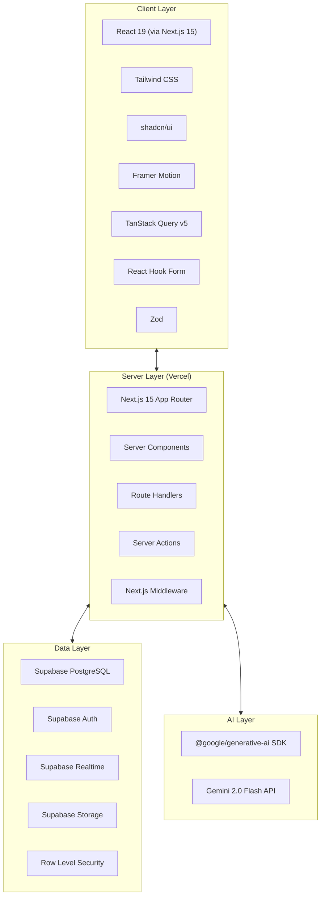

### 5.2 Technology Decisions and Justifications

#### 5.2.1 Next.js 15 (App Router)

**Decision:** Use Next.js 15 with the App Router.

**Justification:**

- **Server Components** eliminate client-side data waterfall — operational dashboards with 6 modules benefit enormously from server-fetched initial data.
- **Route Handlers** provide a native API layer that runs in the same process as the frontend, reducing latency for Gemini proxying.
- **Server Actions** enable form mutations (incident creation) without a separate REST round-trip.
- **Streaming** (`loading.tsx`, Suspense boundaries) provides progressive rendering — the Command Center header loads before AI-generated content.
- **File-system routing** makes module boundaries explicit: each of the 6 product modules maps to a distinct `/app` directory.

**Rejected alternatives:**

| Alternative             | Rejection Reason                                                                      |
| ----------------------- | ------------------------------------------------------------------------------------- |
| Next.js 14 Pages Router | Lacks native Server Components; more client-side data fetching complexity             |
| Remix                   | Less ecosystem maturity for Supabase/Vercel/shadcn combination                        |
| Vite + React SPA        | No SSR; initial load requires client-side auth check + data fetch, adding 1–2s to TTI |

**Trade-off:** App Router's caching model is complex. Aggressive default caching requires careful use of `cache: 'no-store'` on real-time operational data fetches.

#### 5.2.2 TypeScript (Strict Mode)

**Decision:** TypeScript with `"strict": true` and no `any` in production paths.

**Justification:**

- The Gemini API returns untyped JSON. A strict type system with Zod validation at the API boundary is the only defense against runtime shape mismatches crashing the operational dashboard.
- Supabase TypeScript type generation (`supabase gen types typescript`) produces database-accurate types that propagate through the entire stack.

**Trade-off:** Strict TypeScript increases initial development friction, particularly around Gemini response types. Mitigated by using Zod schemas to parse and validate all AI outputs.

#### 5.2.3 Tailwind CSS

**Decision:** Tailwind CSS as the styling system.

**Justification:**

- Co-located styles in JSX reduce context switching in a fast-paced development environment.
- shadcn/ui requires Tailwind — no additional CSS system needed.
- Excellent dark mode support via `dark:` prefix — essential for a command center interface.
- `@layer` and CSS variables integrate cleanly with the design token system.

**Rejected alternatives:** CSS Modules (verbose for responsive/state-conditional styling), Styled Components (runtime CSS-in-JS overhead), plain CSS (insufficient for project scale).

#### 5.2.4 shadcn/ui

**Decision:** shadcn/ui as the component library.

**Justification:**

- Components are **owned** (copied into the project). Customizable without fighting library constraints.
- Built on Radix UI primitives — all accessibility (ARIA, keyboard navigation, focus management) handled at the primitive level.
- No runtime dependency — zero risk of upstream breaking changes.

**Rejected alternatives:** MUI (heavy bundle, opinionated design), Chakra UI (runtime CSS-in-JS overhead), Ant Design (designed for admin interfaces, not real-time dashboards).

#### 5.2.5 Framer Motion

**Decision:** Framer Motion for UI animations.

**Justification:**

- `AnimatePresence` handles alert mounting/unmounting animations correctly.
- `useReducedMotion` hook provides built-in WCAG compliance for reduced motion preference.
- Declarative animation primitives work naturally with React's state model.

**Trade-off:** Adds ~40KB gzipped. Mitigated by dynamic importing animation-heavy components.

#### 5.2.6 TanStack Query v5

**Decision:** TanStack Query for client-side server state management.

**Justification:**

- Dashboard modules need periodic polling (30–60s) combined with Supabase Realtime for live updates. TanStack Query's `refetchInterval` + manual cache invalidation on Realtime events is the cleanest model.
- Built-in loading, error, and stale states for all server data.
- Deduplicates requests when multiple components require the same data.

**Decision to NOT use Zustand/Redux:** The application has no complex client-side state that isn't server state. TanStack Query alone is sufficient.

#### 5.2.7 React Hook Form + Zod

**Decision:** React Hook Form + Zod for form state and validation.

**Justification:**

- React Hook Form's uncontrolled inputs prevent unnecessary re-renders during typing — critical for incident creation speed (<30 seconds per PRD).
- Zod schemas serve dual purpose: client-side form validation + server-side Route Handler validation. One schema, two enforcement points.
- First-class integration with shadcn/ui Form components.

#### 5.2.8 Supabase

**Decision:** Supabase as the unified data platform.

**Justification:**

- **PostgreSQL**: Full ACID compliance for incident and audit data. Rich query capability for analytics aggregations. Native JSONB for zone configuration.
- **Auth**: RLS integrates natively with `auth.uid()` — JWT-based, no custom auth server.
- **Realtime**: WebSocket-based database change subscriptions eliminate polling infrastructure.
- **Storage**: Structured PDF report storage with RLS-matching access policies.
- **Single vendor**: Auth, database, realtime, and storage use the same Supabase client instance.

**Rejected alternatives:** Firebase (NoSQL unsuitable for relational operational data), PlanetScale (no Auth or Realtime), Neon + Clerk + Pusher (three vendors for what Supabase provides in one).

#### 5.2.9 Gemini 2.0 Flash

**Decision:** `gemini-2.0-flash` as the primary AI model.

**Justification:**

- **Speed**: Flash targets <2s for most prompts. PRD requires classification in <5s and summaries in <8s.
- **Cost**: Significantly cheaper per token than Pro — important for the ≤100 calls/hour budget.
- **Structured Output**: Native JSON mode with schema validation eliminates brittle response parsing.
- **Context Window**: 1M token context accommodates the largest operational data payloads.

**Model escalation:** Executive Summary generation uses `gemini-1.5-pro` for higher quality long-form narrative. Configurable per feature via `FEATURE_MODEL_MAP`.

**Rejected alternatives:** GPT-4o (higher cost/latency; not required for structured operational tasks), Claude 3.5 Sonnet (no native structured output schema enforcement matching Gemini's).

#### 5.2.10 Vercel

**Decision:** Vercel as the deployment platform.

**Justification:**

- Native Next.js support with zero configuration.
- Edge Network CDN for static assets.
- Preview deployments per pull request.
- Environment variable management per environment.
- Built-in Web Analytics and Speed Insights.

---

## 6. System Architecture

### 6.1 High-Level Architecture

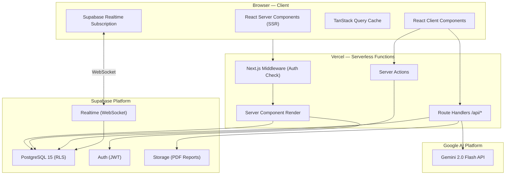

### 6.2 Request Lifecycle — Standard Data Fetch

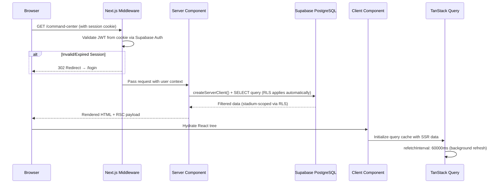

### 6.3 Request Lifecycle — AI Feature Call

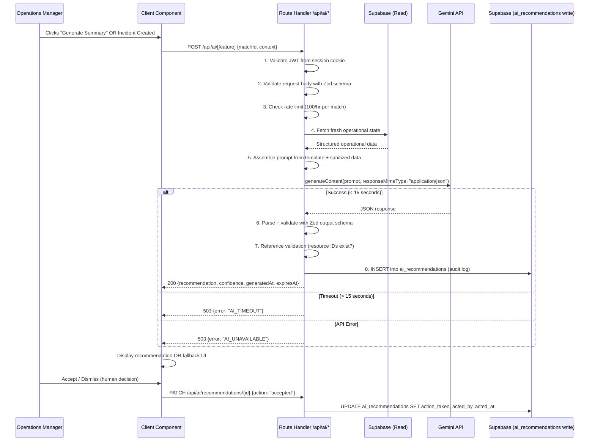

### 6.4 Realtime Subscription Architecture

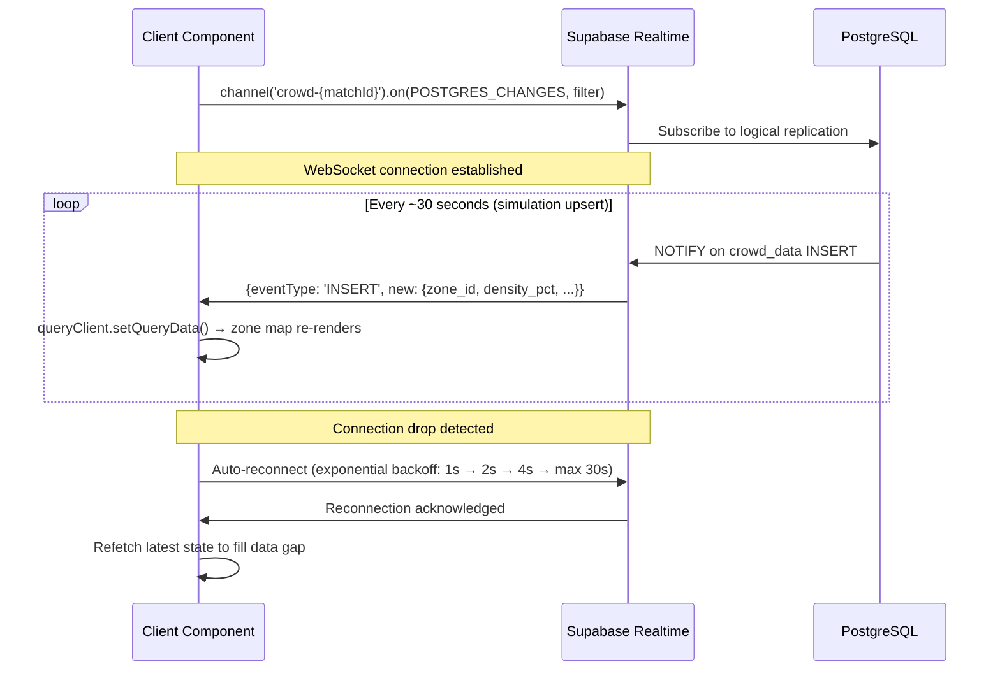

---

## 7. Frontend Architecture

### 7.1 Folder Structure

```
src/
├── app/                          # Next.js App Router
│   ├── (auth)/                   # Auth route group (no dashboard layout)
│   │   ├── login/
│   │   │   └── page.tsx
│   │   └── layout.tsx
│   ├── (dashboard)/              # Dashboard route group (main layout)
│   │   ├── layout.tsx            # Sidebar + header + phase indicator
│   │   ├── page.tsx              # Redirect → /command-center
│   │   ├── command-center/
│   │   │   └── page.tsx          # Module 1: AI Command Center
│   │   ├── crowd-intelligence/
│   │   │   └── page.tsx          # Module 2: Crowd Intelligence
│   │   ├── incidents/
│   │   │   ├── page.tsx          # Module 3: Incident list
│   │   │   └── [id]/page.tsx     # Incident detail view
│   │   ├── resources/
│   │   │   └── page.tsx          # Module 4: Resource Coordination
│   │   ├── transportation/
│   │   │   └── page.tsx          # Module 5: Transportation & Accessibility
│   │   └── reports/
│   │       └── page.tsx          # Module 6: Reports & Analytics
│   ├── api/                      # Route Handlers
│   │   ├── ai/
│   │   │   ├── operational-summary/route.ts
│   │   │   ├── incident-classify/route.ts
│   │   │   ├── incident-recommend/route.ts
│   │   │   ├── crowd-recommendations/route.ts
│   │   │   ├── resource-suggestions/route.ts
│   │   │   ├── shift-handover/route.ts
│   │   │   ├── executive-summary/route.ts
│   │   │   └── routing-suggestions/route.ts
│   │   ├── incidents/route.ts         # GET list, POST create
│   │   ├── incidents/[id]/route.ts    # GET, PATCH
│   │   ├── resources/route.ts
│   │   ├── crowd-data/route.ts
│   │   ├── health-score/route.ts
│   │   ├── matches/[id]/phase/route.ts
│   │   ├── reports/export/route.ts
│   │   └── health/route.ts            # System health check
│   ├── globals.css
│   └── layout.tsx                     # Root layout (fonts, metadata, providers)
│
├── components/
│   ├── ui/                       # shadcn/ui (owned copies — NOT npm imports)
│   ├── layout/
│   │   ├── Sidebar.tsx
│   │   ├── Header.tsx
│   │   └── PhaseIndicator.tsx    # Tournament phase selector (always visible)
│   ├── command-center/
│   │   ├── OperationalSummary.tsx
│   │   ├── HealthScoreGauge.tsx
│   │   ├── LiveStatusGrid.tsx
│   │   ├── CriticalAlertsFeed.tsx
│   │   ├── AIRecommendationCard.tsx
│   │   ├── ShiftHandoverModal.tsx
│   │   └── KPIStrip.tsx
│   ├── crowd/
│   │   ├── StadiumZoneMap.tsx
│   │   ├── ZoneDetailPanel.tsx
│   │   ├── CongestionPrediction.tsx
│   │   ├── QueueMonitor.tsx
│   │   ├── GateUtilizationBar.tsx
│   │   └── CrowdTrendChart.tsx
│   ├── incidents/
│   │   ├── IncidentList.tsx
│   │   ├── IncidentCard.tsx
│   │   ├── CreateIncidentModal.tsx
│   │   ├── IncidentDetail.tsx
│   │   ├── AIClassificationBadge.tsx
│   │   ├── ResponseRecommendation.tsx
│   │   └── IncidentTimeline.tsx
│   ├── resources/
│   │   ├── ResourceTable.tsx
│   │   ├── CoverageMatrix.tsx
│   │   ├── AIResourceSuggestion.tsx
│   │   └── ResourceStatusBadge.tsx
│   ├── transportation/
│   │   ├── ShuttleStatusList.tsx
│   │   ├── ParkingGrid.tsx
│   │   ├── AccessibilityRequestList.tsx
│   │   ├── ElevatorStatusPanel.tsx
│   │   └── AIRoutingSuggestion.tsx
│   ├── reports/
│   │   ├── ExecutiveSummaryPanel.tsx
│   │   ├── CrowdAnalyticsChart.tsx
│   │   ├── IncidentAnalyticsChart.tsx
│   │   ├── ResourceAnalyticsChart.tsx
│   │   └── ExportButton.tsx
│   └── shared/
│       ├── AIContentBlock.tsx    # Reusable wrapper: timestamp, regenerate btn, fallback
│       ├── ErrorBoundary.tsx
│       ├── LoadingSkeleton.tsx
│       ├── EmptyState.tsx
│       ├── ConfidenceBadge.tsx
│       └── TierBadge.tsx
│
├── hooks/
│   ├── useMatch.ts
│   ├── usePhase.ts
│   ├── useCrowdData.ts           # TanStack Query + Realtime subscription
│   ├── useIncidents.ts
│   ├── useResources.ts
│   ├── useHealthScore.ts
│   ├── useAIRecommendations.ts
│   └── useRealtimeSubscription.ts
│
├── lib/
│   ├── supabase/
│   │   ├── client.ts             # Browser Supabase client (singleton)
│   │   ├── server.ts             # Server Supabase client (per-request)
│   │   └── middleware.ts         # Session refresh in middleware
│   ├── gemini/
│   │   ├── client.ts             # GoogleGenerativeAI initialization
│   │   └── models.ts             # Model constants + feature→model map
│   ├── prompts/                  # All prompt templates (versioned)
│   │   ├── system-persona.ts     # Shared system persona string
│   │   ├── operational-summary.ts
│   │   ├── incident-classify.ts
│   │   ├── incident-recommend.ts
│   │   ├── crowd-recommendations.ts
│   │   ├── resource-suggestions.ts
│   │   ├── shift-handover.ts
│   │   ├── executive-summary.ts
│   │   └── routing-suggestions.ts
│   ├── services/                 # Business logic (not in route handlers)
│   │   ├── incident.service.ts
│   │   ├── resource.service.ts
│   │   ├── crowd.service.ts
│   │   ├── health-score.service.ts
│   │   ├── phase.service.ts
│   │   ├── report.service.ts
│   │   └── accessibility.service.ts
│   ├── validators/               # Zod schemas (shared client + server)
│   │   ├── incident.schema.ts
│   │   ├── resource.schema.ts
│   │   ├── crowd.schema.ts
│   │   ├── ai-outputs.schema.ts  # Zod schemas for all Gemini outputs
│   │   └── api-requests.schema.ts
│   ├── api/
│   │   ├── error-handler.ts
│   │   └── rate-limiter.ts
│   ├── security/
│   │   └── prompt-sanitizer.ts
│   ├── auth/
│   │   └── guards.ts
│   ├── observability/
│   │   └── logger.ts
│   ├── pdf/
│   │   └── generator.ts
│   └── utils.ts                  # cn(), formatDate(), etc.
│
├── config/
│   ├── scoring.ts                # Health score weights (configurable)
│   ├── thresholds.ts             # Alert thresholds per phase
│   ├── phases.ts                 # Tournament phase definitions
│   └── routes.ts                 # App route constants
│
├── types/
│   ├── database.types.ts         # Supabase generated types (auto-regenerated)
│   ├── api.types.ts
│   ├── ai.types.ts
│   └── domain.types.ts
│
└── middleware.ts                  # Next.js edge middleware (auth + session refresh)
```

### 7.2 Component Hierarchy

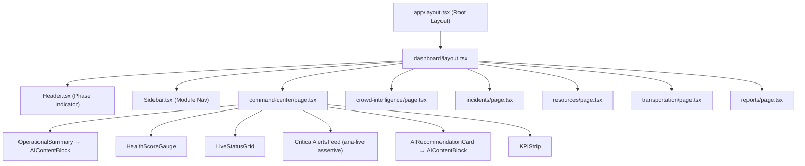

### 7.3 Rendering Strategy

| Component                   | Strategy                                      | Reason                                                      |
| --------------------------- | --------------------------------------------- | ----------------------------------------------------------- |
| `/login` page               | Static                                        | No dynamic data                                             |
| `(dashboard)/layout.tsx`    | Server Component                              | Fetch user + match context once per navigation              |
| `command-center/page.tsx`   | Server Component (initial) + Client hydration | Server-provided initial state; Realtime + polling on client |
| `OperationalSummary.tsx`    | Client Component                              | On-demand AI fetch, loading states                          |
| `HealthScoreGauge.tsx`      | Client Component                              | Real-time polling every 60 seconds                          |
| `StadiumZoneMap.tsx`        | Client Component                              | Realtime subscription for zone updates                      |
| `IncidentList.tsx`          | Client Component                              | Realtime subscription for incident events                   |
| `CrowdTrendChart.tsx`       | Client Component                              | Recharts (no SSR), periodic data fetching                   |
| `reports/page.tsx`          | Server Component (initial)                    | Pre-load historical data on server                          |
| `ExecutiveSummaryPanel.tsx` | Client Component                              | On-demand AI generation                                     |

**Streaming pattern for AI content:**

```tsx
// command-center/page.tsx
import { Suspense } from 'react';
import { LoadingSkeleton } from '@/components/shared/LoadingSkeleton';

export default async function CommandCenterPage() {
  return (
    <div>
      <HealthScoreGauge /> {/* Client Component — no blocking */}
      <Suspense fallback={<LoadingSkeleton variant="status-grid" />}>
        <LiveStatusGrid /> {/* Server Component — streams in */}
      </Suspense>
      <CriticalAlertsFeed /> {/* Client Component — Realtime subscription */}
      <OperationalSummary /> {/* Client Component — on-demand AI fetch */}
    </div>
  );
}
```

### 7.4 State Management Strategy

| State Category                             | Storage                                           | Mechanism                                          |
| ------------------------------------------ | ------------------------------------------------- | -------------------------------------------------- |
| Server state (incidents, resources, crowd) | Supabase → TanStack Query cache                   | `useQuery` + `useMutation` + `invalidateQueries`   |
| Realtime live state                        | TanStack Query cache updated by Realtime events   | `queryClient.setQueryData()` in Realtime callback  |
| UI state (modals, panels, selected zones)  | React `useState`                                  | Local component state                              |
| Form state                                 | React Hook Form                                   | Uncontrolled inputs                                |
| Auth state                                 | Supabase Auth (HTTP-only cookie)                  | `createBrowserClient()` from `@supabase/ssr`       |
| Tournament phase                           | Supabase `matches.current_phase` → TanStack Query | Server-persisted; optimistic update on change      |
| AI recommendation state                    | Supabase `ai_recommendations` table               | Server-persisted; TanStack Query for client access |

### 7.5 Design Token Strategy

```css
/* globals.css — Semantic Design Token System */
:root {
  /* Brand */
  --color-primary: 221 83% 53%;
  --color-primary-foreground: 0 0% 98%;

  /* Crowd Density Levels */
  --color-crowd-safe: 142 71% 45%; /* Green: 0–60% */
  --color-crowd-warning: 38 92% 50%; /* Amber: 61–80% */
  --color-crowd-danger: 0 72% 51%; /* Red: 81–100% */
  --color-crowd-critical: 0 90% 40%; /* Deep Red: >100% */

  /* Incident Tier Colors */
  --color-tier-1: 0 90% 40%; /* Life-threatening */
  --color-tier-2: 25 95% 53%; /* Operational Critical */
  --color-tier-3: 45 93% 47%; /* Operational */
  --color-tier-4: 217 91% 60%; /* Advisory */

  /* Health Score Grades */
  --color-health-a: 142 71% 45%; /* A: 85–100 */
  --color-health-b: 180 60% 40%; /* B: 70–84 */
  --color-health-c: 38 92% 50%; /* C: 55–69 */
  --color-health-d: 25 95% 53%; /* D: 40–54 */
  --color-health-f: 0 72% 51%; /* F: <40 */

  /* Dark Mode Primary */
  --background: 224 71% 4%;
  --card: 224 71% 8%;
  --border: 214 32% 18%;

  /* Typography */
  --font-sans: 'Inter', sans-serif;
  --font-mono: 'JetBrains Mono', monospace;
}
```

**Design token rules:**

1. Never use raw Tailwind color values (`text-blue-500`) — use semantic tokens (`text-primary`).
2. Tier/density colors must always include a non-color indicator (badge label + icon).
3. Dark mode is the primary design target.

### 7.6 Animation Strategy

| Tier            | Use Case                                   | Framer Motion API                | Reduced Motion Behavior                      |
| --------------- | ------------------------------------------ | -------------------------------- | -------------------------------------------- |
| T1 — Critical   | Modal appear/dismiss, alert arrive         | `AnimatePresence` + `motion.div` | Instantaneous (no delay)                     |
| T2 — Data       | Health score change, KPI value update      | `motion.span` count animation    | Disabled                                     |
| T3 — Navigation | Page transitions between modules           | Layout animations                | Disabled                                     |
| T4 — Decorative | Background pulse on critical tier-1 alerts | CSS animation                    | `prefers-reduced-motion: no-preference` only |

```typescript
// Reduced motion integration
import { useReducedMotion } from 'framer-motion';

const prefersReduced = useReducedMotion();
const variants = {
  initial: { opacity: 0, y: prefersReduced ? 0 : -8 },
  animate: { opacity: 1, y: 0 },
  exit: { opacity: 0, y: prefersReduced ? 0 : 8 },
};
```

### 7.7 Code Splitting Strategy

| Split Point              | Method                                         | Reason                               |
| ------------------------ | ---------------------------------------------- | ------------------------------------ |
| Route-level              | Automatic via App Router                       | Each module page is a separate chunk |
| Recharts / chart library | `dynamic(() => import(...), {ssr: false})`     | Not needed for server render         |
| PDF export utility       | `dynamic(() => import('@/lib/pdf/generator'))` | Large bundle, only on export action  |
| Framer Motion            | Import only used components                    | Avoid full library import            |

### 7.8 Naming Conventions

| Element               | Convention                      | Example                    |
| --------------------- | ------------------------------- | -------------------------- |
| React components      | PascalCase                      | `IncidentCard.tsx`         |
| Custom hooks          | camelCase with `use` prefix     | `useHealthScore.ts`        |
| Route handlers        | `route.ts` in directory         | `/api/incidents/route.ts`  |
| Utility functions     | camelCase                       | `calculateHealthScore()`   |
| Zod schemas           | camelCase with `Schema` suffix  | `incidentCreateSchema`     |
| TypeScript types      | PascalCase                      | `IncidentWithActions`      |
| Supabase tables       | snake_case plural               | `incidents`, `crowd_data`  |
| Database columns      | snake_case                      | `created_at`, `match_id`   |
| Environment variables | SCREAMING_SNAKE_CASE            | `NEXT_PUBLIC_SUPABASE_URL` |
| CSS custom properties | kebab-case with semantic prefix | `--color-tier-1`           |

### 7.9 Responsive Strategy

| Breakpoint | Target                                      | Layout                                        |
| ---------- | ------------------------------------------- | --------------------------------------------- |
| `1440px+`  | Primary desktop (Operations Manager laptop) | Full sidebar + content, all widgets visible   |
| `1024px`   | Large tablet landscape                      | Collapsible sidebar                           |
| `768px`    | Tablet portrait                             | Stacked layout, bottom navigation             |
| `< 768px`  | Mobile                                      | Not officially supported; degrades gracefully |

---

## 8. Backend Architecture

### 8.1 Route Handler Pattern

All Route Handlers follow a standardized five-step middleware chain:

```typescript
// Standard Route Handler pattern — src/app/api/incidents/route.ts
import { NextRequest, NextResponse } from 'next/server';
import { createServerClient } from '@/lib/supabase/server';
import { getAuthenticatedUser, requireRole } from '@/lib/auth/guards';
import { incidentCreateSchema } from '@/lib/validators/incident.schema';
import { handleApiError } from '@/lib/api/error-handler';
import { logger } from '@/lib/observability/logger';

export async function POST(request: NextRequest) {
  try {
    // 1. Parse and validate request body
    const body = await request.json();
    const validated = incidentCreateSchema.parse(body);

    // 2. Authenticate
    const supabase = createServerClient();
    const user = await getAuthenticatedUser(supabase);

    // 3. Authorize
    requireRole(user, ['operations_manager', 'deputy_manager']);

    // 4. Business logic
    const { data, error } = await supabase
      .from('incidents')
      .insert({ ...validated, reported_by: user.id, stadium_id: user.stadiumId })
      .select()
      .single();

    if (error) throw error;

    // 5. Audit log + response
    logger.info('incident.created', { incidentId: data.id, tier: data.tier, userId: user.id });
    return NextResponse.json(
      { data, meta: { timestamp: new Date().toISOString() } },
      { status: 201 }
    );
  } catch (error) {
    return handleApiError(error);
  }
}
```

### 8.2 Middleware Chain

```
Incoming Request
  ↓
src/middleware.ts (Next.js Edge Middleware)
  → Validate session cookie via Supabase Auth
  → Redirect to /login if no valid session
  → Refresh session token if near expiry
  ↓
Route Handler / Server Component
  → createServerClient() (inherits cookie session)
  → getAuthenticatedUser() → fetch user + role + stadium_id
  → requireRole() → throws 403 if insufficient role
  ↓
Business Logic (service layer)
  ↓
Supabase Query (RLS filters automatically by auth.uid())
  ↓
Standardized API Response
```

```typescript
// src/middleware.ts
import { createServerClient } from '@supabase/ssr';
import { NextResponse, type NextRequest } from 'next/server';

export async function middleware(request: NextRequest) {
  let response = NextResponse.next({ request });

  const supabase = createServerClient(
    process.env.NEXT_PUBLIC_SUPABASE_URL!,
    process.env.NEXT_PUBLIC_SUPABASE_ANON_KEY!,
    {
      cookies: {
        getAll: () => request.cookies.getAll(),
        setAll: (cookiesToSet) => {
          cookiesToSet.forEach(({ name, value, options }) =>
            response.cookies.set(name, value, options)
          );
        },
      },
    }
  );

  const {
    data: { user },
  } = await supabase.auth.getUser();
  const isAuthRoute = request.nextUrl.pathname.startsWith('/login');

  if (!user && !isAuthRoute) {
    return NextResponse.redirect(new URL('/login', request.url));
  }
  if (user && isAuthRoute) {
    return NextResponse.redirect(new URL('/command-center', request.url));
  }

  return response;
}

export const config = {
  matcher: ['/((?!_next/static|_next/image|favicon.ico).*)'],
};
```

### 8.3 Validation Strategy

| Layer            | Tool                                           | Scope                         |
| ---------------- | ---------------------------------------------- | ----------------------------- |
| API request body | Zod `.parse()` in Route Handler                | All POST/PATCH request bodies |
| Query parameters | Zod `.safeParse()`                             | Filtering, pagination params  |
| AI output        | Zod `.safeParse()` after JSON.parse            | All Gemini API responses      |
| Form input       | Zod schema via `zodResolver` (React Hook Form) | All user-facing forms         |
| Database input   | Supabase CHECK constraints                     | Last-line defense             |

**Zod schema co-location rule:** Every Zod schema lives in `src/lib/validators/`. The same schema is imported by both the Route Handler (server validation) and the form resolver (client validation). One schema, two enforcement points.

### 8.4 Error Taxonomy

```typescript
// src/lib/api/error-handler.ts
export type ApiErrorCode =
  | 'VALIDATION_ERROR' // 400 — Zod parse failure
  | 'UNAUTHORIZED' // 401 — No valid session
  | 'FORBIDDEN' // 403 — Insufficient role
  | 'NOT_FOUND' // 404 — Resource doesn't exist
  | 'DATABASE_ERROR' // 500 — Supabase query failure
  | 'AI_UNAVAILABLE' // 503 — Gemini API down
  | 'AI_TIMEOUT' // 503 — Gemini exceeded 15s
  | 'AI_PARSE_ERROR' // 503 — Gemini response failed Zod validation
  | 'RATE_LIMIT_EXCEEDED' // 429 — AI call limit reached
  | 'INTERNAL_ERROR'; // 500 — Unhandled exception

export function handleApiError(error: unknown): NextResponse {
  if (error instanceof ZodError) {
    return NextResponse.json(
      {
        error: { code: 'VALIDATION_ERROR', message: 'Invalid request data', details: error.errors },
      },
      { status: 400 }
    );
  }
  if (error instanceof AuthorizationError) {
    return NextResponse.json(
      { error: { code: 'FORBIDDEN', message: error.message } },
      { status: 403 }
    );
  }
  if (error instanceof AuthenticationError) {
    return NextResponse.json(
      { error: { code: 'UNAUTHORIZED', message: 'Authentication required' } },
      { status: 401 }
    );
  }
  if (error instanceof AITimeoutError) {
    return NextResponse.json(
      { error: { code: 'AI_TIMEOUT', message: 'AI analysis timed out — please retry' } },
      { status: 503 }
    );
  }
  // ... additional error types
  logger.error('unhandled.error', { error });
  return NextResponse.json(
    { error: { code: 'INTERNAL_ERROR', message: 'An unexpected error occurred' } },
    { status: 500 }
  );
}
```

### 8.5 Rate Limiting

Rate limiting is implemented at Route Handler level for AI endpoints:

```typescript
// src/lib/api/rate-limiter.ts
// Sliding window in-memory rate limiter.
// Production upgrade: Replace with Upstash Redis for distributed rate limiting.

const rateLimitMap = new Map<string, { count: number; resetAt: number }>();

export function checkRateLimit(
  key: string,
  maxRequests: number, // 100
  windowMs: number // 3600000 (1 hour)
): { allowed: boolean; remaining: number; resetAt: number } {
  const now = Date.now();
  const entry = rateLimitMap.get(key);

  if (!entry || now > entry.resetAt) {
    rateLimitMap.set(key, { count: 1, resetAt: now + windowMs });
    return { allowed: true, remaining: maxRequests - 1, resetAt: now + windowMs };
  }
  if (entry.count >= maxRequests) {
    return { allowed: false, remaining: 0, resetAt: entry.resetAt };
  }
  entry.count++;
  return { allowed: true, remaining: maxRequests - entry.count, resetAt: entry.resetAt };
}

// AI Route Handler usage:
// checkRateLimit(`ai:${matchId}`, 100, 3_600_000)
```

### 8.6 Environment Variables

| Variable                        | Client Access  | Description                                 |
| ------------------------------- | -------------- | ------------------------------------------- |
| `NEXT_PUBLIC_SUPABASE_URL`      | ✅ Yes         | Supabase project REST URL                   |
| `NEXT_PUBLIC_SUPABASE_ANON_KEY` | ✅ Yes         | Supabase anonymous key (RLS-protected)      |
| `SUPABASE_SERVICE_ROLE_KEY`     | ❌ Server only | Admin operations (migrations, seeding)      |
| `GEMINI_API_KEY`                | ❌ Server only | Google AI API key — NEVER exposed to client |
| `NEXT_PUBLIC_APP_URL`           | ✅ Yes         | Application base URL                        |

> [!CAUTION]
> `GEMINI_API_KEY` must **never** have the `NEXT_PUBLIC_` prefix. Any variable prefixed with `NEXT_PUBLIC_` is bundled into the client JavaScript and visible to anyone inspecting the browser.

---

## 9. AI Architecture

### 9.1 Gemini Client Initialization

```typescript
// src/lib/gemini/client.ts
import { GoogleGenerativeAI } from '@google/generative-ai';

let client: GoogleGenerativeAI | null = null;

export function getGeminiClient(): GoogleGenerativeAI {
  if (!client) {
    if (!process.env.GEMINI_API_KEY) {
      throw new Error('GEMINI_API_KEY is not configured');
    }
    client = new GoogleGenerativeAI(process.env.GEMINI_API_KEY);
  }
  return client;
}

// src/lib/gemini/models.ts
export const GEMINI_MODELS = {
  flash: 'gemini-2.0-flash',
  pro: 'gemini-1.5-pro',
} as const;

// Feature → Model mapping (configurable per feature)
export const FEATURE_MODEL_MAP: Record<string, string> = {
  'incident-classify': GEMINI_MODELS.flash,
  'incident-recommend': GEMINI_MODELS.flash,
  'crowd-recommendations': GEMINI_MODELS.flash,
  'resource-suggestions': GEMINI_MODELS.flash,
  'operational-summary': GEMINI_MODELS.flash,
  'shift-handover': GEMINI_MODELS.flash,
  'routing-suggestions': GEMINI_MODELS.flash,
  'executive-summary': GEMINI_MODELS.pro, // Long-form → higher quality
};
```

### 9.2 Prompt Architecture

Prompt assembly follows a strict three-layer structure:

```
Layer 1: System Persona (constant — shared across all prompts)
          ↓
Layer 2: Operational Context (match, stadium, phase, weather — per request)
          ↓
Layer 3: Feature-Specific Data Payload + Task Instruction + Output Schema
```

### 9.3 System Persona

```typescript
// src/lib/prompts/system-persona.ts
export const SYSTEM_PERSONA = `
You are ArenaMind AI, an operational copilot assisting Stadium Operations Managers
at the FIFA World Cup 2026. Your role is to provide clear, specific, and actionable
operational guidance.

CRITICAL RULES — ALWAYS FOLLOW:
1. Base ALL outputs strictly on the data provided. Never invent, estimate, or
   hallucinate metrics, staff names, resource IDs, zone IDs, or incident details.
2. If data is insufficient to make a specific recommendation, explicitly state what
   additional information is needed. Do NOT generate a generic recommendation.
3. Use operational language appropriate for an emergency operations center:
   direct, specific, and professional.
4. Always reference the current tournament phase in your analysis.
5. When safety is a factor, always recommend the more conservative course of action.
6. Never recommend actions that bypass established safety protocols.
7. Every recommendation must include: the specific action, the data-based rationale,
   and a confidence level (Low/Medium/High).
`.trim();
```

### 9.4 Prompt Templates

#### Operational Summary Prompt

```typescript
// src/lib/prompts/operational-summary.ts
export const PROMPT_VERSION = 'operational-summary-v1.2';

export function buildOperationalSummaryPrompt(input: OperationalSummaryInput): string {
  return `
${SYSTEM_PERSONA}

OPERATIONAL CONTEXT:
Stadium: ${input.stadium.name} (capacity: ${input.stadium.capacity.toLocaleString()})
Match: ${input.match.homeTeam} vs ${input.match.awayTeam} — ${input.match.stage}
Kickoff: ${input.match.kickoffTime}
Current Phase: ${input.phase.name} (${input.phase.timeInPhase} into phase)
Weather: ${input.weather.temperature}, ${input.weather.conditions}
${input.weather.advisory ? `WEATHER ADVISORY: ${input.weather.advisory}` : ''}

CURRENT OPERATIONAL STATE:
Health Score: ${input.healthScore.score}/100 (Grade ${input.healthScore.grade}, ${input.healthScore.trend})
Incidents — Tier 1: ${input.incidents.tier1} | Tier 2: ${input.incidents.tier2} | Tier 3: ${input.incidents.tier3} | Tier 4: ${input.incidents.tier4}
${input.incidents.mostCritical ? `Most Critical Incident: ${input.incidents.mostCritical}` : ''}
Crowd — Avg density: ${input.crowd.avgDensityPct}% | Zones >85%: ${input.crowd.zonesAbove85Pct} | Zones >100%: ${input.crowd.zonesAbove100Pct}
Resources — Security: ${input.resources.securityCoverage}% | Medical: ${input.resources.medicalCoverage}% | Volunteers: ${input.resources.volunteerCoverage}%

TASK:
Generate an operational summary for the Stadium Operations Manager.
- Length: 150–220 words
- If Tier 1 or Tier 2 incidents are active, open with them IMMEDIATELY
- Reference specific numbers from the data above
- Reference the current tournament phase by name
- Close with exactly ONE priority action item
- Use operational report language: direct, professional, specific

Respond with valid JSON:
{
  "summary": string,
  "primaryAlert": string | null,
  "priorityAction": string,
  "statusTags": {
    "crowd": "nominal" | "elevated" | "critical",
    "security": "nominal" | "elevated" | "critical",
    "medical": "standby" | "active" | "critical",
    "transport": "nominal" | "delayed" | "disrupted"
  }
}`.trim();
}
```

#### Incident Classification Prompt

```typescript
// src/lib/prompts/incident-classify.ts
export const PROMPT_VERSION = 'incident-classify-v1.1';

export function buildIncidentClassifyPrompt(input: IncidentClassifyInput): string {
  return `
${SYSTEM_PERSONA}

TASK: Classify the following stadium incident report.

INCIDENT REPORT:
Description: "${sanitizeForPrompt(input.description)}"
Zone: ${input.zone}
Tournament Phase: ${input.phase}
Zone Crowd Density: ${input.crowdDensityInZone}% of safe capacity
Time: ${input.timeOfDay}

CLASSIFICATION TAXONOMY:
Types: Medical | Security | Crowd | Infrastructure | Fire_Evacuation | VIP_Protocol | Broadcast | Weather

Tier 1 (LIFE-THREATENING): Immediate risk to human life — cardiac events, crush injuries, fire, active security threats, evacuation required
Tier 2 (OPERATIONAL CRITICAL): Significant disruption or escalation risk — overcrowding above safe limits, medical events without confirmed life threat, major infrastructure failure
Tier 3 (OPERATIONAL): Friction requiring attention — queuing issues, minor injuries, localized disturbances, equipment faults
Tier 4 (ADVISORY): Low-priority informational items — minor complaints, non-urgent infrastructure observations

Respond ONLY with valid JSON:
{
  "type": string,
  "tier": 1 | 2 | 3 | 4,
  "confidence": number,
  "rationale": string,
  "escalationRisk": "low" | "medium" | "high"
}`.trim();
}
```

#### Incident Response Recommendation Prompt

```typescript
// src/lib/prompts/incident-recommend.ts
export const PROMPT_VERSION = 'incident-recommend-v1.0';

export function buildIncidentRecommendPrompt(input: IncidentRecommendInput): string {
  const resourceList = input.availableResources
    .map(
      (r) =>
        `  - ${r.name} (ID: ${r.id}) — ${r.category}, Zone: ${r.currentZone} [proximity: ${r.distanceToIncident}]`
    )
    .join('\n');

  return `
${SYSTEM_PERSONA}

INCIDENT DETAILS:
Type: ${input.incidentType} | Tier: ${input.tier}
Zone: ${input.zone}
Description: "${sanitizeForPrompt(input.description)}"
Tournament Phase: ${input.phase}
${input.timeConstraints.minutesToKickoff !== undefined ? `Time to Kickoff: ${input.timeConstraints.minutesToKickoff} minutes` : ''}

AVAILABLE RESOURCES (within or near incident zone):
${resourceList || 'No resources currently available near this zone'}

TASK: Generate a step-by-step incident response plan.
- Reference ONLY resource IDs from the list above — never invent resource IDs
- Each step must be specific and actionable (not generic)
- Include escalation triggers
- Account for the current tournament phase

Respond with valid JSON:
{
  "immediateActions": string[],
  "dispatchRecommendation": {
    "primary": string,
    "secondary": string | null,
    "eta": string
  },
  "ongoingActions": string[],
  "escalationTriggers": string[],
  "communicationSteps": string[],
  "estimatedResolutionTime": string,
  "confidence": "low" | "medium" | "high"
}`.trim();
}
```

### 9.5 Structured Output Validation (Zod Schemas)

```typescript
// src/lib/validators/ai-outputs.schema.ts
import { z } from 'zod';

export const operationalSummaryOutputSchema = z.object({
  summary: z.string().min(100).max(500),
  primaryAlert: z.string().nullable(),
  priorityAction: z.string(),
  statusTags: z.object({
    crowd: z.enum(['nominal', 'elevated', 'critical']),
    security: z.enum(['nominal', 'elevated', 'critical']),
    medical: z.enum(['standby', 'active', 'critical']),
    transport: z.enum(['nominal', 'delayed', 'disrupted']),
  }),
});

export const incidentClassifyOutputSchema = z.object({
  type: z.enum([
    'Medical',
    'Security',
    'Crowd',
    'Infrastructure',
    'Fire_Evacuation',
    'VIP_Protocol',
    'Broadcast',
    'Weather',
  ]),
  tier: z.number().int().min(1).max(4),
  confidence: z.number().min(0).max(1),
  rationale: z.string(),
  escalationRisk: z.enum(['low', 'medium', 'high']),
});

export const incidentRecommendOutputSchema = z.object({
  immediateActions: z.array(z.string()).min(1).max(5),
  dispatchRecommendation: z.object({
    primary: z.string(),
    secondary: z.string().nullable(),
    eta: z.string(),
  }),
  ongoingActions: z.array(z.string()),
  escalationTriggers: z.array(z.string()),
  communicationSteps: z.array(z.string()),
  estimatedResolutionTime: z.string(),
  confidence: z.enum(['low', 'medium', 'high']),
});
```

### 9.6 Hallucination Prevention Strategy

| Technique                   | Implementation                                                               | Prevents                                           |
| --------------------------- | ---------------------------------------------------------------------------- | -------------------------------------------------- |
| Data-grounded prompts       | All resource IDs, zone IDs, counts fetched fresh from DB before prompt build | AI inventing non-existent resources                |
| Taxonomy enforcement        | Incident types listed explicitly in prompt                                   | AI inventing new incident categories               |
| Output schema validation    | Zod parse of every AI response                                               | Structurally invalid or unexpected outputs         |
| Reference validation        | Post-parse check: all resource IDs in recommendation exist in fetched list   | AI referencing resources not in current deployment |
| Explicit persona constraint | "Never invent metrics, names, or events" in system persona                   | General hallucination                              |
| Focused single-task prompts | Each prompt does exactly one task                                            | Reduces confusion and scope drift                  |

```typescript
// Reference validation — implemented after Zod parse
function validateResourceReferences(
  recommendation: IncidentRecommendOutput,
  availableResources: Resource[]
): ValidationResult {
  const availableIds = new Set(availableResources.map((r) => r.id));
  const mentionedText = recommendation.dispatchRecommendation.primary;
  const mentionedIds = extractResourceIds(mentionedText); // regex to extract UUIDs/unit IDs

  const invalidIds = mentionedIds.filter((id) => !availableIds.has(id));

  if (invalidIds.length > 0) {
    logger.warn('ai.hallucination.detected', { feature: 'incident-recommend', invalidIds });
    return { valid: false, invalidIds };
  }

  return { valid: true, invalidIds: [] };
}
```

### 9.7 Retry Strategy

```typescript
// src/lib/gemini/retry.ts
export async function withRetry<T>(
  operation: () => Promise<T>,
  config = { maxAttempts: 3, baseDelayMs: 1000, maxDelayMs: 8000, timeoutMs: 15000 }
): Promise<T> {
  let lastError: Error | null = null;

  for (let attempt = 1; attempt <= config.maxAttempts; attempt++) {
    try {
      return await Promise.race([
        operation(),
        new Promise<never>((_, reject) =>
          setTimeout(() => reject(new AITimeoutError()), config.timeoutMs)
        ),
      ]);
    } catch (error) {
      lastError = error as Error;
      if (error instanceof AITimeoutError || attempt === config.maxAttempts) break;

      // Exponential backoff with jitter
      const delay = Math.min(config.baseDelayMs * 2 ** (attempt - 1), config.maxDelayMs);
      const jitter = Math.random() * delay * 0.1;
      await new Promise((resolve) => setTimeout(resolve, delay + jitter));
    }
  }

  throw lastError;
}
```

### 9.8 Prompt Injection Protection

````typescript
// src/lib/security/prompt-sanitizer.ts
// All user-provided text entering a Gemini prompt MUST pass through this function.
// Primary attack surface: incident description field.

export function sanitizeForPrompt(input: string): string {
  return input
    .slice(0, 1000) // Truncate — prevent token flooding
    .replace(/---/g, '—') // Markdown horizontal rules
    .replace(/```/g, "'''") // Code block delimiters
    .replace(/\[INST\]/gi, '') // Llama instruction tokens
    .replace(/<\|[^|]+\|>/g, '') // GPT/Llama special tokens
    .replace(/###\s*(system|user|assistant)/gi, '') // ChatML roles
    .trim();
}

// In prompt templates, user content is always wrapped in explicit string delimiters:
// Description: "${sanitizeForPrompt(input.description)}"
// This syntactically isolates it from the instruction context.
````

### 9.9 Cost Optimization

| Strategy                     | Implementation                                         | Estimated Savings          |
| ---------------------------- | ------------------------------------------------------ | -------------------------- |
| Flash model for 7/8 features | `FEATURE_MODEL_MAP` defaults                           | ~10x vs Pro                |
| Rate limiting per match      | 100 calls/hour cap                                     | Prevents runaway billing   |
| Prompt deduplication         | Hash comparison of operational data; skip if unchanged | Eliminates redundant calls |
| Controlled output length     | Word count limits in every prompt                      | Controls output token cost |
| Batched data fetching        | Single DB query before AI call                         | Reduces call overhead      |

### 9.10 AI Observability

```typescript
// Every AI call logs to ai_call_logs table:
interface AICallLog {
  matchId: string;
  feature: string;
  model: string;
  promptTokens: number;
  outputTokens: number;
  latencyMs: number;
  success: boolean;
  errorCode?: string;
  outputValidationPassed: boolean;
  hallucinationDetected?: boolean;
}
```

### 9.11 Prompt Versioning

```typescript
// Every prompt module exports its version string:
export const PROMPT_VERSION = 'operational-summary-v1.2';

// Version is stored in ai_recommendations.prompt_version for full auditability.
// When prompts are updated, the version string increments.
// Old recommendations retain their prompt version for historical analysis.
```

---

## 10. Database Architecture

### 10.1 Entity Relationship Diagram

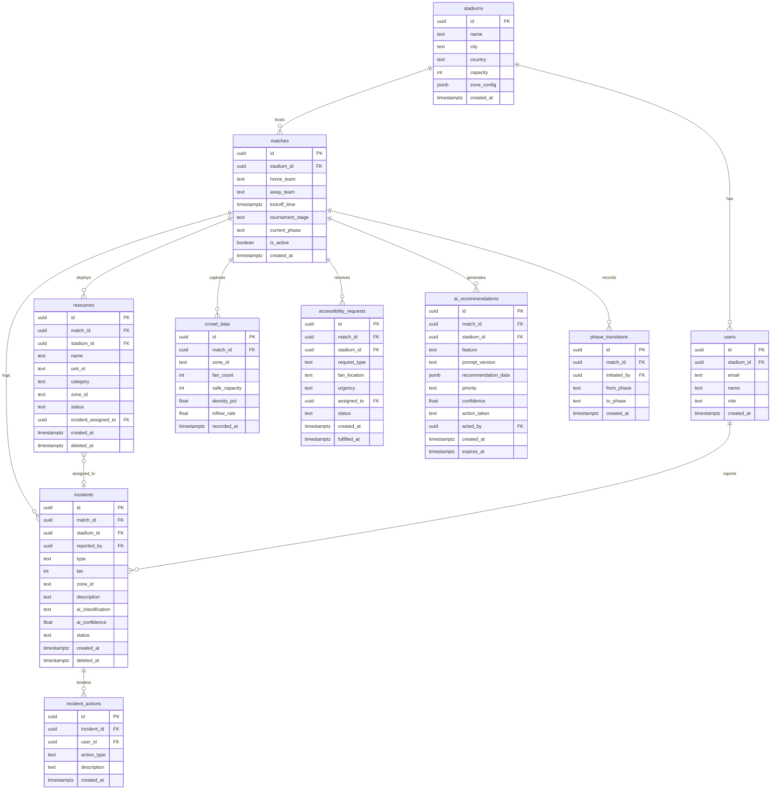

### 10.2 Complete SQL Schema

```sql
-- ============================================================
-- ArenaMind AI — PostgreSQL 15 Schema
-- ============================================================

CREATE EXTENSION IF NOT EXISTS "uuid-ossp";

-- STADIUMS
CREATE TABLE stadiums (
  id UUID PRIMARY KEY DEFAULT uuid_generate_v4(),
  name TEXT NOT NULL,
  city TEXT NOT NULL,
  country TEXT NOT NULL,
  capacity INT NOT NULL,
  zone_config JSONB NOT NULL DEFAULT '{}',
  created_at TIMESTAMPTZ NOT NULL DEFAULT NOW()
);

-- MATCHES
CREATE TABLE matches (
  id UUID PRIMARY KEY DEFAULT uuid_generate_v4(),
  stadium_id UUID NOT NULL REFERENCES stadiums(id) ON DELETE RESTRICT,
  home_team TEXT NOT NULL,
  away_team TEXT NOT NULL,
  kickoff_time TIMESTAMPTZ NOT NULL,
  tournament_stage TEXT NOT NULL,
  current_phase TEXT NOT NULL DEFAULT 'pre_event'
    CHECK (current_phase IN (
      'pre_event','gate_opening','fan_arrival','pre_kickoff',
      'match_live','halftime','second_half','full_time',
      'crowd_exit','post_event'
    )),
  weather_conditions TEXT,
  weather_advisory TEXT,
  is_active BOOLEAN NOT NULL DEFAULT TRUE,
  expected_attendance INT,
  created_at TIMESTAMPTZ NOT NULL DEFAULT NOW()
);

-- USERS (extends auth.users)
CREATE TABLE users (
  id UUID PRIMARY KEY REFERENCES auth.users(id) ON DELETE CASCADE,
  stadium_id UUID NOT NULL REFERENCES stadiums(id) ON DELETE RESTRICT,
  email TEXT NOT NULL,
  name TEXT NOT NULL,
  role TEXT NOT NULL DEFAULT 'read_only'
    CHECK (role IN ('operations_manager','deputy_manager','coordinator','read_only')),
  last_active TIMESTAMPTZ,
  created_at TIMESTAMPTZ NOT NULL DEFAULT NOW()
);

-- INCIDENTS
CREATE TABLE incidents (
  id UUID PRIMARY KEY DEFAULT uuid_generate_v4(),
  match_id UUID NOT NULL REFERENCES matches(id) ON DELETE RESTRICT,
  stadium_id UUID NOT NULL REFERENCES stadiums(id) ON DELETE RESTRICT,
  reported_by UUID REFERENCES users(id) ON DELETE SET NULL,
  type TEXT NOT NULL CHECK (type IN (
    'Medical','Security','Crowd','Infrastructure',
    'Fire_Evacuation','VIP_Protocol','Broadcast','Weather'
  )),
  tier INT NOT NULL CHECK (tier BETWEEN 1 AND 4),
  zone_id TEXT NOT NULL,
  description TEXT NOT NULL,
  ai_classification TEXT,
  ai_confidence FLOAT CHECK (ai_confidence BETWEEN 0 AND 1),
  ai_escalation_risk TEXT CHECK (ai_escalation_risk IN ('low','medium','high')),
  status TEXT NOT NULL DEFAULT 'open'
    CHECK (status IN ('open','active','monitoring','resolved','closed')),
  resolution_description TEXT,
  created_at TIMESTAMPTZ NOT NULL DEFAULT NOW(),
  resolved_at TIMESTAMPTZ,
  deleted_at TIMESTAMPTZ  -- Soft delete
);

-- INCIDENT ACTIONS (Timeline)
CREATE TABLE incident_actions (
  id UUID PRIMARY KEY DEFAULT uuid_generate_v4(),
  incident_id UUID NOT NULL REFERENCES incidents(id) ON DELETE CASCADE,
  user_id UUID REFERENCES users(id) ON DELETE SET NULL,
  action_type TEXT NOT NULL CHECK (action_type IN (
    'created','classified','classification_override','status_change',
    'resource_assigned','resource_released','recommendation_accepted',
    'recommendation_dismissed','resolved','note_added'
  )),
  description TEXT NOT NULL,
  metadata JSONB DEFAULT '{}',
  created_at TIMESTAMPTZ NOT NULL DEFAULT NOW()
);

-- RESOURCES
CREATE TABLE resources (
  id UUID PRIMARY KEY DEFAULT uuid_generate_v4(),
  match_id UUID NOT NULL REFERENCES matches(id) ON DELETE RESTRICT,
  stadium_id UUID NOT NULL REFERENCES stadiums(id) ON DELETE RESTRICT,
  name TEXT NOT NULL,
  unit_id TEXT NOT NULL,
  category TEXT NOT NULL CHECK (category IN ('security','medical','volunteer','equipment')),
  zone_id TEXT NOT NULL,
  status TEXT NOT NULL DEFAULT 'available'
    CHECK (status IN ('available','deployed','off_duty','unavailable')),
  incident_assigned_to UUID REFERENCES incidents(id) ON DELETE SET NULL,
  last_checkin TIMESTAMPTZ,
  created_at TIMESTAMPTZ NOT NULL DEFAULT NOW(),
  deleted_at TIMESTAMPTZ
);

-- CROWD DATA
CREATE TABLE crowd_data (
  id UUID PRIMARY KEY DEFAULT uuid_generate_v4(),
  match_id UUID NOT NULL REFERENCES matches(id) ON DELETE RESTRICT,
  stadium_id UUID NOT NULL REFERENCES stadiums(id) ON DELETE RESTRICT,
  zone_id TEXT NOT NULL,
  fan_count INT NOT NULL CHECK (fan_count >= 0),
  safe_capacity INT NOT NULL CHECK (safe_capacity > 0),
  density_pct FLOAT GENERATED ALWAYS AS ((fan_count::FLOAT / safe_capacity) * 100) STORED,
  inflow_rate FLOAT DEFAULT 0,
  recorded_at TIMESTAMPTZ NOT NULL DEFAULT NOW()
);

-- QUEUE DATA
CREATE TABLE queue_data (
  id UUID PRIMARY KEY DEFAULT uuid_generate_v4(),
  match_id UUID NOT NULL REFERENCES matches(id) ON DELETE RESTRICT,
  location_id TEXT NOT NULL,
  location_type TEXT NOT NULL
    CHECK (location_type IN ('gate','concession','restroom','shuttle_bay')),
  queue_length INT NOT NULL CHECK (queue_length >= 0),
  throughput_rate FLOAT NOT NULL,
  wait_time_minutes FLOAT,
  recorded_at TIMESTAMPTZ NOT NULL DEFAULT NOW()
);

-- ACCESSIBILITY REQUESTS
CREATE TABLE accessibility_requests (
  id UUID PRIMARY KEY DEFAULT uuid_generate_v4(),
  match_id UUID NOT NULL REFERENCES matches(id) ON DELETE RESTRICT,
  stadium_id UUID NOT NULL REFERENCES stadiums(id) ON DELETE RESTRICT,
  request_type TEXT NOT NULL CHECK (request_type IN (
    'wheelchair_assistance','elevator_access','mobility_aid',
    'medical_companion','other'
  )),
  fan_location TEXT NOT NULL,
  fan_description TEXT,
  urgency TEXT NOT NULL DEFAULT 'standard' CHECK (urgency IN ('urgent','standard')),
  assigned_to UUID REFERENCES users(id) ON DELETE SET NULL,
  status TEXT NOT NULL DEFAULT 'open'
    CHECK (status IN ('open','assigned','in_progress','fulfilled')),
  created_at TIMESTAMPTZ NOT NULL DEFAULT NOW(),
  fulfilled_at TIMESTAMPTZ
);

-- AI RECOMMENDATIONS
CREATE TABLE ai_recommendations (
  id UUID PRIMARY KEY DEFAULT uuid_generate_v4(),
  match_id UUID NOT NULL REFERENCES matches(id) ON DELETE RESTRICT,
  stadium_id UUID NOT NULL REFERENCES stadiums(id) ON DELETE RESTRICT,
  feature TEXT NOT NULL,
  prompt_version TEXT NOT NULL,
  recommendation_text TEXT,
  recommendation_data JSONB NOT NULL,
  priority TEXT CHECK (priority IN ('high','medium','low')),
  confidence FLOAT CHECK (confidence BETWEEN 0 AND 1),
  action_taken TEXT CHECK (action_taken IN ('accepted','modified','dismissed','expired')),
  acted_by UUID REFERENCES users(id) ON DELETE SET NULL,
  dismiss_reason TEXT,
  prompt_tokens INT,
  output_tokens INT,
  latency_ms INT,
  output_valid BOOLEAN NOT NULL DEFAULT TRUE,
  created_at TIMESTAMPTZ NOT NULL DEFAULT NOW(),
  acted_at TIMESTAMPTZ,
  expires_at TIMESTAMPTZ
);

-- AI CALL LOGS (observability)
CREATE TABLE ai_call_logs (
  id UUID PRIMARY KEY DEFAULT uuid_generate_v4(),
  match_id UUID REFERENCES matches(id) ON DELETE SET NULL,
  feature TEXT NOT NULL,
  model TEXT NOT NULL,
  prompt_tokens INT,
  output_tokens INT,
  latency_ms INT,
  success BOOLEAN NOT NULL,
  error_code TEXT,
  output_validation_passed BOOLEAN NOT NULL DEFAULT TRUE,
  hallucination_detected BOOLEAN NOT NULL DEFAULT FALSE,
  created_at TIMESTAMPTZ NOT NULL DEFAULT NOW()
);

-- PHASE TRANSITIONS (audit trail)
CREATE TABLE phase_transitions (
  id UUID PRIMARY KEY DEFAULT uuid_generate_v4(),
  match_id UUID NOT NULL REFERENCES matches(id) ON DELETE CASCADE,
  initiated_by UUID REFERENCES users(id) ON DELETE SET NULL,
  from_phase TEXT NOT NULL,
  to_phase TEXT NOT NULL,
  notes TEXT,
  created_at TIMESTAMPTZ NOT NULL DEFAULT NOW()
);
```

### 10.3 Database Indexes

```sql
-- Match queries
CREATE INDEX idx_matches_stadium_active ON matches(stadium_id, is_active);

-- Incident — primary query patterns (always filter deleted_at IS NULL)
CREATE INDEX idx_incidents_match_status ON incidents(match_id, status)
  WHERE deleted_at IS NULL;
CREATE INDEX idx_incidents_match_tier ON incidents(match_id, tier)
  WHERE deleted_at IS NULL;
CREATE INDEX idx_incidents_match_created ON incidents(match_id, created_at DESC)
  WHERE deleted_at IS NULL;

-- Incident actions
CREATE INDEX idx_incident_actions_incident ON incident_actions(incident_id, created_at);

-- Resources — zone and status queries
CREATE INDEX idx_resources_match_zone ON resources(match_id, zone_id)
  WHERE deleted_at IS NULL;
CREATE INDEX idx_resources_match_category ON resources(match_id, category)
  WHERE deleted_at IS NULL;

-- Crowd data — time-series: always latest per zone
CREATE INDEX idx_crowd_data_match_zone_time ON crowd_data(match_id, zone_id, recorded_at DESC);

-- Queue data
CREATE INDEX idx_queue_data_match_recent ON queue_data(match_id, recorded_at DESC);

-- Accessibility — unfulfilled requests (alert trigger)
CREATE INDEX idx_accessibility_unfulfilled ON accessibility_requests(match_id, created_at)
  WHERE status != 'fulfilled';

-- AI recommendations — unacted (displayed in UI)
CREATE INDEX idx_ai_recs_unacted ON ai_recommendations(match_id, created_at)
  WHERE action_taken IS NULL;
```

### 10.4 Row Level Security Policies

```sql
-- Enable RLS on all tables
ALTER TABLE stadiums ENABLE ROW LEVEL SECURITY;
ALTER TABLE matches ENABLE ROW LEVEL SECURITY;
ALTER TABLE users ENABLE ROW LEVEL SECURITY;
ALTER TABLE incidents ENABLE ROW LEVEL SECURITY;
ALTER TABLE incident_actions ENABLE ROW LEVEL SECURITY;
ALTER TABLE resources ENABLE ROW LEVEL SECURITY;
ALTER TABLE crowd_data ENABLE ROW LEVEL SECURITY;
ALTER TABLE queue_data ENABLE ROW LEVEL SECURITY;
ALTER TABLE accessibility_requests ENABLE ROW LEVEL SECURITY;
ALTER TABLE ai_recommendations ENABLE ROW LEVEL SECURITY;
ALTER TABLE phase_transitions ENABLE ROW LEVEL SECURITY;

-- Helper functions (SECURITY DEFINER — cannot be bypassed by user)
CREATE OR REPLACE FUNCTION get_user_stadium_id()
RETURNS UUID AS $$
  SELECT stadium_id FROM users WHERE id = auth.uid()
$$ LANGUAGE SQL SECURITY DEFINER STABLE;

CREATE OR REPLACE FUNCTION get_user_role()
RETURNS TEXT AS $$
  SELECT role FROM users WHERE id = auth.uid()
$$ LANGUAGE SQL SECURITY DEFINER STABLE;

-- STADIUMS: Own stadium only
CREATE POLICY "stadium_select_own" ON stadiums
  FOR SELECT USING (id = get_user_stadium_id());

-- MATCHES: Stadium scoped
CREATE POLICY "matches_select_own" ON matches
  FOR SELECT USING (stadium_id = get_user_stadium_id());

CREATE POLICY "matches_update_manager" ON matches
  FOR UPDATE USING (
    stadium_id = get_user_stadium_id() AND
    get_user_role() IN ('operations_manager','deputy_manager')
  );

-- INCIDENTS: Stadium scoped + soft delete filter
CREATE POLICY "incidents_select" ON incidents
  FOR SELECT USING (stadium_id = get_user_stadium_id() AND deleted_at IS NULL);

CREATE POLICY "incidents_insert" ON incidents
  FOR INSERT WITH CHECK (
    stadium_id = get_user_stadium_id() AND
    get_user_role() IN ('operations_manager','deputy_manager','coordinator')
  );

CREATE POLICY "incidents_update" ON incidents
  FOR UPDATE USING (
    stadium_id = get_user_stadium_id() AND
    get_user_role() IN ('operations_manager','deputy_manager')
  );

-- RESOURCES: Stadium scoped
CREATE POLICY "resources_select" ON resources
  FOR SELECT USING (stadium_id = get_user_stadium_id() AND deleted_at IS NULL);

CREATE POLICY "resources_update" ON resources
  FOR UPDATE USING (
    stadium_id = get_user_stadium_id() AND
    get_user_role() IN ('operations_manager','deputy_manager','coordinator')
  );

-- CROWD DATA: Read-only for all authenticated stadium users
CREATE POLICY "crowd_data_select" ON crowd_data
  FOR SELECT USING (stadium_id = get_user_stadium_id());

-- AI RECOMMENDATIONS: Read for own stadium; write via service role only
CREATE POLICY "ai_recs_select" ON ai_recommendations
  FOR SELECT USING (stadium_id = get_user_stadium_id());

CREATE POLICY "ai_recs_update_action" ON ai_recommendations
  FOR UPDATE USING (
    stadium_id = get_user_stadium_id() AND
    get_user_role() IN ('operations_manager','deputy_manager')
  );
```

### 10.5 Migration Strategy

```bash
# Create new migration
supabase migration new add_queue_data_table

# Apply to local dev
supabase db push

# Regenerate TypeScript types (REQUIRED after every schema change)
supabase gen types typescript --local > src/types/database.types.ts
```

**Migration rules:**

1. Every schema change = new migration file. Never edit an existing migration.
2. File naming: `YYYYMMDDHHMMSS_description.sql`
3. All migrations include UP and DOWN comments.
4. Production migrations require peer review before `supabase db push --project-ref=...`
5. TypeScript types must be regenerated and committed after every schema change.

### 10.6 Realtime Table Configuration

| Table                    | Realtime Enabled | Subscription Filter                 |
| ------------------------ | ---------------- | ----------------------------------- |
| `crowd_data`             | ✅               | `match_id=eq.{matchId}`             |
| `incidents`              | ✅               | `match_id=eq.{matchId}`             |
| `accessibility_requests` | ✅               | `match_id=eq.{matchId}`             |
| `resources`              | ✅               | `match_id=eq.{matchId}`             |
| `matches`                | ✅               | `id=eq.{matchId}` (phase detection) |
| `ai_recommendations`     | ❌               | Fetched on-demand via REST          |
| `ai_call_logs`           | ❌               | Observability only                  |

### 10.7 Soft Delete Strategy

| Action               | SQL                                                                                |
| -------------------- | ---------------------------------------------------------------------------------- |
| Soft delete incident | `UPDATE incidents SET deleted_at = NOW() WHERE id = $id`                           |
| Soft delete resource | `UPDATE resources SET deleted_at = NOW(), status = 'unavailable' WHERE id = $id`   |
| RLS filter           | All SELECT policies include `AND deleted_at IS NULL`                               |
| Archival             | Records with `deleted_at` older than 90 days are moved to archive table (post-MVP) |

---

## 11. Authentication

### 11.1 Authentication Flow

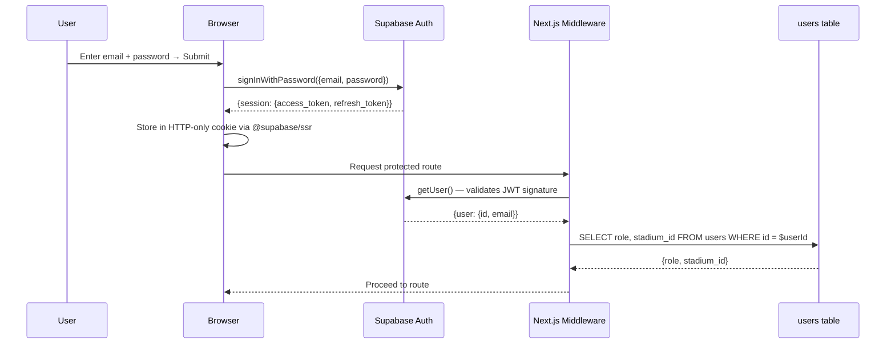

### 11.2 Session Configuration

| Parameter         | Value                       | Justification                                           |
| ----------------- | --------------------------- | ------------------------------------------------------- |
| Storage           | HTTP-only cookie            | Prevents XSS token theft (no localStorage)              |
| Duration          | 8 hours                     | Matches PRD shift duration (FR-AUTH-04)                 |
| Token refresh     | Automatic via middleware    | Transparent to user; preserves session without re-login |
| Refresh token     | Rotating (Supabase default) | Compromised refresh token invalidated after use         |
| Re-auth on expiry | Hard redirect → `/login`    | No silent session extension                             |

### 11.3 User Provisioning

Users are provisioned by system admin via Supabase Auth Admin API (service role). Self-registration is disabled.

```sql
-- Trigger: auto-create users table record on auth.users INSERT
CREATE OR REPLACE FUNCTION handle_new_user()
RETURNS TRIGGER AS $$
BEGIN
  INSERT INTO public.users (id, email, name, role, stadium_id)
  VALUES (
    NEW.id,
    NEW.email,
    COALESCE(NEW.raw_user_meta_data->>'name', NEW.email),
    COALESCE(NEW.raw_user_meta_data->>'role', 'read_only'),
    (NEW.raw_user_meta_data->>'stadium_id')::UUID
  );
  RETURN NEW;
END;
$$ LANGUAGE plpgsql SECURITY DEFINER;

CREATE TRIGGER on_auth_user_created
  AFTER INSERT ON auth.users
  FOR EACH ROW EXECUTE FUNCTION handle_new_user();
```

---

## 12. Authorization

### 12.1 Role Model

| Role               | Code                 | Capabilities                                                    |
| ------------------ | -------------------- | --------------------------------------------------------------- |
| Operations Manager | `operations_manager` | Full access; approves AI recommendations; changes phase         |
| Deputy Manager     | `deputy_manager`     | Full read/write on incidents and resources; cannot change phase |
| Coordinator        | `coordinator`        | Create incidents; update resource status; read-only reports     |
| Read Only          | `read_only`          | View all dashboards; no write access                            |

### 12.2 Permission Matrix

| Action                           | operations_manager | deputy_manager | coordinator | read_only |
| -------------------------------- | ------------------ | -------------- | ----------- | --------- |
| View all modules                 | ✅                 | ✅             | ✅          | ✅        |
| Create incident                  | ✅                 | ✅             | ✅          | ❌        |
| Override AI classification       | ✅                 | ✅             | ❌          | ❌        |
| Accept/dismiss AI recommendation | ✅                 | ✅             | ❌          | ❌        |
| Update resource zone/status      | ✅                 | ✅             | ✅          | ❌        |
| Resolve incident                 | ✅                 | ✅             | ❌          | ❌        |
| Change tournament phase          | ✅                 | ❌             | ❌          | ❌        |
| Create accessibility request     | ✅                 | ✅             | ✅          | ❌        |
| Initiate shift handover          | ✅                 | ✅             | ❌          | ❌        |
| Export PDF report                | ✅                 | ✅             | ✅          | ✅        |
| Generate AI executive summary    | ✅                 | ✅             | ❌          | ❌        |

### 12.3 Authorization Enforcement — Defense in Depth

Three independent enforcement layers:

| Layer                      | Mechanism                                        | Bypassing it requires                   |
| -------------------------- | ------------------------------------------------ | --------------------------------------- |
| **Database (RLS)**         | `get_user_role()` in USING clause                | Compromise of Supabase service role key |
| **Server (Route Handler)** | `requireRole()` throws 403 before business logic | Bypass Next.js server entirely          |
| **Client (UI)**            | Conditional rendering based on role context      | Both of the above                       |

```typescript
// src/lib/auth/guards.ts
export class AuthorizationError extends Error {
  constructor(message: string) {
    super(message);
    this.name = 'AuthorizationError';
  }
}

export function requireRole(user: AuthenticatedUser, allowedRoles: UserRole[]): void {
  if (!allowedRoles.includes(user.role)) {
    throw new AuthorizationError(
      `Role '${user.role}' cannot perform this action. Required: ${allowedRoles.join(', ')}`
    );
  }
}
```

---

## 13. API Architecture

### 13.1 REST Conventions

| Convention       | Rule                                                                    |
| ---------------- | ----------------------------------------------------------------------- |
| Method semantics | GET (read), POST (create), PATCH (partial update), DELETE (soft-delete) |
| URL structure    | `/api/[resource]/[id]/[sub-resource]`                                   |
| Naming           | Kebab-case, plural nouns: `/api/incidents`, `/api/crowd-data`           |
| Versioning       | No prefix for MVP. Future: `/api/v2/...`                                |
| Filtering        | Query params: `?status=open&tier=1`                                     |
| Sorting          | Query params: `?sort=created_at&order=desc`                             |
| Pagination       | Cursor-based: `?cursor=<id>&limit=20`                                   |

### 13.2 Standard Response Envelope

```typescript
// Success
{
  "data": T,
  "meta": {
    "timestamp": "2026-07-12T17:00:00Z",
    "count"?: number,
    "nextCursor"?: string
  }
}

// Error
{
  "error": {
    "code": "VALIDATION_ERROR",
    "message": "Human-readable description",
    "details"?: ZodIssue[]
  },
  "meta": { "timestamp": "2026-07-12T17:00:00Z" }
}
```

### 13.3 HTTP Status Code Usage

| Code | Scenario                           |
| ---- | ---------------------------------- |
| 200  | Successful GET or PATCH            |
| 201  | Successful POST (resource created) |
| 400  | Validation error                   |
| 401  | Not authenticated                  |
| 403  | Authenticated but unauthorized     |
| 404  | Resource not found                 |
| 429  | Rate limit exceeded                |
| 503  | Gemini API unavailable or timeout  |
| 500  | Unhandled server error             |

---

## 14. Security

### 14.1 Threat Model

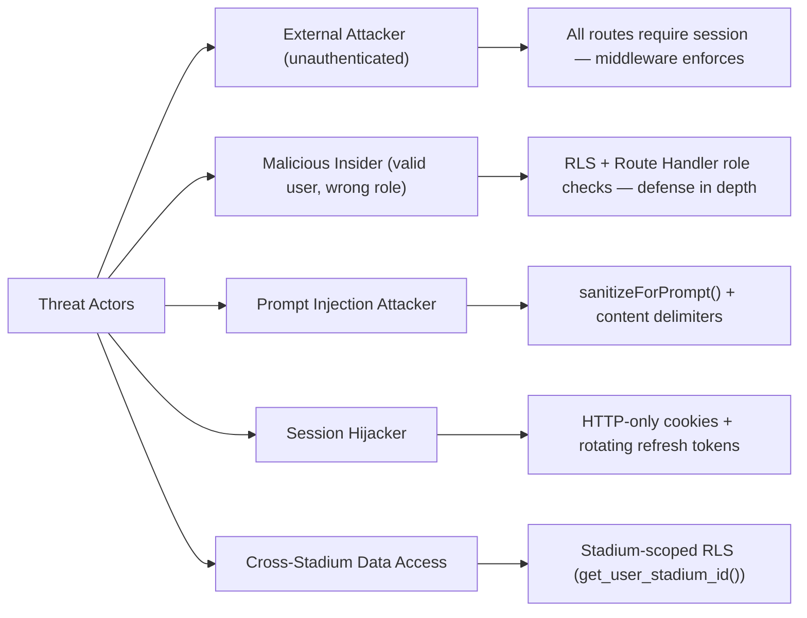

### 14.2 Security Headers

```typescript
// next.config.ts
const securityHeaders = [
  { key: 'X-DNS-Prefetch-Control', value: 'on' },
  { key: 'Strict-Transport-Security', value: 'max-age=63072000; includeSubDomains; preload' },
  { key: 'X-Content-Type-Options', value: 'nosniff' },
  { key: 'X-Frame-Options', value: 'DENY' },
  { key: 'X-XSS-Protection', value: '1; mode=block' },
  { key: 'Referrer-Policy', value: 'strict-origin-when-cross-origin' },
  { key: 'Permissions-Policy', value: 'camera=(), microphone=(), geolocation=()' },
  {
    key: 'Content-Security-Policy',
    value: [
      "default-src 'self'",
      "script-src 'self' 'unsafe-eval' 'unsafe-inline'",
      "style-src 'self' 'unsafe-inline' https://fonts.googleapis.com",
      "font-src 'self' https://fonts.gstatic.com",
      "img-src 'self' data: blob:",
      "connect-src 'self' https://*.supabase.co wss://*.supabase.co https://generativelanguage.googleapis.com",
      "frame-ancestors 'none'",
    ].join('; '),
  },
];
```

### 14.3 SQL Injection Prevention

ArenaMind AI is not vulnerable to SQL injection because:

1. All database queries use the Supabase parameterized query builder (`.eq()`, `.in()`, `.select()`).
2. Raw SQL is never constructed via string concatenation.
3. RLS policies use `auth.uid()` — not influenced by user input.

### 14.4 Security Checklist

| Item                                  | Status |
| ------------------------------------- | ------ |
| HTTPS enforced (Vercel TLS)           | ✅     |
| HTTP-only session cookies             | ✅     |
| GEMINI_API_KEY server-only            | ✅     |
| Supabase service role key server-only | ✅     |
| RLS enabled on all tables             | ✅     |
| Route Handler role checks             | ✅     |
| Zod input validation                  | ✅     |
| Prompt injection sanitization         | ✅     |
| AI output Zod validation              | ✅     |
| Security headers configured           | ✅     |
| Audit logging for all mutations       | ✅     |
| Soft delete (no data loss)            | ✅     |

---

## 15. Performance

### 15.1 Caching Strategy

| Data Type                            | Cache         | TTL                 | Strategy                              |
| ------------------------------------ | ------------- | ------------------- | ------------------------------------- |
| Static assets (JS, CSS)              | Vercel CDN    | Immutable           | Next.js content-hash naming           |
| Operational data (Server Components) | None          | Per-request         | `cache: 'no-store'`                   |
| TanStack Query — incidents           | Client memory | staleTime: 30s      | Background refetch                    |
| TanStack Query — crowd data          | Client memory | staleTime: 15s      | Realtime override                     |
| TanStack Query — resources           | Client memory | staleTime: 30s      | Realtime override                     |
| TanStack Query — AI summaries        | Client memory | staleTime: 10min    | Explicit invalidation on phase change |
| Health Score                         | Client memory | staleTime: 60s      | `refetchInterval: 60000`              |
| Stadium zone config                  | Client memory | staleTime: Infinity | Static per session                    |

### 15.2 Critical DB Query Patterns

```sql
-- Latest crowd data per zone (most frequent query in the app)
SELECT DISTINCT ON (zone_id)
  zone_id, fan_count, safe_capacity, density_pct, inflow_rate, recorded_at
FROM crowd_data
WHERE match_id = $1
ORDER BY zone_id, recorded_at DESC;

-- Active incidents ordered by urgency
SELECT id, type, tier, zone_id, status, ai_confidence, created_at
FROM incidents
WHERE match_id = $1
  AND deleted_at IS NULL
  AND status NOT IN ('resolved','closed')
ORDER BY tier ASC, created_at DESC
LIMIT 50;
```

### 15.3 Performance Budget

| Metric                         | Target |
| ------------------------------ | ------ |
| Time to First Byte (TTFB)      | <400ms |
| Largest Contentful Paint (LCP) | <2.5s  |
| Cumulative Layout Shift (CLS)  | <0.1   |
| Total Blocking Time (TBT)      | <300ms |
| Initial JS bundle (gzipped)    | <200KB |
| AI response latency (p95)      | <8s    |
| Realtime update latency (p95)  | <2s    |

### 15.4 React Optimization Patterns

```typescript
// Memoize expensive Health Score computation
const healthScore = useMemo(
  () => calculateHealthScore(crowdData, incidents, resources),
  [crowdData, incidents, resources]
);

// Stable callback reference for Realtime handler
const handleCrowdUpdate = useCallback(
  (data: CrowdData) => {
    queryClient.setQueryData(['crowd-data', matchId], (old) => updateZoneData(old, data));
  },
  [matchId, queryClient]
);

// Virtualize long incident lists (>50 items)
// Use @tanstack/react-virtual for IncidentList
```

---

## 16. Accessibility

### 16.1 WCAG 2.1 AA Implementation

| Criterion                     | Implementation                                                  |
| ----------------------------- | --------------------------------------------------------------- |
| 1.1.1 Non-text Content        | All icons `aria-label`; decorative icons `aria-hidden="true"`   |
| 1.3.1 Info & Relationships    | Semantic HTML: `main`, `nav`, `header`, `section`               |
| 1.3.3 Sensory Characteristics | Color-coding always has text label + icon                       |
| 1.4.1 Use of Color            | Density zones: color + text label + optional pattern            |
| 1.4.3 Contrast                | Min 4.5:1 normal text; 3:1 large text                           |
| 2.1.1 Keyboard                | All elements in natural tab order                               |
| 2.4.3 Focus Order             | Logical flow; modal traps focus (Radix Dialog)                  |
| 2.4.7 Focus Visible           | `focus-visible:ring-2 focus-visible:ring-primary`               |
| 3.3.1 Error Identification    | Form errors in text; `aria-describedby` links to message        |
| 4.1.2 Name, Role, Value       | Custom components have `role` + `aria-label`/`aria-labelledby`  |
| 4.1.3 Status Messages         | `role="status"` for updates; `role="alert"` for critical alerts |

### 16.2 Key Accessibility Patterns

```tsx
// Critical Alerts — Live Region
<div
  aria-live="assertive"
  aria-atomic="false"
  aria-label="Critical alerts feed"
>
  {alerts.map(alert => (
    <div key={alert.id} role="alert">
      <span className="sr-only">Critical alert: </span>
      {alert.description}
    </div>
  ))}
</div>

// Health Score Gauge — Meter role
<div
  role="meter"
  aria-valuenow={score}
  aria-valuemin={0}
  aria-valuemax={100}
  aria-label={`Stadium Health Score: ${score}/100, Grade ${grade}`}
>
  {/* Visual gauge implementation */}
</div>

// Zone Map — Alternative text list for screen readers
<div aria-label="Stadium zone density map">
  {/* Visual map */}
  <ul className="sr-only" aria-label="Zone density list">
    {zones.map(zone => (
      <li key={zone.id}>
        {zone.name}: {zone.densityPct.toFixed(0)}% capacity — {zone.densityLevel}
      </li>
    ))}
  </ul>
</div>
```

### 16.3 Keyboard Navigation Map

| Action                    | Shortcut                  |
| ------------------------- | ------------------------- |
| Navigate modules          | `Ctrl+1` through `Ctrl+6` |
| Create new incident       | `Ctrl+N`                  |
| Open command palette      | `Ctrl+K`                  |
| Acknowledge focused alert | `Ctrl+Enter`              |
| Dismiss focused alert     | `Escape`                  |

---

## 17. Error Handling

### 17.1 Frontend Error Boundary Strategy

| Boundary Scope   | Component Wrapped  | Fallback UI                              |
| ---------------- | ------------------ | ---------------------------------------- |
| Module-level     | Each module page   | `<ModuleFallback>` with retry button     |
| AI content       | `<AIContentBlock>` | "AI analysis unavailable" inline message |
| Chart components | Recharts wrapper   | Static data table fallback               |
| Zone map         | `<StadiumZoneMap>` | Zone list as text table                  |

```tsx
// Error boundary placement in Command Center
<ModuleErrorBoundary fallback={<ModuleFallback module="AI Command Center" />}>
  <OperationalSummary />
</ModuleErrorBoundary>
```

### 17.2 AI-Specific Error States

| Error Code            | UI Message                                                   | Recovery Action           |
| --------------------- | ------------------------------------------------------------ | ------------------------- |
| `AI_UNAVAILABLE`      | "AI analysis unavailable. Data features remain operational." | Retry button              |
| `AI_TIMEOUT`          | "AI analysis timed out. Click to retry."                     | Retry button              |
| `AI_PARSE_ERROR`      | "AI response could not be processed. Click to retry."        | Retry button              |
| `RATE_LIMIT_EXCEEDED` | "AI request limit reached. Please wait X minutes."           | Auto-retry after cooldown |

### 17.3 Network Error Recovery (TanStack Query)

```typescript
const queryClient = new QueryClient({
  defaultOptions: {
    queries: {
      retry: (failureCount, error) => {
        if (isAuthError(error)) return false; // Never retry 401/403
        return failureCount < 3;
      },
      retryDelay: (attempt) => Math.min(1000 * 2 ** attempt, 30000),
    },
    mutations: {
      retry: 1, // One retry for safe-to-retry mutations
    },
  },
});
```

---

## 18. Observability

### 18.1 Structured Logging

```typescript
// src/lib/observability/logger.ts
// JSON structured logging — Vercel Log Drain compatible

export const logger = {
  info: (event: string, ctx?: Record<string, unknown>) =>
    console.log(JSON.stringify({ level: 'info', event, ts: new Date().toISOString(), ...ctx })),
  warn: (event: string, ctx?: Record<string, unknown>) =>
    console.warn(JSON.stringify({ level: 'warn', event, ts: new Date().toISOString(), ...ctx })),
  error: (event: string, ctx?: Record<string, unknown>) =>
    console.error(JSON.stringify({ level: 'error', event, ts: new Date().toISOString(), ...ctx })),
};
```

### 18.2 Standard Log Events

| Event                       | Level | Key Context                         |
| --------------------------- | ----- | ----------------------------------- |
| `auth.login`                | info  | userId, role                        |
| `auth.login_failed`         | warn  | email, reason                       |
| `incident.created`          | info  | incidentId, tier, type, matchId     |
| `incident.tier_overridden`  | warn  | incidentId, aiTier, manualTier      |
| `ai.call.success`           | info  | feature, latencyMs, tokens          |
| `ai.call.error`             | error | feature, errorCode, attempt         |
| `ai.hallucination.detected` | warn  | feature, invalidIds                 |
| `ratelimit.exceeded`        | warn  | matchId, feature                    |
| `realtime.reconnect`        | warn  | channel, attempt                    |
| `database.error`            | error | table, operation, errorCode         |
| `phase.changed`             | info  | matchId, fromPhase, toPhase, userId |

### 18.3 Health Check Endpoint

```typescript
// /api/health/route.ts
export async function GET() {
  const [dbCheck, geminiCheck] = await Promise.allSettled([
    checkDatabaseConnection(),
    checkGeminiAvailability(),
  ]);

  const status = {
    database: dbCheck.status === 'fulfilled' ? 'ok' : 'error',
    gemini: geminiCheck.status === 'fulfilled' ? 'ok' : 'degraded', // degraded, not error (non-critical)
    timestamp: new Date().toISOString(),
  };

  const httpStatus = status.database === 'ok' ? 200 : 503;
  return NextResponse.json(status, { status: httpStatus });
}
```

---

## 19. Testing Strategy

### 19.1 Testing Pyramid

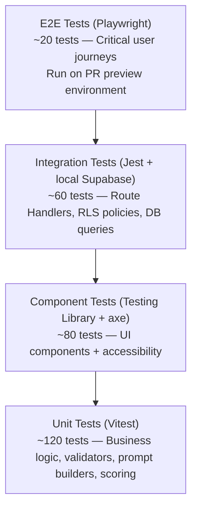

### 19.2 Unit Tests — Key Coverage Areas

```typescript
// Health Score formula correctness
describe('calculateHealthScore', () => {
  it('returns 100 for perfect conditions');
  it('returns grade F below score 40');
  it('weights incidents at exactly 30% of total score');
  it('handles edge case: zero resources available');
});

// Prompt builder correctness
describe('buildOperationalSummaryPrompt', () => {
  it('includes all required context fields');
  it('references tournament phase by name');
  it('includes tier 1 incident count');
});

// Prompt injection sanitization
describe('sanitizeForPrompt', () => {
  it('removes INST tokens');
  it('removes ChatML role markers');
  it('truncates at 1000 characters');
  it('allows normal operational text through unchanged');
});

// Zod AI output schemas
describe('incidentClassifyOutputSchema', () => {
  it('validates correct Gemini response');
  it('rejects tier values outside 1–4');
  it('rejects confidence outside 0–1');
  it('rejects unknown incident types');
});
```

### 19.3 RLS Tests

```typescript
// Local Supabase integration tests
it('prevents cross-stadium incident read', async () => {
  const stadiumAClient = createAuthenticatedClient(STADIUM_A_USER_ID);
  const { data } = await stadiumAClient
    .from('incidents')
    .select('*')
    .eq('id', STADIUM_B_INCIDENT_ID)
    .single();

  expect(data).toBeNull(); // RLS returns empty, not an error
});

it('prevents coordinator from changing phase', async () => {
  const coordinatorClient = createAuthenticatedClient(COORDINATOR_USER_ID);
  const { error } = await coordinatorClient
    .from('matches')
    .update({ current_phase: 'match_live' })
    .eq('id', MATCH_ID);

  expect(error).not.toBeNull(); // RLS blocks update
});
```

### 19.4 E2E Tests (Playwright) — Priority Matrix

| Test                                              | Priority | Covers                  |
| ------------------------------------------------- | -------- | ----------------------- |
| Login → Command Center with data                  | P0       | Auth + dashboard render |
| Create incident → AI classifies → manager accepts | P0       | Core AI workflow        |
| Crowd density Realtime update visible             | P0       | Realtime subscription   |
| Phase change → AI summary regenerates             | P1       | Phase-aware AI          |
| Generate + download shift handover                | P1       | AI + PDF                |
| Generate executive summary → export PDF           | P1       | Reports module          |
| Create accessibility request → alert triggered    | P2       | Module 5                |
| Gemini API down → fallback UI renders             | P1       | Graceful degradation    |

### 19.5 Accessibility Tests

```typescript
// Using axe-playwright on every module
test('Command Center passes WCAG 2.1 AA', async ({ page }) => {
  await page.goto('/command-center');
  await checkA11y(page, undefined, {
    runOnly: { type: 'tag', values: ['wcag2a', 'wcag2aa', 'wcag21aa'] },
  });
});
```

---

## 20. Deployment Architecture

### 20.1 Environment Configuration

| Environment   | Purpose   | Branch             | Supabase                    |
| ------------- | --------- | ------------------ | --------------------------- |
| `development` | Local dev | Any feature branch | `supabase start` (local)    |
| `preview`     | PR review | Feature branches   | Supabase staging project    |
| `production`  | Live      | `main`             | Supabase production project |

### 20.2 CI/CD Pipeline

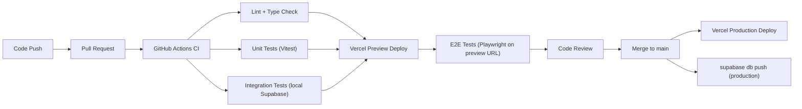

```yaml
# .github/workflows/ci.yml (summary)
jobs:
  lint-type-check:
    steps: [checkout, setup-node, npm ci, npm run lint, npm run type-check]

  unit-tests:
    needs: lint-type-check
    steps: [checkout, setup-node, npm ci, npm run test:unit -- --coverage]

  integration-tests:
    needs: lint-type-check
    steps: [checkout, setup-node, npm ci, supabase db push --local, npm run test:integration]

  e2e-tests:
    needs: [unit-tests, integration-tests]
    if: github.event_name == 'pull_request'
    steps: [checkout, npm ci, playwright install, npm run test:e2e]

  deploy-production:
    needs: [unit-tests, integration-tests]
    if: github.ref == 'refs/heads/main'
    steps: [vercel deploy --prod, supabase db push --project-ref=$PROD_REF]
```

### 20.3 Rollback Strategy

| Failure               | Rollback                                | Time         |
| --------------------- | --------------------------------------- | ------------ |
| Bad frontend deploy   | Vercel → Deployments → Promote previous | <60 seconds  |
| Bad DB migration      | Run DOWN migration script               | 2–5 minutes  |
| AI prompt regression  | Revert prompt file commit + redeploy    | 5–10 minutes |
| RLS policy regression | Run DOWN migration + redeploy           | 2–5 minutes  |

---

## 21. Development Standards

### 21.1 TypeScript Configuration

```json
{
  "compilerOptions": {
    "target": "ES2022",
    "strict": true,
    "noImplicitAny": true,
    "strictNullChecks": true,
    "noUncheckedIndexedAccess": true,
    "exactOptionalPropertyTypes": true,
    "noImplicitReturns": true,
    "noFallthroughCasesInSwitch": true,
    "forceConsistentCasingInFileNames": true,
    "module": "esnext",
    "moduleResolution": "bundler",
    "jsx": "preserve",
    "paths": { "@/*": ["./src/*"] }
  }
}
```

### 21.2 ESLint Configuration

```json
{
  "extends": [
    "next/core-web-vitals",
    "next/typescript",
    "plugin:@typescript-eslint/strict-type-checked",
    "plugin:jsx-a11y/strict"
  ],
  "rules": {
    "@typescript-eslint/no-explicit-any": "error",
    "@typescript-eslint/no-floating-promises": "error",
    "@typescript-eslint/consistent-type-imports": "error",
    "jsx-a11y/no-autofocus": "warn"
  }
}
```

### 21.3 Git Branch and Commit Convention

**Branch naming:**

| Type    | Pattern             | Example                       |
| ------- | ------------------- | ----------------------------- |
| Feature | `feat/description`  | `feat/incident-ai-classify`   |
| Bug fix | `fix/description`   | `fix/health-score-weight`     |
| Chore   | `chore/description` | `chore/update-supabase-types` |
| Docs    | `docs/description`  | `docs/api-reference`          |

**Commit convention (Conventional Commits):**

```
<type>(<scope>): <description>

Types:   feat | fix | refactor | perf | docs | test | chore | ci
Scopes:  command-center | crowd | incidents | resources | transport | reports | ai | db | auth

Examples:
feat(incidents): add AI classification with confidence badge
fix(ai): add exponential backoff retry for Gemini timeout
perf(crowd): switch to DISTINCT ON query for latest zone density
chore(db): regenerate Supabase TypeScript types
```

### 21.4 Code Quality Gates

| Rule                                             | Enforcement                 |
| ------------------------------------------------ | --------------------------- |
| No `any` type in production paths                | ESLint error                |
| No floating promises                             | ESLint error                |
| All AI outputs Zod-validated                     | Code review gate            |
| All prompt templates versioned                   | Code review gate            |
| All new DB tables have RLS enabled               | Migration review gate       |
| TypeScript types regenerated after schema change | CI check (diff detection)   |
| axe-core zero critical violations                | E2E accessibility test      |
| Lighthouse score ≥85                             | Manual check before release |

### 21.5 Reusable Patterns

**AIContentBlock — reused by all AI-powered UI sections:**

```tsx
// src/components/shared/AIContentBlock.tsx
interface AIContentBlockProps {
  isLoading: boolean;
  error: ApiError | null;
  generatedAt?: string;
  promptVersion?: string;
  onRegenerate: () => void;
  children: ReactNode;
  featureName: string;
}
// Renders: loading skeleton | error state | AI content with timestamp + regenerate button
// All 8 AI features use this component as their outer wrapper
```

---

## 22. Engineering Risks

### 22.1 Technical Risks

| Risk                                                           | Probability | Impact | Mitigation                                                                            |
| -------------------------------------------------------------- | ----------- | ------ | ------------------------------------------------------------------------------------- |
| Next.js 15 App Router caching causes stale operational data    | High        | High   | `cache: 'no-store'` on all dynamic fetches; integration tests verify freshness        |
| Supabase Realtime drops silently during match                  | Medium      | High   | Reconnect logic with backoff; polling fallback every 30s                              |
| Gemini rate limits reached during high-activity phases         | Medium      | High   | Rate limiter middleware; prioritize incident classification over background summaries |
| TypeScript strict mode causes significant development friction | High        | Medium | Generator scripts for Supabase types; Zod schemas as type source-of-truth             |
| PDF generation timeout for large match datasets                | Low         | Low    | Chunked data loading; progress indicator; retry                                       |

### 22.2 AI Risks

| Risk                                                      | Probability | Impact | Mitigation                                                          |
| --------------------------------------------------------- | ----------- | ------ | ------------------------------------------------------------------- |
| Gemini hallucinates resource/zone IDs                     | Medium      | High   | Post-parse reference validation; Zod schema rejects invalid shapes  |
| Gemini safety filters block operational content           | Low         | Medium | Test all prompt types before demo; adjust safety settings if needed |
| AI response is too generic (not data-grounded)            | Medium      | Medium | Explicit data grounding in every prompt + few-shot examples         |
| Prompt injection via incident description                 | Low         | High   | `sanitizeForPrompt()` + explicit content delimiters                 |
| AI classification confidence overconfident (always ~0.99) | Low         | Medium | Always surface Override option; confidence displayed honestly       |

### 22.3 Scalability Risks

| Risk                                            | Probability | Impact | Mitigation                                                                       |
| ----------------------------------------------- | ----------- | ------ | -------------------------------------------------------------------------------- |
| Supabase connection pool exhaustion at 50 users | Low         | High   | Supabase uses pgbouncer by default; pooled connections handle 50+ easily         |
| crowd_data table growing large mid-match        | Medium      | Medium | Indexed on `(match_id, zone_id, recorded_at DESC)`; only latest-per-zone queried |
| Realtime fan-out overhead with 50 subscribers   | Low         | Low    | Supabase handles 1000s of connections; 50 users is trivial                       |

---

## 23. Future Technical Roadmap

### 23.1 Phase 2 (0–3 months post-hackathon)

| Item                        | Technical Approach                                               |
| --------------------------- | ---------------------------------------------------------------- |
| Mobile companion app        | Expo React Native; read-only; shared Supabase backend            |
| Push notifications          | Web Push API + Supabase Edge Functions                           |
| Distributed rate limiting   | Replace in-memory rate limiter with Upstash Redis                |
| Realistic simulation worker | Supabase Edge Function to generate crowd data patterns           |
| Multi-stadium federation    | New Next.js layout + cross-stadium Supabase views (service role) |

### 23.2 Phase 3 (3–12 months)

| Item                        | Technical Approach                                               |
| --------------------------- | ---------------------------------------------------------------- |
| Hardware sensor integration | REST ingestion API; webhook endpoints for turnstile/parking data |
| ML congestion prediction    | Time-series model (Python/TensorFlow) deployed as Edge Function  |
| Voice interface             | Web Speech API + streaming Gemini response                       |
| Gemini multimodal input     | CCTV frame snapshots in incident prompts                         |
| Historical analytics        | PostgREST views + charting for cross-match trends                |

### 23.3 Phase 4 (12–36 months)

| Item                           | Technical Approach                                               |
| ------------------------------ | ---------------------------------------------------------------- |
| Custom fine-tuned model        | Gemini fine-tuning on FIFA incident corpus                       |
| Autonomous resource scheduling | Temporal workflow engine + human-in-the-loop approval            |
| Digital twin                   | Three.js / CesiumJS 3D model with operational data overlay       |
| SOC 2 Type II                  | Formal audit trail, penetration testing, data retention policies |

---

## 24. Appendix

### Appendix A: Environment Variables Reference

| Variable                        | Client | Required | Example                        |
| ------------------------------- | ------ | -------- | ------------------------------ |
| `NEXT_PUBLIC_SUPABASE_URL`      | ✅     | ✅       | `https://xyz.supabase.co`      |
| `NEXT_PUBLIC_SUPABASE_ANON_KEY` | ✅     | ✅       | `eyJ...`                       |
| `SUPABASE_SERVICE_ROLE_KEY`     | ❌     | ✅       | `eyJ...`                       |
| `GEMINI_API_KEY`                | ❌     | ✅       | `AIza...`                      |
| `NEXT_PUBLIC_APP_URL`           | ✅     | ✅       | `https://arenamind.vercel.app` |
| `SUPABASE_DB_URL`               | ❌     | Optional | `postgresql://...`             |

### Appendix B: TypeScript Domain Type Catalog

```typescript
// src/types/domain.types.ts

export type TournamentPhase =
  | 'pre_event'
  | 'gate_opening'
  | 'fan_arrival'
  | 'pre_kickoff'
  | 'match_live'
  | 'halftime'
  | 'second_half'
  | 'full_time'
  | 'crowd_exit'
  | 'post_event';

export type IncidentType =
  | 'Medical'
  | 'Security'
  | 'Crowd'
  | 'Infrastructure'
  | 'Fire_Evacuation'
  | 'VIP_Protocol'
  | 'Broadcast'
  | 'Weather';

export type IncidentTier = 1 | 2 | 3 | 4;
export type IncidentStatus = 'open' | 'active' | 'monitoring' | 'resolved' | 'closed';
export type ResourceCategory = 'security' | 'medical' | 'volunteer' | 'equipment';
export type ResourceStatus = 'available' | 'deployed' | 'off_duty' | 'unavailable';
export type UserRole = 'operations_manager' | 'deputy_manager' | 'coordinator' | 'read_only';
export type DensityLevel = 'safe' | 'warning' | 'danger' | 'critical';
export type HealthGrade = 'A' | 'B' | 'C' | 'D' | 'F';

export interface CrowdZone {
  id: string;
  name: string;
  fanCount: number;
  safeCapacity: number;
  densityPct: number;
  densityLevel: DensityLevel;
  inflowRate: number;
  recordedAt: string;
}

export interface HealthScoreResult {
  score: number;
  grade: HealthGrade;
  trend: 'improving' | 'stable' | 'declining';
  components: {
    crowdScore: number;
    incidentScore: number;
    resourceScore: number;
    transportScore: number;
    accessScore: number;
  };
}
```

### Appendix C: Realtime Channel Reference

| Channel Name              | Table                    | Filter                  | Hook                       |
| ------------------------- | ------------------------ | ----------------------- | -------------------------- |
| `crowd-{matchId}`         | `crowd_data`             | `match_id=eq.{matchId}` | `useCrowdDataRealtime`     |
| `incidents-{matchId}`     | `incidents`              | `match_id=eq.{matchId}` | `useIncidentRealtime`      |
| `resources-{matchId}`     | `resources`              | `match_id=eq.{matchId}` | `useResourceRealtime`      |
| `accessibility-{matchId}` | `accessibility_requests` | `match_id=eq.{matchId}` | `useAccessibilityRealtime` |
| `phase-{matchId}`         | `matches`                | `id=eq.{matchId}`       | `usePhaseRealtime`         |

### Appendix D: npm Scripts Reference

```json
{
  "scripts": {
    "dev": "next dev",
    "build": "next build",
    "start": "next start",
    "lint": "next lint",
    "lint:fix": "next lint --fix",
    "type-check": "tsc --noEmit",
    "format": "prettier --write .",
    "test:unit": "vitest run",
    "test:unit:watch": "vitest",
    "test:unit:coverage": "vitest run --coverage",
    "test:integration": "jest --testPathPattern='integration'",
    "test:e2e": "playwright test",
    "test:a11y": "playwright test --project=accessibility",
    "test:all": "npm run type-check && npm run lint && npm run test:unit && npm run test:integration",
    "db:types": "supabase gen types typescript --local > src/types/database.types.ts",
    "db:push": "supabase db push",
    "db:reset": "supabase db reset",
    "db:seed": "ts-node scripts/seed.ts",
    "supabase:start": "supabase start",
    "supabase:stop": "supabase stop"
  }
}
```

### Appendix E: Health Score Configuration

```typescript
// src/config/scoring.ts
export const HealthScoreConfig = {
  weights: {
    crowd: 0.25, // 25%
    incidents: 0.3, // 30% — highest weight (safety-critical)
    resources: 0.2, // 20%
    transport: 0.15, // 15%
    accessibility: 0.1, // 10%
  },
  grades: { A: 85, B: 70, C: 55, D: 40, F: 0 },
  incidentPressureWeights: {
    tier1: 40, // Normalized to 100 max
    tier2: 20,
    tier3: 10,
    tier4: 5,
  },
  crowdPressureThresholds: {
    warning: 61, // % above which zone contributes to crowd pressure index
    danger: 81,
    critical: 100,
  },
} as const;
```

---

_Document End_

---

> **ArenaMind AI** — Technical Requirements Document  
> _Version 1.0.0 | July 12, 2026_  
> _Engineering Source of Truth — Derived from PRD v1.0.0_  
> _Every architectural, implementation, and infrastructure decision for ArenaMind AI is defined in this document._
